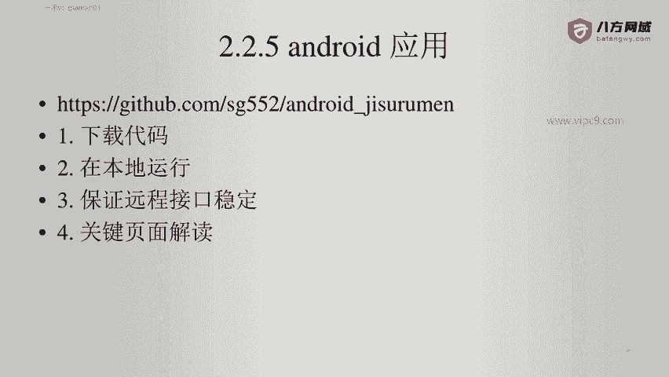
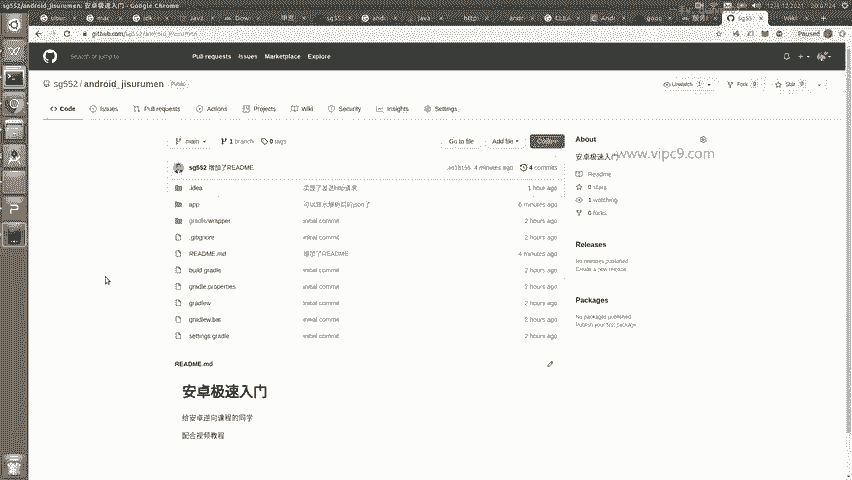

# Android逆向-基础篇：P22：章节3-15-android_应用

在本节课中，我们将学习如何获取、编译和运行一个用于Android逆向分析的示例项目。我们将从GitHub下载代码，并在本地环境中进行设置和调试。

## 🛠️ 获取示例项目

上一节课程中使用的示例项目已经上传到GitHub。各位同学可以前往该仓库下载代码，以便在本地进行编译、运行和调试，从而理解其中的具体实现。

以下是获取项目的两种方式：

*   可以直接使用 `git clone` 命令下载整个仓库。
*   也可以直接下载仓库的压缩包文件。

## 💻 本地环境设置与运行

获取代码后，你需要在本地配置好相应的开发环境（如Android Studio），然后导入项目进行编译和调试。这个过程能帮助你直观地观察和分析应用的行为与代码结构。

本节课中，我们一起学习了如何从GitHub获取Android逆向分析的示例项目，并了解了在本地运行它的基本步骤。掌握这些操作是进行后续实际分析和调试的重要基础。