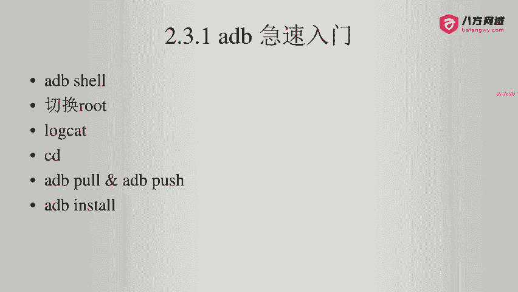
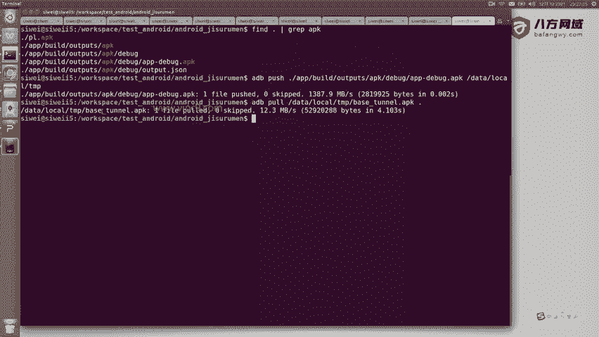
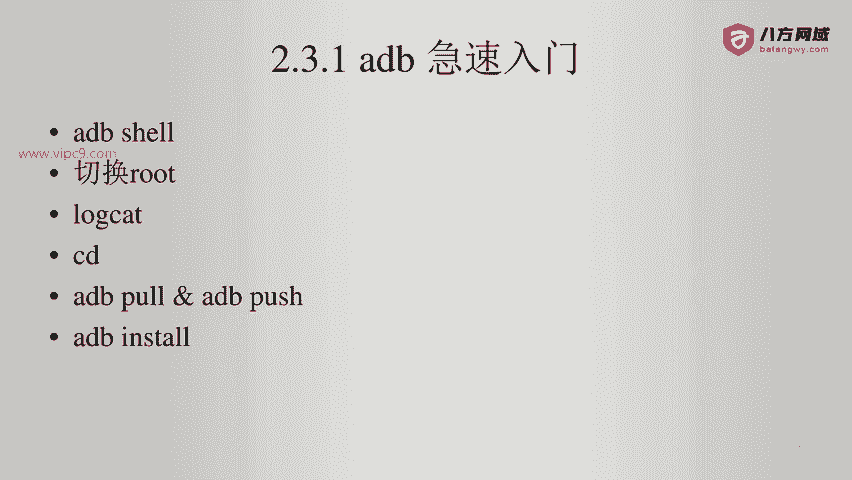

# Android逆向-基础篇：P23：章节3-16-adb-push-pull

在本节课中，我们将要学习ADB（Android Debug Bridge）的两个核心文件传输命令：`push`和`pull`，以及一个应用安装命令`install`。这些命令是连接电脑与Android设备、进行文件管理和应用部署的基础工具。



## 📤 ADB push：上传文件到设备

上一节我们介绍了ADB的基本连接。本节中我们来看看如何将电脑上的文件传输到连接的Android设备上。`adb push`命令用于实现此功能。

该命令的基本格式如下：
```
adb push <电脑上的文件路径> <设备上的目标路径>
```

以下是具体操作步骤：
1.  首先，在电脑上定位需要传输的文件。例如，我们有一个名为`app-debug.apk`的文件。
2.  打开命令行终端，输入命令将文件推送到设备的`/data/local/tmp`目录。
3.  执行命令后，终端会显示传输进度。传输完成后，文件便存在于设备的指定路径下。

## 📥 ADB pull：从设备下载文件

与`push`操作相反，`adb pull`命令用于将设备上的文件下载到电脑中。

该命令的基本格式如下：
```
adb pull <设备上的文件路径> <电脑上的目标路径>
```

以下是具体操作步骤：
1.  假设我们需要将设备上的`base.apk`文件下载到电脑当前目录。
2.  在命令行中输入对应的`pull`命令。
3.  命令执行后，文件将从设备传输到电脑的指定位置。



## 📲 ADB install：安装应用

除了文件传输，ADB还提供了直接安装应用的功能。`adb install`命令可以将电脑上的APK文件安装到连接的设备上，其效果与在设备上手动点击安装完全相同。

该命令的基本格式如下：
```
adb install <电脑上的APK文件路径>
```

由于操作直观简单，此处不进行演示。你只需在命令行中输入上述格式的命令，即可完成应用的安装。



---

本节课中我们一起学习了ADB的三个实用命令：使用`adb push`上传文件到设备，使用`adb pull`从设备下载文件，以及使用`adb install`安装APK应用。掌握这些命令是进行Android应用调试和逆向工程的基础。