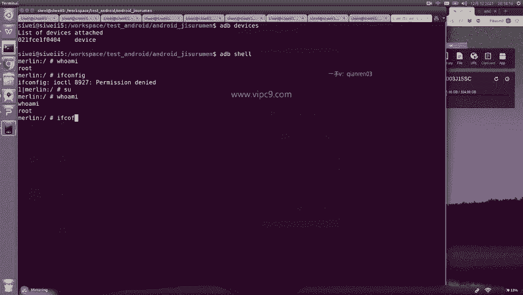
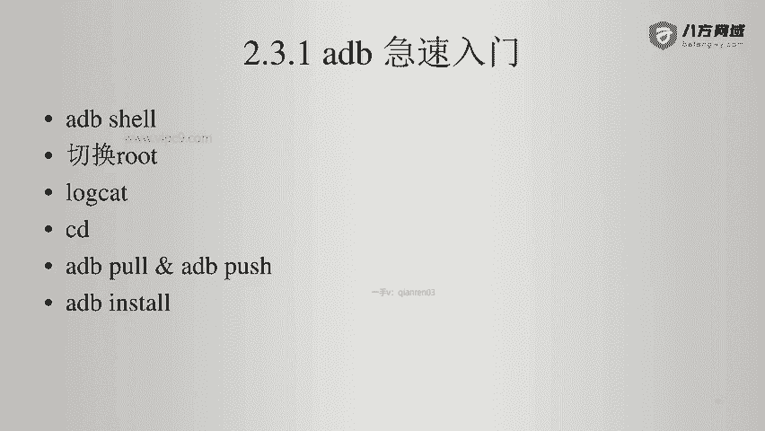
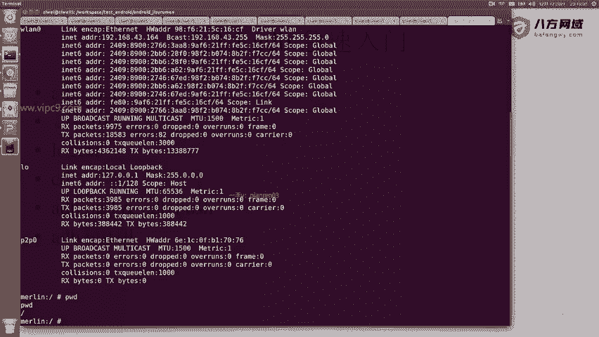
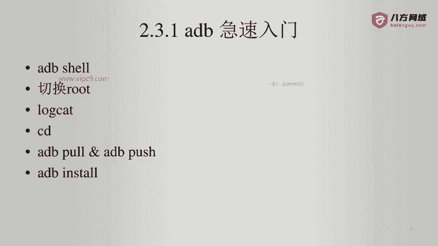

# Android逆向-基础篇：P24：章节3-17-adb-使用root设备

在本节课中，我们将学习如何使用ADB（Android Debug Bridge）连接并操作一台已获取root权限的Android设备。我们将涵盖从设备连接到获取root shell，再到执行一些基础系统命令的完整流程。

## 设备连接与验证

上一节我们介绍了ADB的基本概念，本节中我们来看看如何连接一台已root的设备并进行验证。

首先，确保设备已通过USB连接并开启了USB调试模式。在命令行中输入以下命令来检查设备是否被识别：

```bash
adb devices
```

命令执行后，如果设备已就绪，列表中会显示一个设备ID（例如以`021`开头）。接着，我们可以通过ADB Shell登录到设备：

```bash
adb shell
```

登录后，我们可以使用`whoami`命令查看当前用户身份。虽然此时终端可能显示为`root`，但某些操作（如查看网络配置）可能仍会因权限不足而被拒绝。



## 获取Root Shell

为了解决权限问题，我们需要切换到真正的root用户。在ADB Shell中，使用`su`命令（即switch user）来切换：

```bash
su
```

切换成功后，再次输入`whoami`命令，此时显示的`root`才是具有完整系统权限的超级用户。

## 查看系统信息



成功获取root权限后，我们可以执行更多系统级命令来查看设备信息。

例如，要查看设备的网络配置和IP地址，可以使用`ifconfig`命令：

```bash
ifconfig
```



在输出信息中，找到类似`wlan0`的条目，其对应的`inet addr`就是设备在局域网中的真实IP地址（例如`192.168.43.164`）。其他条目通常是本地虚拟网卡。

接下来，我们可以查看当前所在的目录路径：

```bash
pwd
```

通常，登录后默认位于根目录`/`。要查看设备的存储空间使用情况，可以使用`df`命令：

```bash
df -kh
```

该命令会以人类可读的格式（KB, MB, GB）列出各分区的磁盘使用情况。例如，你可能会看到`/data/media`分区有105GB，其中89GB可用。

## 监控系统日志

在逆向工程中，查看系统日志（Logcat）是分析应用行为的重要手段。使用以下命令可以实时打印系统日志：

```bash
logcat
```

命令执行后，终端会持续滚动输出日志信息，其中包含了系统事件、应用调试信息等。例如，当你打开一个名为“党报头条”的应用程序时，相关的启动和运行日志就会出现在Logcat输出中，尽管可能被大量的其他日志信息快速冲刷掉。

## 文件传输与安装

ADB提供了在PC和设备之间传输文件的功能，这对于安装应用或提取数据非常有用。

以下是两个核心命令：
*   **`adb pull <设备文件路径> <PC保存路径>`**：将设备上的文件拉取（复制）到电脑上。
*   **`adb push <PC文件路径> <设备目标路径>`**：将电脑上的文件推送（复制）到设备上。



一个最常见的操作是安装APK应用。虽然可以直接使用`adb install <apk文件路径>`命令，但了解其底层原理有助于理解。安装过程本质上涉及将APK文件`push`到设备的临时目录，然后由系统包管理器执行安装。

本节课中我们一起学习了如何通过ADB连接root设备、获取完整root权限、查看系统信息与日志，以及进行基础的文件操作。掌握这些命令是进行Android应用逆向分析和深入系统调试的基石。