# Android逆向-基础篇：P25：章节3-18-Linux极速入门 🚀

在本节课中，我们将要学习Linux命令行的基础知识。掌握这些命令对于安卓逆向至关重要，因为每一台安卓设备本质上都是一台运行Linux内核的小型计算机。通过命令行操作安卓设备，是进行逆向分析的必备技能。

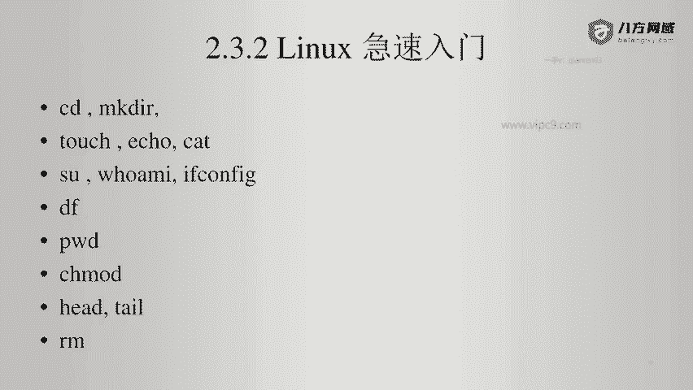

## 概述 📖

我们将快速浏览一系列最常用的Linux命令，并通过实例演示它们在电脑和安卓设备上的应用。理解这些命令将帮助你通过ADB Shell有效地与安卓设备进行交互。

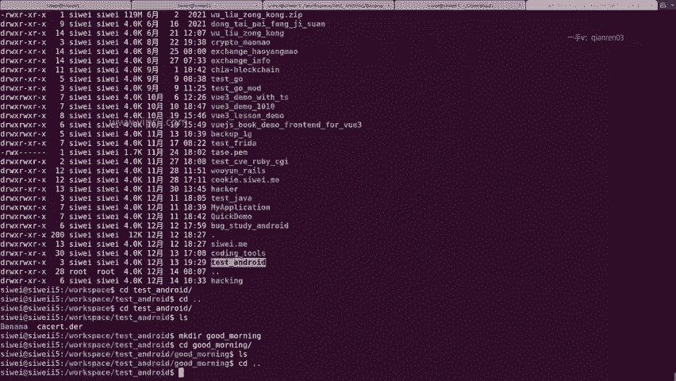

## 目录与文件操作

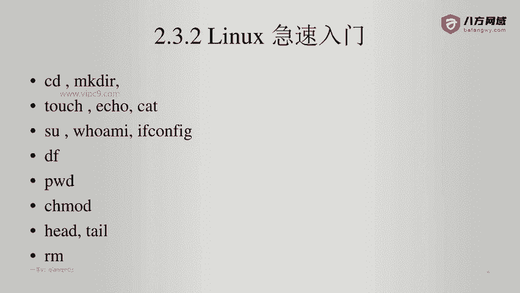

上一节我们介绍了学习Linux命令的意义，本节中我们来看看最基础的目录与文件操作命令。

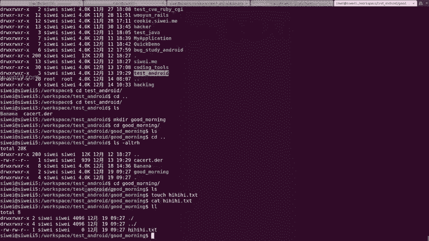

### `cd` 与 `mkdir`

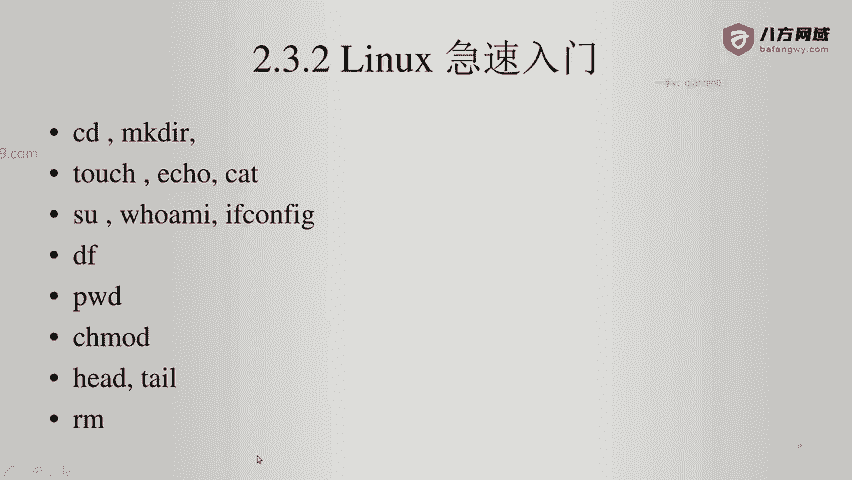

`cd` 命令用于切换当前工作目录，`mkdir` 命令用于创建新的目录。

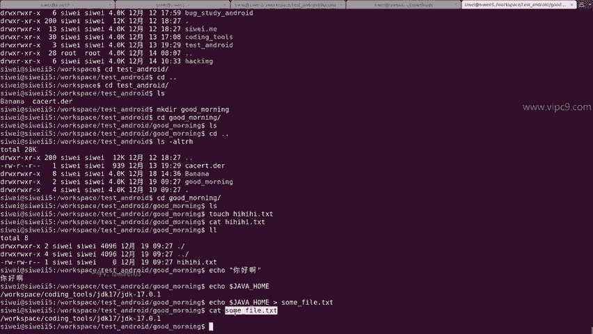

以下是具体用法示例：
*   `cd test_android`：切换到名为 `test_android` 的目录。
*   `cd ..`：切换到上一级目录。
*   `cd .`：切换到当前目录（通常用于脚本中）。
*   `mkdir good_morning`：在当前目录下创建一个名为 `good_morning` 的新文件夹。

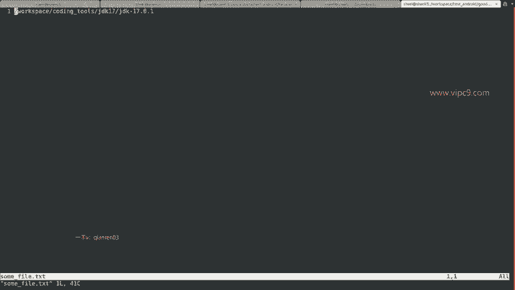

### `touch`, `echo` 与 `cat`

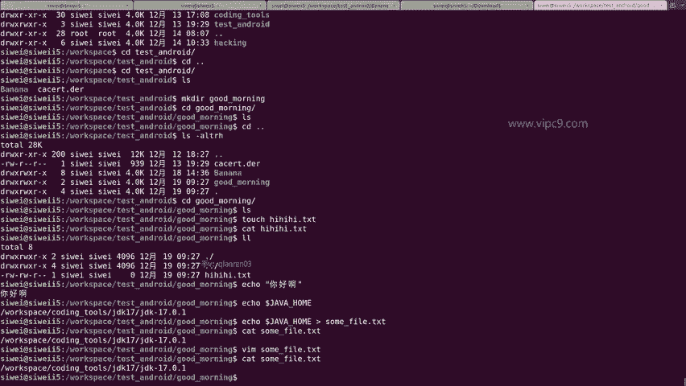

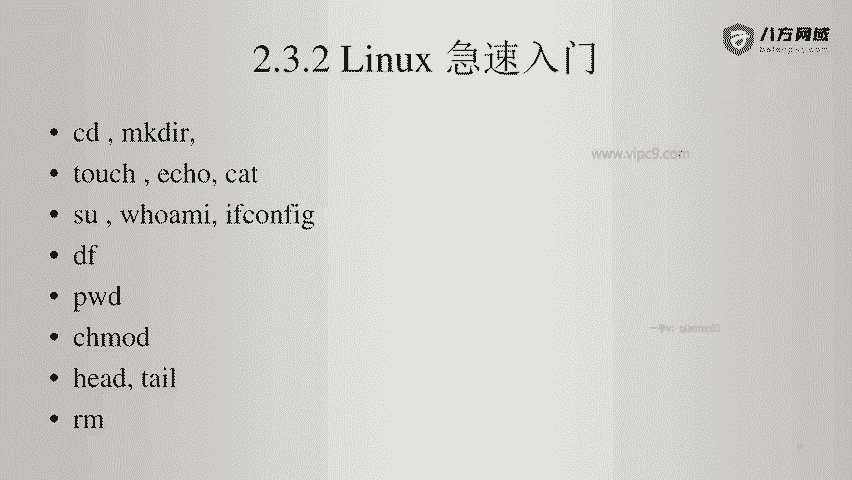

`touch` 命令用于创建空文件或更新文件时间戳。`echo` 命令用于输出文本到终端或文件。`cat` 命令用于查看文件内容。

以下是具体用法示例：
*   `touch haihaihai`：创建一个名为 `haihaihai` 的空文件。
*   `echo “你好”`：在终端输出字符串“你好”。
*   `echo $JAVA_HOME`：输出环境变量 `JAVA_HOME` 的值。
*   `echo “内容” > some_file.txt`：将字符串“内容”写入（覆盖）到 `some_file.txt` 文件中。
*   `cat some_file.txt`：在终端显示 `some_file.txt` 文件的全部内容。**注意：** 如果文件非常大，此操作可能导致终端卡顿。

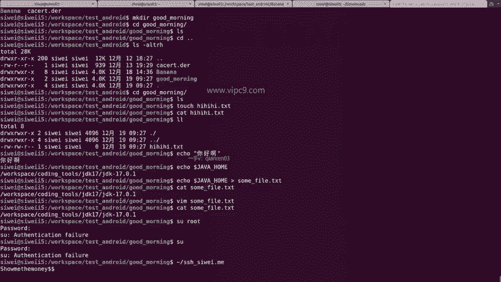

### `rm`

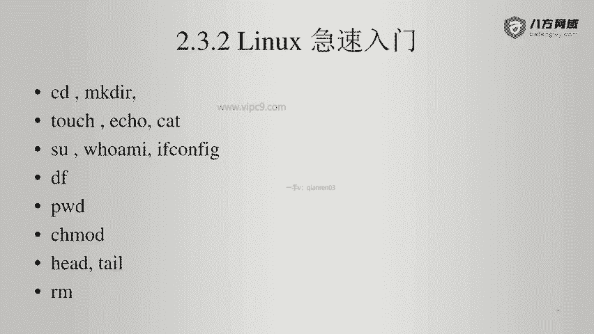

`rm` 命令用于删除文件或目录。

以下是具体用法示例：
*   `rm haihaihai`：删除文件 `haihaihai`。
*   `rm -r folder_name`：递归删除名为 `folder_name` 的目录及其内部所有内容。
*   `rm -f file_name`：强制删除文件，不进行确认提示。

## 系统信息与权限管理

掌握了基础的文件操作后，我们来看看如何查看系统信息和管理文件权限。

### `su` 与 `whoami`

`su` 命令用于切换用户身份，`whoami` 命令用于显示当前登录的用户名。

以下是具体用法示例：
*   `su` 或 `su root`：尝试切换到 `root`（超级管理员）用户，需要输入密码。
*   `whoami`：显示当前用户名。

### `ifconfig` 与 `df`

`ifconfig` 命令用于查看和配置网络接口信息。`df` 命令用于显示磁盘空间使用情况。

以下是具体用法示例：
*   `ifconfig`：列出所有网络接口的详细信息，如IP地址（在Windows中类似命令为 `ipconfig`）。
*   `df -kh`：以人类可读的格式（KB， MB， GB）显示所有磁盘分区的使用情况。Linux的路径以 `/` 开始，例如 `/home/user`。

### `pwd`

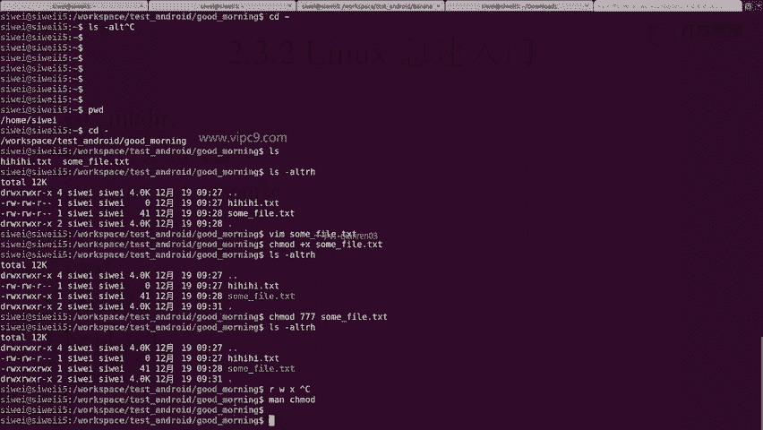

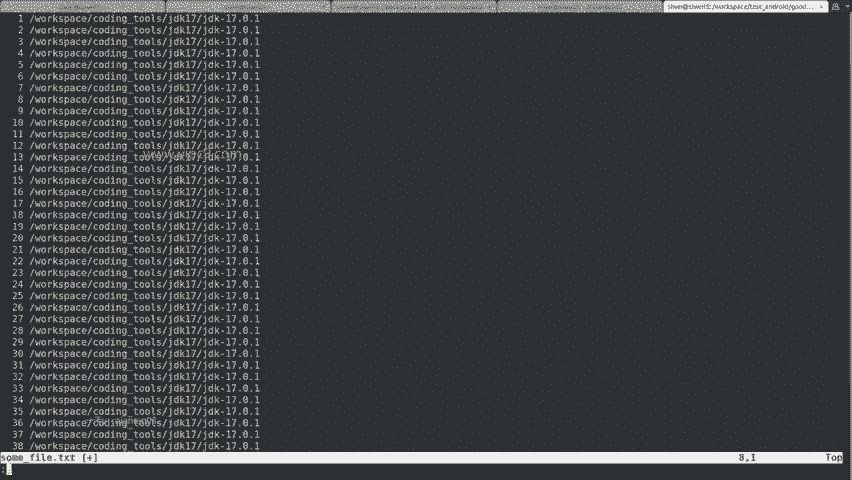

`pwd` 命令用于打印当前工作目录的绝对路径。

以下是具体用法示例：
*   `pwd`：显示你当前所在的完整目录路径。例如，`/home/username` 或 `~`（`~` 是用户家目录的缩写）。

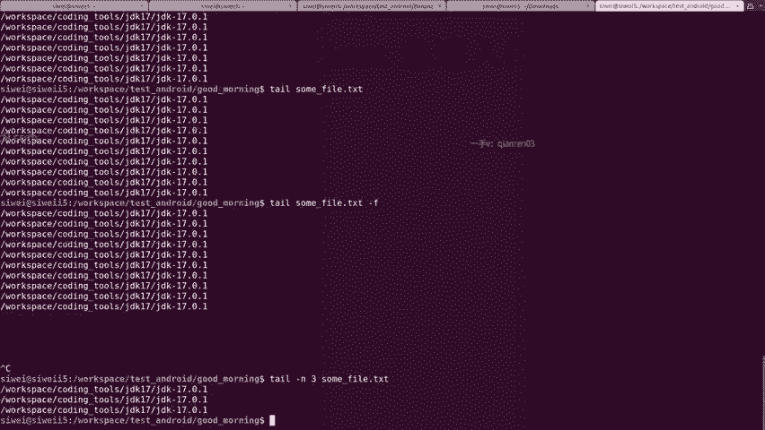

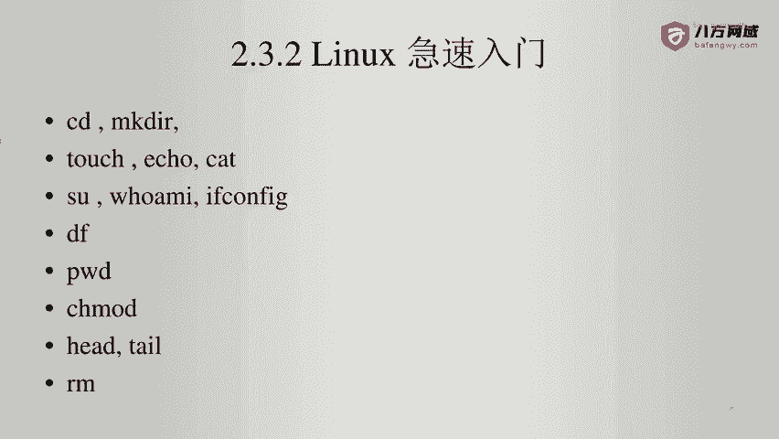

### `chmod`

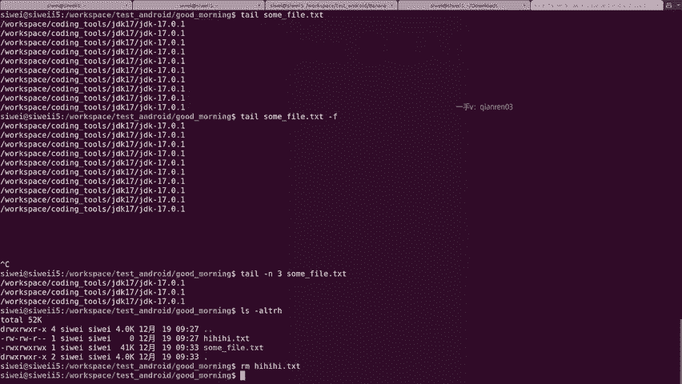

`chmod` 命令用于修改文件或目录的权限。Linux文件权限分为三组：**用户(User)**、**用户组(Group)** 和**其他用户(Others)**。每组权限包括读(r)、写(w)、执行(x)。

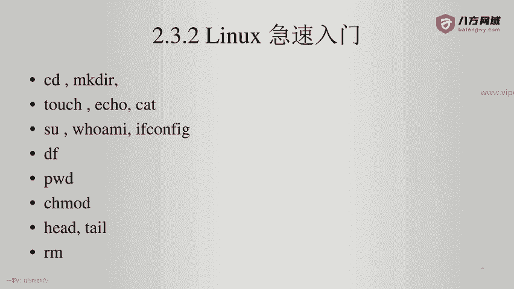

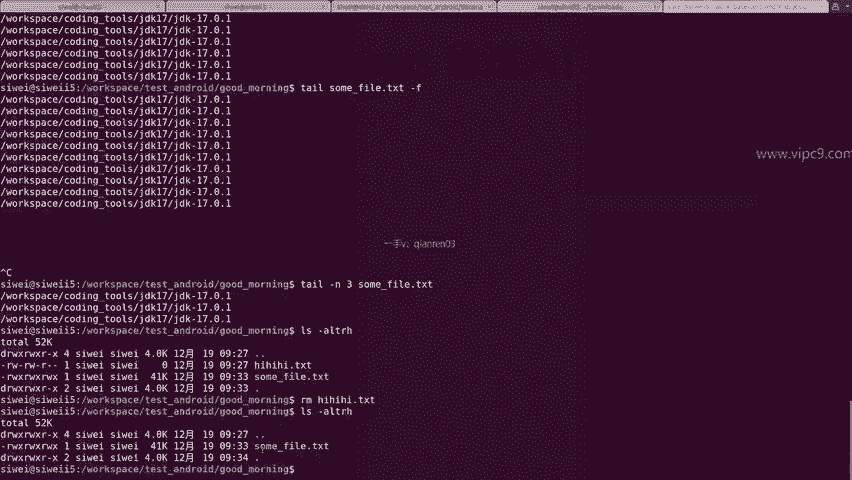

权限可以用数字表示：**读(r)=4**，**写(w)=2**，**执行(x)=1**。


以下是具体用法示例：
*   `chmod +x some_file`：为 `some_file` 文件的所有者添加执行权限。
*   `chmod 777 some_file`：将 `some_file` 文件的权限设置为所有用户可读、可写、可执行。
    *   第一个7（4+2+1）代表**用户**权限。
    *   第二个7代表**用户组**权限。
    *   第三个7代表**其他用户**权限。
*   可以使用 `man chmod` 命令查看更详细的手册。

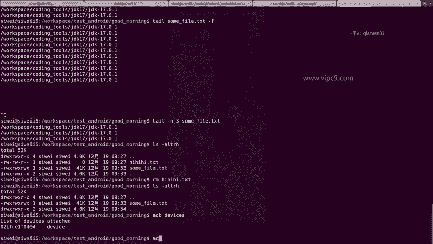

### `head` 与 `tail`

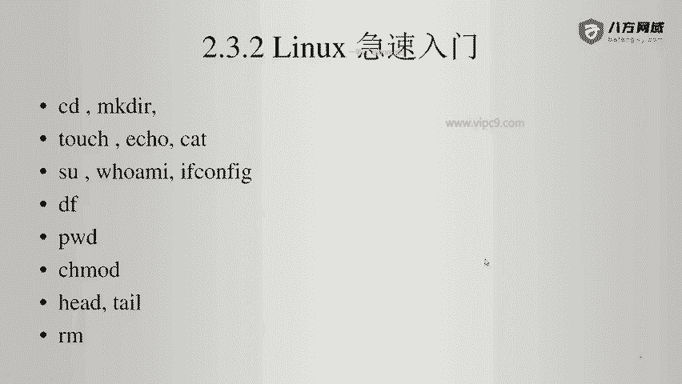

`head` 和 `tail` 命令用于查看文件的开头或结尾部分，常用于查看日志。

以下是具体用法示例：
*   `head some_file.txt`：默认显示文件的前10行。
*   `tail some_file.txt`：默认显示文件的最后10行。
*   `tail -n 20 some_file.txt`：显示文件的最后20行。
*   `tail -f log_file.txt`：实时跟踪并显示文件新增的内容（常用于监控日志）。

## 在安卓设备上实践

理论需要结合实践。现在，我们将上述命令应用到已连接的安卓设备上，通过ADB Shell来验证。

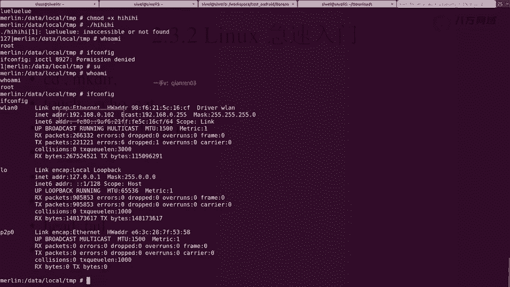

首先，确保设备已连接并开启USB调试：
```bash
adb devices
```
进入设备的Shell环境：
```bash
adb shell
```
现在，你可以在设备上执行Linux命令了：
*   `pwd`：查看设备上的当前目录。
*   `df -kh`：查看设备的存储空间。
*   `cd /data/local/tmp`：切换到临时目录。
*   `touch haihaihai`：在设备上创建文件。
*   `echo “lueluelue” > haihaihai`：向文件写入内容。
*   `cat haihaihai`：查看文件内容。
*   `whoami`：查看当前Shell的用户（可能是 `shell` 或 `root`）。
*   `su`：尝试获取root权限（取决于设备是否已root）。
*   `ifconfig`：查看设备的网络接口信息（可能需要root权限）。
*   `mkdir test_folder` 和 `rm -rf test_folder`：创建并删除目录。

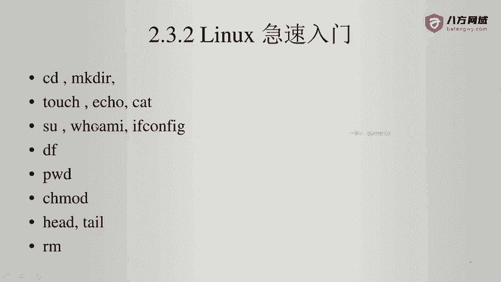

## 总结 🎯

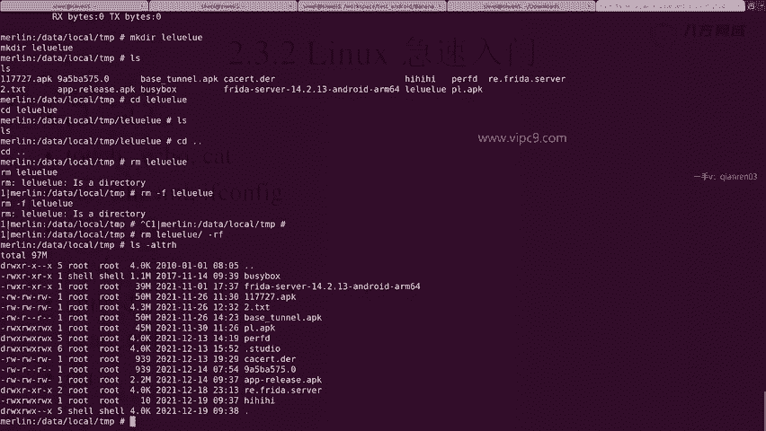

本节课中我们一起学习了Linux命令行的极速入门。我们涵盖了从基本的目录导航(`cd`, `pwd`, `mkdir`)、文件操作(`touch`, `echo`, `cat`, `rm`)，到系统信息查询(`whoami`, `ifconfig`, `df`)、权限管理(`chmod`)和日志查看(`head`, `tail`)等核心命令。最重要的是，我们验证了这些命令在安卓ADB Shell环境中同样有效，这是进行安卓逆向工程的基础。熟练掌握这些命令，将为后续更复杂的逆向分析工作铺平道路。