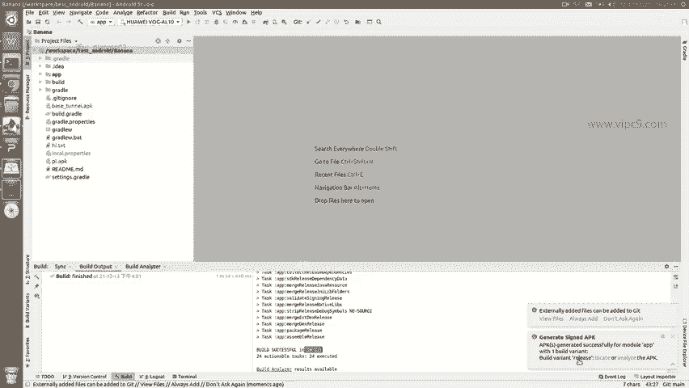
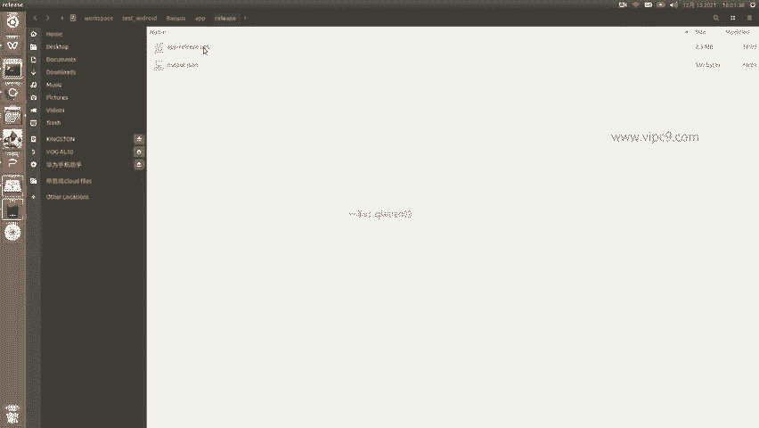
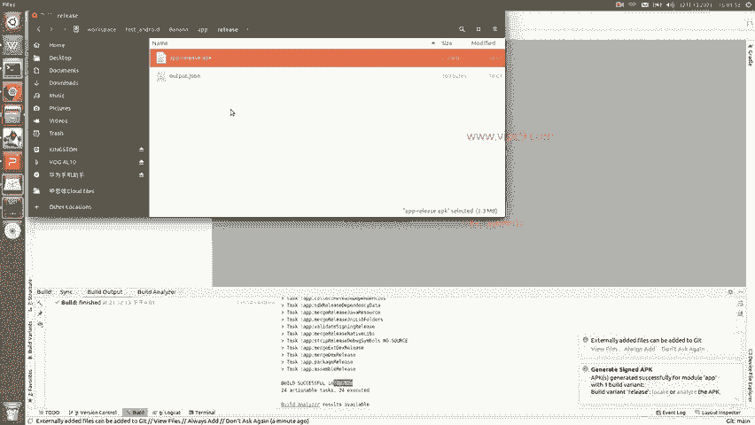

# Android逆向-基础篇：P27：章节3-20-普通发布的过程

在本节课中，我们将要学习Android应用发布的基础知识，特别是普通发布（未加固）的完整流程。我们将从打包一个APK文件开始，了解其关键步骤和概念。

## 普通发布的过程

上一节我们介绍了Android逆向的背景知识，本节中我们来看看一个标准的、未加固的Android应用是如何被打包和发布的。

普通发布的过程在Android Studio开发环境中进行演示。以下是一个简单的示例应用。

以下是打包APK的具体步骤：

1.  点击菜单栏的 **Build**。
2.  选择 **Generate Signed Bundle / APK**。
3.  在弹出的窗口中，选择 **APK** 选项，然后点击 **Next**。

接下来，系统会要求我们提供签名密钥（Key Store）的路径。因为Android应用打包发布时必须使用一个密钥进行签名。

如果我们没有现成的密钥文件，可以创建一个新的。以下是创建新密钥的步骤：

1.  点击 **Create new...**。
2.  选择密钥文件的保存位置，例如命名为 `android_quick_start.jks`。
3.  设置密钥库密码（Key store password），例如 `123456`。
4.  设置密钥别名（Alias），例如 `quick_start`。
5.  设置密钥密码（Key password），同样设为 `123456`。
6.  证书信息（如姓名、组织等）可填可不填，但建议至少填写一项。
7.  点击 **OK** 完成创建。

创建完成后，相应的路径和密码会自动填充。勾选 **Remember passwords** 以便下次使用，然后点击 **Next**。

此时，我们需要选择构建变体（Build Variants），这决定了打包的是开发版（Debug）还是正式版（Release）。在Gradle中，这被称为“风味”（Flavor）。

1.  在 **Build Variants** 中选择 **release**（正式发布版）。
2.  务必同时勾选签名版本 **V1 (Jar Signature)** 和 **V2 (Full APK Signature)**。
3.  点击 **Finish** 开始构建。

点击Finish后，Android Studio底部的 **Build** 窗口会显示构建进度（Gradle building...）。首次构建时，系统可能会下载一些必要的依赖项。构建过程包含多个子任务，如合并资源、链接代码等。

构建完成后，右下角会弹出通知提示。生成的APK文件位于项目的 `app/build/outputs/apk/release/` 目录下，文件名通常为 `app-release.apk`。

这个生成的APK文件就是Android应用的正式发布版本，可以安装到手机上进行测试或分发。

## 总结

本节课中我们一起学习了Android应用普通发布的完整流程。我们演示了如何在Android Studio中创建签名密钥、选择发布版本，并最终生成一个可安装的APK文件。理解这个基础流程是后续学习应用加固和逆向分析的重要前提。