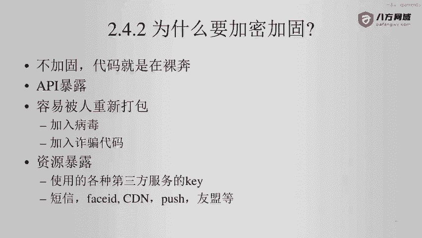
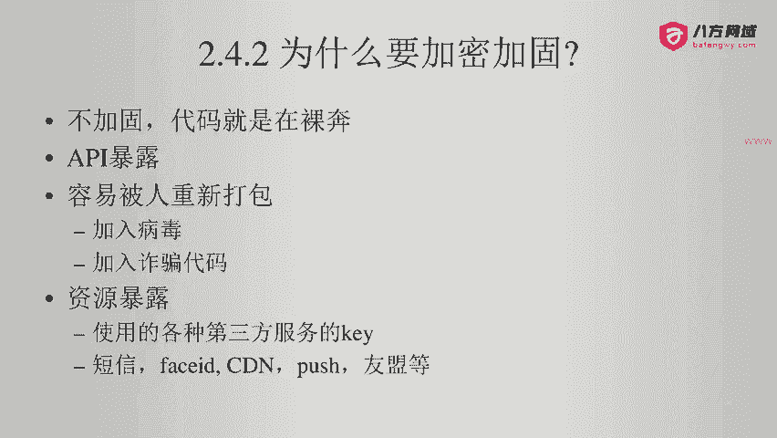
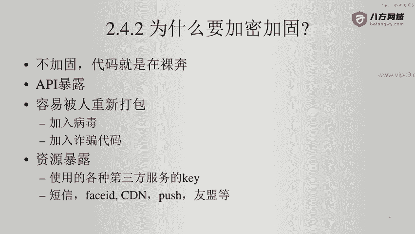
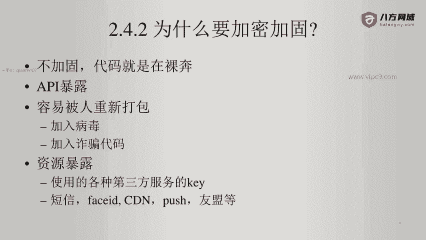
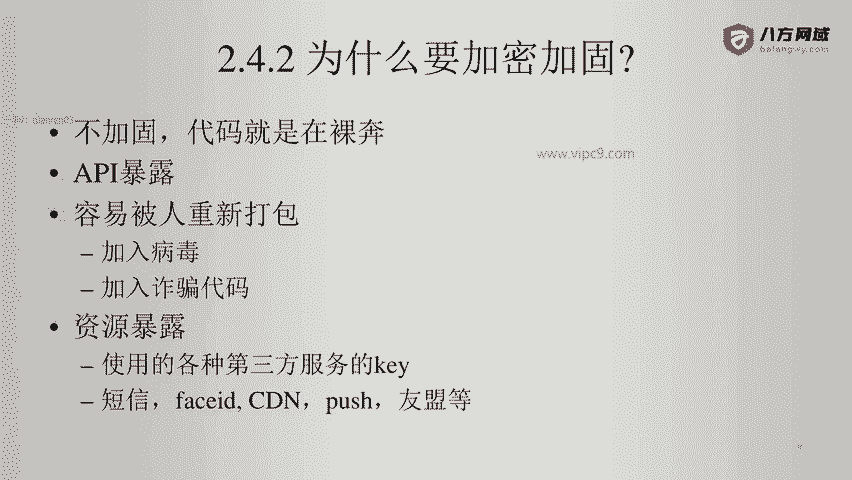
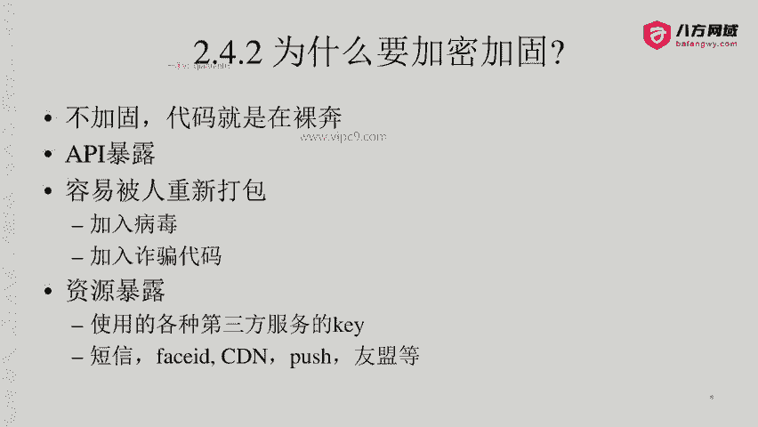
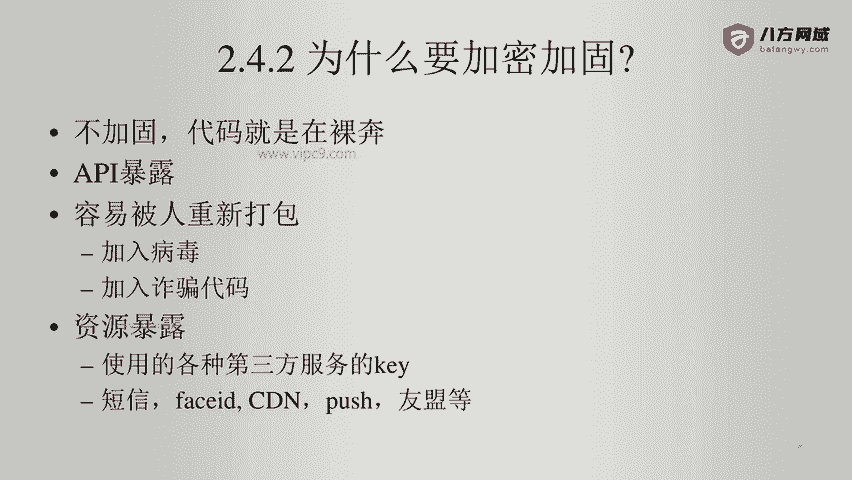
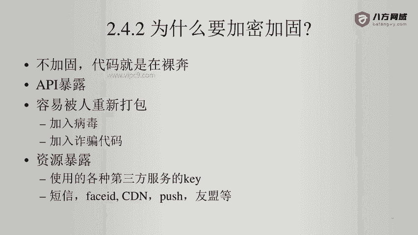

# Android逆向-基础篇：P28：章节3-21-为什么要加固加密 🔒

在本节课中，我们将要学习为什么需要对Android应用进行加固和加密。理解这一点是学习逆向工程和移动应用安全防护的基础。

## 概述

一个未经过任何保护的Android应用，其代码和资源是完全暴露的，这会给开发者和用户带来巨大的安全风险。本节将详细阐述不进行加固加密可能导致的几种主要问题。

## 代码与API的暴露

上一节我们介绍了逆向工程的基本概念，本节中我们来看看不加固的直接后果。未加固的应用，其所有代码逻辑和API接口都是清晰可见的。这意味着攻击者可以轻易地分析出应用的业务逻辑、关键算法和服务器通信方式。

## 应用被恶意篡改的风险

除了代码暴露，未加固的APK文件还极易被重新打包和篡改。攻击者可以修改原始应用，植入恶意代码。

以下是几种常见的恶意篡改方式：
*   **植入病毒或诈骗代码**：在应用中添加恶意程序，窃取用户信息或进行诈骗活动。
*   **篡改关键功能**：例如，如果应用具有收款功能，攻击者可能将收款二维码替换为自己的，从而窃取资金。
*   **植入后门程序**：添加能够远程控制设备、窃取相册、通讯录等敏感数据的代码。

更危险的是，攻击者可能窃取应用内的数字资产，例如将比特币钱包的私钥上传到远程服务器，给用户造成无法挽回的损失。因此，未加固的应用是非常脆弱的。

## 敏感资源的泄露

造成资源暴露是另一个严重问题。许多Android应用会集成第三方服务（如支付、推送、统计等），这些服务通常需要配置唯一的密钥（Key）或令牌（Token）。

如果这些敏感信息以明文形式写在客户端代码中，那么在应用打包时就会被包含进去。攻击者通过逆向工程可以轻易提取这些信息。

以下是几种常见的敏感资源示例：
*   支付接口的商户密钥
*   短信验证或人脸识别服务的授权码
*   内容分发网络（CDN）的访问密钥
*   推送服务（如极光、个推）的AppKey
*   友盟等统计平台的Secret

一旦这些密钥泄露，攻击者就可以盗用对应的服务，产生巨额费用，或者伪造请求攻击服务器，这都属于严重的资源暴露问题。

## 总结

本节课中我们一起学习了不对Android应用进行加固加密所带来的主要风险。我们了解到，未保护的应用会导致**核心代码与API暴露**、**应用容易被恶意篡改和重新打包**，以及**集成服务的敏感密钥等资源泄露**。认识到这些风险，是理解后续应用加固技术必要性的第一步。