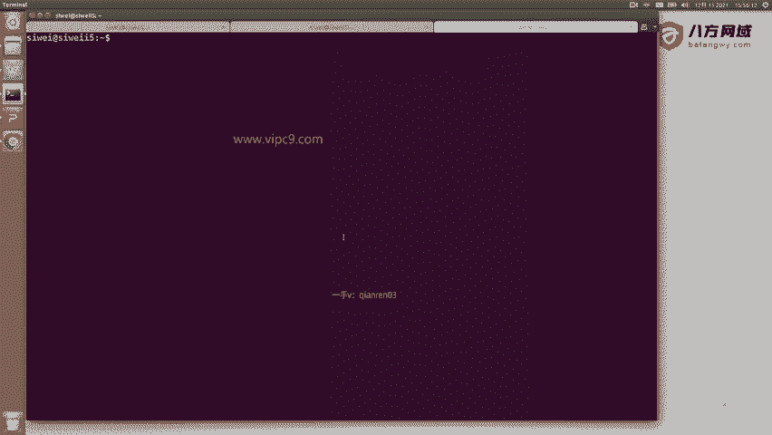
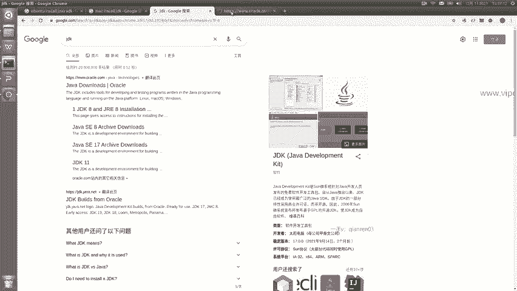
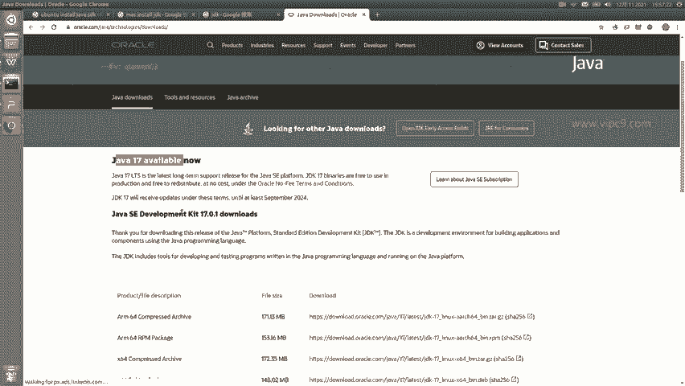
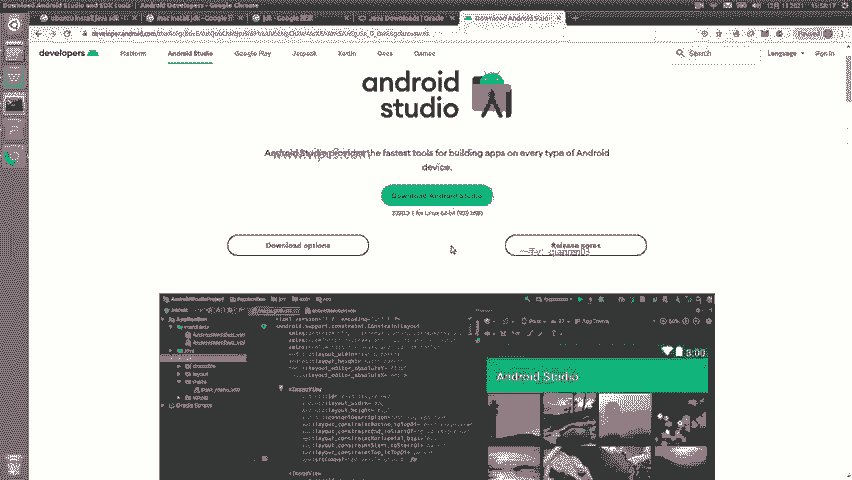
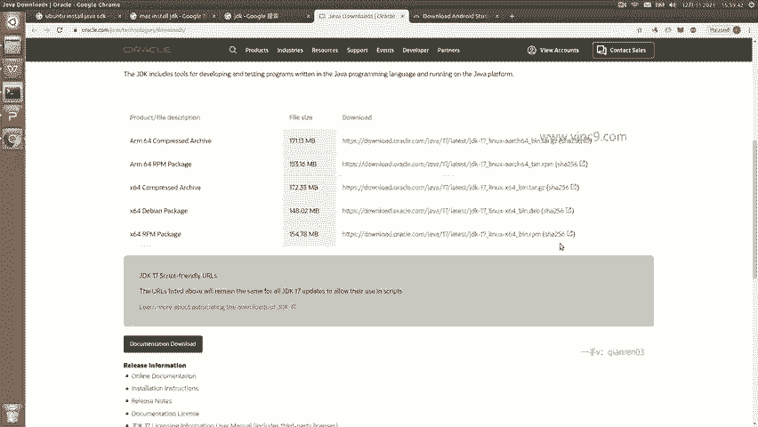

# Android逆向-基础篇：P2：章节2-1-Linux-mac设置jdk

在本节课中，我们将学习如何在Linux或macOS操作系统上设置Java开发工具包（JDK），这是进行Android正向开发的第一步。我们将介绍如何下载和安装JDK，并确保开发环境准备就绪。

## 搭建开发环境


上一节我们介绍了课程的整体目标，本节中我们来看看如何搭建基础的开发环境。首先需要准备的是操作系统和开发工具。



操作系统方面，Windows、macOS或Linux均可。本教程将以Linux系统（Ubuntu 18）为例进行演示。


开发工具我们选择Android Studio。但在安装Android Studio之前，需要先安装Java SDK，即JDK。

## 下载与安装JDK

以下是下载和安装JDK的步骤。



1.  **搜索JDK安装指南**：打开浏览器，根据你的操作系统搜索相应的JDK安装方法。例如，在Ubuntu上可以搜索“Ubuntu 安装 Java SDK”，在macOS上搜索“macOS install JDK”，在Windows上搜索“Windows install JDK”。

2.  **访问官方网站**：建议从Oracle官网下载JDK。搜索“JDK”通常会引导至Oracle官方网站。



3.  **选择JDK版本**：在官网上，可以看到最新的JDK版本（例如JDK 17）。但建议初学者不要立即使用最新版本，而是选择一个稳定的长期支持版本。可以查看Android Studio的官方要求，以确定兼容的JDK版本。通常，Android Studio对JDK版本的支持比较宽泛。

4.  **下载安装包**：在官网上，找到标有“LTS”（Long Term Support，长期支持）的版本进行下载。根据你的操作系统，下载对应的安装包格式。对于Linux，常见的有`.tar.gz`压缩包或`.deb`、`.rpm`安装包；对于Windows，是`.exe`安装文件；对于macOS，则是`.dmg`或`.pkg`文件。



5.  **安装JDK**：下载完成后，最简单的安装方式是使用系统对应的安装包进行安装。对于Linux的`.tar.gz`包，通常解压到指定目录并配置环境变量即可。

## 验证安装

安装完成后，可以打开终端，输入以下命令来验证JDK是否安装成功：

```bash
java -version
```

如果安装成功，终端会显示已安装的Java版本信息。

## 总结



本节课中我们一起学习了在Linux或macOS系统上设置JDK环境。我们了解了选择稳定JDK版本的重要性，并掌握了从官网下载及安装的基本步骤。正确安装JDK是为后续安装Android Studio和进行Android开发奠定基础的关键环节。下一节，我们将开始安装和配置Android Studio集成开发环境。