# Android逆向-基础篇：P30：章节3-23-加密加固的多种方案 🔐

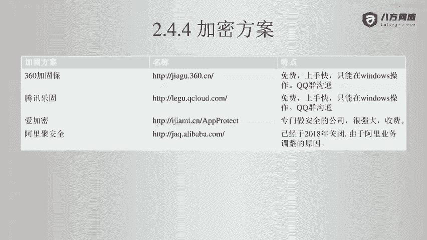

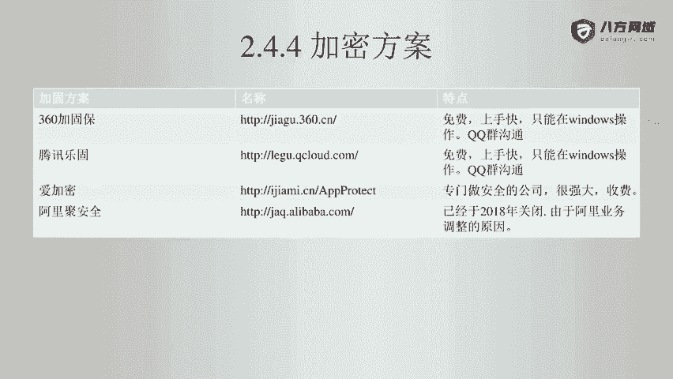

在本节课中，我们将要学习Android应用加密加固的多种主流方案，了解它们的特点、适用场景以及一些关键的使用限制。

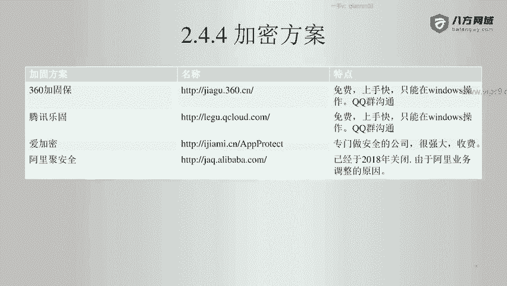

上一节我们介绍了Android应用加固的基本概念，本节中我们来看看市面上几种常见的加密加固方案。

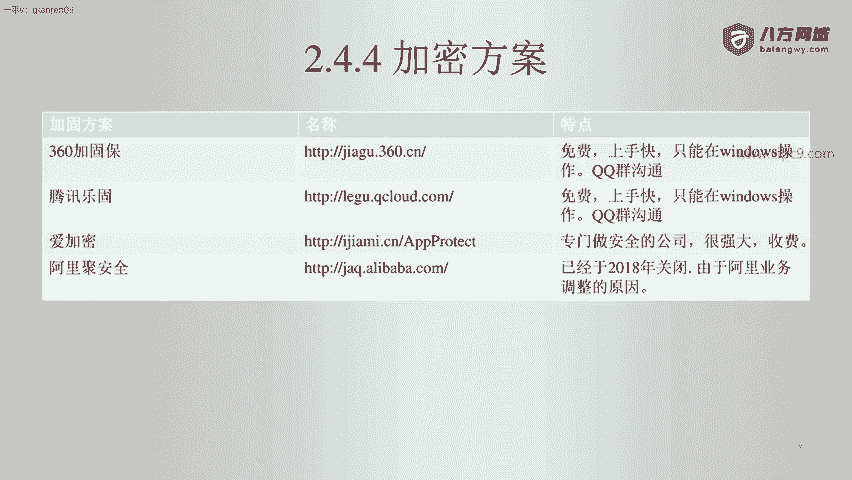

## 主流加密加固方案

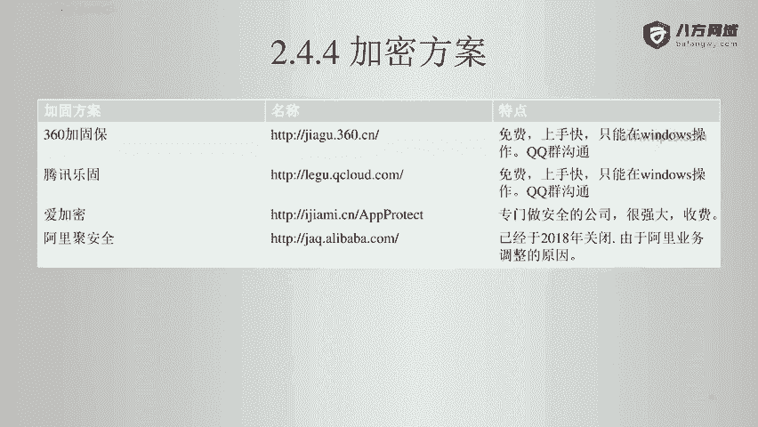

以下是几种主流的Android应用加密加固方案及其特点：

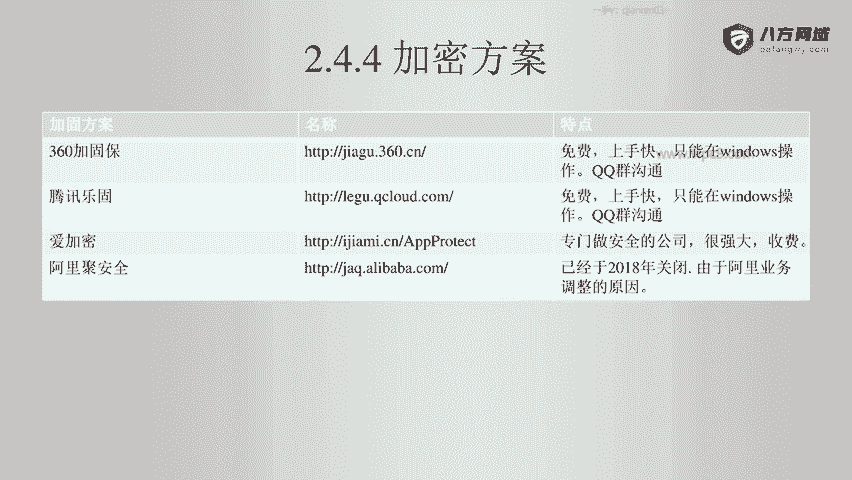

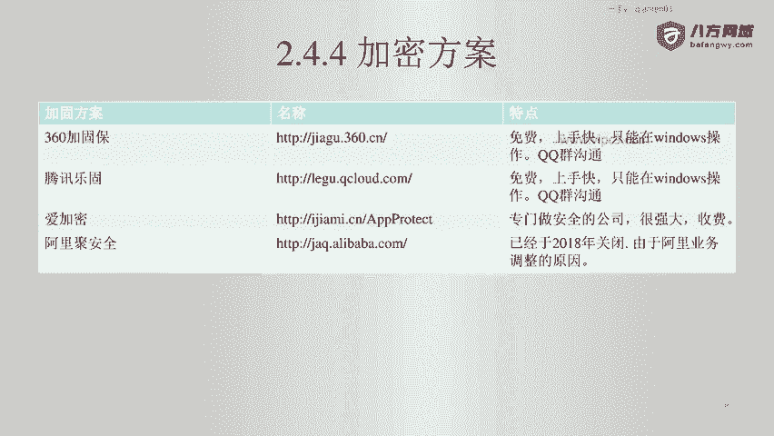

*   **360加固宝**：一款广泛使用的免费加固方案。
*   **腾讯乐固**：另一款流行的免费加固方案。
*   **爱加密**：商业级的加密加固方案，效果较好，但价格较高。
*   **阿里聚安全**：该服务已于2018年关闭。

## 方案选择建议

对于不同规模和类型的项目，加固方案的选择有所不同。

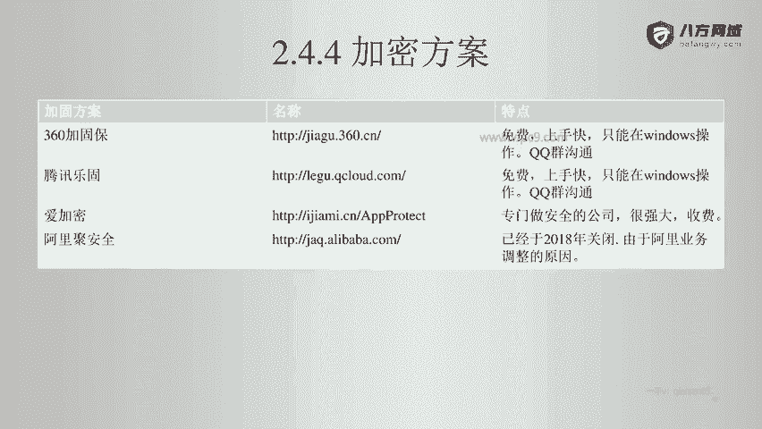

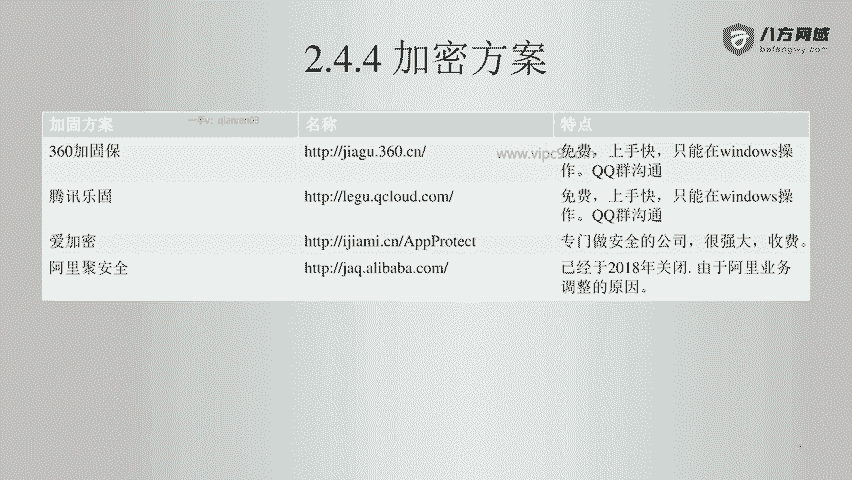

*   **一般应用**：如果应用的用户量在100万以内，使用**360加固宝**或**腾讯乐固**这类免费方案即可获得良好的保护效果。
*   **金融类应用**：对于安全性要求极高的项目，如手机银行，选择**爱加密**这类商业级方案是更合适的选择。

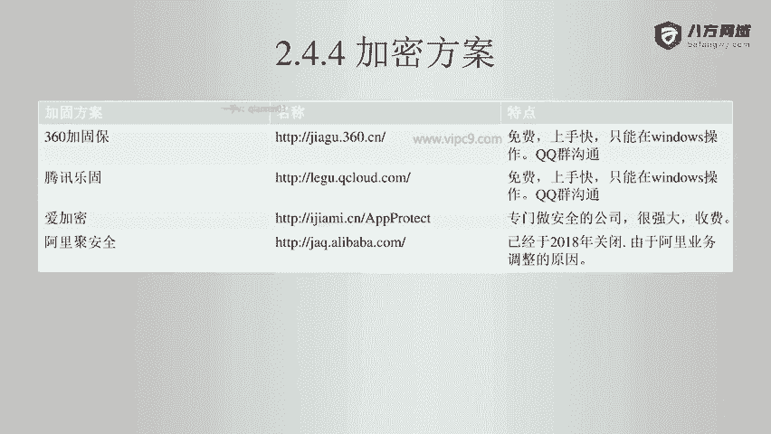

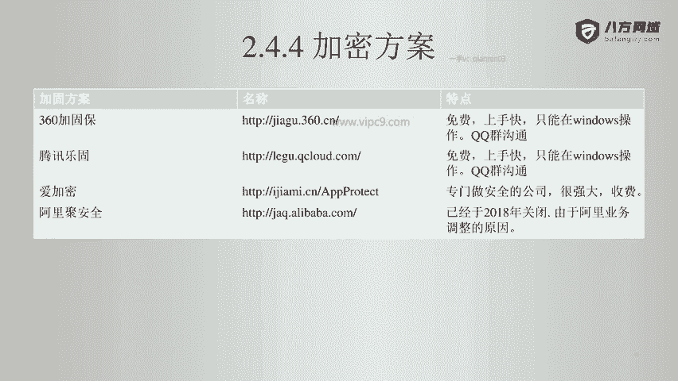

## 重要注意事项

在使用某些加固方案时，需要注意其平台和沟通方式的限制。

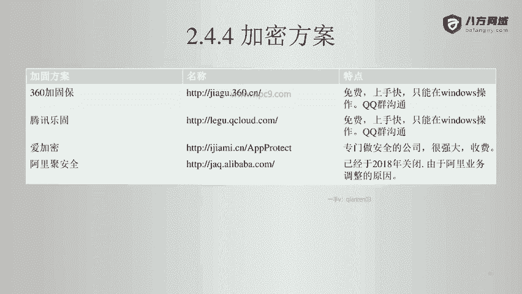

*   **操作平台限制**：**腾讯乐固**和**360加固宝**的加固操作只能在**Windows**操作系统上进行。
*   **沟通方式**：这些方案的官方沟通渠道通常只有**QQ群**。

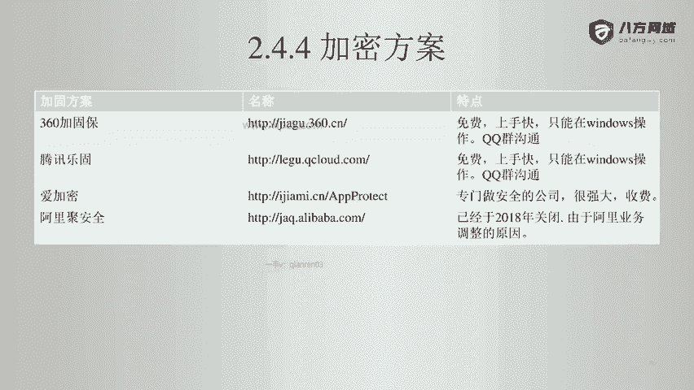

本节课中我们一起学习了Android应用加密加固的几种主流方案，包括360加固宝、腾讯乐固、爱加密和已关闭的阿里聚安全。我们了解了如何根据应用类型和用户规模选择合适的方案，并特别指出了免费方案在操作平台和沟通方式上的限制。掌握这些知识有助于在实际开发中为应用选择恰当的防护手段。