# Android逆向-基础篇：P31：章节4-1-安卓逆向基础-基本路径&基本用法

在本节课中，我们将要学习安卓逆向的基础知识，包括反编译的基本路径和几种核心的反编译方法。通过本节课的学习，你将能够理解如何将一个APK文件逐步还原为可读的Java源代码。

## 概述

经过前两章的学习，我们已经对安卓正向开发有了很好的入门。从本章开始，我们将系统地学习安卓逆向。安卓逆向可以大致分为两部分：基础逆向和针对加固应用的高级逆向。本章我们只学习基础逆向部分，首先会介绍反编译的几种基本路径，然后演示一种最常用的反编译方法。

## 反编译的基本路径

安卓逆向的核心目标是将编译后的APK文件还原为可读的源代码。目前主要有以下几种反编译路径。

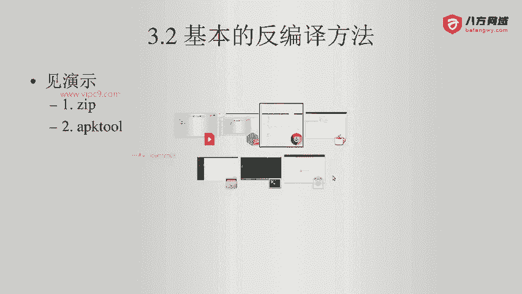

以下是四种主要的反编译路径：

1.  **APK -> Smali**：此路径主要用于重新打包应用。
2.  **APK -> DEX -> JAR -> Java**：一种经典的反编译路径，最终目标是获得Java文件。
3.  **APK -> (通过工具) -> DEX -> JAR -> Java**：与路径2类似，但使用特定工具直接从APK提取DEX文件。
4.  **APK -> Java**：使用集成化工具，直接从APK得到Java文件。

在实际操作中，我们会根据具体情况选择不同的路径。

上一节我们介绍了反编译的几种基本路径，本节中我们来看看如何实际操作第一种经典路径：从APK到DEX，再到JAR，最后到Java。

## 基本反编译方法演示

首先，我们来看一个之前通过打包生成的APK文件。

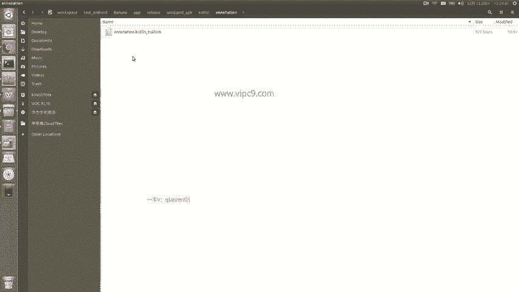

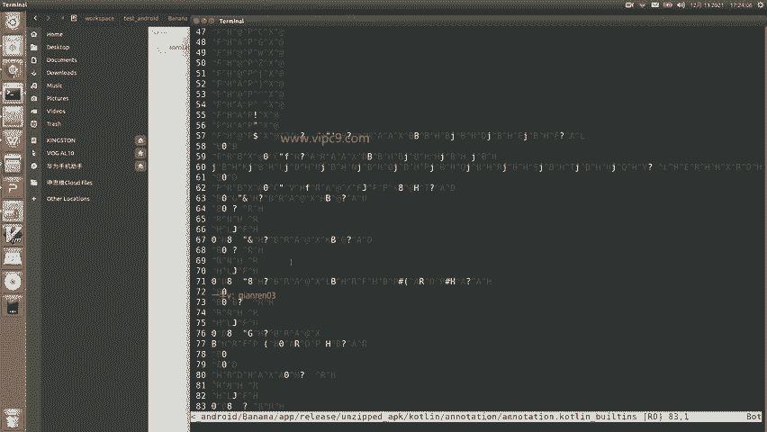


进入项目目录，可以找到一个名为 `app-release.apk` 的文件。需要记住，APK文件的本质是一个ZIP压缩包。

我将这个APK文件重命名为 `.zip` 后缀，然后双击打开。可以看到压缩包内的结构，其中包含了各种文件和文件夹。


解压这个ZIP文件后，会得到一系列内容。其中最重要的文件是 `classes.dex`。这个文件包含了应用程序编译后的字节码。


其他文件如 `AndroidManifest.xml`、资源文件等虽然存在，但格式可能已被转换或压缩，直接阅读比较困难。因此，`classes.dex` 是我们逆向分析的核心起点，这对应了之前提到的路径2的第一步：**从APK得到DEX**。

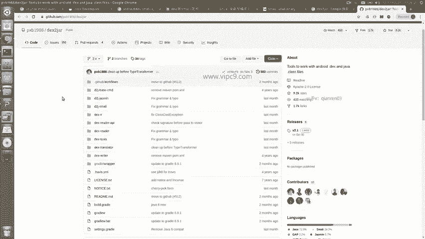

接下来，我们需要将DEX文件转换为JAR文件。

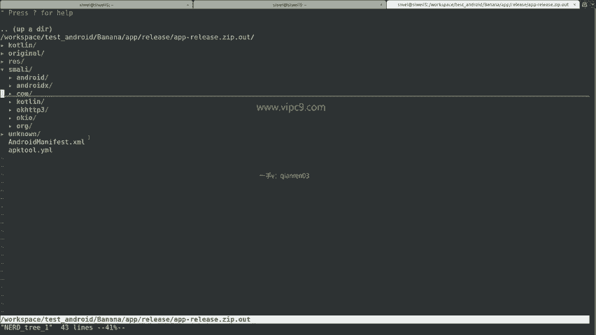

### 步骤一：DEX 转 JAR

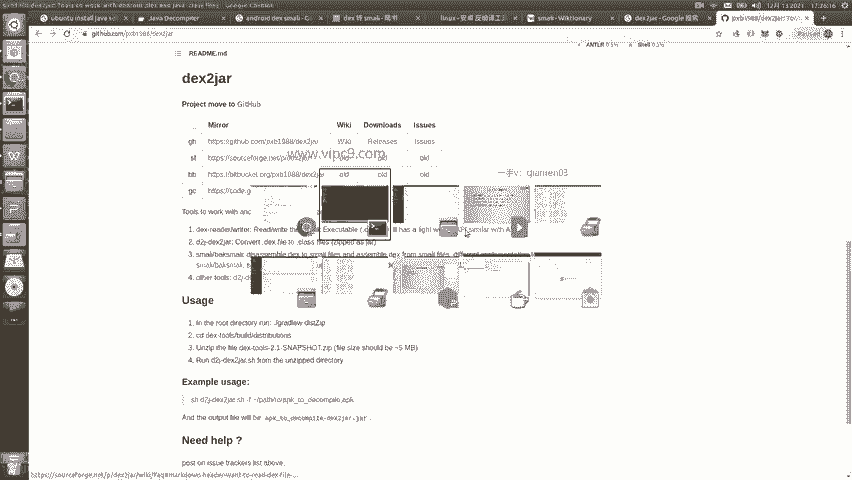

我们可以使用一个名为 `dex2jar` 的工具来完成这个转换。这是一个由开发者维护的开源工具。

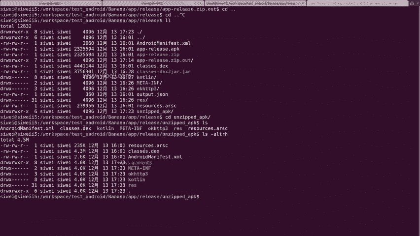

在我的电脑上已经下载好了该工具。它是一个命令行工具，将其所在目录添加到系统路径即可使用。

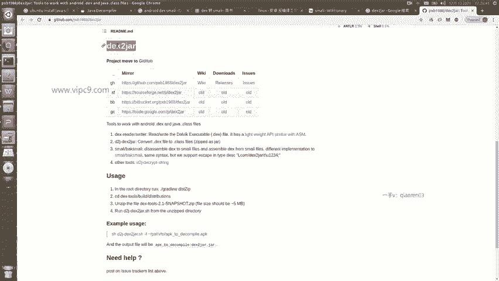

现在进行演示。首先进入包含 `classes.dex` 文件的解压目录。


然后执行 `dex2jar` 工具提供的转换脚本。最常用的脚本是 `d2j-dex2jar.sh`。

```bash
d2j-dex2jar.sh classes.dex
```

执行该命令后，工具会开始转换过程。


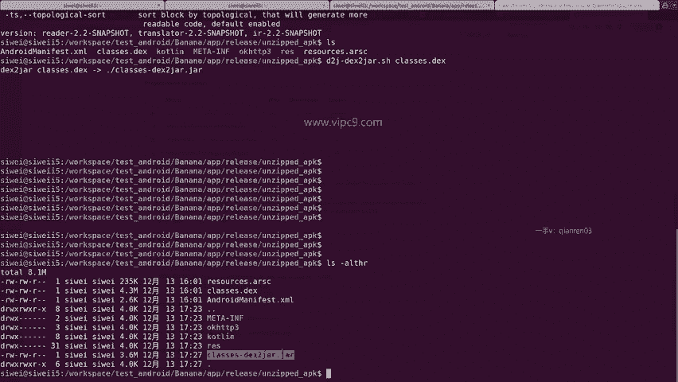

转换完成后，会在当前目录生成一个JAR文件（例如 `classes-dex2jar.jar`）。可以看到，DEX文件大小约为4.3MB，转换后的JAR文件约为3.6MB。

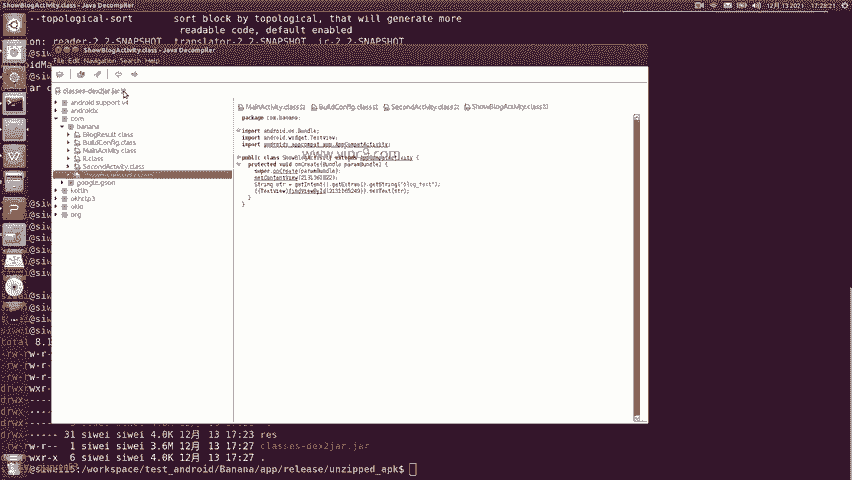


现在，我们得到了JAR文件。下一个问题是如何查看JAR文件中的Java代码。

### 步骤二：使用 JD-GUI 查看Java代码

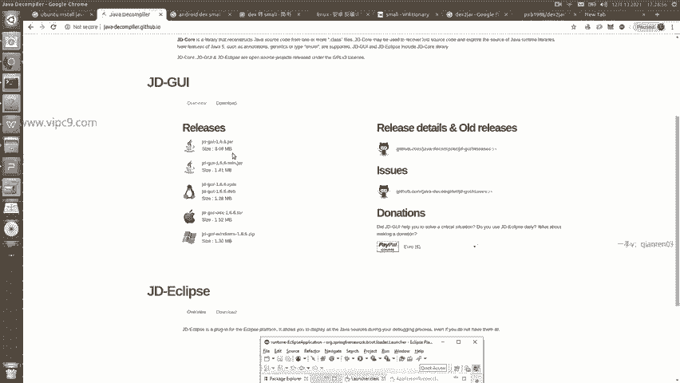

要查看JAR文件中的反编译代码，我们可以使用一个名为 **JD-GUI** 的工具。它是一个Java反编译器，有独立版本和IDE插件版本。

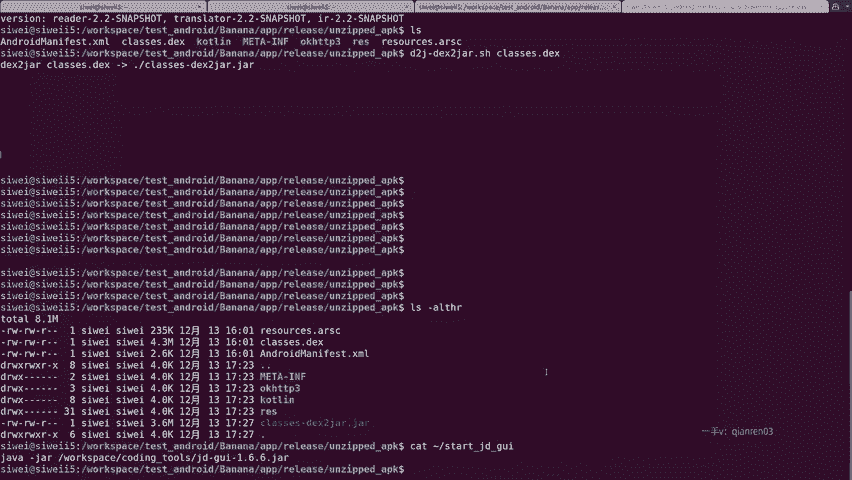

我们可以从其官方网站下载对应操作系统的版本。这里我使用的是可执行的JAR版本。

下载后，通过以下命令运行JD-GUI：

```bash
java -jar jd-gui.jar
```

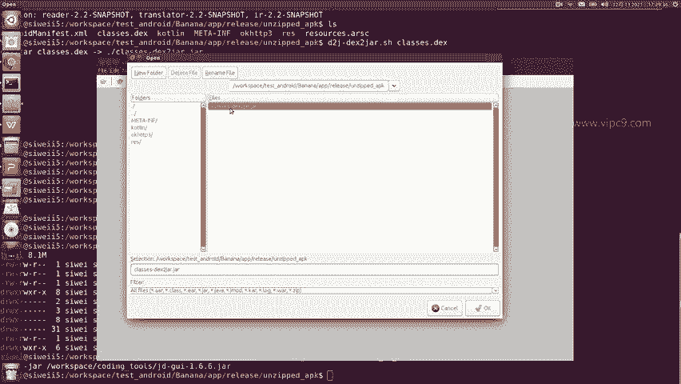

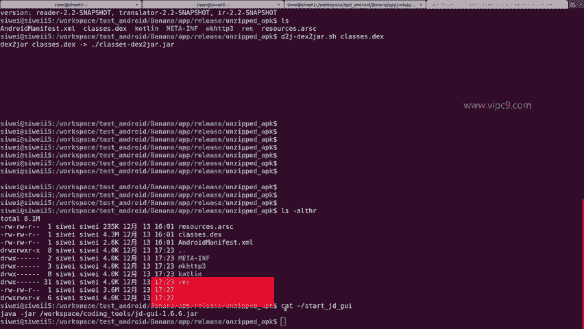

运行后，JD-GUI的界面会打开。


通过菜单栏的 `File` -> `Open File...`，选择我们刚才生成的 `classes-dex2jar.jar` 文件。

打开后，界面左侧会以树形结构展示JAR包中的所有类。其中会包含Android系统库、第三方库以及我们自己的应用代码。


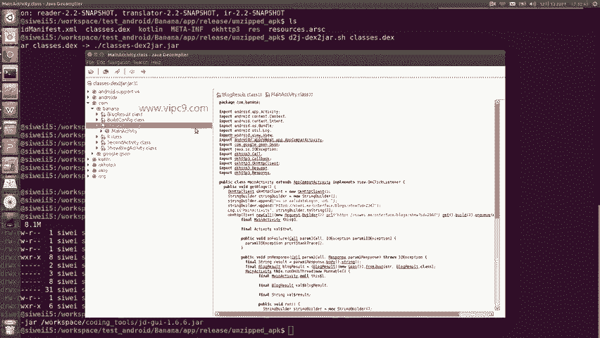

通常，以 `com.` 开头的包名最有可能是我们自己的应用代码。在本例中，我们的应用包名为 `com.banana`，因此可以很快定位到目标。


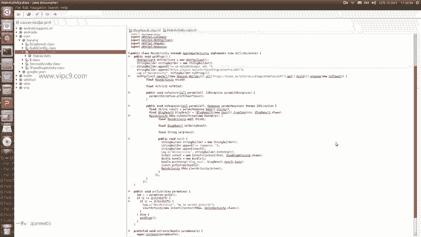

点击进入 `MainActivity.class`，右侧窗口会显示反编译出的Java代码。

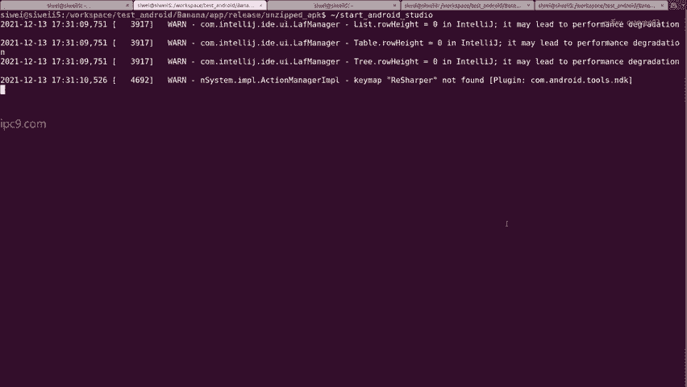


为了验证准确性，我们可以打开Android Studio中的原始源代码进行对比。


对比发现，反编译得到的代码中的方法（如 `onCreate`, `onClick`, `getBlocks`）与源代码完全对应。虽然代码顺序、注释可能丢失，并且控制结构（如 `if` 和 `switch`）可能被等价转换，但核心逻辑和字符串常量（如接口地址）都得以保留。

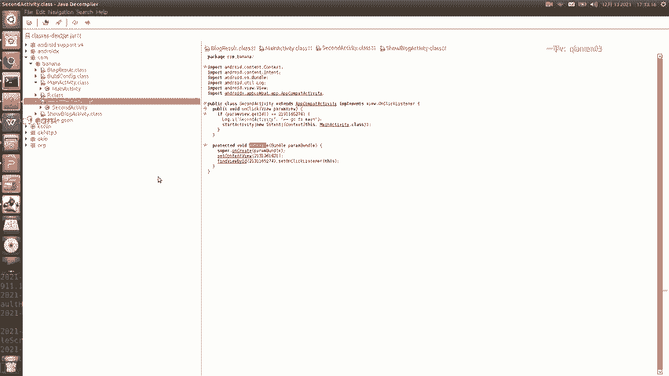

同样，我们可以查看其他Activity（如 `SecondActivity`），其代码结构也能被正确反编译出来。这就是最基本的安卓逆向流程。

## 总结


本节课中我们一起学习了安卓逆向的基础入门知识。我们首先了解了反编译的几种基本路径，然后重点演示了最经典的一种：**APK -> DEX -> JAR -> Java**。通过使用 `dex2jar` 和 `JD-GUI` 这两个工具，我们成功将一个APK文件还原成了可读的Java源代码。这是所有安卓逆向分析的起点，后续更复杂的分析都建立在此基础之上。