# Android逆向-基础篇：P32：章节4-2：jd-gui的基本用法 🛠️

在本节课中，我们将要学习逆向工程中一个非常实用的工具——JD-GUI的基本操作方法。JD-GUI是一款Java反编译器，能够将编译后的`.class`或`.jar`文件还原成可读的Java源代码。掌握它的核心功能，能极大地提升我们分析和理解Android应用代码的效率。

## 概述
本节课将详细介绍JD-GUI的三个核心操作：如何在代码间快速跳转、如何管理多个打开的类文件，以及如何将反编译的源代码保存到本地。这些是使用JD-GUI进行静态分析的基础。

---

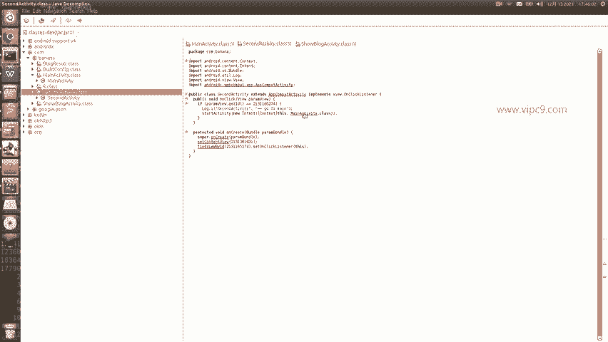

## 代码跳转功能 🔍
上一节我们介绍了如何用JD-GUI打开一个APK文件。本节中我们来看看如何高效地浏览反编译出的代码。JD-GUI支持通过鼠标点击进行快速导航。

以下是具体的操作方法：
*   在代码中，当看到类名、方法名或变量名时，直接用鼠标左键点击。
*   点击后，JD-GUI会自动跳转到该名称对应的类或方法的定义处。

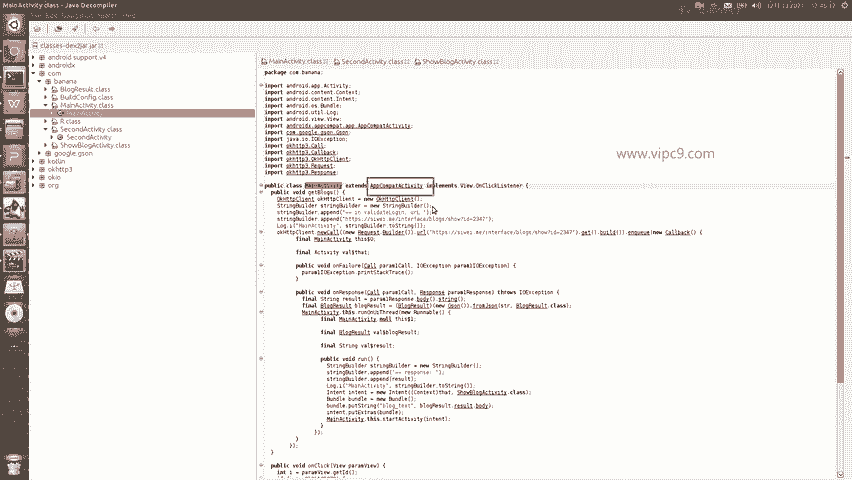

例如，在代码中看到 `MainActivity`，点击它即可跳转到 `MainActivity` 类的定义。

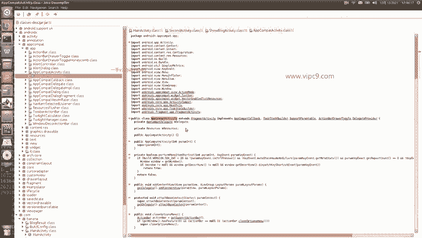

同理，点击 `AppCompActivity` 会跳转到对应的类。

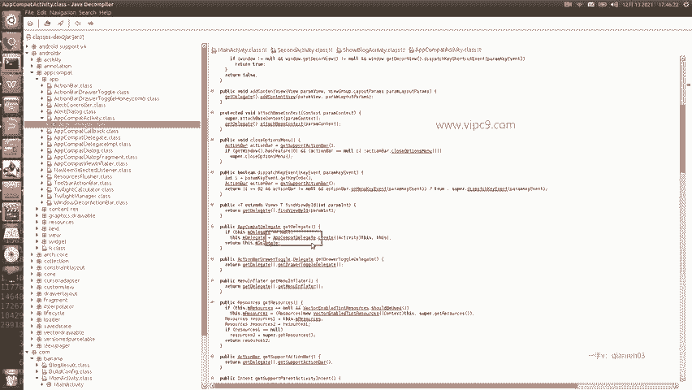

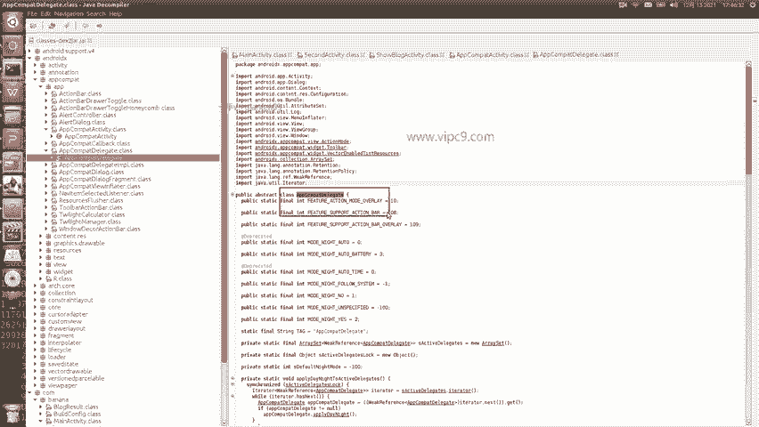

再次尝试点击 `AppCompDelegate`，也会成功跳转。

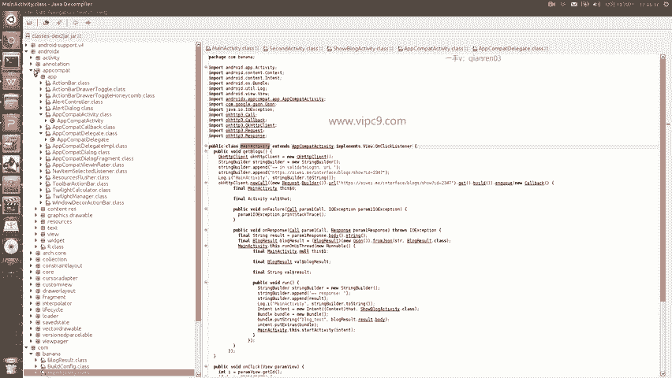

因此，通过简单的鼠标点击，就能在不同的类和方法之间自由跳转，方便追踪代码逻辑。

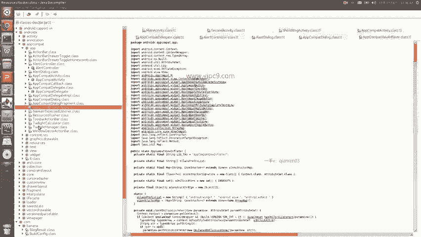

---

## 管理多个标签页 📑
在分析过程中，我们可能会打开越来越多的类文件，所有打开的文件会以标签页的形式排列在窗口顶部。

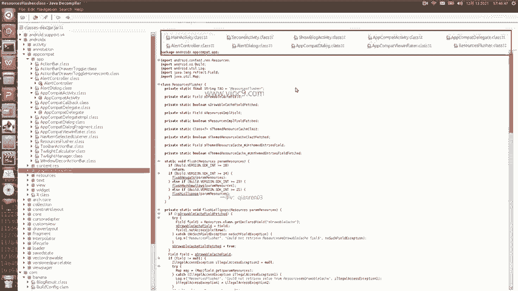

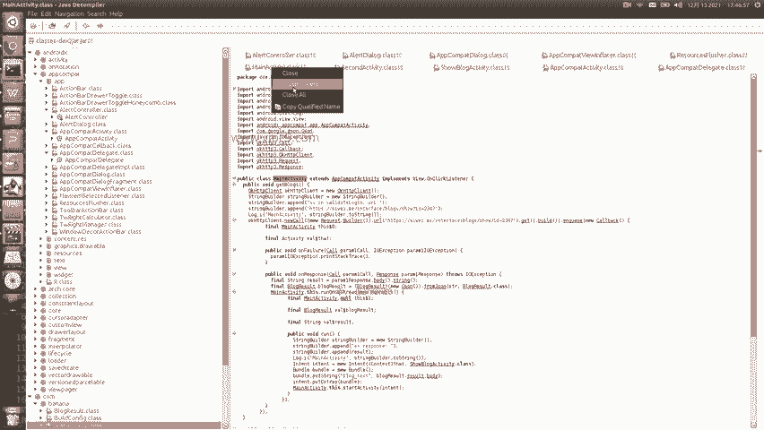

当标签页过多时，可以使用以下方法进行管理：
*   在任意一个标签页上点击鼠标右键。
*   在弹出的菜单中，选择 **`Close Others`** 可以关闭除当前标签页外的所有其他标签页。
*   选择 **`Close All`** 则可以关闭所有已打开的标签页。

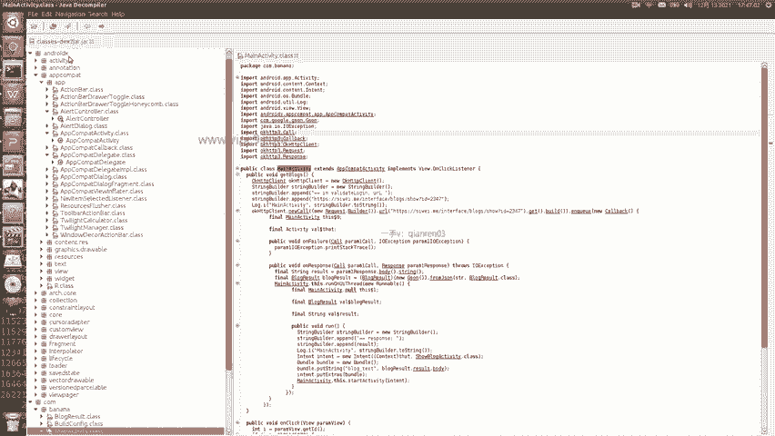

执行 `Close Others` 后，界面将只保留当前正在查看的文件。

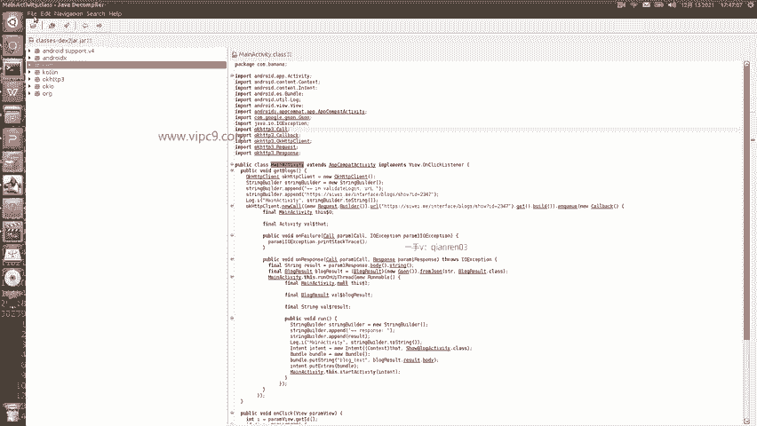

---

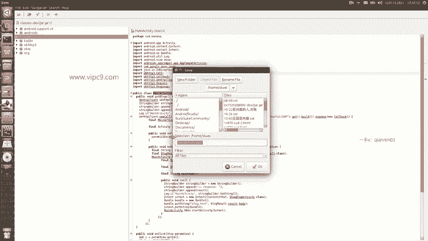

## 保存源代码 💾
有时我们需要将反编译出的Java代码保存到本地，以便使用其他编辑器查看或进行版本管理。JD-GUI提供了两种保存方式。

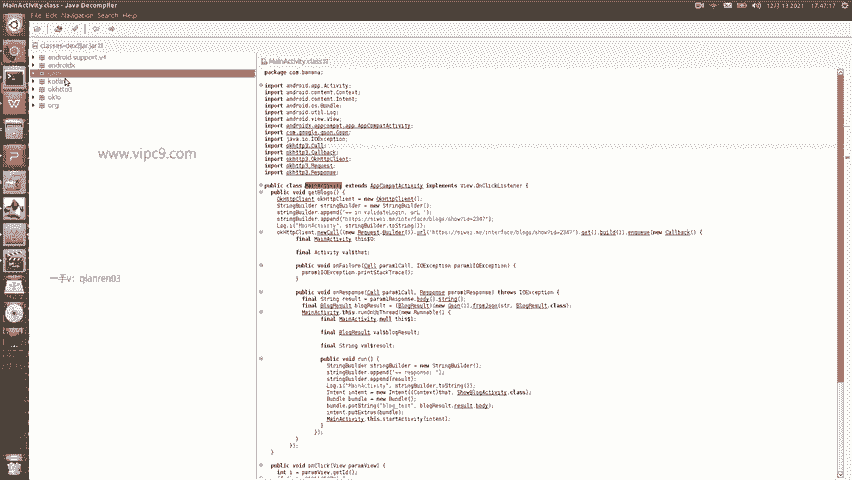

### 保存单个文件
如果你只想保存当前正在查看的这个类文件，操作如下：
1.  点击菜单栏的 **`File`**。
2.  在下拉菜单中选择 **`Save`**。
3.  选择保存路径，即可将当前文件保存为 `.java` 文件。

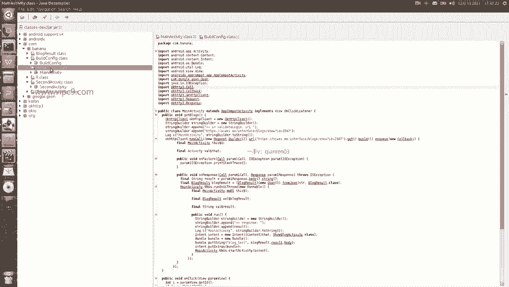

### 保存全部源代码
如果你想一次性导出当前打开的所有类文件，或者整个包的源代码，请使用以下功能：
1.  点击菜单栏的 **`File`**。
2.  选择 **`Save All Sources`**。
3.  在弹出的窗口中，选择希望保存的文件夹路径。

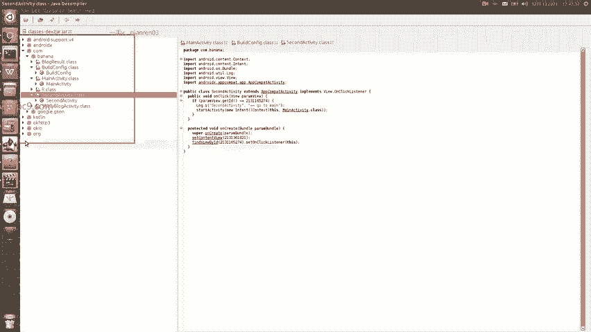

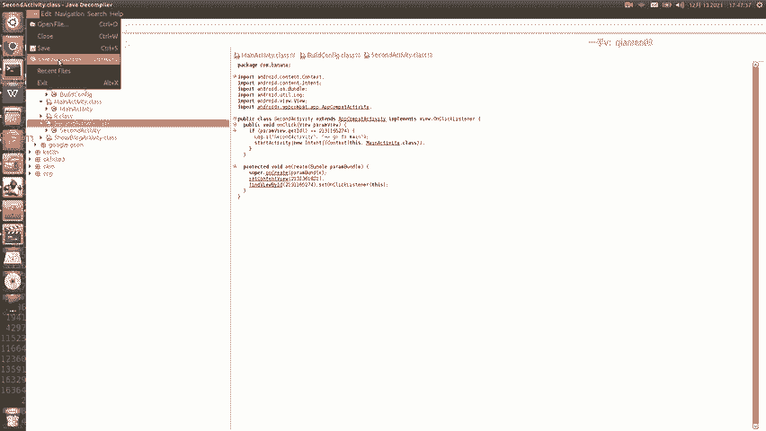

确认后，JD-GUI会将所有反编译出的Java文件打包成一个ZIP压缩包。

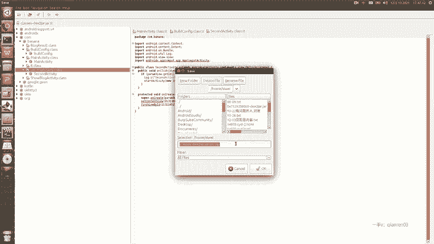

保存过程中，界面会显示进度条。

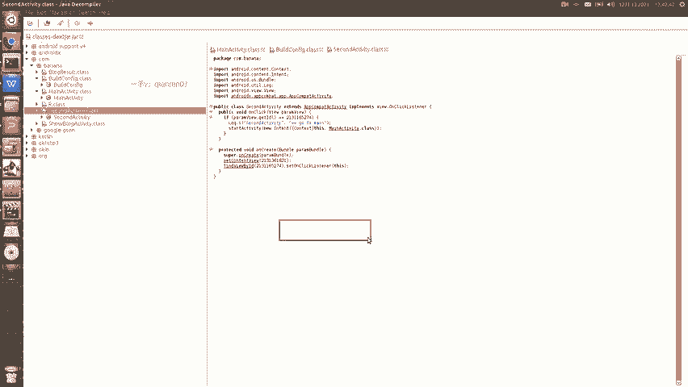

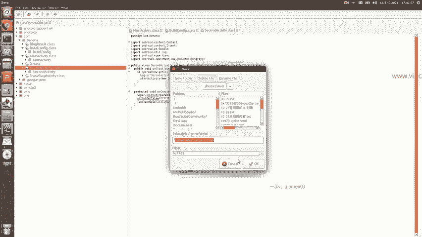

等待进度条完成，即可在指定目录找到生成的压缩包文件。文件大小会影响保存所需的时间。

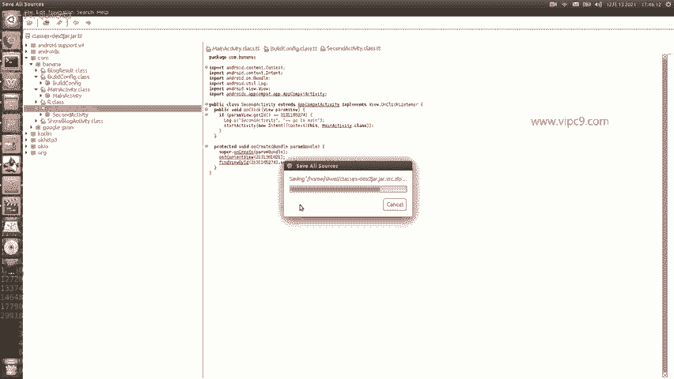

---

## 总结
本节课中我们一起学习了JD-GUI的三个基本但至关重要的操作：**通过点击进行代码跳转**、**使用右键菜单管理多个标签页**，以及**通过 `Save` 和 `Save All Sources` 功能导出源代码**。熟练掌握这些功能，是使用JD-GUI进行高效Android应用逆向分析的第一步。