# Android逆向-基础篇：P33：章节4-3-apk-to-smali路径

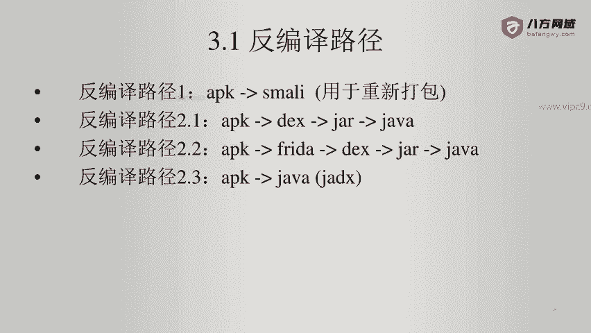

在本节课中，我们将要学习如何将一个未加固的APK文件反编译成smali代码。这是Android逆向工程中用于分析和重新打包应用的关键步骤。

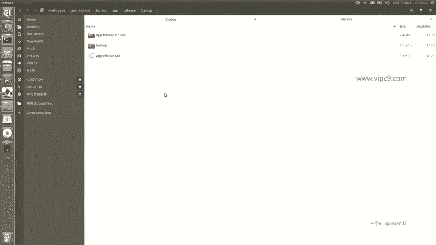

## 概述

反编译路径是指从APK文件获取其内部smali代码的过程。smali是一种类似于汇编语言的中间表示，它对应着原始的Java/Kotlin源代码。掌握这个路径对于后续的代码分析和修改至关重要。

上一节我们介绍了APK的基本结构，本节中我们来看看如何将其内容反编译为可读的smali代码。

## 反编译工具：apktool

我们使用一个名为 **apktool** 的工具来完成反编译工作。它是一个广泛使用的Android逆向工程工具。

以下是apktool的基本命令格式：

```bash
apktool d [APK文件路径]
```

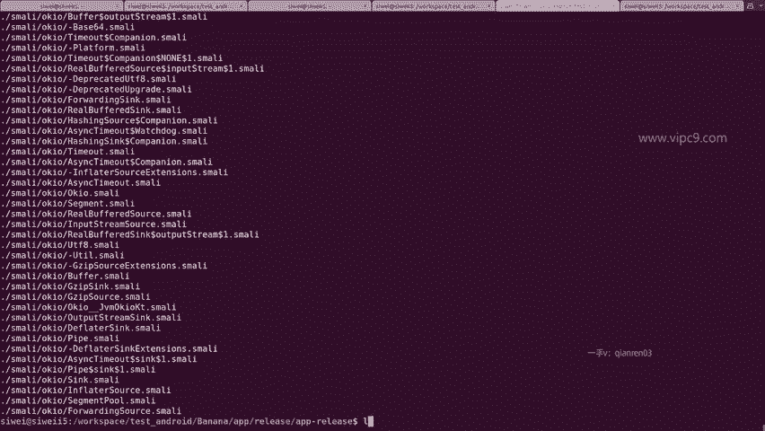

其中，参数 `d` 代表 `decode`，即解码或反编译。

## 操作演示

现在，我们进入存放目标APK文件的目录。假设APK文件名为 `app-release.apk`。

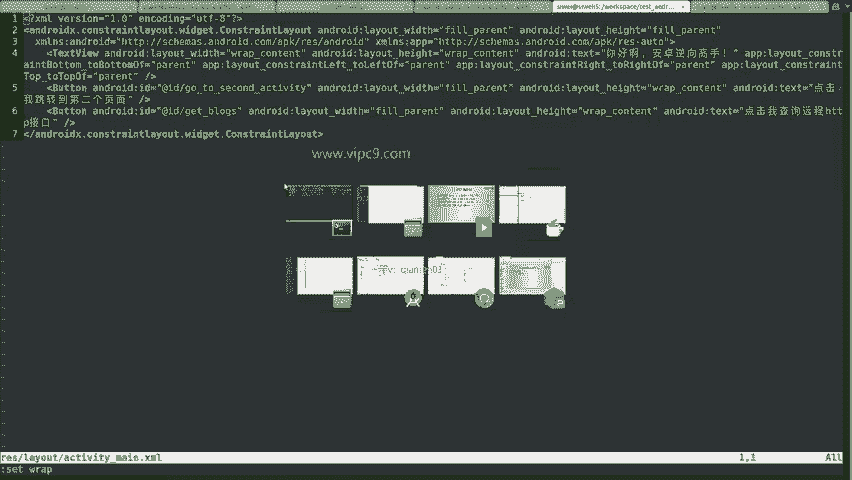

执行以下命令开始反编译：

```bash
apktool d app-release.apk
```

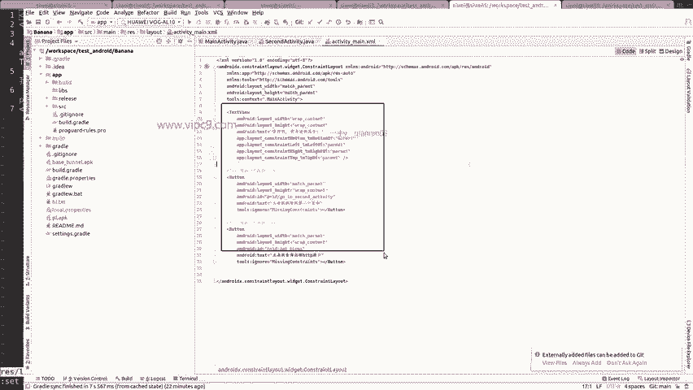

命令执行后，工具会开始解码资源文件（如XML）并将DEX文件转换为smali代码。这个过程会在当前目录下生成一个与APK同名的文件夹（例如 `app-release`）。

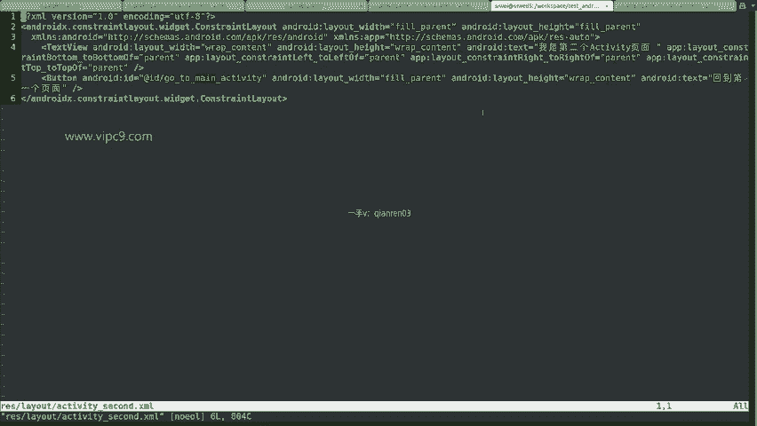

## 分析反编译输出

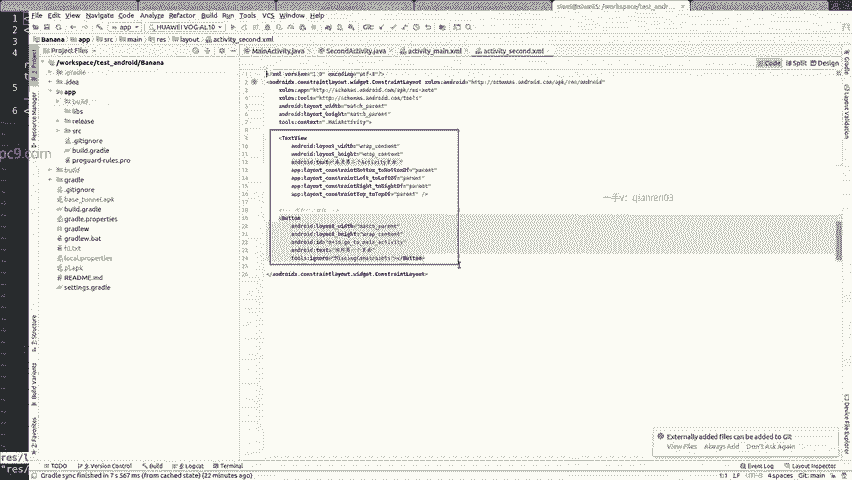

生成的文件夹包含反编译后的所有内容。我们逐一查看主要部分。

### 资源文件

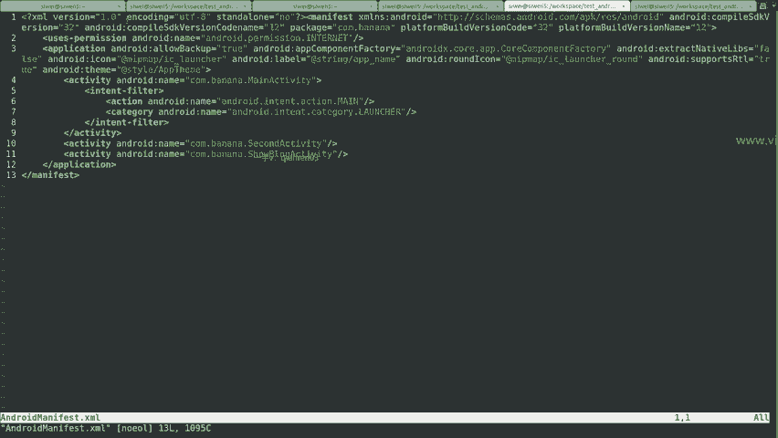

在 `res/layout/` 目录下，可以找到应用的布局文件。例如，`activity_main.xml` 文件已经被完整地逆向出来。虽然格式（如换行）可能与原始开发文件略有不同，但其中的UI组件（如Button）和结构都与原文件一致。

### 清单文件

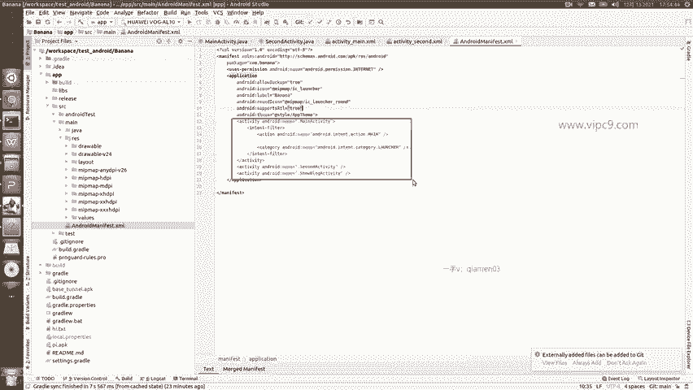

`AndroidManifest.xml` 文件也被成功反编译。其中声明的Activity数量与源代码中的完全一致，验证了反编译的准确性。

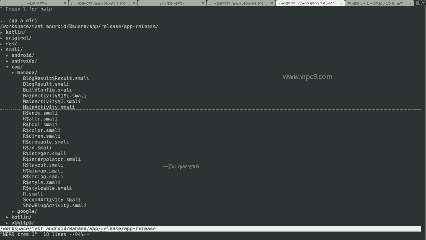

### Smali代码

最重要的输出在 `smali/` 目录下。这里的文件结构与Java包名对应。

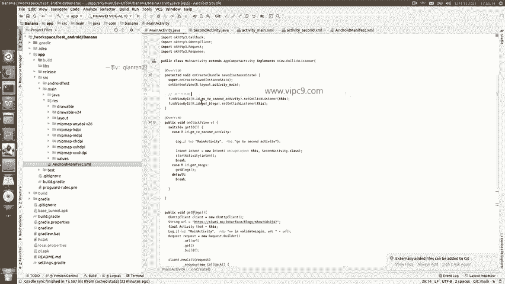

例如，`com/example/app/MainActivity.smali` 文件就对应着源代码中的 `MainActivity` 类。打开该文件，可以看到其中包含的方法，如 `onCreate`。

smali代码的语法比较晦涩，充满了类似 `goto`、`if-eq` 这样的指令，它非常接近于Dalvik虚拟机的字节码。目前，对smali代码的调试没有特别便捷的方法，通常需要修改后重新打包并运行应用来测试效果。

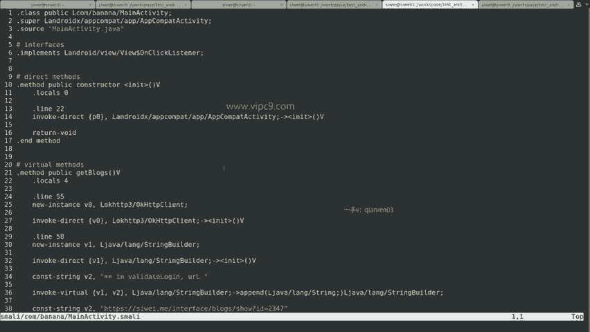

## 其他文件

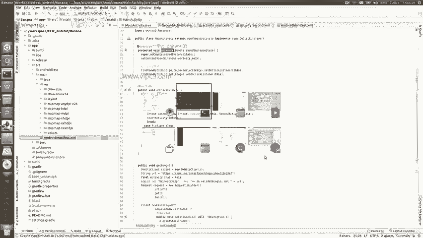

反编译生成的文件夹中还包含 `original/`、`apktool.yml` 等目录和文件。`apktool.yml` 是一个配置文件，记录了APK的元信息，如应用名称、SDK版本等。

## 总结

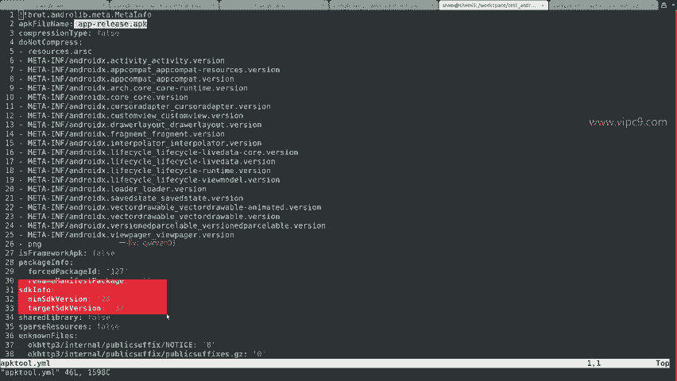

本节课中我们一起学习了从APK到smali的反编译路径。我们使用 **apktool** 工具，通过 `apktool d` 命令成功将一个APK文件解包，并获得了其资源文件、清单文件以及核心的smali代码。理解这个路径是进行Android应用逆向分析和修改的基础。虽然smali代码可读性较差，但它是我们深入理解应用逻辑的必经之路。