# Android逆向-基础篇：P34：章节5-1：Burp Suite的安装与基本使用 🛠️

在本节课中，我们将要学习安卓抓包与高级Hook方法的第一部分内容：Burp Suite抓包工具的安装与基本使用。Burp Suite是一款功能强大的网络抓包与安全测试工具，掌握其基本用法是进行安卓应用安全分析的重要一步。

## 概述

我们学习第四章安卓抓包与高级Hook方法。本章内容分成两大块。第一块是Burp Suite抓包工具的基本使用。第二块是抓取HTTPS内容的方法。本节我们先看第一部分，Burp Suite。

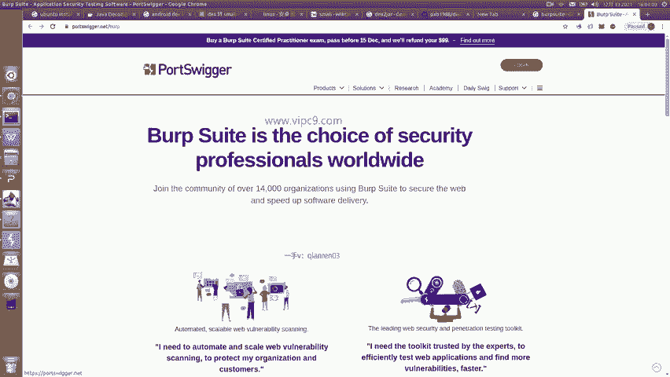

Burp Suite是一个抓包工具。它与Charles、Fiddler等工具功能类似。具体使用哪个工具，大家可以凭个人喜好选择。例如，Charles是收费软件，而Burp Suite有免费的社区版可供使用。当然，Burp Suite也分为免费的社区版和商用的专业版/企业版，大家可以根据自身条件选择。

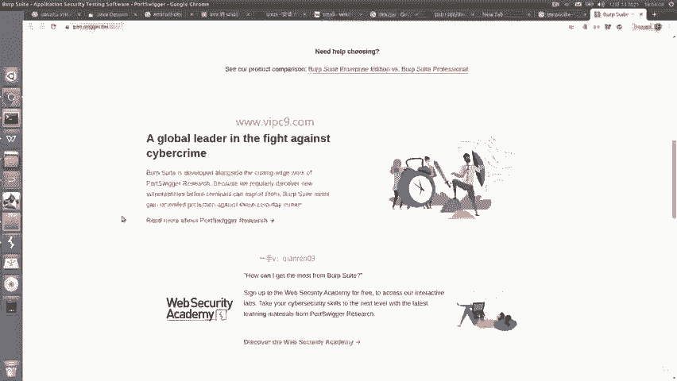

## 下载与安装

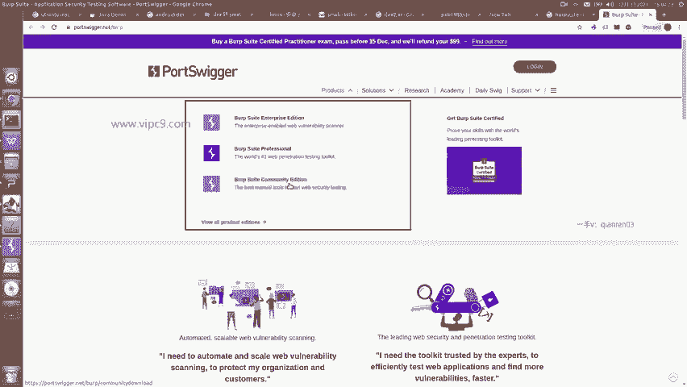

上一节我们介绍了Burp Suite的基本概念，本节中我们来看看如何获取和安装它。

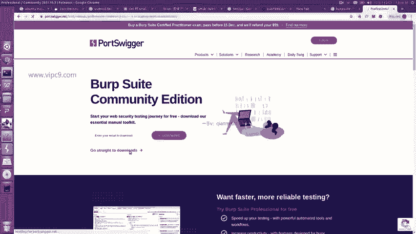

首先，访问Burp Suite的官方网站。官方网站地址是 `portswigger.net`，这是PortSwigger公司的一款产品。

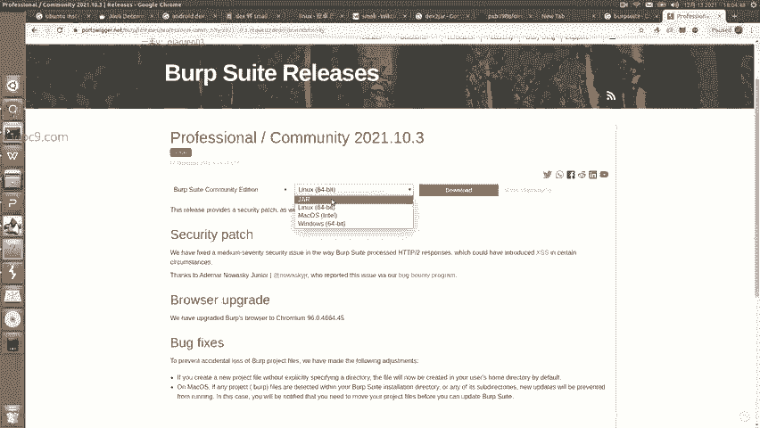

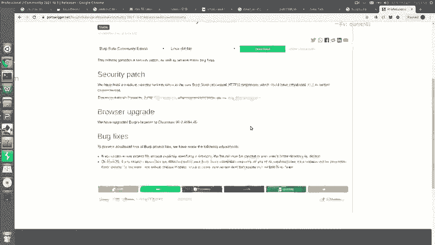

在官网上，我们可以查看产品信息并找到下载入口。例如，点击“Products”菜单，可以看到三个版本：企业版、专业版和社区版。社区版就是免费版本。

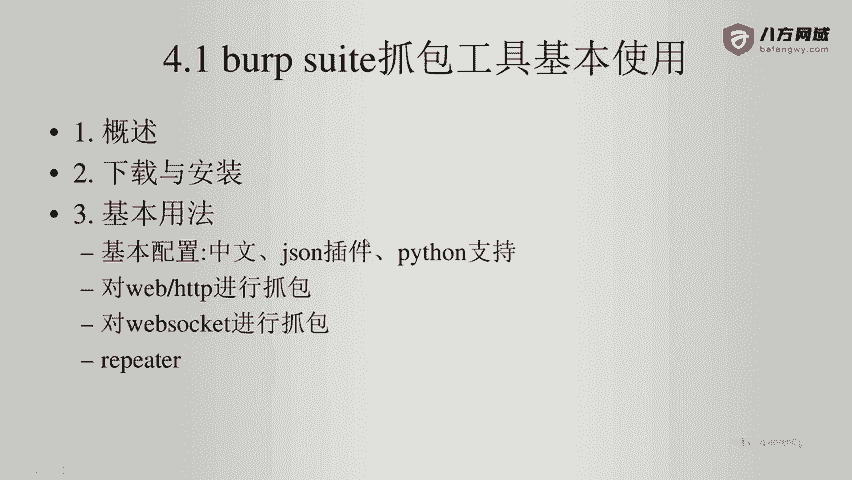

下载时，可以根据不同的操作系统进行选择，例如Linux、macOS或Windows。需要注意的是，这个工具是基于Java开发的，因此在安装Burp Suite之前，需要先安装Java运行环境。

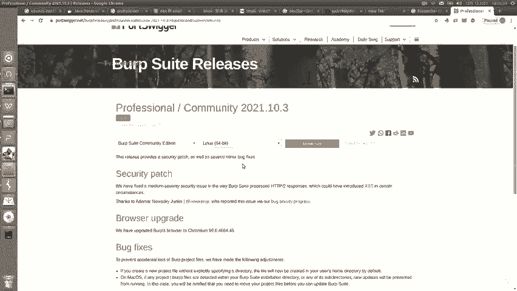

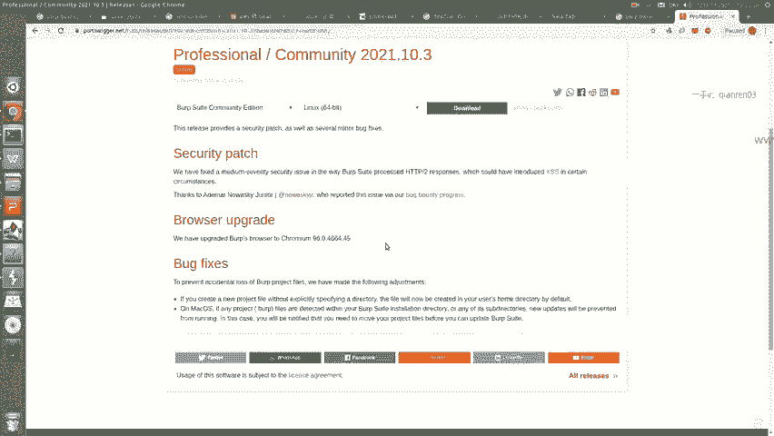

以下是安装Java环境的关键点：
*   JDK版本必须是1.8（即Java 8）或更高版本，但需要注意与Burp Suite版本的兼容性。例如，某些旧版Burp Suite Pro可能需要JDK 1.8，而新版可能支持更高版本。建议参考官方文档的版本要求。

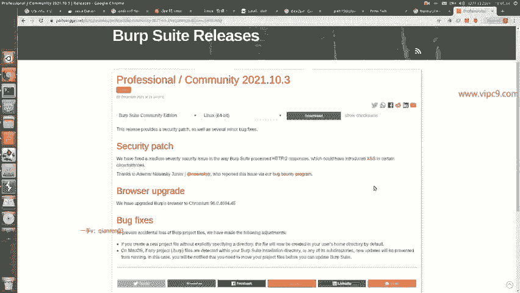

下载完成后，按照安装向导进行安装即可，这个过程不再赘述。

## 基本配置与使用

成功安装Burp Suite后，我们来看看它的基本用法。首先需要启动Burp Suite。

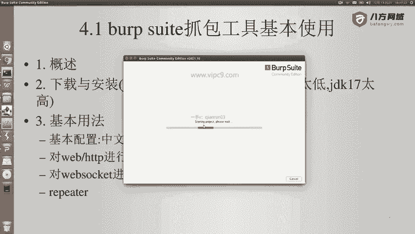

启动时，可能会提示选择之前的配置文件，初次使用可以直接跳过。进入主界面后，如果英语阅读有困难，可以在设置中将界面语言切换为中文。

接下来，我们介绍如何配置Burp Suite进行HTTP抓包。首先需要进行一些设置。

在主界面找到“Proxy”标签页。注意顶部的“Intercept is on”按钮，这表示拦截功能已开启。我们先将其关闭，因为开启拦截后，客户端的网络请求会被暂停，无法正常浏览。

然后，我们点击“HTTP history”子标签页。这里会显示所有捕获到的HTTP请求和响应数据。“WebSockets history”则用于显示WebSocket的通信记录。

现在，我们需要配置代理服务器设置。点击“Proxy”标签页下的“Options”子标签。

在代理监听器设置中，可以看到Burp Suite默认在本机（127.0.0.1）的8080端口上运行。我们可以修改这个地址和端口。例如，点击“Edit”，勾选“All interfaces”，并将端口改为8888。这样配置后，Burp Suite会监听本机所有网卡上的8888端口。

## 配置浏览器代理

配置好Burp Suite的监听端口后，我们需要让浏览器的流量经过它。这可以通过配置浏览器代理来实现。

以下是配置浏览器代理的步骤：
1.  打开你的浏览器（如Chrome、Firefox）。
2.  找到代理设置或安装代理管理插件。例如，在Firefox中，可以进入“设置”->“网络设置”来配置代理。
3.  更便捷的方法是使用代理切换插件，例如名为“FoxyProxy”或“SwitchyOmega”的插件。
4.  以Chrome浏览器安装SwitchyOmega插件为例：打开Chrome网上应用店，搜索“SwitchyOmega”并安装。
5.  安装后，点击插件图标，新建一个情景模式，命名为“BurpSuite”，代理类型选择HTTP，服务器地址填写`127.0.0.1`，端口填写刚才设置的`8888`，然后保存。
6.  之后，只需点击插件图标并选择“BurpSuite”情景模式，浏览器的流量就会通过Burp Suite代理。

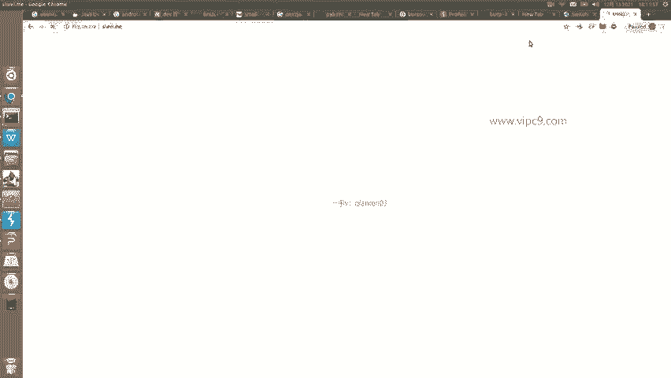

## 进行抓包测试

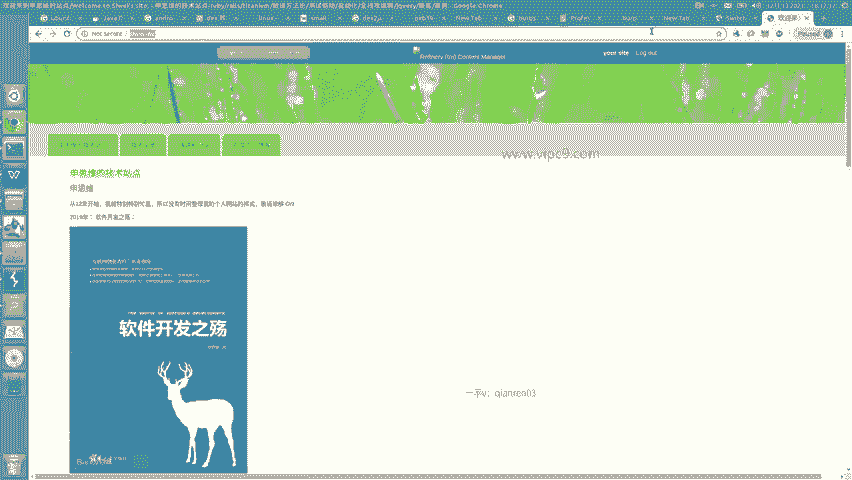

现在，让我们进行一个简单的抓包测试，验证配置是否成功。

首先，确保Burp Suite正在运行，并且“Intercept”处于关闭状态。然后，在浏览器中通过SwitchyOmega插件切换到BurpSuite代理模式。

接着，在浏览器地址栏访问一个网站，例如 `suiyiming.com`。网页加载后，切换回Burp Suite。

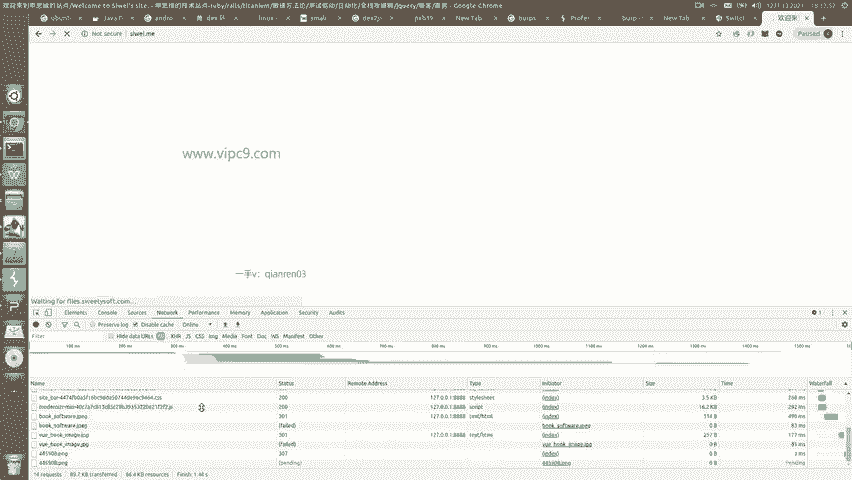

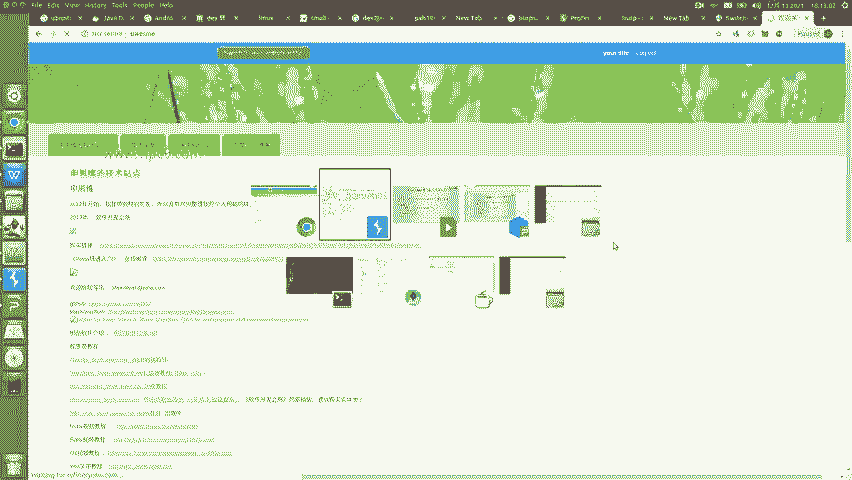

点击“HTTP history”标签页，你应该能看到捕获到的网络请求。最初可能只看到主文档（如HTML）的请求，这是因为浏览器缓存了其他静态资源（如图片、CSS、JS）。

为了看到所有请求，我们需要在Burp Suite中勾选“Filter”设置下的“Show all items”选项。同时，为了清除之前的记录，可以在历史记录列表右键选择“Clear history”。

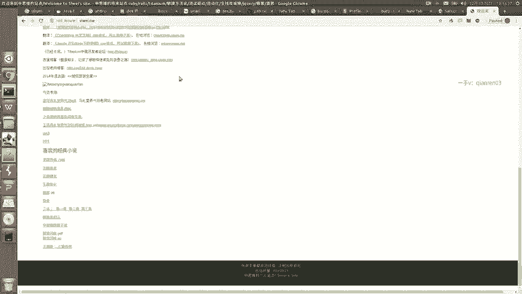

最后，在浏览器中按 `Ctrl+F5` 进行强制刷新，重新请求所有资源。此时，再回到Burp Suite的“HTTP history”中，就能看到完整的请求列表，包括HTML、图片、CSS和JavaScript文件等。

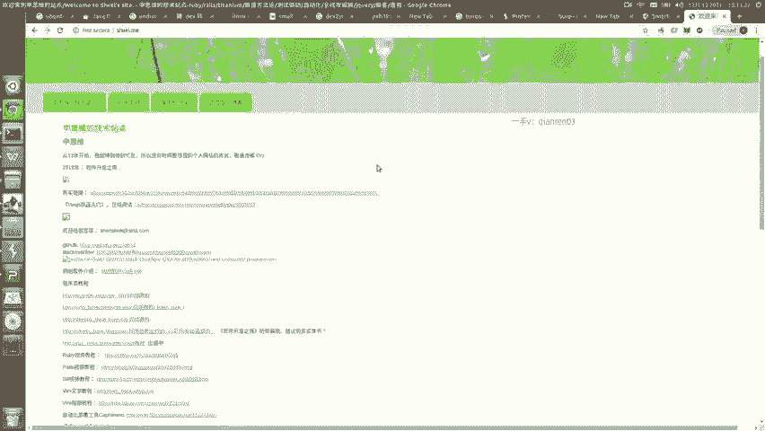

## 总结

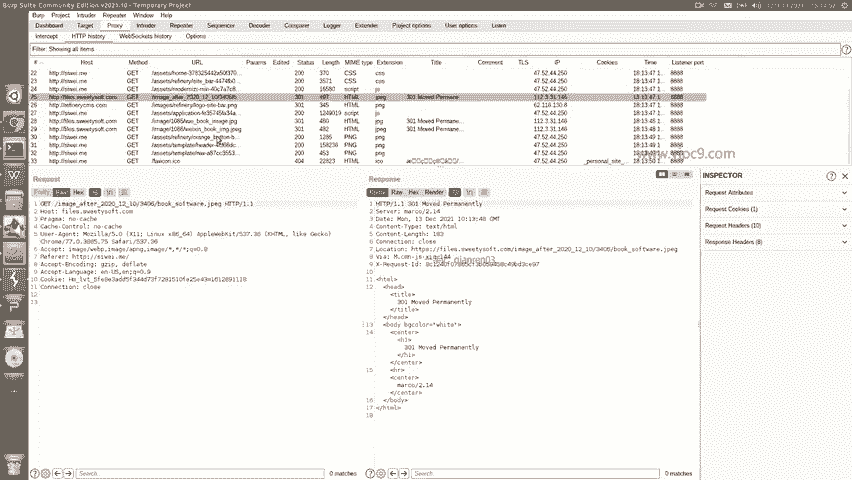

本节课中我们一起学习了Burp Suite抓包工具的安装与基本配置。我们了解了Burp Suite的版本区别，完成了Java环境的准备和软件安装，并逐步配置了Burp Suite的代理监听器以及浏览器的代理设置。最后，我们通过一个实际的网页访问测试，成功捕获了HTTP网络流量，验证了整个抓包流程。这是进行后续HTTPS抓包和移动端抓包分析的基础。