# Android逆向-基础篇：P35：章节5-2：Burp Suite的基本配置 🛠️

在本节课中，我们将要学习Burp Suite的基本配置，包括如何让它正确显示中文、格式化JSON数据，以及如何安装Python插件来扩展其功能。掌握这些配置是后续进行网络抓包和分析的基础。

## 概述

Burp Suite默认在显示抓取到的JSON数据时存在两个问题：不显示中文，以及无法对JSON进行格式化。此外，为了支持某些插件，我们需要为其配置Python环境。本节将逐一解决这些问题。

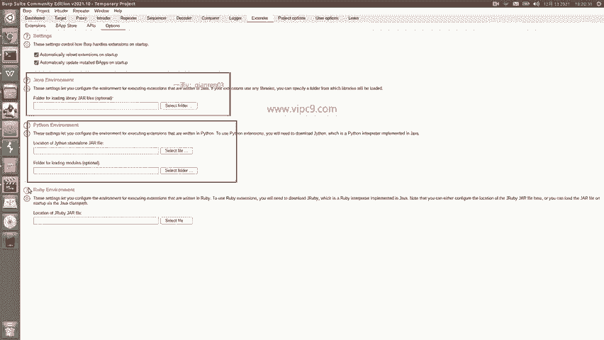

## 配置中文字体显示

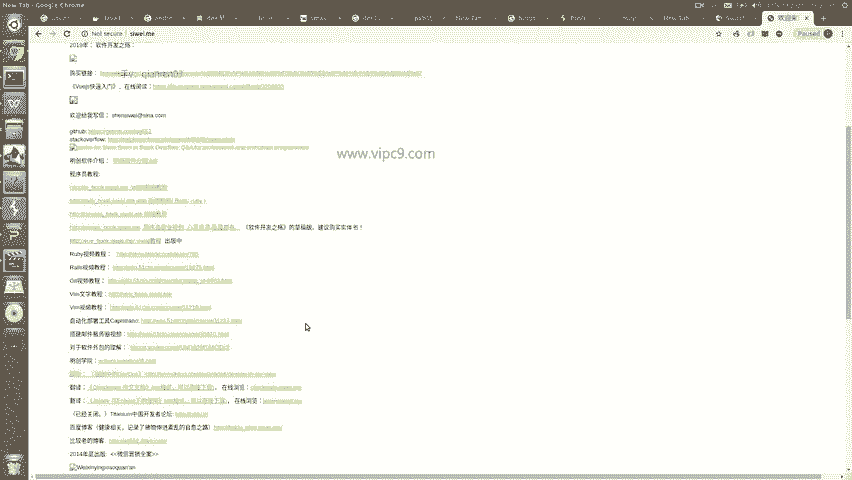

首先，我们需要解决Burp Suite无法显示中文的问题。默认情况下，它可能无法正确渲染中文字符。

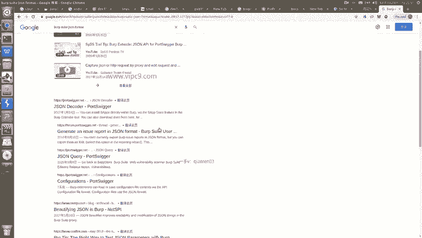

以下是配置步骤：

1.  找到并点击右上角的 **User options**（用户选项）。
2.  在字体（Font）设置中，将其更改为一种中文字体，例如 **SimSun（宋体）**。
3.  完成更改后，Burp Suite界面及抓取到的数据中的中文就能正常显示了。

## 安装扩展插件

上一节我们配置了中文字体，本节中我们来看看如何通过安装插件来增强Burp Suite的功能，特别是格式化JSON的能力。

Burp Suite支持通过 **Extender** 功能安装多种类型的插件，包括Java、Python和Ruby插件。

以下是安装JSON格式化插件的步骤：

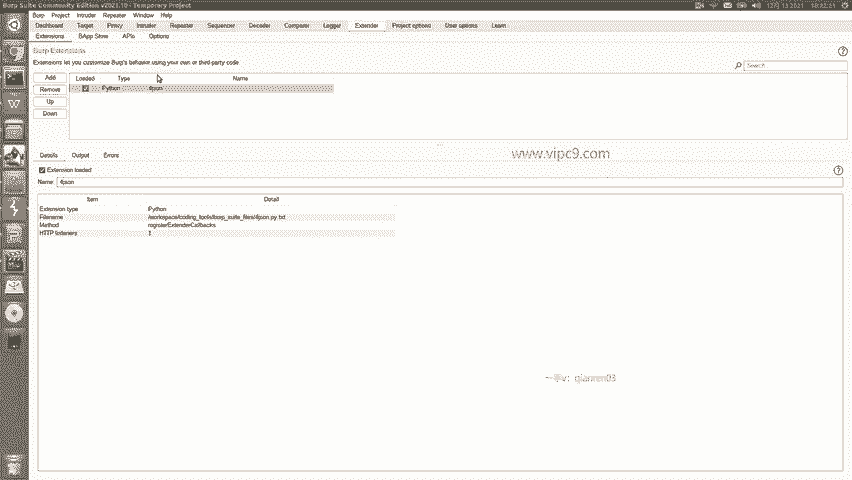

1.  点击顶部菜单中的 **Extender** 选项卡。
2.  在 **Extensions** 界面中，点击 **Add** 按钮。
3.  我们需要安装一个名为 **Burp JSON Formatter** 的Python插件。你可以从网络上下载对应的 `.py` 文件。
4.  在添加扩展的对话框中，将 **Extension Type** 选择为 **Python**。
5.  点击 **Select file...**，选择你下载好的 `.py` 插件文件。
6.  保持 **Standard Output** 和 **Error Output** 的默认设置（输出到界面即可），点击 **Next**。
7.  等待插件加载，当看到 **Success** 提示时，表示插件安装成功。

此时，Burp Suite已经具备了显示中文和格式化JSON数据的能力。

## 使用Repeater重放请求

配置好基本环境后，Burp Suite的核心功能就可以使用了。其中一个最常用的工具是 **Repeater**，它允许我们捕获一个HTTP请求，并手动地、反复地重新发送它，以便于分析和测试。

以下是使用Repeater的步骤：

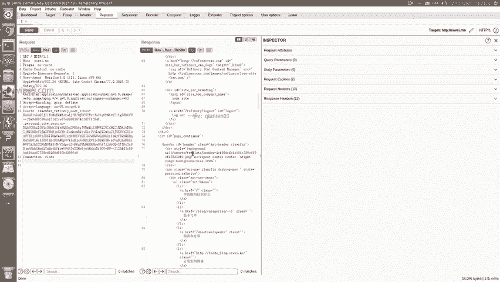

1.  在 **Proxy** -> **HTTP history** 中，找到你想要分析的请求。
2.  右键点击该请求，选择 **Send to Repeater**。
3.  切换到 **Repeater** 选项卡，你可以看到请求的所有细节，如URL、参数、Headers、Cookies等。
4.  点击 **Send** 按钮，即可重新发送该请求，并在右侧查看服务器的响应（Response）。
5.  你可以在Repeater中任意修改请求参数，然后再次点击 **Send** 来观察不同的响应结果，这对测试接口和寻找漏洞非常有帮助。

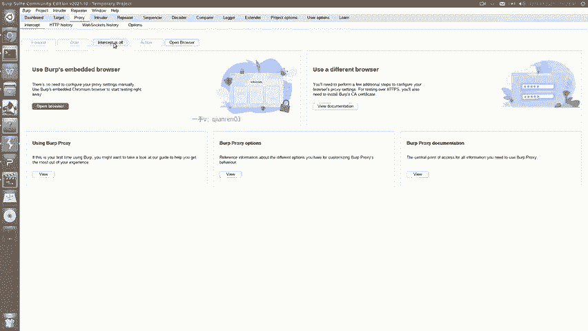

## 拦截并修改请求

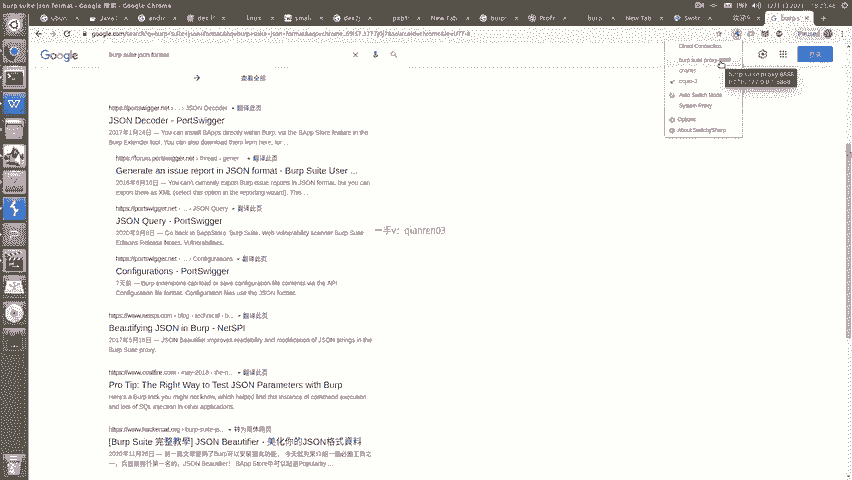

除了重放，Burp Suite另一个强大的功能是拦截并实时修改HTTP/HTTPS请求。这让我们能够看到客户端发送的确切数据，并能手动干预通信过程。

上一节我们介绍了Repeater，本节中我们来看看如何实时拦截和修改流量。

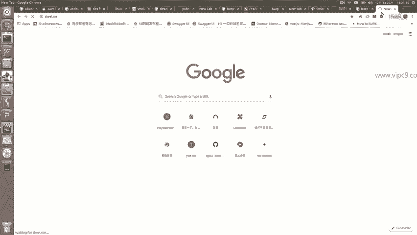

以下是拦截和修改请求的步骤：

1.  切换到 **Proxy** 选项卡，确保 **Intercept** 子选项卡是激活状态。
2.  点击按钮将拦截功能从 **Intercept is off** 变为 **Intercept is on**。
3.  在浏览器或其他客户端中访问目标网址（例如 `http://127.0.0.1:8888`）。
4.  此时，Burp Suite会弹出窗口，显示它拦截到的第一个请求。你可以在这个界面中查看甚至修改请求的任何部分。
5.  点击 **Forward** 按钮，将这个（可能修改后的）请求发送给服务器。
6.  服务器返回的响应也可能被Burp Suite拦截（如果开启了响应拦截），你可以再次点击 **Forward** 将其发送回浏览器。
7.  最终，浏览器将接收到经你修改后的请求所对应的响应内容。

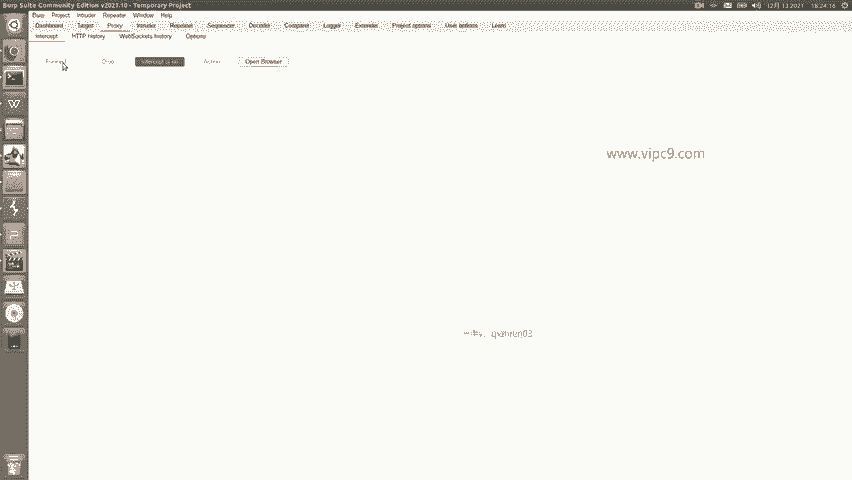

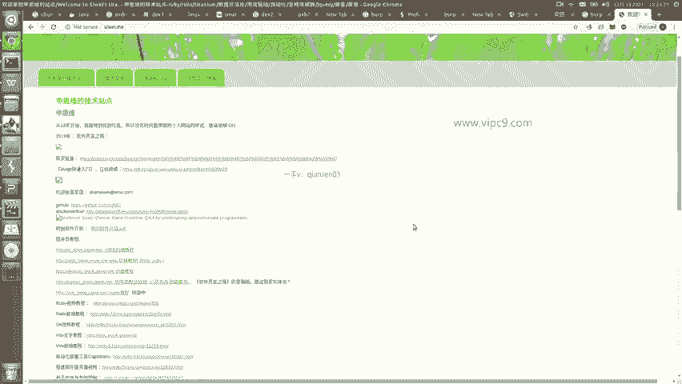

通过这个功能，你可以动态地测试不同参数对应用程序的影响，是安全测试和逆向分析中不可或缺的手段。

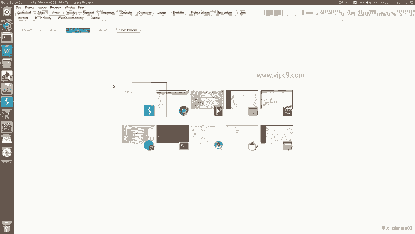

## 总结

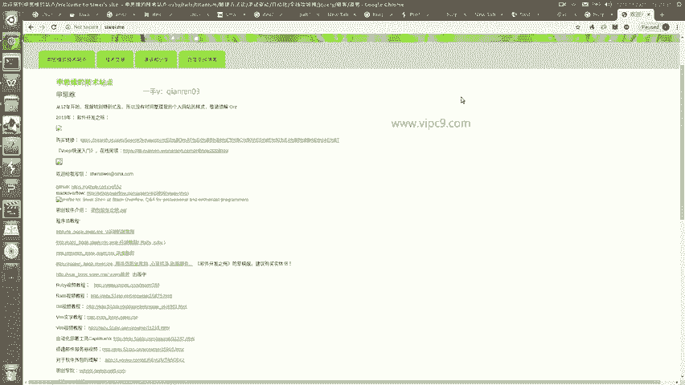

本节课中我们一起学习了Burp Suite的基本配置与核心操作。我们首先解决了中文显示和JSON格式化的问题，然后安装了Python插件以扩展功能。接着，我们探索了 **Repeater** 工具用于重放和测试请求，最后掌握了实时 **拦截和修改** 网络流量的方法。这些是使用Burp Suite进行后续安卓应用网络层分析的基础技能。