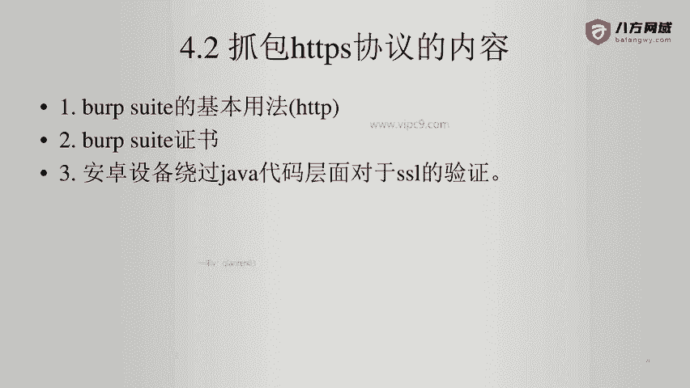
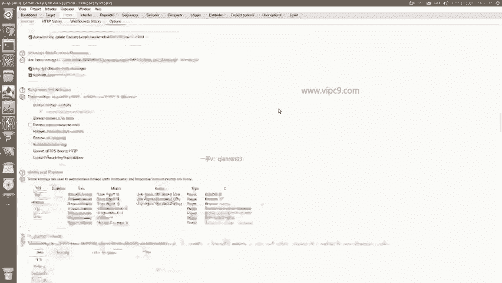
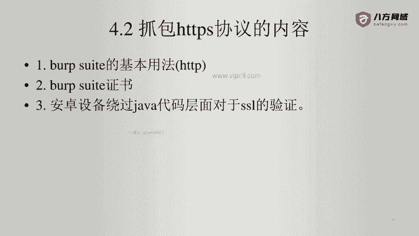
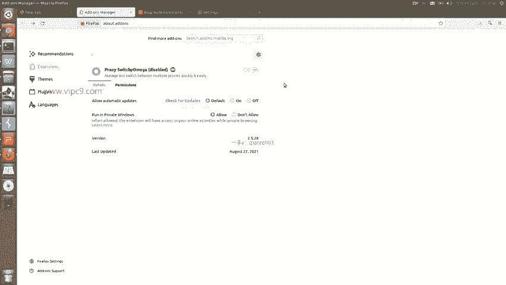
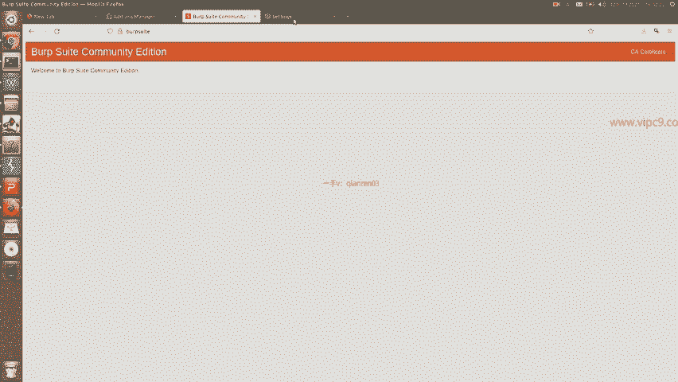
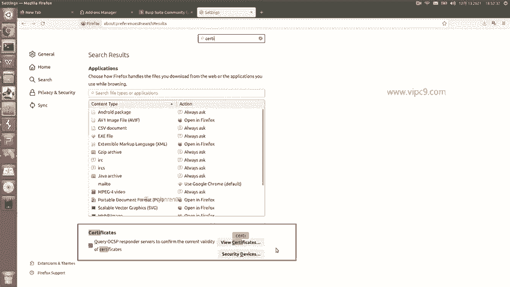
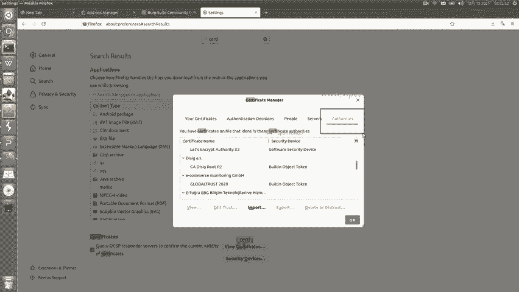
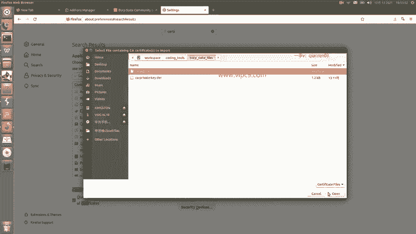
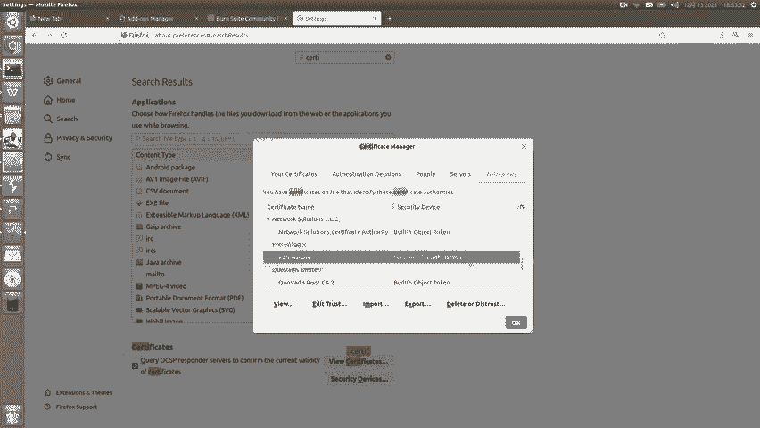
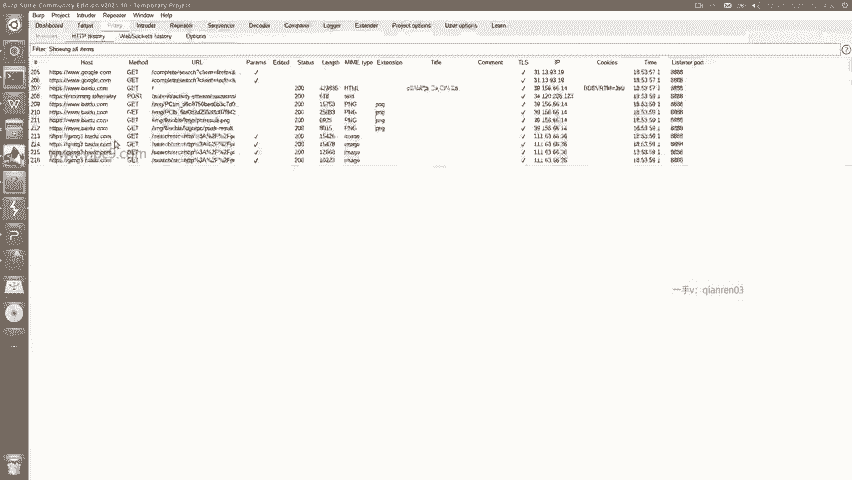

# Android逆向-基础篇：P36：章节5-3-使用burpsuite抓包https-web

在本节课中，我们将要学习如何使用Burp Suite对HTTPS协议的通信内容进行抓包。HTTPS抓包是移动应用和Web应用安全测试中的一项基础且关键的技能。

## 🔐 HTTPS抓包原理概述

上一节我们介绍了HTTP抓包的基本方法，本节中我们来看看如何抓取HTTPS流量。首先，需要了解HTTPS的基本原理。

当用户与目标站点进行HTTPS协议通信时，双方会进行证书交换以确保通信安全。如果我们要引入Burp Suite这样的第三方代理进行抓包，情况会变得复杂：代理需要与目标网站建立带有证书的HTTPS连接，同时用户也需要与代理建立另一个带有证书的HTTPS连接。

因此，Burp Suite证书存在的意义，就是充当这个“中间人”，分别与客户端和服务器端建立可信的HTTPS连接。换句话说，没有正确配置Burp Suite的证书，就无法对HTTPS流量进行解密和抓包。

## ⚙️ Burp Suite证书配置

理解了原理后，我们开始配置Burp Suite的证书。证书通常包含两个文件：一个公钥证书（Certificate）和一个私钥（Private Key）。

以下是配置步骤：

1.  **导出证书**
    在Burp Suite中，点击 **Proxy** 标签页，然后进入 **Options** 子选项卡。在Proxy Listeners区域，找到你的监听器并点击 **Import / export CA certificate**。
    *   导出证书：选择第一个选项 “**Certificate in DER format**”，保存为一个文件（如 `cacert.der`）。
    *   导出私钥：选择第二个选项 “**Private key in DER format**”，保存为另一个文件（如 `privkey.der`）。

2.  **导入证书**
    如果你需要从备份恢复或使用他人的证书，可以使用导入功能。
    *   点击 **Import / export CA certificate** 按钮。
    *   选择 “**Import**”，然后点击 **Next**。
    *   在 “**CA certificates**” 处选择你的证书文件（`.der` 格式）。
    *   在 “**Private key**” 处选择你的私钥文件（`.der` 格式）。
    *   点击 **Next**，如果成功会提示 “**Successfully**”。

## 🌐 浏览器端证书安装

Burp Suite端配置好后，我们需要在客户端（这里以Firefox浏览器为例）安装Burp Suite的CA证书，这样浏览器才会信任由Burp Suite签发的证书。

以下是具体操作步骤：

1.  **关闭代理插件**：确保浏览器中任何便捷切换代理的插件（如FoxyProxy、SwitchyOmega）已被禁用或关闭，以免干扰。
2.  **下载证书**：在浏览器中访问 `http://burpsuite` 这个地址。页面右上角会出现一个 **CA Certificate** 按钮，点击它即可下载证书文件（通常为 `cacert.der`）。
3.  **导入证书**：
    *   打开Firefox的设置（Settings）。
    *   搜索或找到 **隐私与安全（Privacy & Security）** 选项。
    *   滚动到最底部，点击 **查看证书（View Certificates…）** 按钮。
    *   在弹出的证书管理器窗口中，选择 **证书机构（Authorities）** 选项卡。
    *   点击 **导入（Import…）** 按钮，选择刚才下载的 `cacert.der` 文件。
    *   **关键步骤**：在导入时，务必勾选 **信任此CA以标识网站（Trust this CA to identify websites）** 这一选项，然后点击确定。

## ✅ 测试抓包

完成以上所有配置后，就可以进行测试了。

将浏览器的代理设置为Burp Suite（例如 `127.0.0.1:8080`），然后访问任何一个HTTPS网站，例如 `https://www.baidu.com`。此时，回到Burp Suite的 **Proxy -> Intercept** 或 **HTTP history** 标签页，你应该能看到抓取到的HTTPS请求和响应内容，并且内容已被成功解密。

## 📝 总结

本节课中我们一起学习了使用Burp Suite抓取HTTPS流量的完整流程。核心在于理解HTTPS的“中间人”原理，并正确地在Burp Suite端和客户端（浏览器）配置CA证书。记住，保护好自己的证书私钥非常重要，因为它是建立可信中间人连接的关键。掌握了这个方法，你就能对绝大多数基于HTTPS的Web通信进行安全分析了。