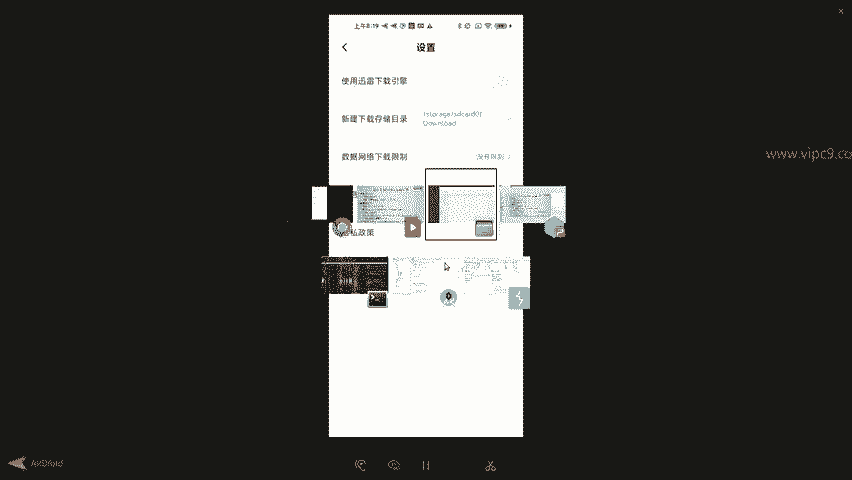
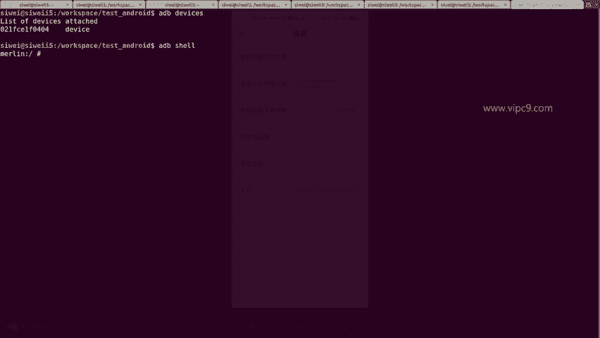
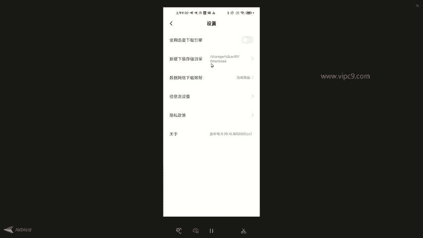
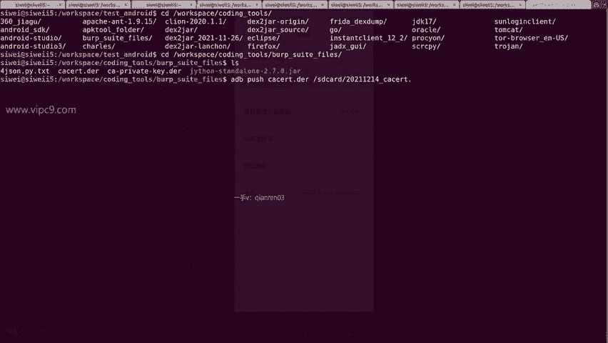
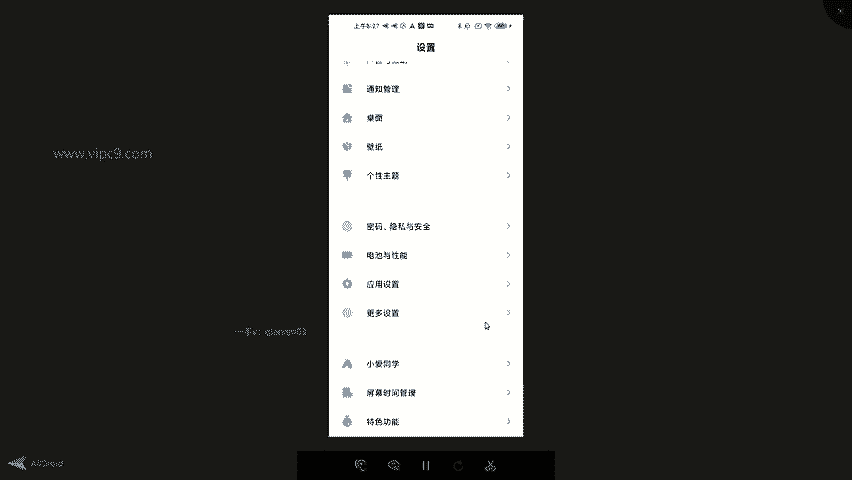

# Android逆向-基础篇：P37：章节5-4-安卓设备安装证书 📱

在本节课中，我们将要学习一个至关重要的步骤：如何在安卓设备上安装Burp Suite的CA证书。这对于后续进行HTTPS流量抓包与分析是必不可少的前提。

## 概述

安卓设备安装证书是安卓逆向工程中的一个关键环节。在安卓7及更高版本中，由于系统安全策略的改变，直接安装用户证书将不被系统信任，这给许多逆向分析人员带来了挑战。本节教程将详细介绍如何克服这一障碍，成功将证书安装到系统信任区。

## 安卓版本差异与挑战

上一节我们介绍了证书的基本概念，本节中我们来看看安卓系统对证书信任策略的变化。

在安卓6及更早的版本中，安装证书相对简单：下载证书文件后，在设备设置中导入即可。系统会信任用户导入的证书。其逻辑可以概括为：
**安卓版本 <= 6：信任用户证书**

然而，从安卓7开始，谷歌修改了网络安全策略。系统默认不再信任用户安装的CA证书，只信任预装在系统分区中的证书。这是手机厂商为了增强系统安全性而采取的措施，但对于需要进行安全分析的技术人员而言，则构成了一道门槛。其逻辑变为：
**安卓版本 >= 7：仅信任系统证书**

## 安卓7+设备安装证书的解决方案

面对上述限制，我们有一套完整的解决方案。以下是实现该方案所需的四个核心步骤：



1.  **准备一台已获取Root权限的安卓设备。**
2.  **下载并安装Magisk框架及其特定模块。**
3.  **按照常规流程安装用户证书。**
4.  **重启设备使配置生效。**





接下来，我们将以一台红米10X 4G设备为例，详细演示每个步骤。

## 详细操作步骤

### 第一步：下载并推送证书文件

首先，我们需要将Burp Suite导出的证书文件传输到安卓设备上。证书文件通常为`.der`或`.cer`格式，但为了被安卓系统正确识别，我们需要将其重命名为`.crt`后缀。



以下是操作命令示例：
```bash
# 连接设备
adb devices
# 进入设备shell环境
adb shell
# 将本地证书文件推送到设备SD卡，并重命名为.crt格式
adb push cacert.der /sdcard/burpsuite_cert.crt
```

**关键提示**：某些手机浏览器（如小米自带浏览器）的下载引擎可能无法正常下载证书文件。如果遇到问题，请检查并关闭浏览器设置中的“使用迅雷下载引擎”等选项，或直接使用`adb push`命令传输文件。

### 第二步：在设备上安装用户证书

文件推送完成后，我们需要在安卓系统的设置中安装它。

1.  进入设备的 **设置** > **隐私与安全** > **系统安全** > **加密与凭据**。
2.  点击 **“从SD卡安装”** 或类似选项。
3.  在文件列表中，找到并选择我们刚刚推送的 `.crt` 文件（例如 `burpsuite_cert.crt`）。
4.  系统会提示为证书命名（例如 “BurpSuiteCA”），确认后即可完成安装。

安装成功后，你可以在 **“加密与凭据”** > **“用户凭据”** 中看到已安装的证书。但此时，该证书仍未被系统完全信任。

### 第三步：使用Magisk模块将证书移至系统区

为了让系统信任我们安装的证书，我们需要借助Magisk框架的一个模块。

1.  确保设备已安装 **Magisk**（通常图标为京剧脸谱）。
2.  打开Magisk应用，进入 **“模块”** 页面（图标类似拼图）。
3.  在模块仓库中搜索并安装名为 **“Always Trust User Certificates”** 的模块。这个模块的作用是将所有用户安装的CA证书复制到系统的信任证书存储区。
4.  安装模块后，根据提示重启设备。

### 第四步：验证证书安装结果

设备重启后，我们可以通过以下命令验证证书是否已成功添加到系统信任区：

```bash
# 进入系统证书目录
adb shell
cd /system/etc/security/cacerts
# 列出证书文件，按时间倒序排列，新安装的证书会排在前面
ls -altr
```

如果操作成功，你会在文件列表中找到对应的证书文件（通常以 `.0` 为后缀）。你可以使用 `cat` 命令查看证书内容，并与本地原始的Burp Suite证书内容进行比对，确认其一致性。

## 总结



本节课中我们一起学习了在安卓7及以上版本的设备上安装Burp Suite CA证书的完整流程。我们首先了解了高版本安卓系统的证书信任策略变化，然后通过四个步骤：**准备Root环境**、**传输证书文件**、**安装用户证书**、**使用Magisk模块迁移至系统区**，最终成功突破了系统限制，将证书安装到了系统信任区。这是进行安卓应用HTTPS流量抓包和分析的基石，请务必掌握。