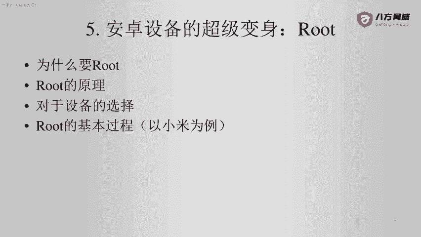
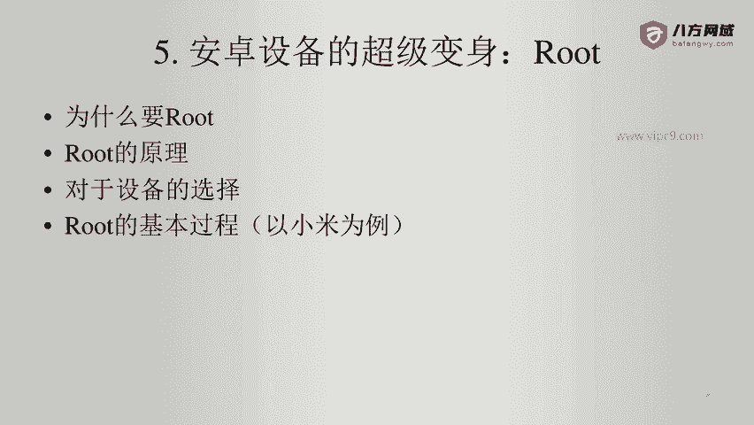
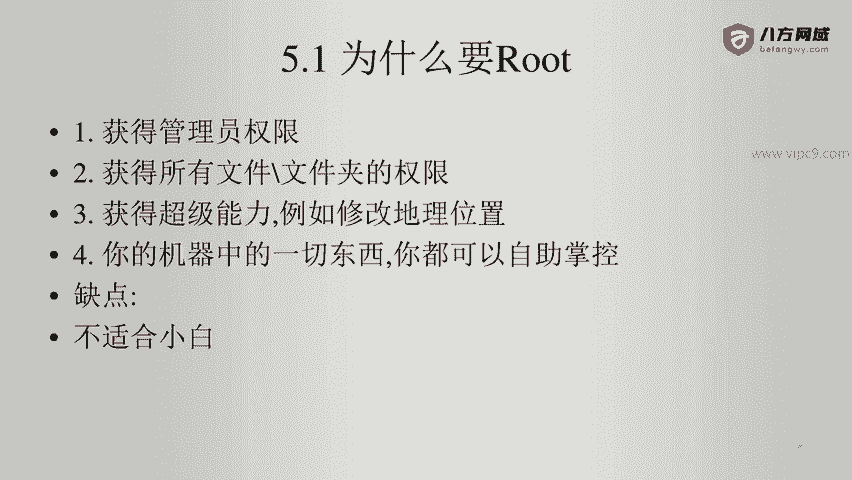

# Android逆向-基础篇：P38：章节6-1-为什么root与root原理

在本节课中，我们将要学习安卓设备获取最高权限——即“Root”操作的核心概念。我们将探讨Root的必要性、其背后的工作原理，并简要介绍设备选择和基本流程，为后续的实践操作打下基础。

## 为什么要Root？🔓

上一节我们介绍了Root是安卓设备的超级管理员权限。本节中，我们来看看获取Root权限的具体原因。

获取Root权限主要有以下几个目的：

1.  **获得超级管理员权限**：Root是Linux系统中的默认超级管理员用户名。在安卓中，Root意味着获得设备的最高管理权限。这与PC端渗透测试中“拿到root”的概念一致，代表完全掌控了目标系统。
2.  **获得所有文件和文件夹的访问权限**：默认情况下，通过ADB连接手机后，用户无法访问或修改系统内绝大部分文件和文件夹。这是安卓系统的自我保护机制。Root后可以突破这一限制。
3.  **解锁设备的“超级能力”**：Root后的设备可以实现许多高级功能，例如修改地理位置信息、深度定制系统等，让设备完全为用户服务。
4.  **实现设备的完全所有权**：用户购买设备后，理应拥有对其软硬件的完全控制权。Root可以打破厂商设置的限制，真正实现“我的设备我做主”。

然而，Root操作也存在缺点，主要是不适合技术小白用户。不当的操作可能导致系统文件缺失，致使设备“变砖”（无法正常启动）。

## Root的原理是什么？⚙️

了解了Root的必要性后，本节我们来深入探讨Root操作的实现原理。

Root的基本原理可以类比为电脑的重装系统。设备出厂时安装的原生系统对用户权限有严格限制。Root过程相当于为设备刷入了一个经过修改的新系统镜像。这个新镜像默认赋予了用户更高的权限。

一个典型的Root过程完成后，设备通常会安装一个名为 **Magisk** 的工具包。Magisk提供了一系列用于管理Root权限的工具，其核心优势在于能够实现“系统化”的修改，从而绕过某些安全检测。

以下是Root过程中涉及的核心概念：

*   **Bootloader（引导加载程序）**：这是设备启动时运行的第一个程序。要刷入修改后的系统镜像，通常需要先解锁Bootloader。
*   **Recovery模式**：一个独立的迷你操作系统，用于安装系统更新和第三方ROM（包括用于Root的修改包）。常见的第三方Recovery是 **TWRP**。
*   **刷机**：指将新的系统镜像文件写入设备存储的过程。Root通常通过刷入特定的ZIP格式安装包来实现。

其基本流程公式可以概括为：
**解锁Bootloader → 刷入第三方Recovery → 通过Recovery刷入Root权限包（如Magisk） → 重启获得Root权限**

## 设备选择与Root流程概览📱

在理解了Root的原理之后，我们来看看如何选择合适的设备并了解大致的操作流程。

并非所有安卓设备都容易Root。在选择设备时，建议优先考虑开发者和极客社区支持度高的型号（例如谷歌Pixel系列、部分小米/红米机型）。这些设备的Bootloader通常更容易解锁，且有丰富的第三方ROM和Root资源。

以下是以小米手机为例的Root基本步骤概述：

1.  **申请解锁权限**：在小米官方平台提交申请，等待审核通过（通常需要数天）。
2.  **解锁Bootloader**：使用小米官方解锁工具连接手机，完成解锁操作。**此操作会清除手机内所有用户数据。**
3.  **刷入第三方Recovery**：下载与手机型号匹配的TWRP Recovery镜像，并通过Fastboot模式刷入。
4.  **获取Root权限**：下载最新的Magisk安装包，将其放入手机存储。启动进入TWRP Recovery，选择安装该ZIP包。
5.  **重启系统**：安装完成后重启手机，系统中会出现Magisk应用，代表Root成功。

---

本节课中我们一起学习了安卓Root的核心知识。我们明确了Root的目的是为了获取设备的完全控制权，理解了其原理类似于重装一个权限更高的系统，并概览了Root的基本流程和注意事项。掌握这些理论基础，是安全进行安卓逆向工程和深度定制的第一步。在接下来的课程中，我们将进入实践环节，详细演示具体的操作步骤。