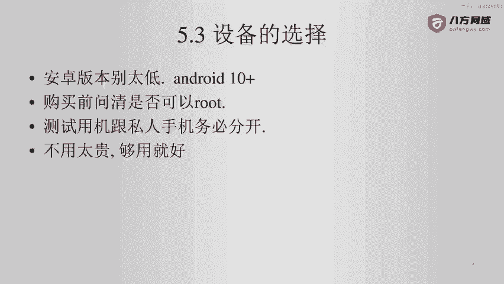
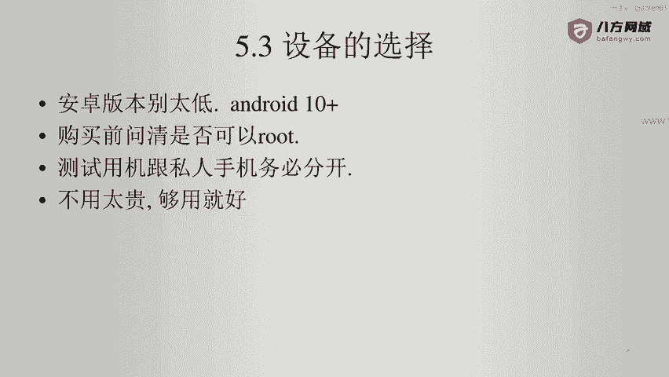
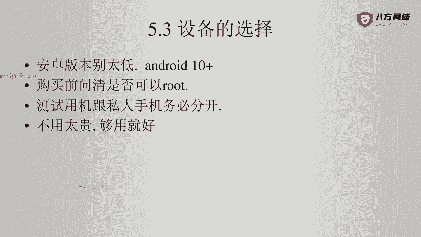
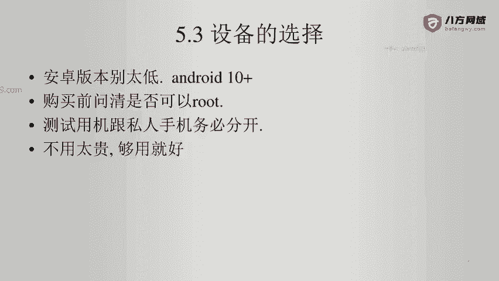

# Android逆向-基础篇：P39：章节6-2：设备的选择 📱

在本节课中，我们将要学习如何为Android逆向工程选择合适的物理设备。选择合适的设备是成功进行逆向分析的第一步，本节将详细介绍选购设备时的关键考虑因素。

## 设备选购建议

上一节我们介绍了逆向工程的基本概念，本节中我们来看看如何选择一台合适的Android设备。以下是选购设备时的核心建议。

1.  **优先考虑新设备**：建议购买一台新设备。如果选择购买二手设备，可以到闲鱼等平台选购。设备版本不宜过低，例如在2021年，使用Android 5.0版本的设备可能会遇到很多兼容性问题。

2.  **确认设备可Root**：在购买设备前，必须确认该机型是否可以获取Root权限。目前很多机型无法Root。可以Root的机型包括小米（其官方提供了较为便捷的解锁方式）以及华为的部分机型。

## 设备使用与安全须知

了解了如何选购设备后，我们还需要关注设备的使用规范与安全风险。以下是重要的使用原则。

*   **测试机与私人手机务必分开**：Root操作存在很大风险。例如，设备可能因安装某个软件而导致无法开机，需要重新刷写系统才能恢复。因此，应将被Root的设备视为测试专用机，并假定其上的所有数据都有随时丢失的风险。
*   **设备性能够用即可**：用于Root和测试的设备无需追求高端型号，例如不需要购买华为P50这类具备顶级摄像功能的旗舰机。对于逆向分析工作而言，这些高端功能通常用不上。
*   **注意物理安全与隐私**：在进行安卓逆向时，无法确定设备是否会受到某些应用程序的远程操控。因此，建议用一小块纸片贴住设备的前置摄像头，以防止潜在的隐私泄露风险。

## 总结

本节课中我们一起学习了为Android逆向选择设备的关键要点。我们强调了应优先选择可Root且系统版本较新的设备，并严格区分测试机与私人手机以规避风险。同时，设备性能以满足基本测试需求为准，并需注意采取如遮挡摄像头等物理安全措施。做好这些准备，将为后续的逆向分析工作打下坚实的基础。