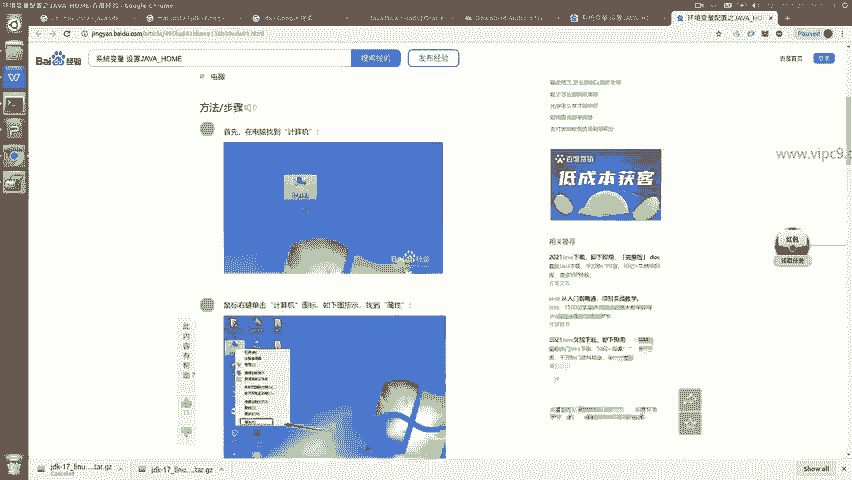
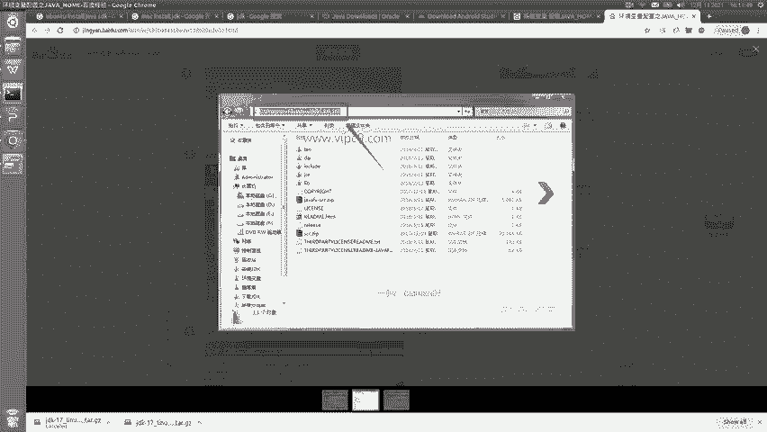
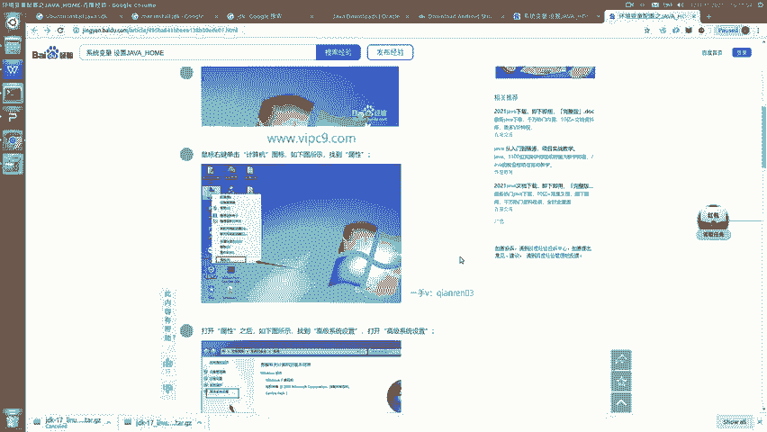
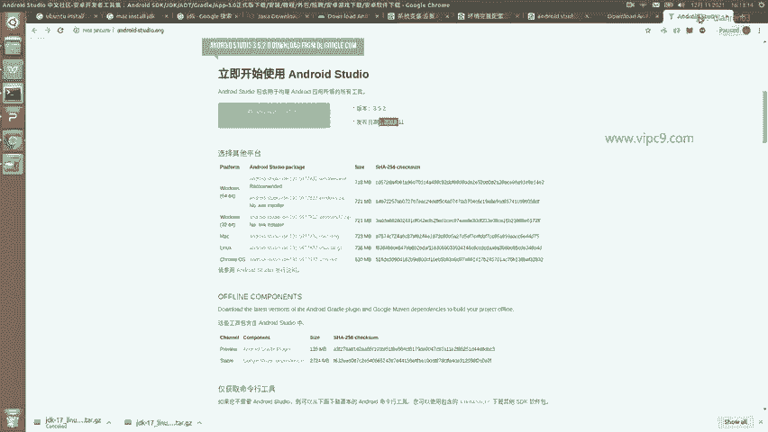
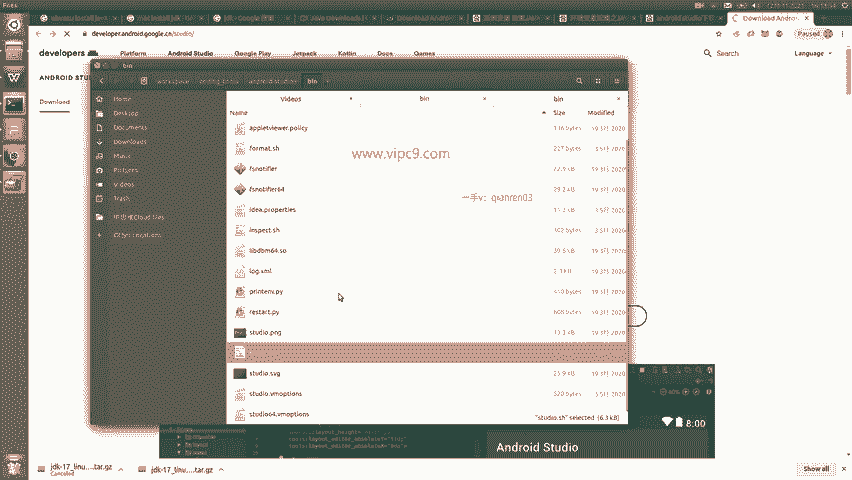
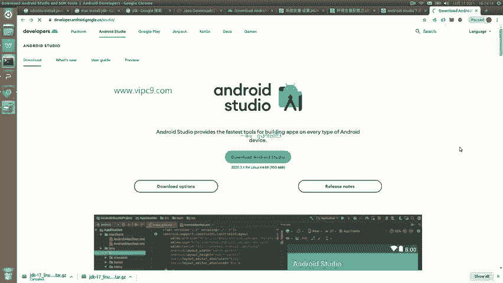

# Android逆向-基础篇：P3：Windows设置JDK与环境准备 🛠️

在本节课中，我们将学习如何在Windows操作系统中配置Java开发环境（JDK），并完成Android Studio的下载与初步设置。这是进行Android应用开发与逆向工程的基础步骤。

## 配置JAVA_HOME环境变量

上一节我们介绍了JDK的下载与解压，本节中我们来看看如何在Windows系统中设置`JAVA_HOME`环境变量，以便系统能够正确识别Java的安装位置。

首先，进入桌面。在桌面上右键点击“此电脑”（或“我的电脑”），然后选择“属性”。

在弹出的窗口中，选择“高级系统设置”。

在“系统属性”窗口中，点击“高级”标签页，然后点击下方的“环境变量”按钮。

在“环境变量”窗口中，我们通常在“系统变量”区域（下半部分）新建变量，这样所有用户都可以使用。点击“新建”按钮。

以下是新建系统变量的具体步骤：
*   **变量名**：输入大写的 `JAVA_HOME`。
*   **变量值**：输入你之前解压JDK压缩包的完整路径。例如，如果你将JDK解压到了`C:\Java`目录下，则变量值就是 `C:\Java`。你可以通过文件资源管理器复制该路径并粘贴进来。

配置完成后，点击“确定”保存所有设置。至此，JDK的环境变量就设置完成了。

## 下载Android Studio

配置好Java环境后，下一步是下载Android开发的核心工具——Android Studio。

你可以通过以下两种主要途径下载Android Studio：
1.  **官方网站**：访问Google的Android开发者官网进行下载。
2.  **国内镜像站**：通过百度搜索“Android Studio 下载”，可以找到一些中文社区或镜像站点提供的下载链接。

> **注意**：官网下载有时可能不稳定，需要具备一定的网络访问能力。从第三方镜像站下载时，请务必注意版本是否为最新，避免下载到过时的版本（例如2019年的版本在2021年就已过时）。

## 安装与启动Android Studio

下载完成后，安装过程非常简单，通常只需解压下载的压缩包到指定目录即可。

例如，你可以将其解压到 `D:\Android\android-studio` 这样的目录中。

解压后，进入解压目录的 `bin` 文件夹。启动方式根据操作系统有所不同：
*   **Windows系统**：双击 `studio.exe` 或 `studio64.exe` 文件。
*   **macOS系统**：双击 `studio` 可执行文件。
*   **Linux系统**：在终端中执行 `./studio.sh` 脚本。

## 准备开发设备与安装SDK

启动Android Studio后，首次运行会引导你安装Android SDK（软件开发工具包）并配置虚拟设备（AVD）或连接物理设备进行调试。

现在，你可以尝试启动Android Studio，按照向导完成初始设置。

## 总结

本节课中我们一起学习了在Windows系统下搭建Android开发环境的核心步骤。我们首先配置了 `JAVA_HOME` 系统环境变量，然后下载并解压了Android Studio，最后了解了其启动方法以及后续安装SDK和配置设备的流程。完成这些步骤后，你的基础开发环境就已准备就绪。