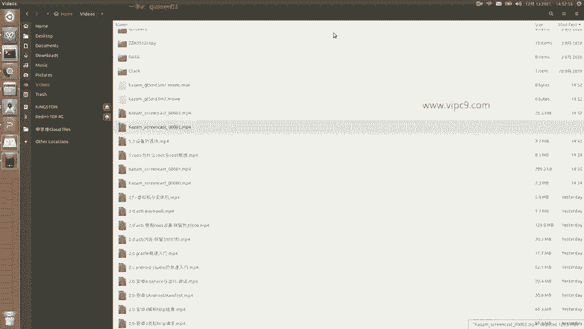
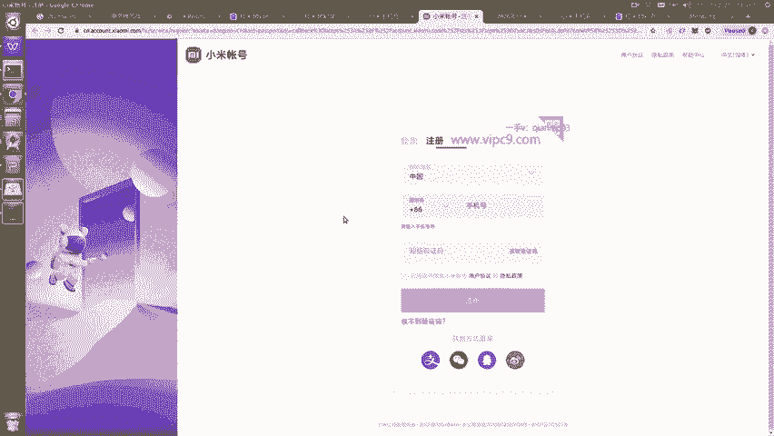
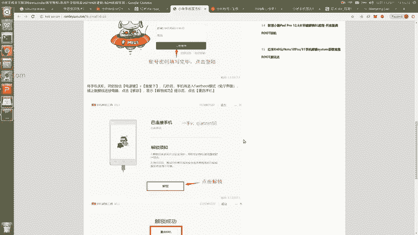

# Android逆向-基础篇：P40：章节6-3-小米账户的绑定与设备解锁

在本节课中，我们将学习如何为一台小米/红米手机获取Root权限。整个过程分为四个核心步骤，我们将以红米10X手机为例，进行详细说明。

## 📝 第一步：注册小米账户



首先，你需要拥有一个小米账户。访问小米官方网站 `account.xiaomi.com` 进行注册。



以下是注册流程：
*   使用一个有效的手机号码进行注册。
*   接收并填写短信验证码即可完成注册。

## 🔗 第二步：绑定账户与设备

上一节我们注册了小米账户，本节中我们来看看如何将账户与你的设备绑定。

在手机端登录你刚刚注册的小米账户。登录成功后，进入手机的“设置” > “小米账号”页面，确认账号已成功登录。

**核心要求**：该小米账户必须与当前设备绑定**至少满一周**，才能进行后续的解锁操作。

绑定完成后，你需要开启手机的“开发者选项”。开启方法通常是连续点击“设置” > “关于手机”中的“MIUI版本”多次。

在“开发者选项”中，找到“设备解锁状态”选项。对于一台未解锁的全新设备，这里会有一个“绑定账号和设备”或“申请解锁”的入口。请确保在此完成绑定。

## 🔓 第三步：申请并执行解锁

账户绑定满足时长要求后，我们就可以开始正式的解锁流程了。这个过程需要在手机和电脑上配合完成。

以下是具体操作步骤：
1.  **手机端申请**：在“开发者选项”的“设备解锁状态”中，点击“申请解锁”。（如果设备已解锁，此处会显示“已解锁”）。
2.  **电脑端下载工具**：在PC端访问小米官方解锁页面，下载“小米解锁工具”（例如：红米专用解锁工具）。
3.  **电脑端登录**：在Windows电脑上安装并运行解锁工具。首次运行会显示免责声明，阅读后使用你的小米账号密码登录该工具。
4.  **手机进入Fastboot模式**：将手机关机。然后，同时按住 **电源键** 和 **音量下键** 几秒钟，直到手机屏幕显示一只兔子（Fastboot模式）。
5.  **连接与解锁**：使用一条**可以传输数据的数据线**（非仅充电线）将手机与电脑连接。在电脑的解锁工具上点击“解锁”按钮。
6.  **完成**：等待工具提示解锁成功，随后手机会自动重启。

**核心概念**：Fastboot模式是Android设备的一种底层刷机模式，在此模式下可以通过电脑命令行或工具直接对手机分区进行操作。
```
# 在电脑命令行中，可以通过以下命令检查设备是否进入Fastboot模式
fastboot devices
```

## 🛠️ 第四步：安装Root权限

设备解锁完成后，就为获取Root权限扫清了障碍。你可以根据需求，选择刷入包含Root权限的定制ROM（如LineageOS），或者直接向当前系统刷入Magisk等Root管理工具来获取权限。具体的刷入方法将取决于你选择的Root方案。



本节课中我们一起学习了为小米设备获取Root权限的完整前置流程：从注册绑定小米账户，到使用官方工具解锁Bootloader。解锁Bootloader是后续一切高级系统修改（包括Root）的基础。请注意，此操作通常会清除手机内所有数据，请在操作前做好备份。