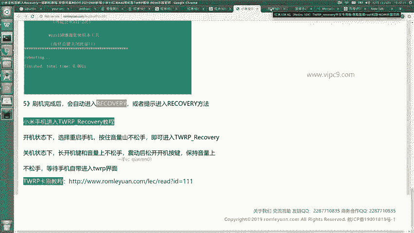
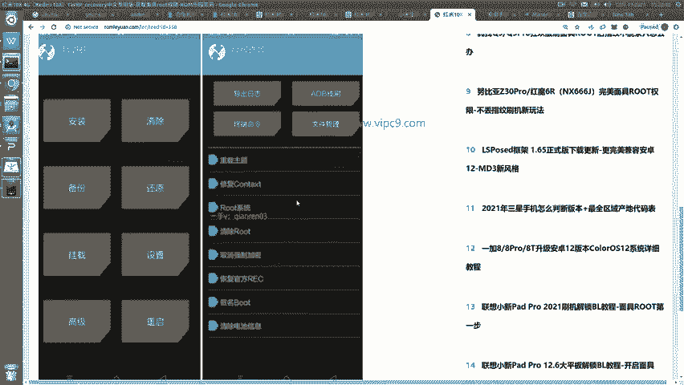
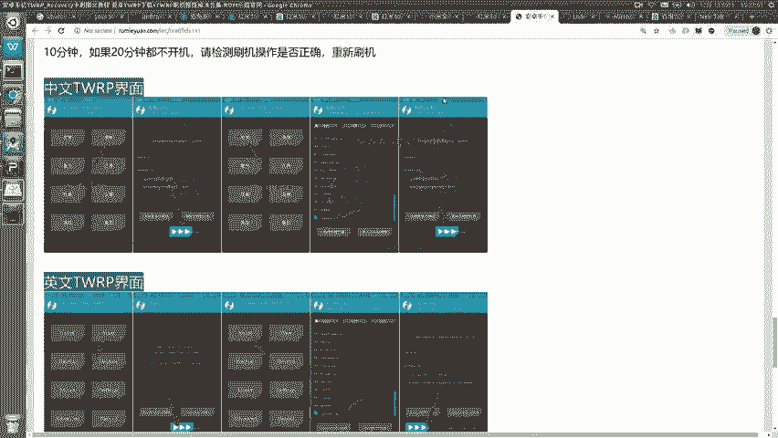
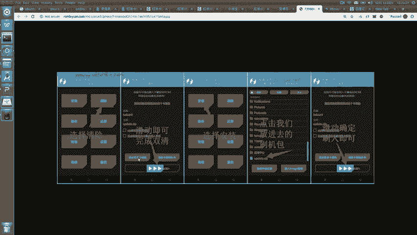
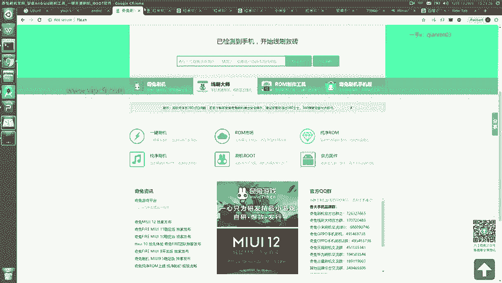

# Android逆向-基础篇：P41：章节6-4-刷机

在本节课中，我们将要学习为Android设备获取Root权限的两种主要方法。Root是进行深度系统修改和逆向工程分析的基础步骤。我们将介绍一种简单快捷的“傻瓜式”方法和一种需要更多手动操作的“亲力亲为”方法，并比较它们的优缺点。

## 两种Root方式概述

Root操作主要分为两种方式。第一种是使用自动化工具的“傻瓜式”方法，这种方法操作简单，成功率高，非常适合初学者。第二种是手动操作的“亲力亲为”方法，步骤相对繁琐，需要用户对刷机流程有更深入的了解。

上一节我们介绍了Root的基本概念，本节中我们来看看具体的操作流程。

## 方法一：使用奇兔刷机（推荐）

这是一种简单高效的Root方法。我个人推荐使用“奇兔刷机”这款软件来完成此操作。

以下是使用奇兔刷机进行Root的步骤：

1.  **下载软件**：首先，访问奇兔刷机的官方网站，下载其客户端。请注意，该软件仅支持Windows操作系统。
2.  **连接设备**：启动软件后，将你的手机通过USB数据线连接到电脑。软件界面会显示连接状态。
3.  **选择机型**：在软件界面中，找到并输入你的手机型号（例如：红米10X）。软件会在列表中显示对应的可刷机资源。
4.  **开始刷机**：点击“一键刷机”按钮，软件会自动为你选择合适的ROM包。根据屏幕提示完成后续操作即可。

整个流程可以概括为两个核心步骤：在软件中选择机型，然后执行一键刷机。过程中可能需要支付约12元的费用，但换来了极高的便捷性和稳定性，因此这是我非常推荐的方式。

## 方法二：手动刷机流程

如果你希望亲自动手完成每一个步骤，也可以选择手动刷机的方式。这通常需要遵循网络上找到的特定机型教程。

以下是手动刷机的一般性步骤：

1.  **准备工具**：根据教程（例如“小米全机型一键刷机教程”），从提供的链接（如百度网盘）下载专用的刷机工具包，并在电脑上解压缩。
2.  **进入刷机模式**：完全关闭手机，然后同时按住“音量下键”和“电源键”，进入Fastboot模式（通常被称为“兔子模式”）。
3.  **执行脚本**：在电脑上，找到解压包中的“一键刷入”或“recovery”脚本文件，双击运行。此时手机会被引导进入Recovery模式。
4.  **Recovery模式操作**：手机进入Recovery模式后，界面通常如下图所示。部分机型的Recovery自带“Root系统”选项，可以直接选择。如果没有该选项，则需进行下一步。

5.  **安装Root包**：在Recovery界面中，选择“安装”选项，然后找到你事先拷贝到手机存储中的Root安装包（例如Magisk的ZIP文件），其图标通常如下图所示。

6.  **清除与刷入**：在安装前，**重要提示**：很多教程会要求先执行“清除数据/恢复出厂设置”操作（如下图所示），这会删除手机上的所有个人数据。然后再选择安装Root包，并通过滑动滑块确认刷入。

由于手动流程涉及清除数据等高风险操作，且步骤因机型而异，容易出错。因此，对于大多数同学，尤其是初学者，使用奇兔刷机等自动化工具是更稳定、更快速的选择。

## 总结

本节课中我们一起学习了为Android设备获取Root权限的两种方法。我们重点介绍了操作简便、成功率高的“奇兔刷机”工具，将其步骤总结为 **`下载软件 -> 连接设备 -> 选择机型 -> 一键刷机`**。同时也概述了手动刷机的基本流程，并指出了其复杂性和风险。对于逆向工程初学者而言，掌握一种可靠、简单的Root方法是后续学习的重要基础。