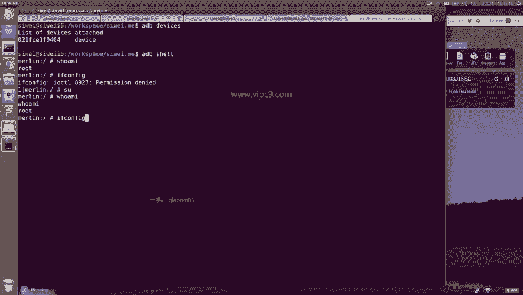
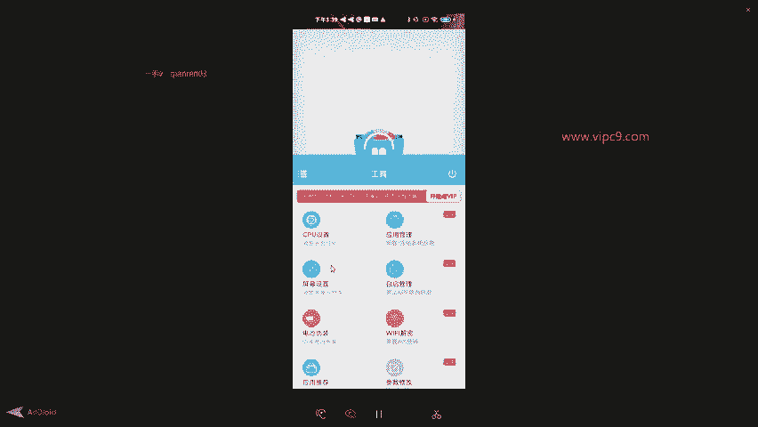

# Android逆向-基础篇：P42：章节6-5：刷机后的验证 🔍

在本节课中，我们将学习如何验证安卓设备在刷机后是否成功获取了Root权限。我们将通过命令行和图形界面两种方式进行验证，确保你能够准确判断设备的Root状态。

---

## 命令行验证

上一节我们介绍了刷机过程，本节中我们来看看如何通过ADB命令行来验证Root权限。

首先，确保设备已通过USB连接电脑，并在命令行中执行 `adb devices` 以确认设备连接成功。接着，输入 `adb shell` 命令进入设备的Shell环境。

此时，不要认为已经获得了完整的Root权限。输入 `who am I` 命令，虽然可能显示为 `root`，但此权限是受限的。

例如，尝试查看当前手机的IP地址，输入命令：
```bash
ifconfig
```
系统会提示权限不足。



为了获取完整权限，我们需要使用 `su` 命令进行切换。在Shell中输入 `su`，然后再次输入 `who am I`。此时返回的用户标识与之前不同，表明已切换到超级用户。

再次执行：
```bash
ifconfig
```
即可成功显示网络配置信息，例如IP地址 `192.168.43.164`。这证明已具备Root权限执行网络相关命令。

此外，我们还可以尝试访问系统核心目录。以下是验证步骤：

1.  进入Linux系统的核心配置目录 `/etc`。
2.  查看该目录下的文件，例如选择一个XML文件。
3.  使用 `cat` 命令读取该文件内容。

若能成功列出并读取系统文件，则从命令行层面验证了Root权限。

---

## 图形界面验证

除了命令行，我们还可以通过手机端的应用程序来直观验证Root状态。

一般来说，如果手机未成功Root，某些需要高级权限的应用程序将无法正常运行。在手机界面中，找到并打开诸如“奇兔刷机助手”、“Magisk”或“EdXposed”之类的工具。

以下是常见的验证迹象：

*   应用检测到设备已Root，并显示相关提示。
*   应用内提供了通常需要Root权限的高级功能选项，例如CPU状态监控、屏幕设置、电池信息伪装等。



若能正常使用这些应用及其高级功能，则从图形界面验证了Root权限。

---

本节课中我们一起学习了验证安卓设备Root权限的两种方法：通过ADB命令行执行高级指令和访问系统文件，以及通过观察特定应用程序能否正常提供高级功能。这些步骤能帮助你确认刷机操作是否成功赋予了设备完整的超级用户权限。