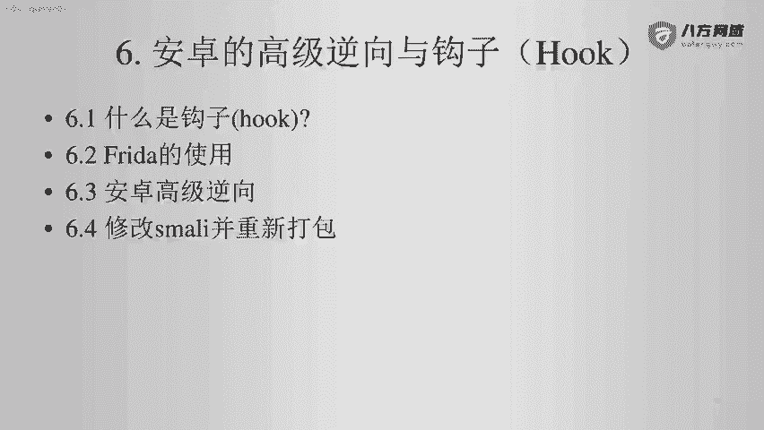
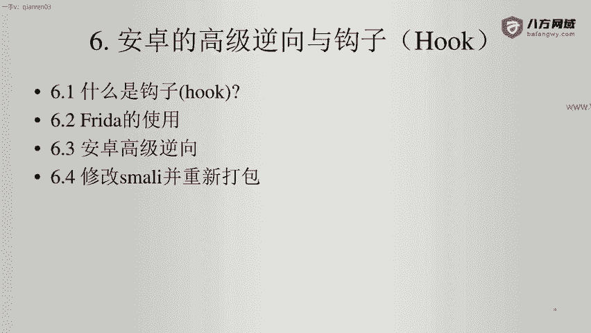
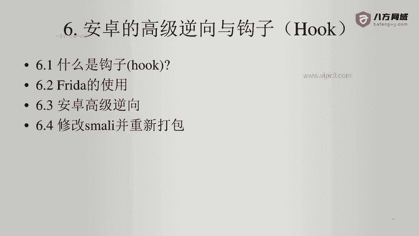

# Android逆向-基础篇：P43：章节7-1-介绍

在本节课中，我们将要学习第六章“安卓的高级逆向与钩子”的概述。钩子，英文为“Hook”，是一种强大的技术，允许我们拦截和修改程序的行为。本章将为你揭开钩子的神秘面纱，并介绍其在安卓逆向中的应用。

## 什么是钩子？

上一节我们介绍了本章的主题，本节中我们来看看钩子的基本概念。

钩子是一种编程技术，它允许开发者在程序执行过程中拦截函数调用、消息或事件。通过钩子，我们可以在目标函数执行前或执行后注入自定义代码，从而实现对程序行为的监控、修改或增强。在安卓逆向中，钩子常用于分析应用逻辑、绕过安全检测或修改应用功能。

## 本章内容概览

了解了钩子的基本概念后，接下来我们看看本章将具体涵盖哪些内容。

以下是本章内容分为的四个主要部分：

1.  **什么是钩子？** - 深入讲解钩子的原理与类型。
2.  **钩子框架Frida的使用** - 介绍如何使用强大的动态插桩工具Frida进行钩子操作。
3.  **安卓的高级逆向** - 探讨更复杂的逆向工程技术与场景。
4.  **修改Smali并重新打包** - 学习如何直接修改应用的底层Smali代码并重新打包APK文件。

## 总结

本节课中我们一起学习了第六章的引言部分。我们了解了“钩子”的基本定义及其在安卓逆向中的重要性，并预览了本章将要深入探讨的四个核心主题：钩子原理、Frida框架的使用、高级逆向技术以及Smali代码的修改与重打包。在接下来的课程中，我们将逐一深入这些主题，帮助你掌握安卓高级逆向的关键技能。