# Android逆向-基础篇：P44：章节7-2-钩子方法

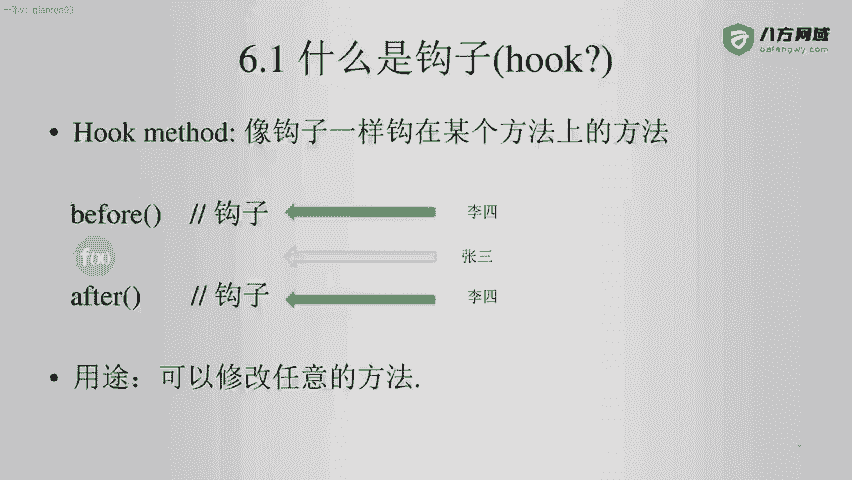

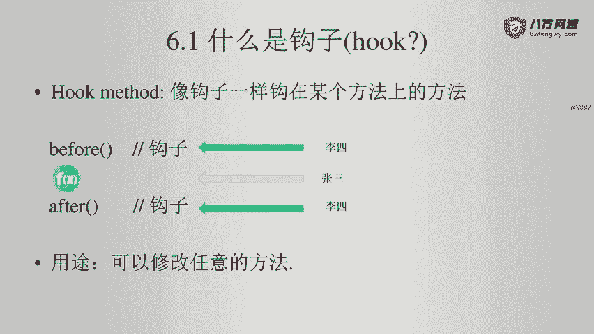

## 概述
在本节课中，我们将要学习Android逆向工程中的一个重要概念——钩子方法。我们将了解钩子的基本定义、它在软件开发中的常见应用，以及它在逆向工程中的特殊作用和意义。

## 什么是钩子方法

钩子，英文称为“Hook”，其核心含义是能够“挂”在某个东西上。

在软件开发领域，我们通常称其为“钩子方法”。钩子方法的结构非常简单，通常是在一个方法执行前（before）或执行后（after）插入的代码。

例如，在进行Vue.js或Android开发时，我们经常会看到诸如 `beforeCreate`、`afterCreate`、`beforePause`、`beforeDestroy` 等生命周期方法。因此，凡是带有 `before` 或 `after` 前缀的方法，都可以被视为钩子方法。

在数据库操作中也会遇到类似概念，例如一个事务在创建之前有 `before` 操作，创建之后有 `after` 操作。这是一种非常方便且在开发层面广泛使用的实现模式。

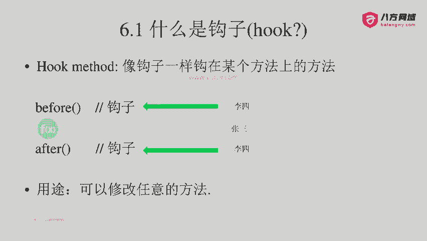

## 逆向工程中的钩子方法

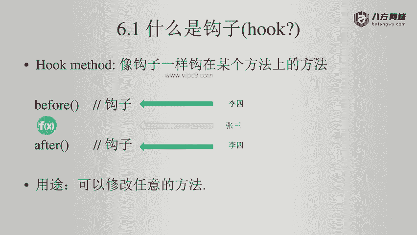

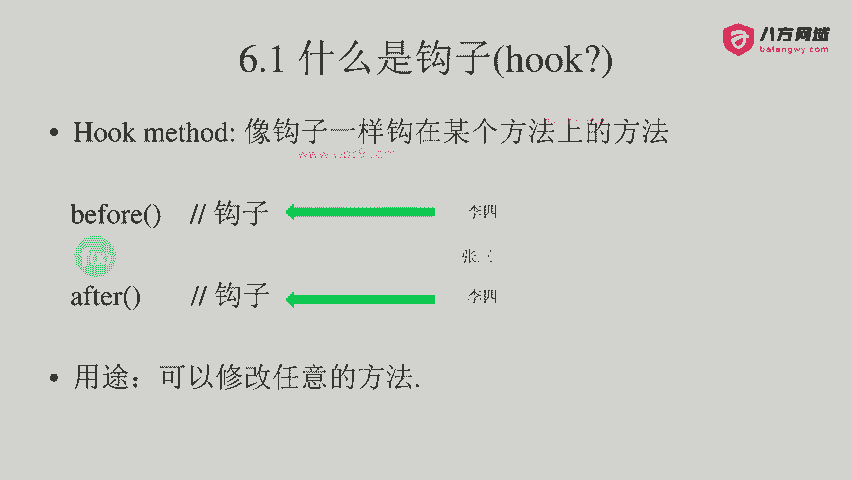

上一节我们介绍了软件开发中钩子方法的概念。本节中，我们来看看在逆向工程或黑客技术中，钩子方法是如何被应用的。

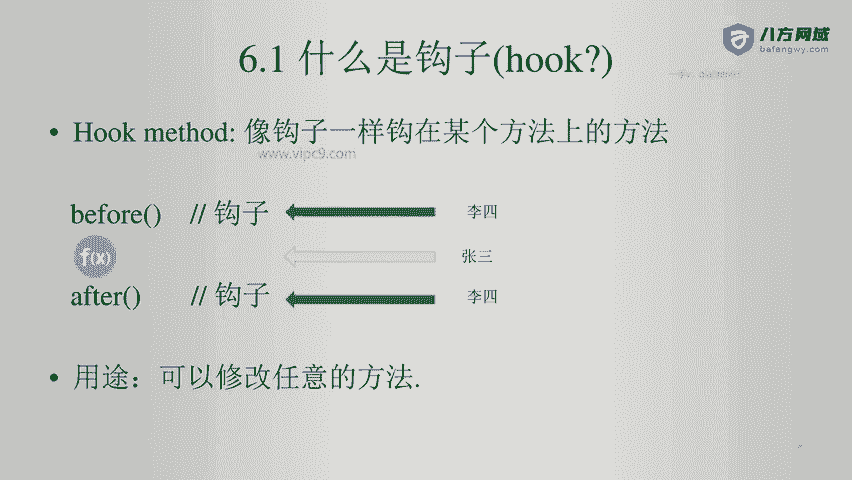

从逆向人员的视角来看，钩子方法通常是自己编写的代码。

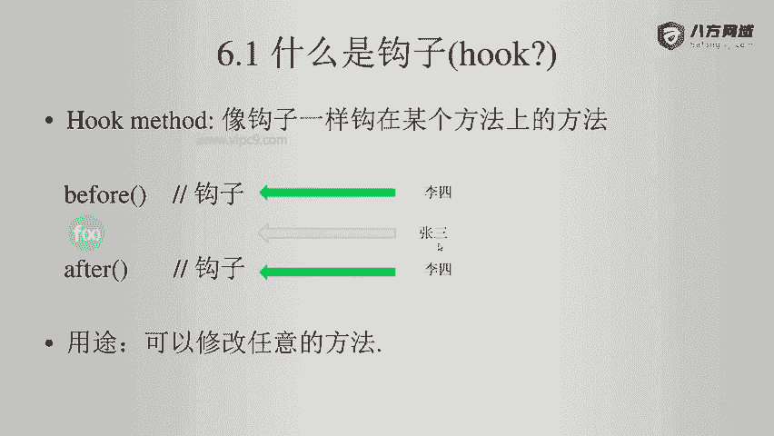

方法本体则是目标程序原有的、由他人编写的代码。在下图的示例中，蓝色的圆圈代表由张三编写的方法本体。

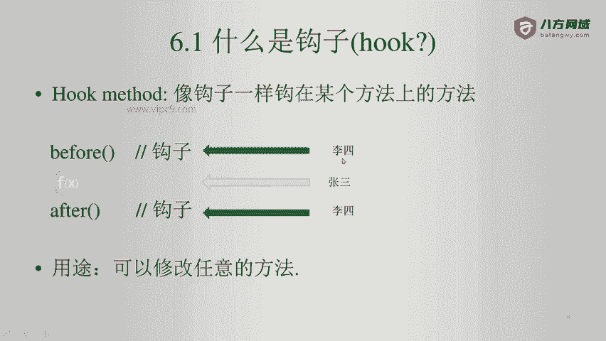

而钩子方法（`before` 和 `after`）则是由逆向人员李四编写的。

钩子的核心作用在于，它允许我们通过插入的代码来修改任意目标方法的执行流程或结果。

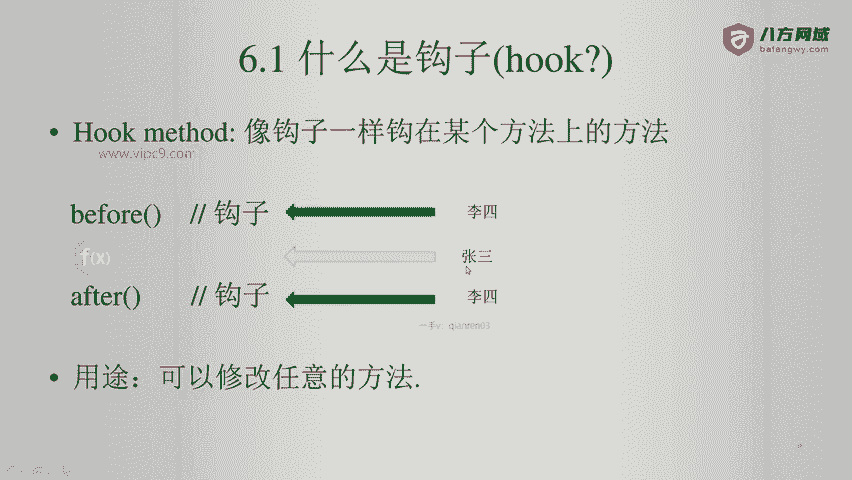

例如，张三编写了一个非常复杂、包含1000行代码的函数，该函数经过大量计算后返回一个布尔值（`true` 或 `false`）。

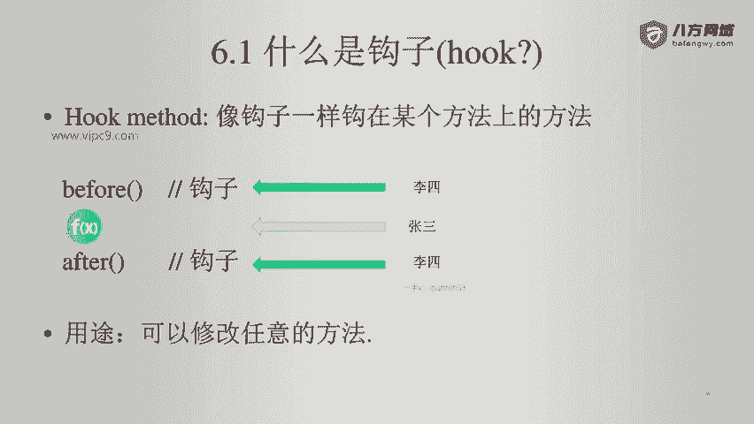

李四作为逆向人员，可以非常简单地在目标函数执行前（`before`）或执行后（`after`）通过钩子直接修改其返回值。

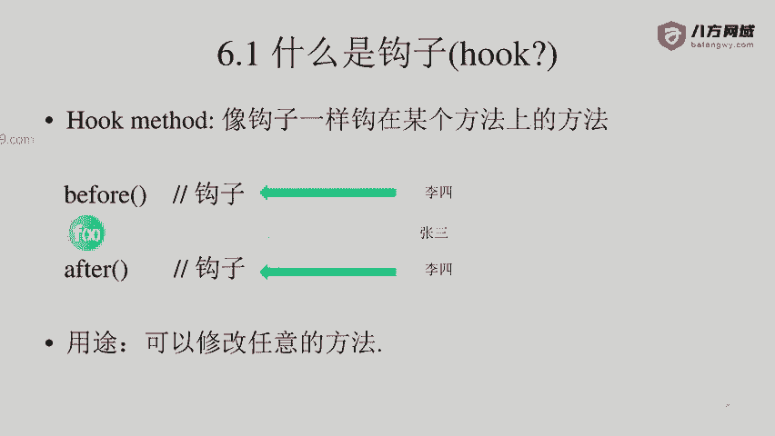

因此，钩子方法的意义在于，它为逆向分析人员提供了一个“上帝视角”，能够拦截、监视并修改程序的正常执行逻辑。

## 总结
本节课中，我们一起学习了钩子方法的概念。我们了解到钩子方法是一种在目标代码执行前后插入自定义逻辑的技术。在正向开发中，它用于扩展功能；在逆向工程中，它则成为分析、监控乃至修改程序行为的强大工具。理解钩子方法是掌握高级逆向技术的重要基础。