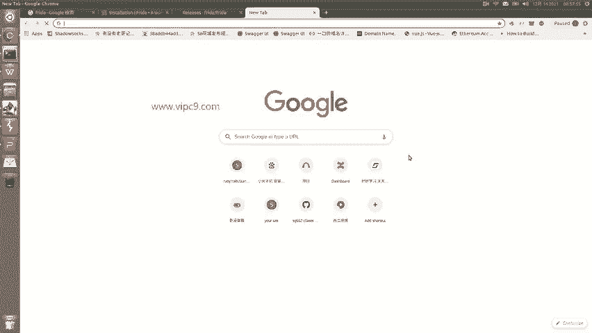
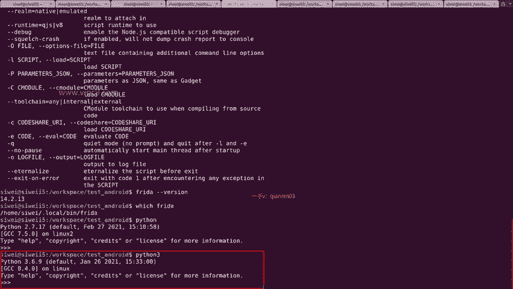
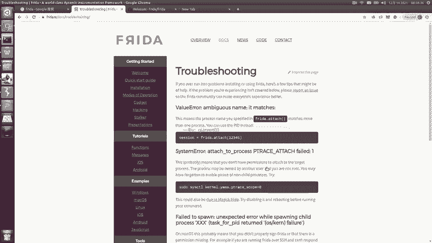
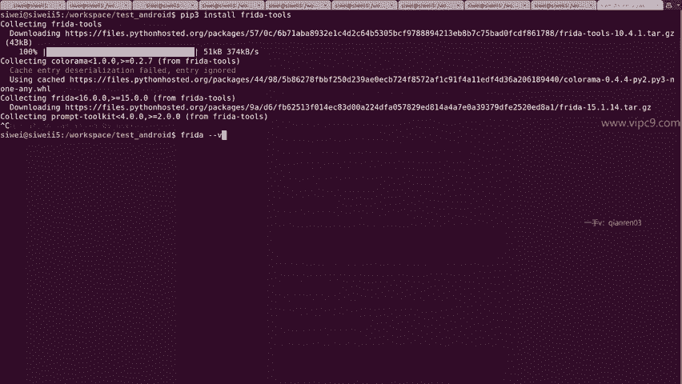
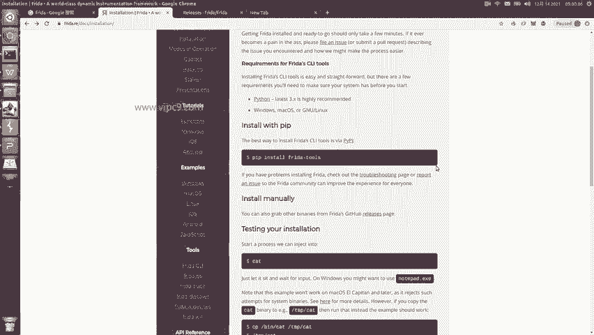
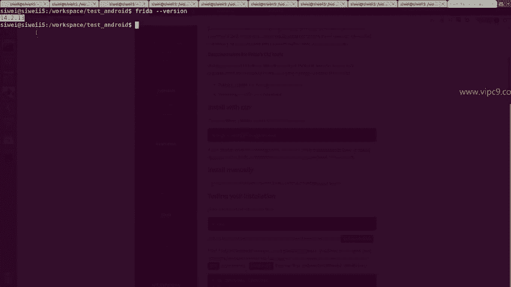
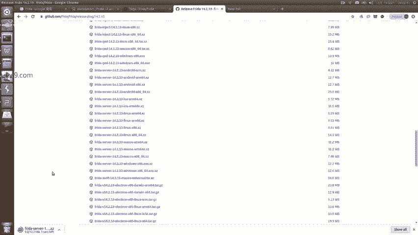
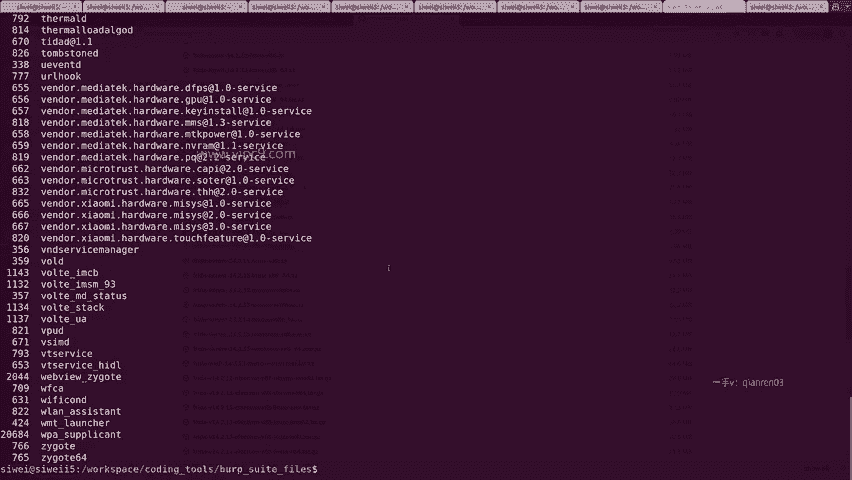

# Android逆向-基础篇：P45：章节7-3：Frida Server与Client的安装与注意事项 🛠️

在本节课中，我们将要学习Frida钩子框架。我们将分别讲解Frida服务器（Server）和客户端（Client）的安装与使用方法，并最终使用Frida实现一个简单的钩子方法。

## 概述



Frida是一个世界级的动态代码插桩框架，主要用于开发人员、逆向工程师和安全研究人员进行运行时分析和修改。它由运行在目标设备上的**Frida Server**和运行在分析电脑上的**Frida Client**两部分组成。



## Frida Client的安装



上一节我们介绍了Frida的基本概念，本节中我们来看看如何安装Frida Client。Frida Client通常安装在我们的分析电脑（PC）上。



安装过程非常简单，主要使用Python的包管理工具`pip`。

**核心安装命令如下：**
```bash
pip install frida-tools
```
对于Python 3环境，命令可能为：
```bash
pip3 install frida-tools
```

除了使用`pip`自动安装，也可以从GitHub的Release页面手动下载`frida-tools`包进行安装，但这对于新手来说较为复杂，建议优先使用`pip`安装。



## Frida Server的安装

Frida Client安装完成后，我们需要在目标安卓设备上安装Frida Server。这是实现钩子的关键一步。



以下是安装Frida Server的步骤：

1.  **确定版本号**：首先，确保手机端Frida Server的版本与PC端Frida Client的版本**完全一致**。可以通过在PC端运行以下命令查看Client版本：
    ```bash
    frida --version
    ```
    例如，输出可能是 `14.2.13`。

2.  **下载对应版本**：访问Frida的GitHub Release页面，找到与PC端版本号匹配的发布版本。例如，对于版本`14.2.13`，需要找到对应的`frida-server`文件。



3.  **选择正确架构**：根据目标手机的CPU架构选择正确的文件。绝大多数现代安卓手机都是ARM64架构。因此，应选择名为 `frida-server-14.2.13-android-arm64.xz` 的文件进行下载。

4.  **推送至手机**：将下载的压缩包解压，得到可执行文件（通常名为`frida-server`）。然后使用ADB命令将其推送到手机的`/data/local/tmp/`目录下：
    ```bash
    adb push frida-server /data/local/tmp/
    ```

5.  **赋予执行权限并运行**：通过ADB Shell进入手机，切换到`root`用户，为文件添加执行权限并运行它。
    ```bash
    adb shell
    su
    cd /data/local/tmp
    chmod 755 frida-server
    ./frida-server &
    ```
    运行后，进程会在后台保持，命令行可能没有明显输出。

## 连接与验证

安装并启动Frida Server后，我们需要验证PC和手机是否成功连接。

在PC端执行以下命令，通过USB连接列出安卓设备上正在运行的进程：
```bash
frida-ps -U
```
如果命令成功执行并列出设备上的进程列表（例如包含`com.xiaomi`等包名），则表明Frida Server和Client已成功连接，版本匹配正确。

**关键注意事项总结：**
*   **Frida Server** 安装在**手机端**。
*   **Frida Client (frida-tools)** 安装在**PC端**。
*   Server与Client的**版本号务必保持一致**。
*   使用 `frida-ps -U` 命令验证连接是否成功。

## 总结



本节课中我们一起学习了Frida框架的核心组成部分及其安装。我们明确了Frida Server与Client的角色和安装位置，掌握了通过`pip`安装Client、根据手机架构下载对应Server并推送到设备的方法，最后学会了使用`frida-ps -U`命令验证环境搭建是否成功。正确搭建Frida环境是后续进行动态分析和钩子实践的基础。