# Android逆向-基础篇：P46：7-4-frida-安卓例子

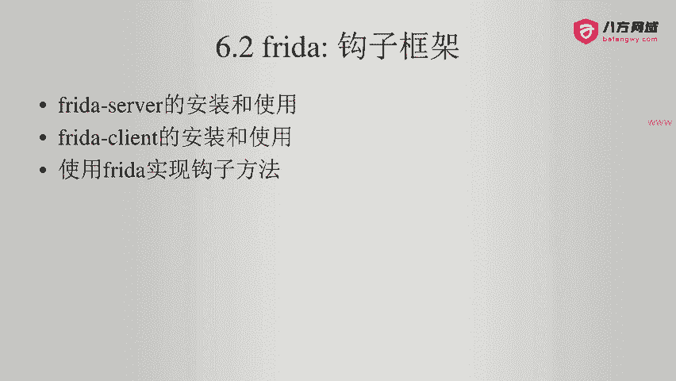

在本节课中，我们将通过一个真实的安卓应用例子，学习如何使用Frida框架来钩子（Hook）并修改应用内部的方法逻辑。我们将从分析目标应用开始，逐步完成Frida脚本的编写与注入，最终实现对目标方法的动态控制。

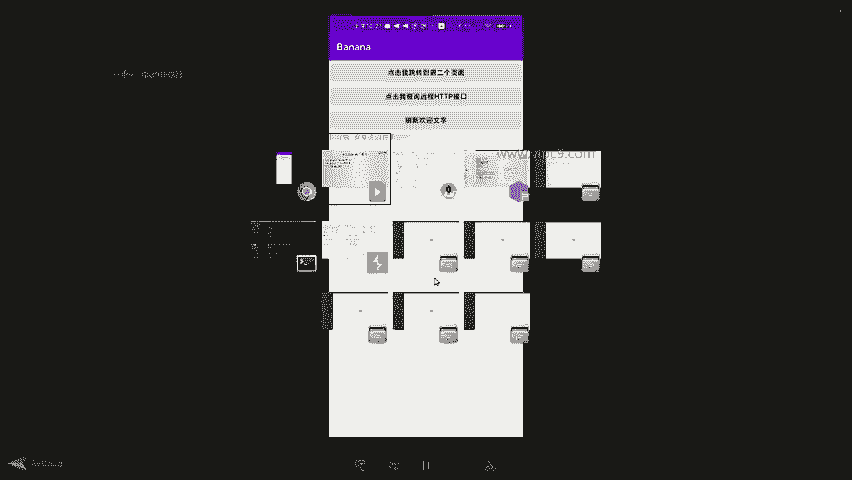

---

## 应用功能分析

上一节我们介绍了Frida的基本概念，本节中我们来看看如何在一个具体的安卓应用上实践。

目标应用界面包含三个按钮。第一个按钮用于页面跳转，第二个按钮用于查询远程接口。我们重点关注第三个按钮，其功能是“刷新文字”。点击该按钮后，应用会更新界面下方的一段文本。

然而，当前点击“刷新文字”按钮后，文本内容看似没有变化。我们需要查看代码来理解其内部逻辑。

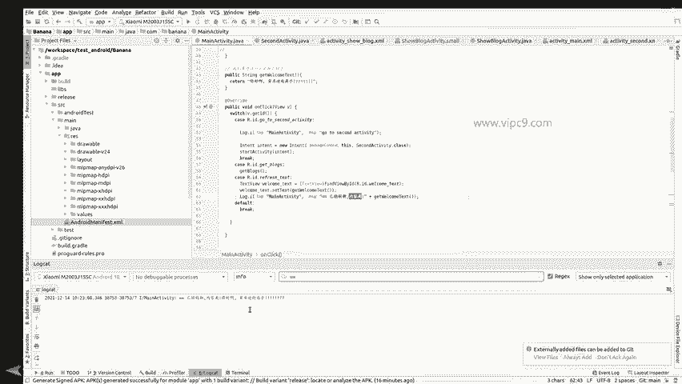

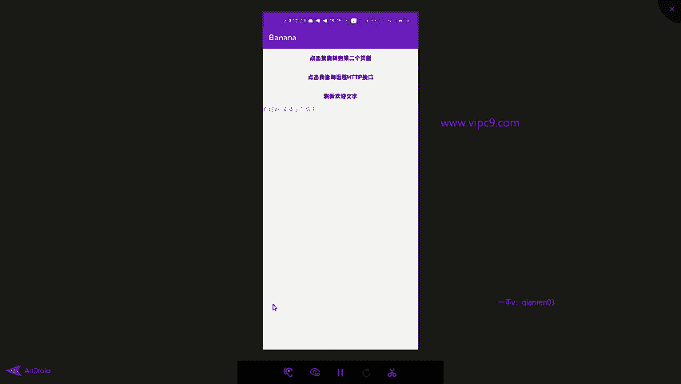

在对应的XML布局文件中，存在一个ID为`welcome_text`的TextView组件。在Activity代码的第36行，通过`setText`方法为该组件设置文本，其文本值来源于一个名为`getWelcomeText`的独立方法。此方法返回固定的字符串“你好啊，安卓逆向高手”。

为了验证逻辑，我们在代码中定位到一处日志打印语句：
```java
Log.i("TAG", "刷新后的内容: " + getWelcomeText());
```
当我们在设备上运行应用并点击“刷新文字”按钮时，可以在日志中看到相应的输出，证明按钮点击事件确实触发了`getWelcomeText`方法。

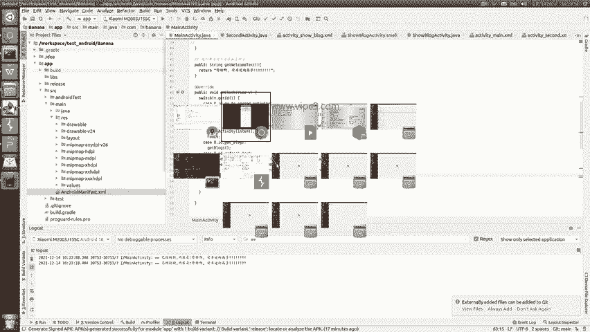

## 准备Frida环境

在开始编写Hook脚本前，需要确保Frida环境已正确配置。

以下是环境准备步骤：
1.  通过ADB Shell连接到安卓设备。
2.  获取root权限（执行`su`命令）。
3.  在root权限下启动Frida Server。

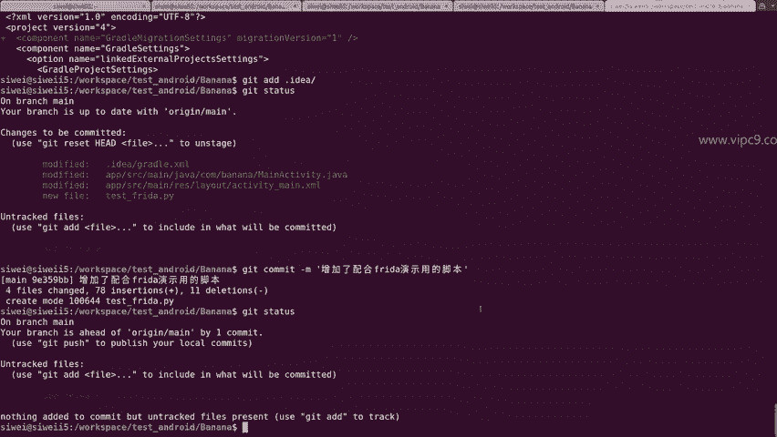

启动后，可以使用命令`frida-ps -U`来确认目标应用进程正在运行，并获取其进程ID。通过`adb logcat | grep <进程ID>`可以过滤查看该应用的相关日志，与我们之前在Android Studio中观察到的日志一致。

## 编写与解析Frida脚本

环境就绪后，接下来我们编写用于Hook的Frida脚本。

以下是为本次演示准备的完整Python脚本，我们将逐段解析其作用：

```python
import frida
import sys

def on_message(message, data):
    if message['type'] == 'send':
        print(f"[*] {message['payload']}")
    else:
        print(message)

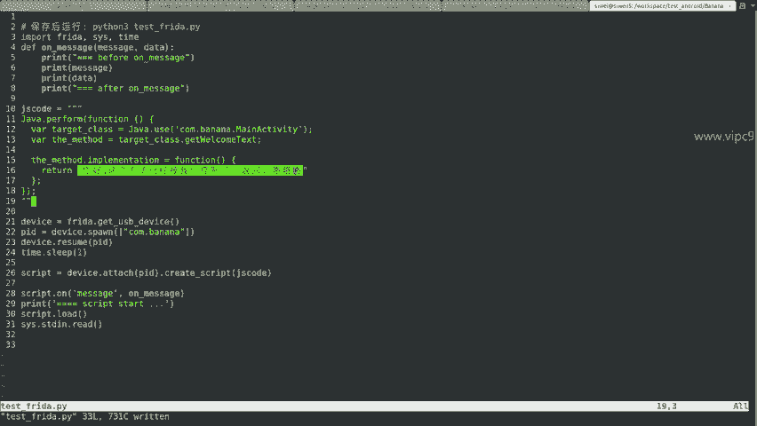

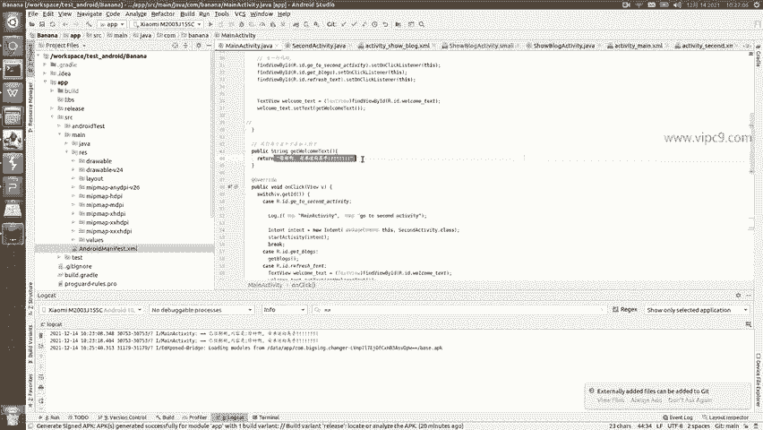

# JavaScript Hook 代码
jscode = """
Java.perform(function () {
    // 获取目标类
    var MainActivity = Java.use('com.banana.MainActivity');
    // Hook 目标方法 getWelcomeText
    MainActivity.getWelcomeText.implementation = function () {
        // 打印日志，表示方法被调用
        console.log('getWelcomeText 方法已被Hook!');
        // 修改返回值
        return '你好，这个方法已经被我们控制了。略略略';
    };
});
"""

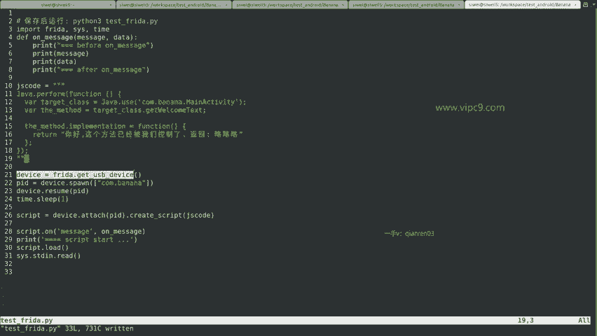

# 连接到USB设备
device = frida.get_usb_device()
# 附加到目标应用进程
pid = device.spawn(["com.banana"])
device.resume(pid)
time.sleep(1)
session = device.attach(pid)
# 创建脚本并加载
script = session.create_script(jscode)
script.on('message', on_message)
script.load()
# 保持脚本运行
sys.stdin.read()
```

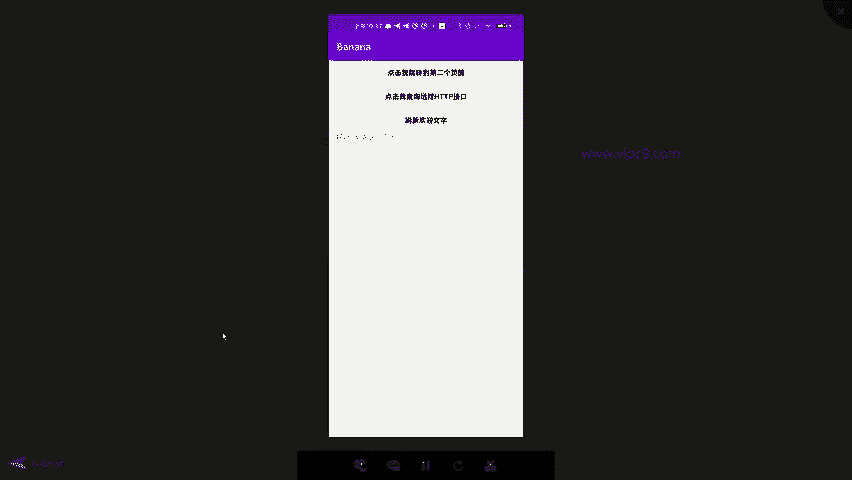

脚本的核心是JavaScript代码部分，它完成了实际的Hook操作：
1.  `Java.perform`确保代码在Java上下文中执行。
2.  `Java.use`获取到我们要Hook的类`com.banana.MainActivity`。
3.  通过重写`MainActivity.getWelcomeText.implementation`，我们接管了原方法的执行逻辑。在新逻辑中，我们首先打印一条日志，然后返回一个自定义的字符串。

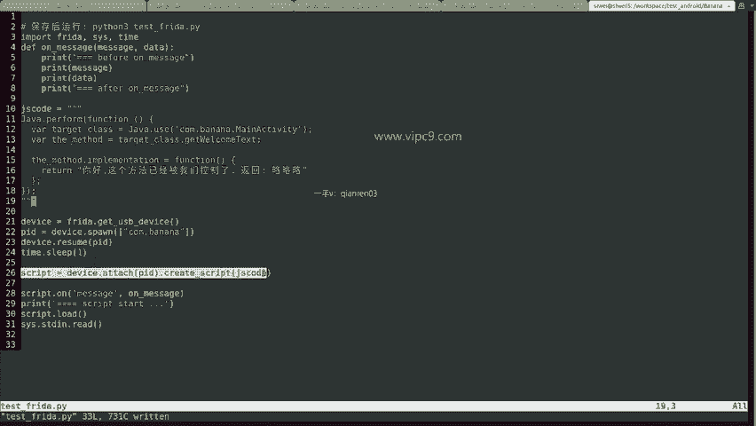

Python部分则负责将这段JS代码注入到目标应用进程中：
1.  连接到USB设备上的安卓系统。
2.  通过包名启动（或附加）目标应用进程。
3.  将JS代码创建为Frida脚本并加载，同时设置消息回调函数。
4.  最后保持脚本运行，等待交互。

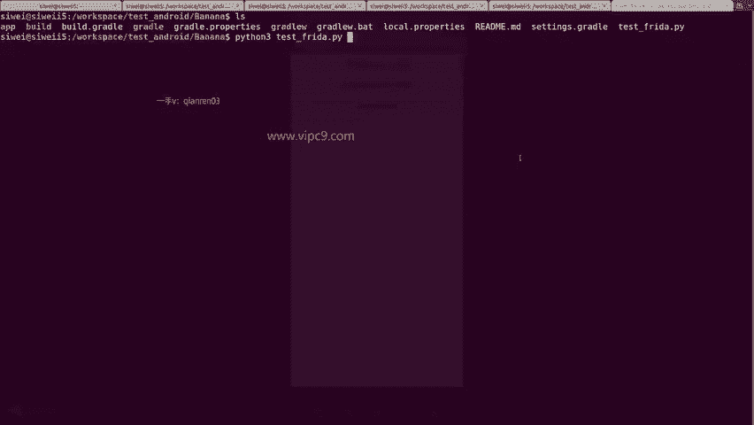

## 执行Hook并验证效果

万事俱备，现在运行我们的Frida脚本。

在PC端命令行执行`python3 frida_hook.py`。脚本运行后，目标应用会自动重启。此时，再次点击应用界面上的“刷新文字”按钮，可以观察到下方的文本内容已经变为我们脚本中定义的“你好，这个方法已经被我们控制了。略略略”。

同时，查看设备日志，除了应用原有的日志外，还能看到我们通过`console.log`添加的“getWelcomeText 方法已被Hook!”信息。这清楚地证明了Frida已成功Hook并修改了目标方法的执行流程与返回值。

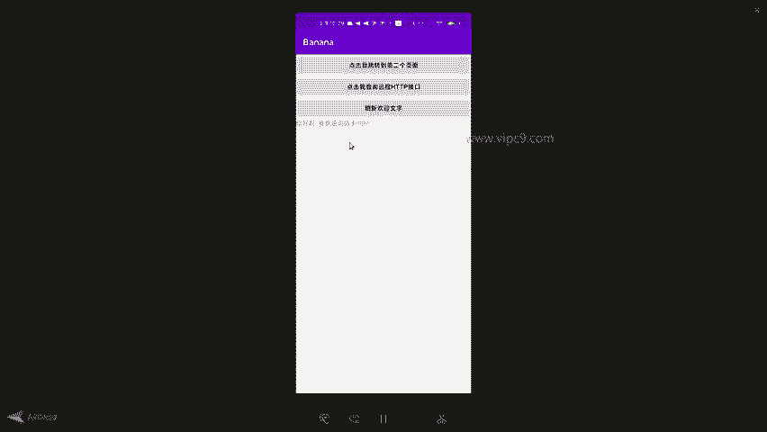

## 重要注意事项与原理

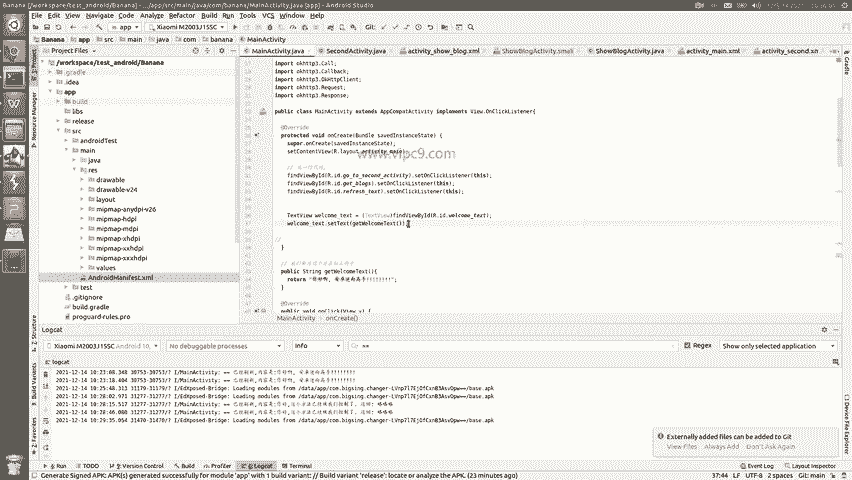

在实践过程中，有几个关键点需要理解：

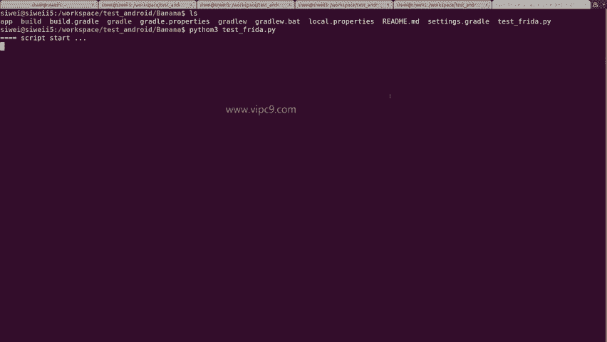

1.  **首次加载现象**：应用首次启动时，若Frida脚本尚未注入，界面文本将显示原始方法返回的“你好啊，安卓逆向高手”。这是因为Android系统在初始加载时直接执行了APK中的原始代码。只有在Frida脚本运行并注入后，后续对`getWelcomeText`方法的调用才会被我们的Hook逻辑接管。

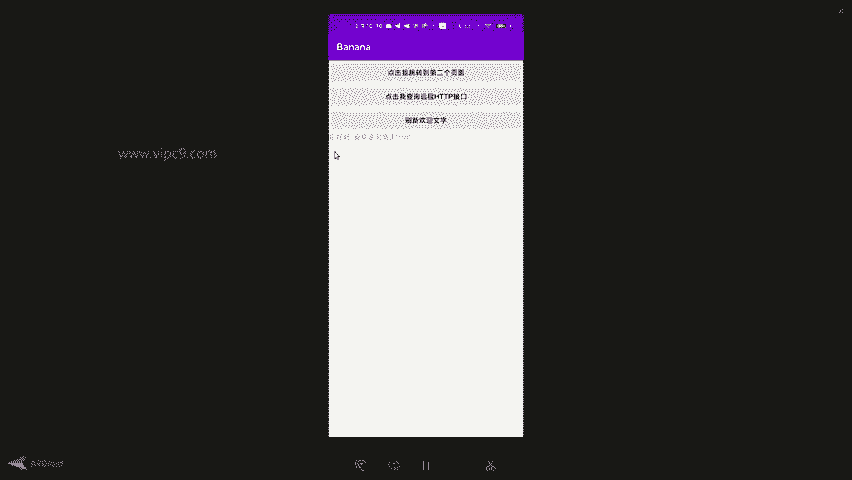

2.  **进程生命周期**：Frida Hook作用于特定的进程实例。如果手动杀死了目标应用进程，然后重新启动应用，之前的Hook将会失效。因为新启动的进程是一个全新的实例，需要重新注入Frida脚本才能再次生效。因此，演示中我们通常通过脚本自动重启应用来确保Hook成功附着。

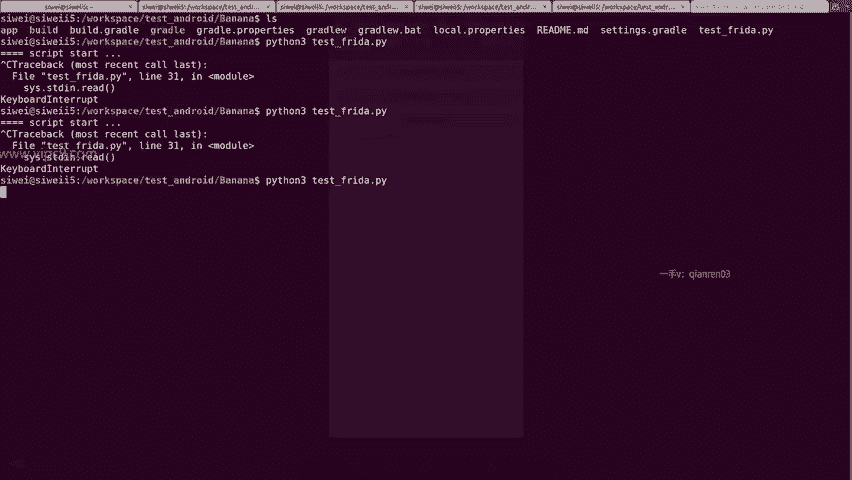

3.  **典型应用场景**：本例演示的方法替换是Frida最基础的能力之一。在实际的安卓逆向与安全测试中，这项技术常被用于动态分析应用逻辑、绕过证书绑定（SSL Pinning）验证、修改函数参数或返回值等场景。

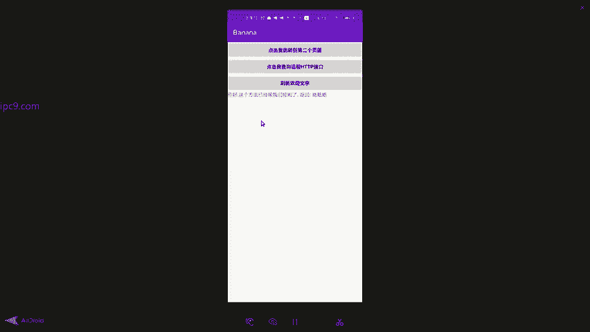

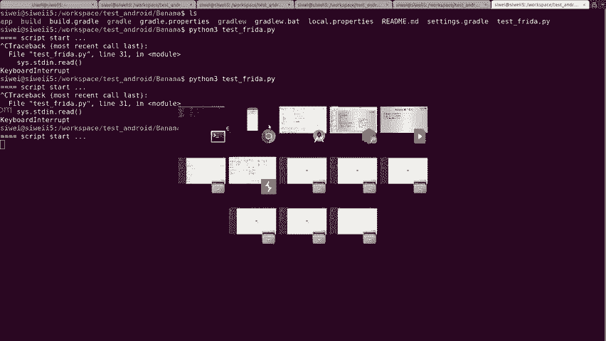

---

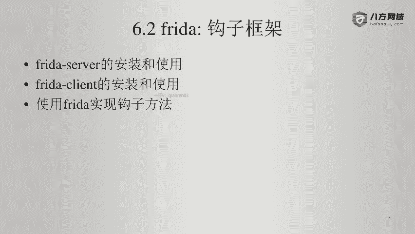

本节课中我们一起学习了如何为一个真实的安卓应用编写并注入Frida脚本，成功Hook了其中的`getWelcomeText`方法，并修改了其返回值。通过这个完整的例子，你应该掌握了使用Frida进行动态方法Hook的基本流程：从环境准备、脚本编写到执行验证。记住注意事项中提到的进程与注入时机的关系，这在后续更复杂的实战中至关重要。