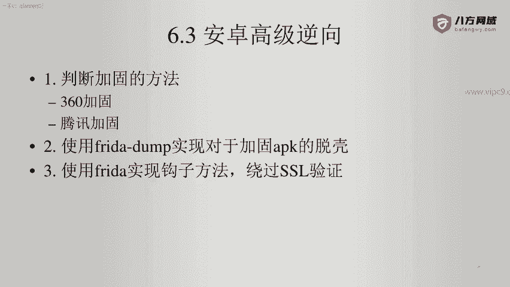
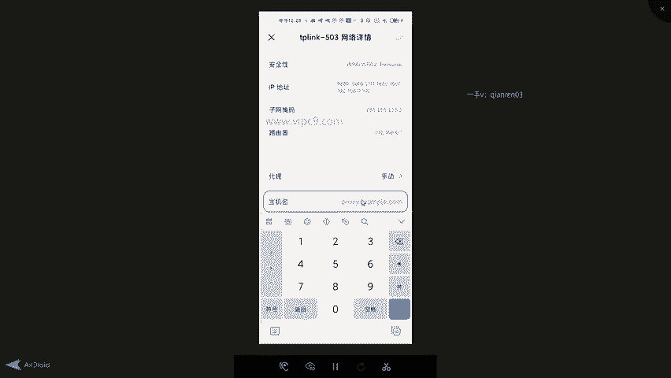
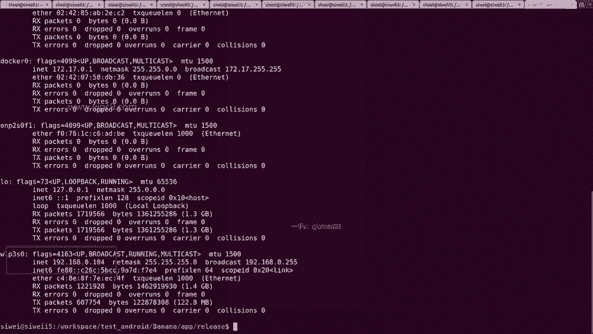
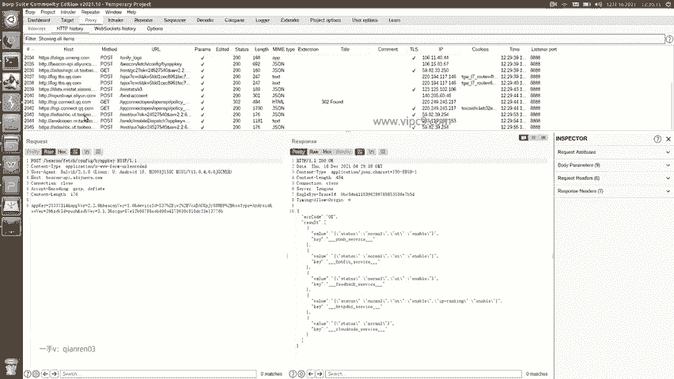
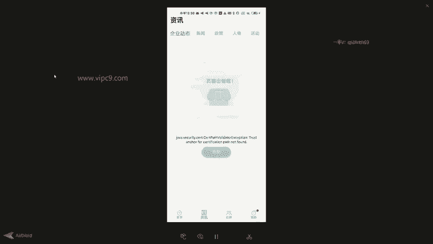

# Android逆向-基础篇：P47：章节7-5-判断是否存在代码层面的证书校验



在本节课中，我们将学习如何通过抓包工具的行为，来判断一个Android应用是否存在代码层面的SSL证书校验。我们将以一个实际应用为例，演示当应用存在证书校验时，抓包过程中会出现的典型现象。

## 概述

上一节我们介绍了SSL证书校验的基本概念。本节中，我们来看看如何在实际操作中判断一个应用是否在Java代码层面实施了SSL证书校验。核心方法是观察应用在代理抓包环境下的行为表现。

## 操作步骤



以下是判断应用是否存在Java层面SSL证书校验的具体流程。

### 第一步：观察正常应用行为

首先，我们需要观察目标应用在正常网络环境下的行为。我们以“数联通”APP为例。

1.  打开“数联通”APP。
2.  点击“首页”，可以正常看到内容。
3.  点击“我的”，可以正常查看相关信息。



这表明在无代理干扰的情况下，应用功能正常。


### 第二步：配置抓包环境

接下来，我们需要在手机上配置代理，以便使用抓包工具（如Burp Suite）拦截网络流量。


1.  进入手机的网络设置，找到当前连接的Wi-Fi。
2.  点击“代理”设置，选择“手动”。
3.  输入运行抓包工具的PC（或虚拟机）的IP地址。在Windows系统可使用 `ipconfig` 命令查看，在Linux或Mac系统可使用 `ifconfig` 命令查看。通常是一个以 `192.168` 或 `10` 开头的局域网地址，例如 `192.168.1.104`。
4.  端口号通常设置为抓包工具监听的端口，例如 `8888`。
5.  保存并确认设置。

### 第三步：启动抓包并触发网络请求

配置好代理后，启动抓包工具并开始捕获数据包。然后，回到手机端重新打开目标应用。


1.  此时，应用界面可能会显示错误，例如 **“Certificate path validation exception”**。
2.  点击应用的各个功能模块（如“首页”），发现无法加载任何内容，页面空白或报错。
3.  回到抓包工具界面，检查捕获到的数据包。你可能会发现，抓到的请求大多来自其他应用（如淘宝、友盟、腾讯等），而几乎没有来自目标应用自身服务器的真实请求。

### 第四步：分析现象与结论



上述现象是判断存在Java层SSL证书校验的关键依据。

1.  应用报错信息明确指出了证书验证问题。`Certificate`（证书）和 `Validator`（验证器）等关键词直接表明了错误根源。
2.  应用功能完全失效，无法与服务器正常通信。
3.  抓包工具未能捕获到应用的真实请求，因为证书校验失败导致请求在发出前就已中断。

**核心逻辑**可以总结为以下伪代码：
```java
// 应用尝试建立SSL连接时
try {
    establishSSLConnection();
} catch (CertificateValidationException e) {
    // 证书校验失败，抛出异常，网络请求终止
    throw new RuntimeException("Certificate path validation failed");
    // 因此，抓包工具无法看到该请求
}
```

当应用配置了严格的证书校验（如固定证书Pinning），而抓包工具的代理证书不被信任时，就会触发此类异常，导致网络请求失败。

## 总结



本节课中，我们一起学习了如何通过实践操作判断Android应用是否存在代码层面的SSL证书校验。关键步骤是：在代理环境下启动应用，观察其是否出现证书验证错误、功能是否失效，以及抓包工具是否能捕获到真实流量。这些现象是存在Java层证书校验的明确标志。理解这一判断方法，是后续学习如何绕过此类校验的基础。