# Android逆向-基础篇：P48：章节7-6-脱壳并使用frida绕过SSL证书校验

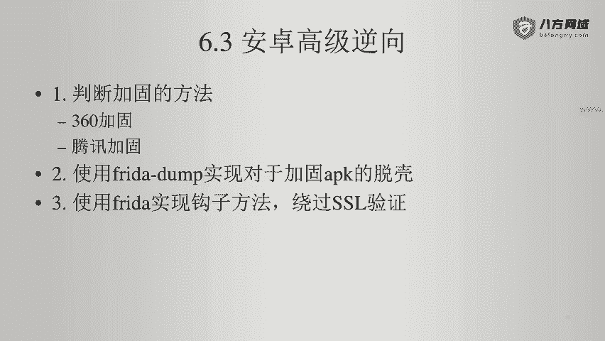

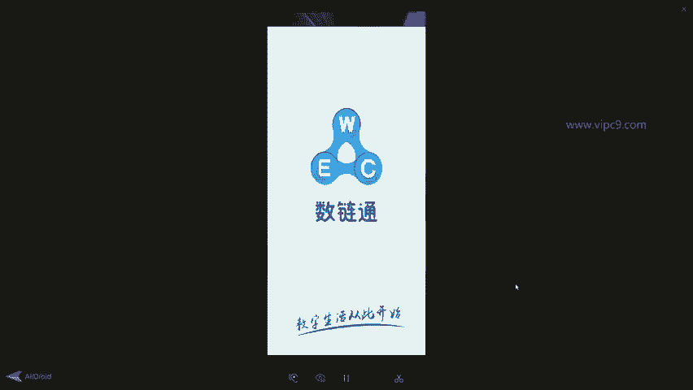

在本节课中，我们将学习如何对一个加固的APK进行脱壳，并分析其源代码，最终使用Frida框架绕过其SSL证书校验机制。

## 概述

我们将以“数联通”APK为例，演示完整的脱壳与分析流程。首先，我们会将APK运行在安卓设备上，然后使用工具提取其DEX文件并反编译为Java代码。接着，通过分析反编译后的代码，定位到进行SSL证书校验的关键方法。最后，编写一个Frida脚本，通过Hook该方法来绕过证书校验，从而允许我们在代理环境下正常抓取网络数据包。

## 脱壳与获取源码

上一节我们介绍了逆向工程的基本环境，本节中我们来看看如何对加固的APK进行脱壳以获取其源代码。

首先，确保目标APK已在安卓设备上运行，并且设备已通过ADB连接到电脑。

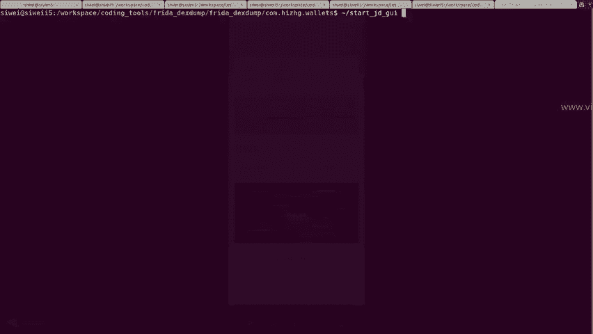

然后，在电脑上启动Frida服务端。进入Frida Server所在目录，并以root权限运行它。

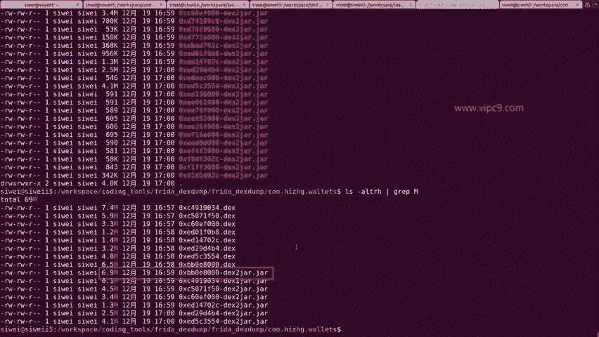

```bash
./frida-server
```

接下来，使用`frida-dexdump`工具来提取APK运行时加载的DEX文件。确保工具在正确的目录下，并执行以下命令：

```bash
frida-dexdump -U -f com.example.app
```

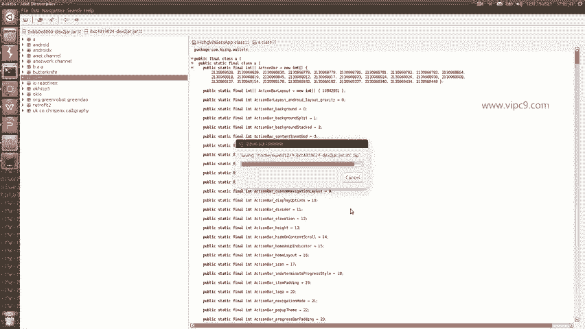

命令执行后，工具会自动识别目标应用的进程，并将内存中加载的DEX文件导出到本地。导出的文件会保存在一个以应用包名命名的文件夹中。

这些导出的DEX文件通常体积较大（以MB为单位），它们是我们的主要分析目标。使用`d2j-dex2jar`工具将所有DEX文件转换为JAR文件，以便用反编译工具查看。

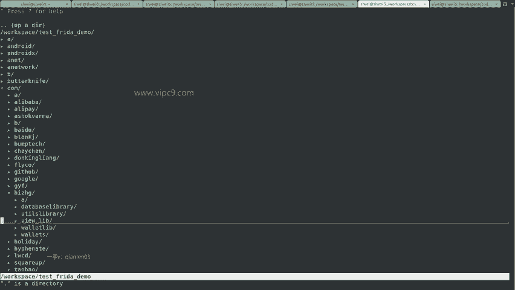

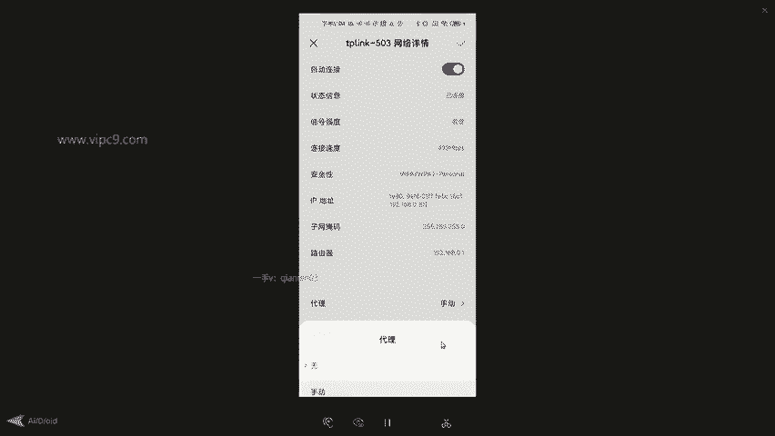

```bash
d2j-dex2jar.sh *.dex
```

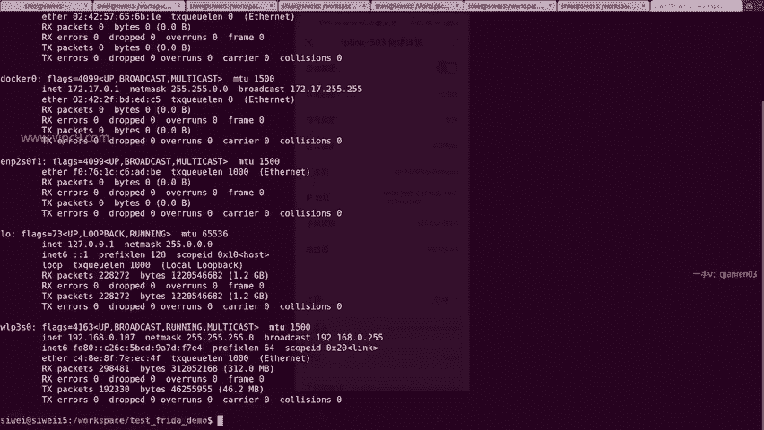

转换完成后，会生成对应的JAR文件。此时，我们可以使用JD-GUI等Java反编译工具来打开这些JAR文件，查看其内部的Java源代码结构。


在JD-GUI中，优先打开体积较大的JAR文件进行查看。通过浏览包结构（通常以`com`开头），可以定位到应用的核心业务代码。找到目标代码后，可以使用JD-GUI的导出功能，将整个包或特定类的源代码导出为Java文件，以便后续进行静态分析。

## 分析SSL证书校验

在成功获取源代码后，我们接下来分析应用中的网络请求部分，特别是SSL证书校验相关的代码。

在配置了代理服务器后重新运行应用，可能会遇到类似`javax.net.ssl.SSLHandshakeException`的证书校验异常。这个异常表明应用对SSL证书进行了严格的校验。

在导出的Java源代码中，搜索异常信息或关键词（如`TrustManager`、`X509Certificate`）来定位校验逻辑。通常，证书校验代码会集中在某个工具类或网络框架的初始化方法中。

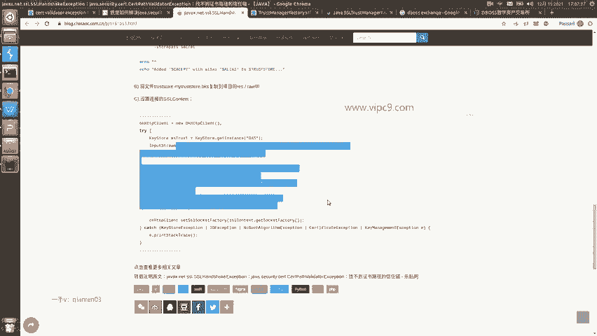

例如，我们可能找到类似以下结构的代码：

```java
public class SSLVerifier {
    public static void verifyCertificates(Context context, X509Certificate[] certs) throws CertificateException {
        // 证书验证逻辑
        CertificateFactory cf = CertificateFactory.getInstance("X.509");
        // ... 更多校验代码
    }
}
```

这段代码就是应用自定义的证书校验入口。我们的目标就是绕过这个校验方法。

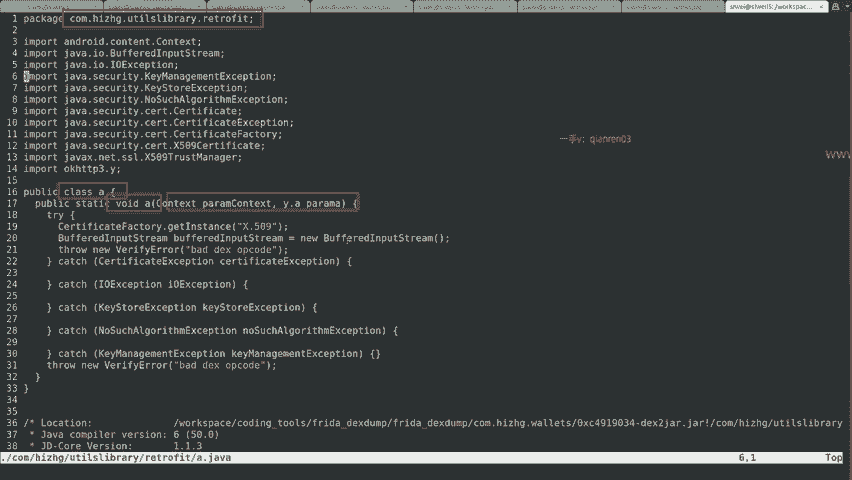

## 使用Frida绕过校验

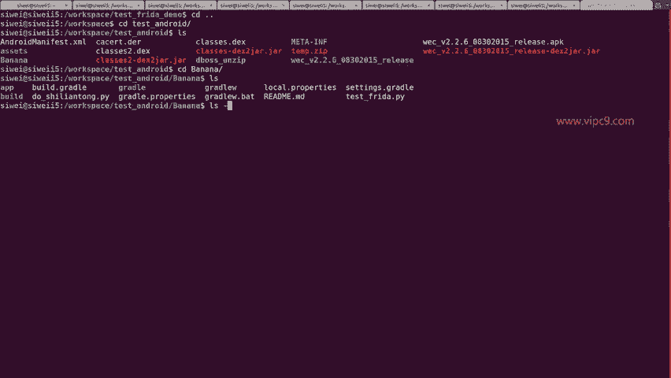

分析出关键类和方法后，本节我们将使用Frida框架来动态Hook并绕过SSL证书校验。

我们需要编写一个Frida JavaScript脚本，来Hook住上一步找到的证书校验方法。脚本的核心思想是替换该方法的实现，使其不执行任何实际的校验逻辑。

以下是一个示例脚本框架：

```javascript
Java.perform(function() {
    // 定位目标类
    var targetClass = Java.use("com.example.app.retrofit.A");
    // Hook目标方法
    targetClass.A.implementation = function(context, certs) {
        // 什么也不做，直接绕过校验
        console.log("SSL证书校验已被绕过");
        // 原方法有两个参数，这里我们选择不调用原方法
        // 因此，无需执行 this.A(context, certs);
    };
});
```

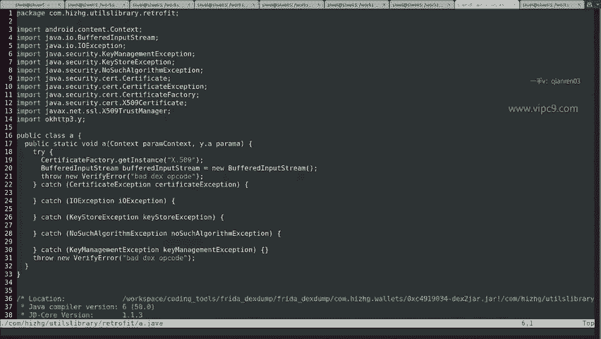

接下来，我们需要一个Python脚本来将上述JS代码注入到目标应用进程中。

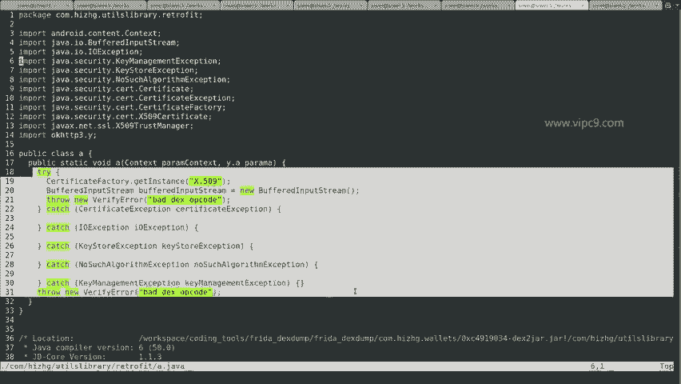

```python
import frida
import sys
import time

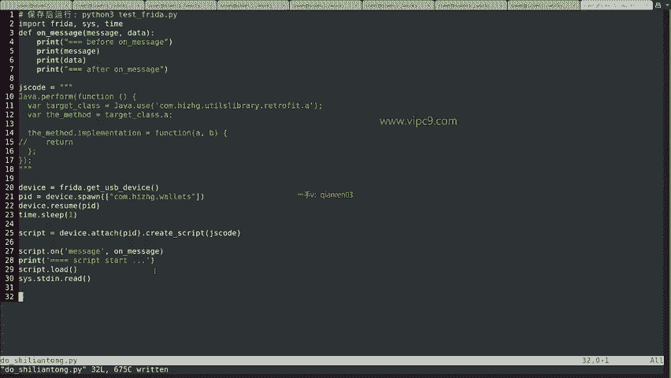

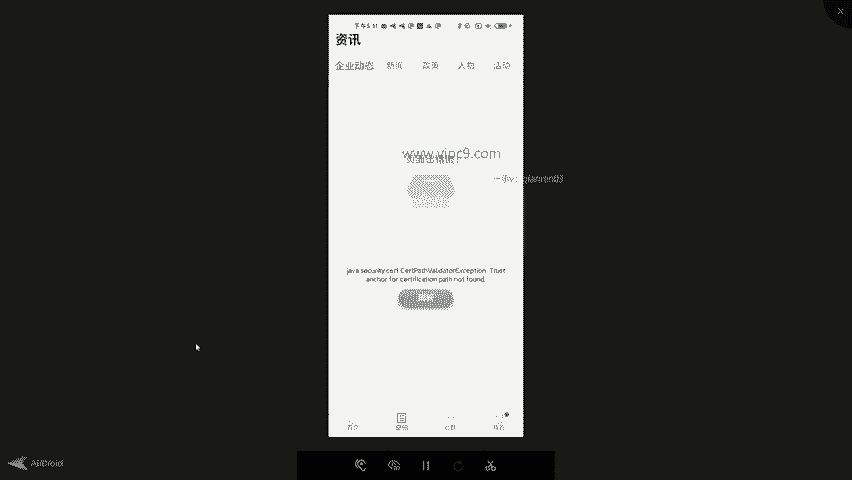

def on_message(message, data):
    print(message)

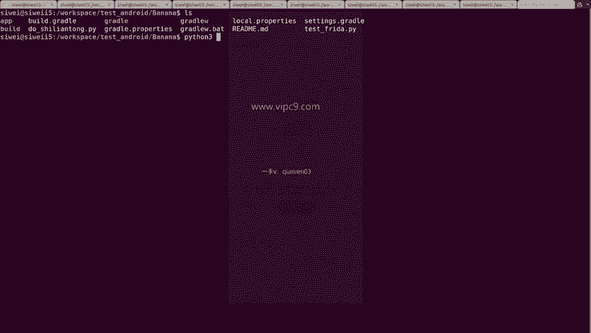

# 这是我们的Frida JS脚本代码
jscode = """
Java.perform(function() {
    var targetClass = Java.use("com.example.app.retrofit.A");
    targetClass.A.implementation = function(a, b) {
        // 空实现，绕过校验
    };
});
"""

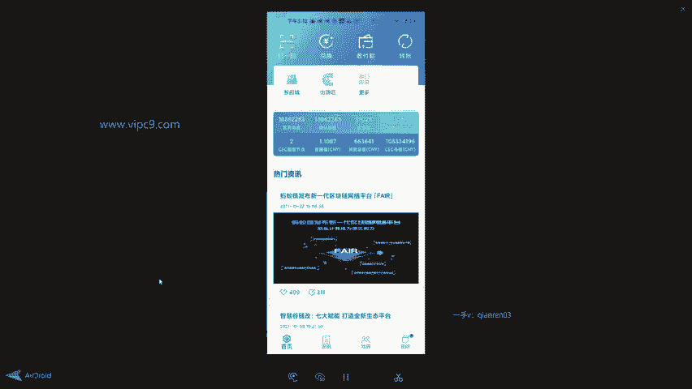

# 连接到设备并附加到目标进程
device = frida.get_usb_device()
pid = device.spawn(["com.example.app"])
device.resume(pid)
time.sleep(1)
session = device.attach(pid)
script = session.create_script(jscode)
script.on('message', on_message)
script.load()

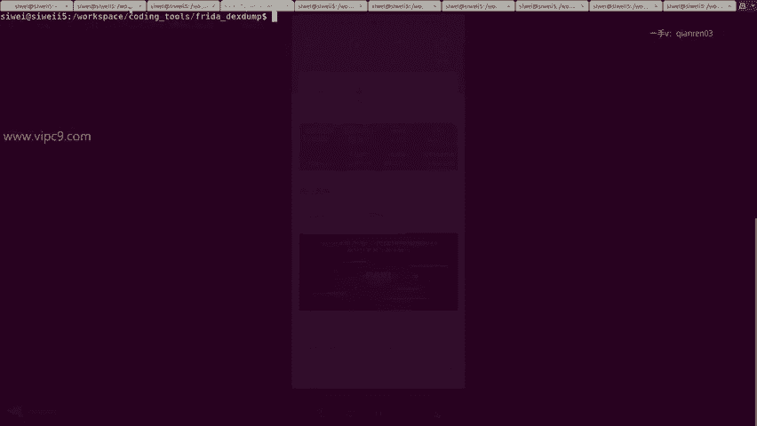

# 保持脚本运行
sys.stdin.read()
```

运行此Python脚本，Frida会自动重启目标应用并将我们的Hook代码注入。注入成功后，应用将不再进行SSL证书校验，之前遇到的证书错误也会消失，网络数据包可以正常通过代理被捕获。

## 注意事项与备选方案

在使用上述流程时，可能会遇到一些问题，以下是常见的注意事项和解决方案。

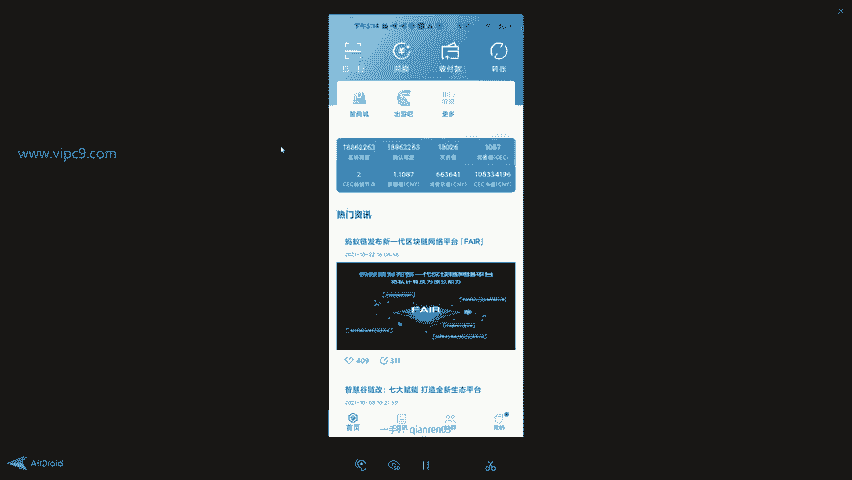

以下是几种可能遇到的问题及解决方法：

1.  **`frida-dexdump`执行失败或无法导出DEX**：尝试删除Frida Server的缓存文件（通常位于`/data/local/tmp/re.frida.server/`），然后以root权限重新运行Frida Server和目标应用。有时也需要重新安装目标APK。
2.  **脱壳工具不适用**：`frida-dexdump`并非万能，对于某些强加固的应用可能失效。此时需要尝试其他脱壳方法。
3.  **备选脱壳方案**：如果主要工具失效，可以考虑以下备选方案：
    *   **直接解压APK**：使用`unzip`命令或压缩软件直接解压APK文件，有时可以在`assets`或`lib`目录下找到原始的DEX文件。
    *   **使用`apktool`**：`apktool`可以反编译APK资源，有时也能获取到DEX文件。
    *   **使用`dex2jar`**：针对从APK中直接提取出的`classes.dex`文件，使用`d2j-dex2jar`工具进行转换。

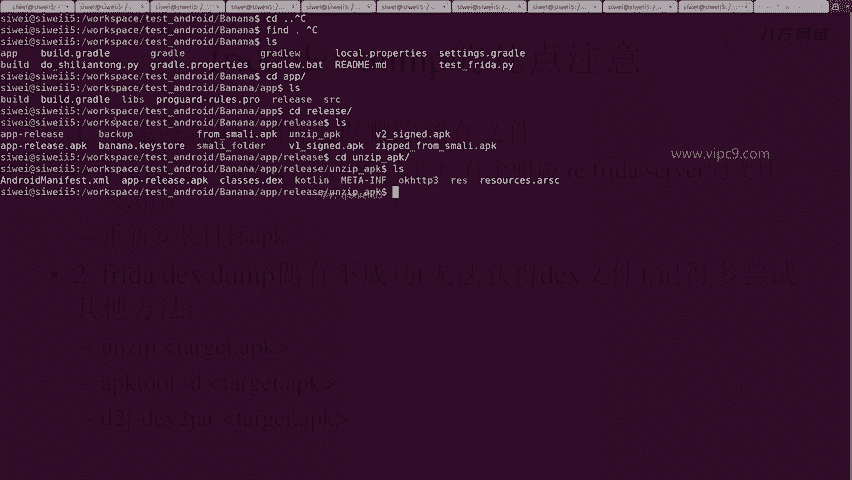

多尝试几种方法，通常可以成功获取到可分析的代码。

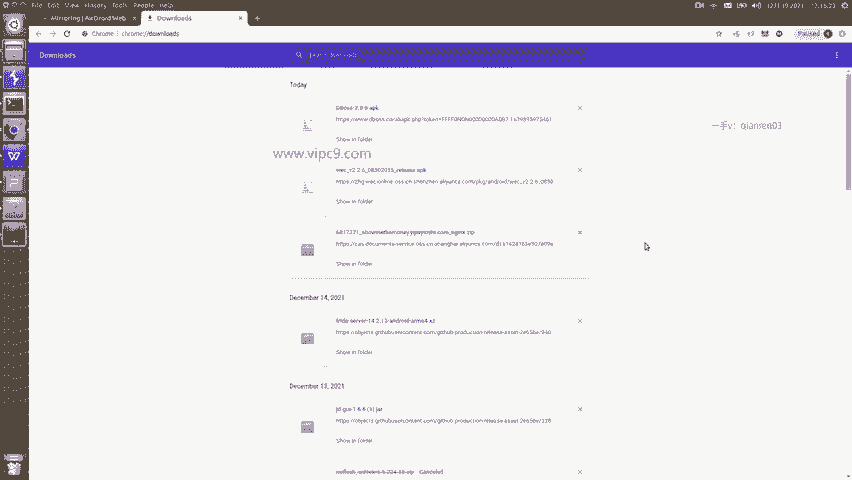

## 总结

本节课中我们一起学习了针对加固APK的完整逆向分析流程。

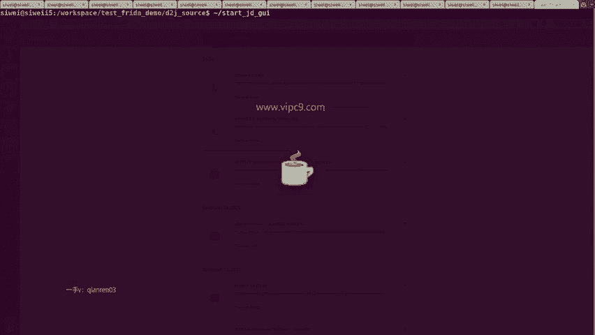

我们首先使用`frida-dexdump`工具对运行中的APK进行脱壳，获取了其DEX文件并反编译成Java源代码。接着，通过分析源代码，我们定位到了导致网络代理失败的关键——SSL证书校验方法。最后，我们编写并注入了一个Frida脚本，通过Hook该校验方法并置空其实现，成功地绕过了证书校验，使得应用可以在配置代理的环境下正常工作。

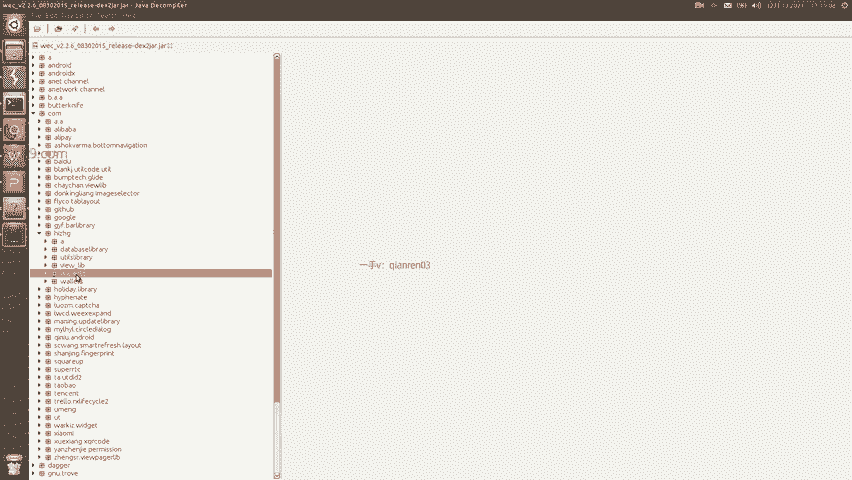

这个过程涵盖了静态分析与动态调试的结合，是Android应用安全研究中一项非常实用的技能。