# Android逆向-基础篇：P49：章节7-7：APK反编译成Smali再重新打包成APK 🛠️

在本节课中，我们将学习如何将一个APK文件反编译成Smali代码，修改关键逻辑后，再重新打包并签名成一个可以安装的新APK。这个过程是Android应用逆向工程的基础操作。

## 概述 📋

我们将通过一个具体的例子来演示整个流程。目标应用有一个按钮，点击后总是返回布尔值 `true`。我们的目标是通过修改其Smali代码，让该按钮点击后返回 `false`。

## 第一步：分析目标应用 🔍

上一节我们介绍了逆向工程的基本概念，本节中我们来看看具体的操作步骤。首先，我们需要了解目标应用的行为。


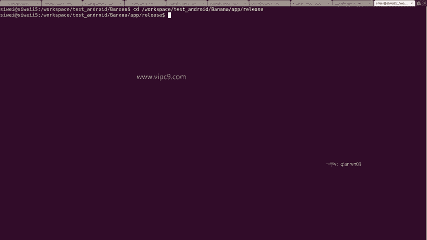

在测试应用中，主界面增加了一个按钮，文本为“返回true或false”。正常情况下，点击此按钮总是返回 `true`。其源代码逻辑如下：

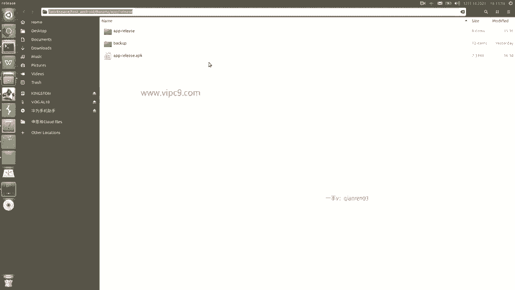

```java
// MainActivity.java 中的关键方法
public boolean getSSLVerifyResult() {
    boolean result = true;
    return result;
}
```

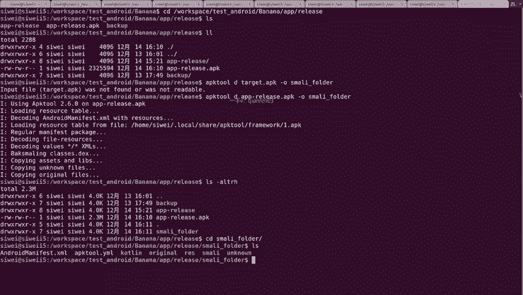

该方法被按钮的点击事件监听器调用。我们的目标就是修改这个方法，使其返回 `false`。

## 第二步：准备已签名的APK 📦

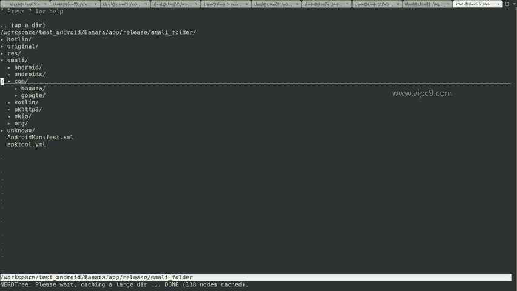

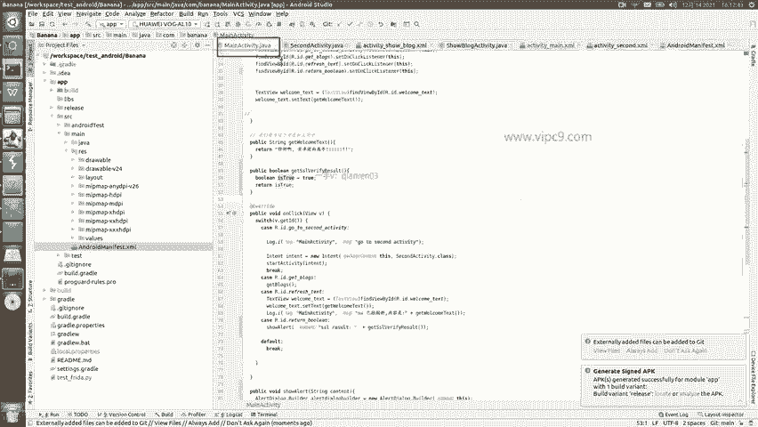

在对APK进行修改前，我们需要一个已经使用V1和V2方案签名的原始APK文件。这通常是应用发布时的版本。我们将其命名为 `signed.apk`。

## 第三步：反编译APK为Smali代码 ⚙️

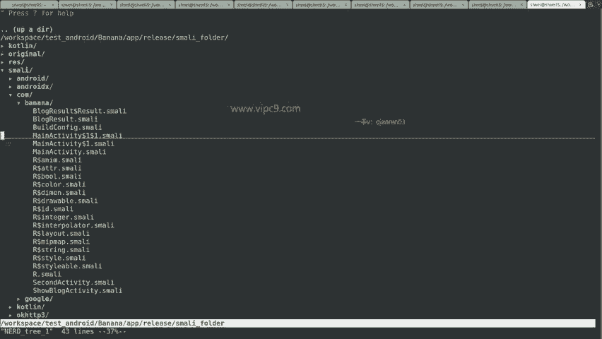

现在，我们开始进行反编译。我们将使用 `apktool` 工具将APK文件解包并反编译成可读的Smali代码。

以下是操作命令：
```bash
apktool d signed.apk -o smali_folder
```
此命令会将 `signed.apk` 反编译，并将所有输出文件（包括资源、清单文件和Smali代码）保存到 `smali_folder` 目录中。

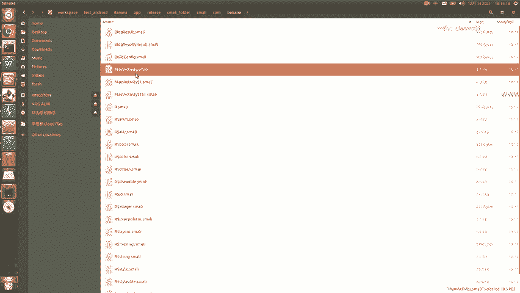

反编译完成后，我们进入 `smali_folder` 目录。我们需要找到与 `MainActivity.java` 对应的Smali文件。通常路径为 `smali/com/example/app/MainActivity.smali`。

## 第四步：定位并修改Smali代码 ✏️

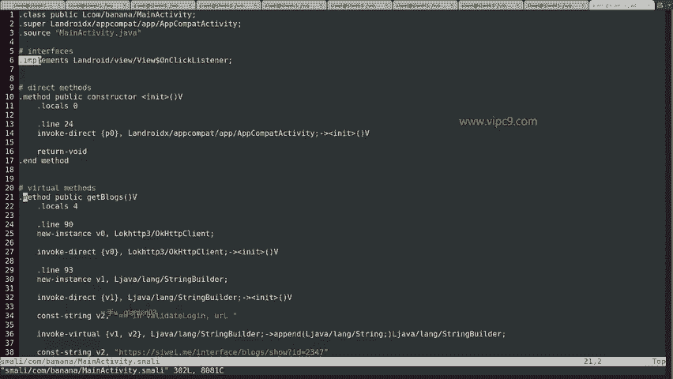

在 `smali_folder` 目录中，我们找到了 `MainActivity.smali` 文件。打开它，我们需要找到 `getSSLVerifyResult` 方法。

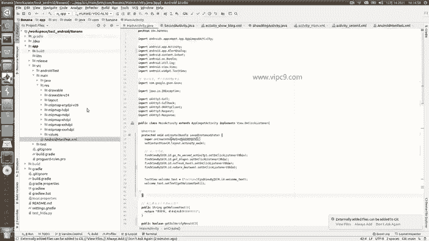

在Smali代码中，该方法可能如下所示：
```smali
.method public getSSLVerifyResult()Z
    .locals 1

    const/4 v0, 0x1  # 将值1（即true）存入寄存器v0
    return v0         # 返回v0的值
.end method
```
在Smali汇编语言中，`0x1` 代表布尔值 `true`，`0x0` 代表 `false`。

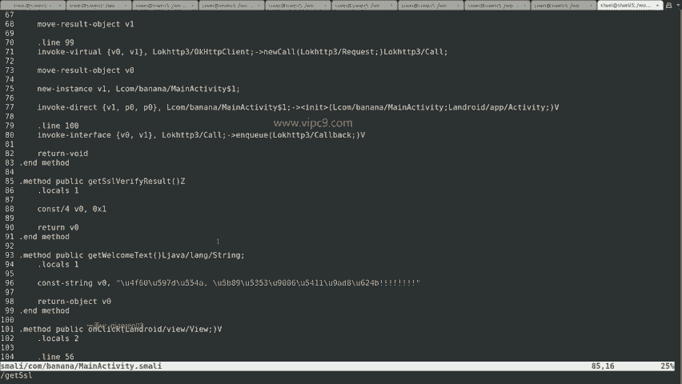

为了将返回值改为 `false`，我们只需将 `const/4 v0, 0x1` 这行代码修改为 `const/4 v0, 0x0`。

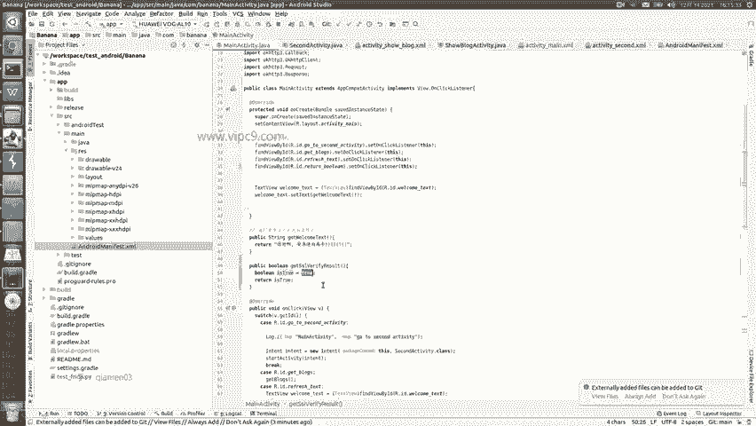

修改完成后，保存并关闭文件。

## 第五步：重新打包APK 🔄

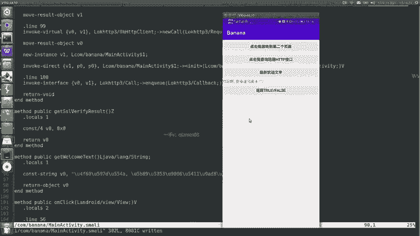

修改完Smali代码后，下一步是使用 `apktool` 将修改后的文件重新打包成一个新的APK文件。

以下是重新打包的命令：
```bash
apktool b smali_folder -o modified.apk
```
此命令会将 `smali_folder` 目录下的所有内容重新编译并打包成名为 `modified.apk` 的文件。

## 第六步：优化与对齐APK 📐

新生成的APK文件可能未经过优化和对齐。我们可以使用 `zipalign` 工具进行优化，这有助于提升应用性能。

以下是优化对齐的命令：
```bash
zipalign -v -p 4 modified.apk aligned.apk
```
此命令会生成一个名为 `aligned.apk` 的优化后文件。

## 第七步：为APK签名 🔑

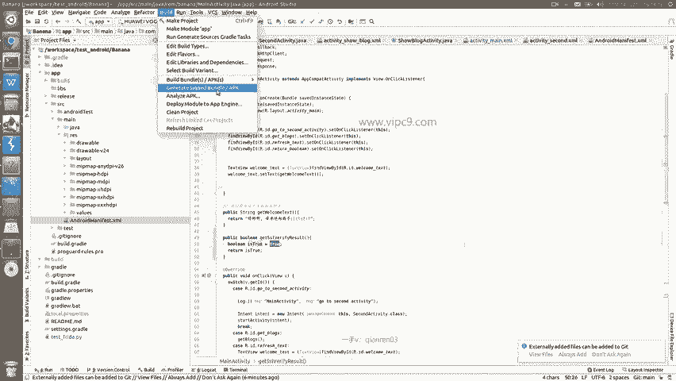

未经签名的APK无法在Android设备上安装。我们需要为APK创建签名密钥并进行签名。签名分为V1（JAR签名）和V2（APK签名方案）两种。

以下是操作步骤：

1.  **生成密钥库**：
    ```bash
    keytool -genkey -v -keystore banana.keystore -alias banana -keyalg RSA -keysize 2048 -validity 10000
    ```
    按照提示输入密码（例如：666666）和信息，即可生成 `banana.keystore` 文件。

2.  **进行V1签名**：
    ```bash
    jarsigner -verbose -sigalg SHA1withRSA -digestalg SHA1 -keystore banana.keystore aligned.apk banana
    ```
    输入密钥库密码，完成V1签名。

3.  **进行V2签名**：
    ```bash
    apksigner sign --ks banana.keystore --ks-key-alias banana --out final.apk aligned.apk
    ```
    再次输入密码，完成V2签名。最终生成可安装的 `final.apk` 文件。

## 第八步：安装与测试 📱

由于新APK使用了不同的签名（“盗版”签名），在安装前需要先卸载设备上使用原始签名（“正版”签名）的同一应用。

卸载原应用后，通过ADB命令或手动将 `final.apk` 文件安装到测试设备上。
```bash
adb install final.apk
```
安装完成后，打开应用并点击按钮。此时，弹出的对话框将显示 `false`，这表明我们的Smali代码修改已成功生效。

## 总结 🎉

本节课中我们一起学习了Android应用逆向工程中的一个核心流程：将APK反编译为Smali代码、修改关键逻辑、重新打包并签名。我们通过一个将返回值从 `true` 改为 `false` 的实例，完整演示了从分析、修改到测试的每一步操作。掌握这个流程是进行更深入逆向分析和修改的基础。