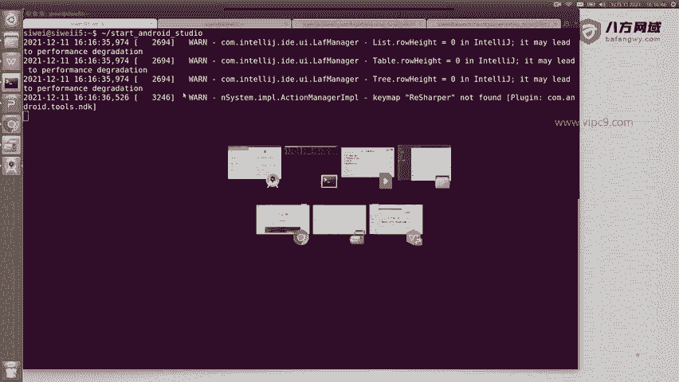
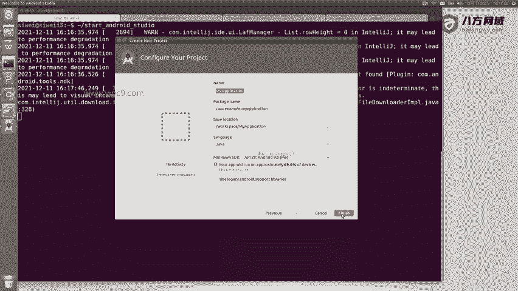
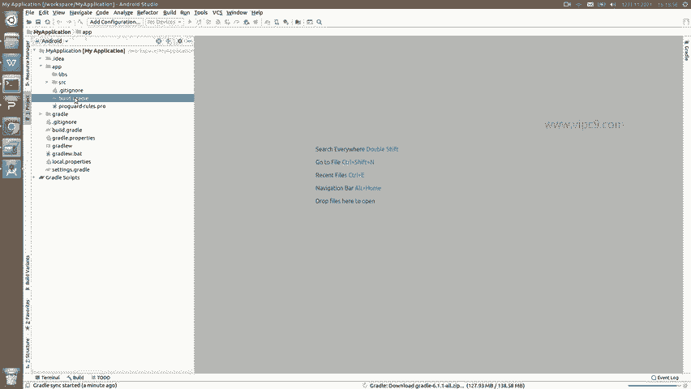
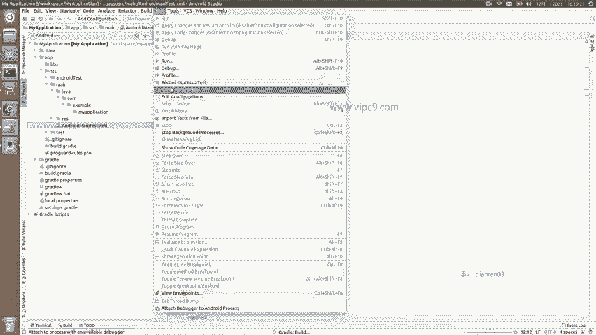

# Android逆向-基础篇：P4：章节2-3-安装Android Studio

在本节课中，我们将学习如何安装并启动Android Studio，并初步了解其基本界面布局和核心功能，为后续的Android应用开发与逆向分析打下基础。

## 启动Android Studio

上一节我们介绍了Android Studio的下载，本节中我们来看看如何启动它。

正常情况双击图标即可启动。在Linux系统中，可以通过命令行运行脚本来启动。

启动后，会看到初始界面。

## 初始界面选项

以下是初始界面中几个主要选项的含义：

*   **Start a new Android Studio project**：创建一个新的Android项目。
*   **Open an existing Android Studio project**：打开一个已有的Android项目。
*   **Get from Version Control**：从版本控制工具（如Git）下载项目。
*   **Import project (Gradle, Eclipse ADT, etc.)**：导入其他格式的项目。

通常我们选择创建一个新项目。在创建过程中，可以选择项目模板、名称等配置。为快速演示，此处使用默认配置。

## Android Studio主界面

成功创建或打开项目后，将进入Android Studio的主开发界面。

界面左侧是项目导航视图，可以切换不同视角查看项目结构：

*   **Project**：按项目文件目录结构查看。
*   **Packages**：按Java包结构查看。
*   **Android**：按Android预设的视图（如`app`、`Gradle Scripts`）查看。

界面中央是代码编辑区，用于编写和查看代码，例如打开`Gradle`构建脚本或Android配置文件。

界面上方是菜单栏和工具栏，包含文件操作、编辑、运行等各项功能。

## 安装Android SDK

在Android Studio中，有一个非常重要的步骤是通过它来安装和管理Android SDK（软件开发工具包）。

可以通过顶部菜单 **Tools > SDK Manager** 来打开SDK管理器，在这里可以下载不同版本的Android平台工具、系统镜像和构建工具，这是开发和编译Android应用所必需的。

本节课中我们一起学习了Android Studio的启动方法、主界面布局以及安装Android SDK的重要性。熟悉这个开发环境是进行Android应用开发和逆向分析的第一步。