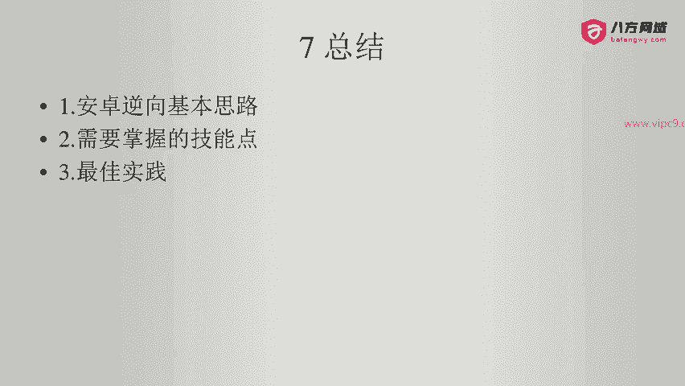
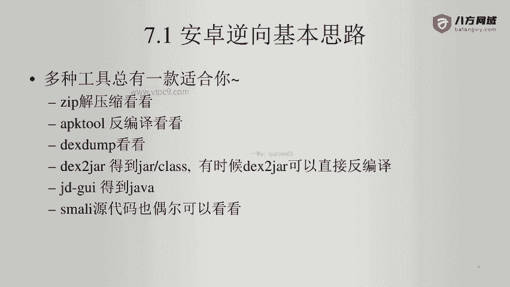
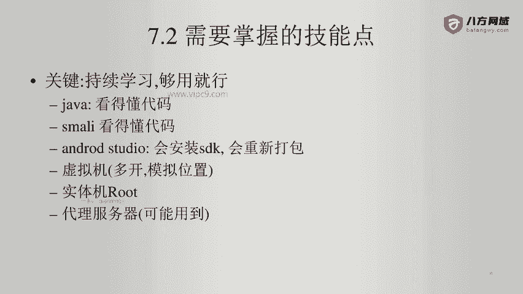

# Android逆向-基础篇：P50：章节8-1-总结

在本节课中，我们将对安卓逆向的基础知识进行总结，回顾核心思路、必备技能以及一些最佳实践。

## 安卓逆向的基本思路 🧠

上一节我们介绍了多种工具的使用，本节中我们来看看安卓逆向的核心思路。其核心在于灵活运用多种工具，没有一种工具能解决所有问题，但总有一款适合当前场景。

以下是安卓逆向的基本流程与常用工具：

*   **初步探查**：使用 `zip` 命令或解压软件直接查看APK包的内部结构。
*   **反编译分析**：使用 `apktool` 对APK进行反编译，检查是否存在 `dex` 文件，判断是否被加固。
*   **脱壳处理**：对于已加固的应用（如使用梆梆、爱加密等），可以使用 `dexHunter`、`Frida` 等工具从内存中 dump 出原始的 `dex` 文件。
*   **代码查看**：使用 `dex2jar` 工具将 `dex` 文件转换为 `jar` 文件。值得注意的是，`dex2jar` 有时也能直接处理APK文件，效果可能更好。
*   **源码阅读**：使用 `JD-GUI` 或 `JADX` 等工具查看 `jar` 文件对应的Java源代码。当分析陷入僵局时，也可以尝试阅读 `Smali` 代码来寻找线索。

总之，掌握多种工具并灵活切换是逆向分析的关键。

## 需要掌握的技能点 🛠️

了解了基本思路后，我们需要明确要掌握哪些技能。核心原则是：**持续学习，但不必过度深入，够用即可**。

以下是逆向工程师需要掌握的关键技能：

*   **Java基础**：能够读懂Java代码即可，无需深入研究如多线程、网络编程等复杂特性。目标是理解程序逻辑。
*   **Smali语法**：能够看懂 `Smali` 代码与Java源代码的对应关系，辅助分析。
*   **Android Studio**：用于安装SDK、编写测试Demo、或进行APK的重打包工作。
*   **虚拟机使用**：掌握至少一种安卓模拟器（如雷电模拟器）的使用。虚拟机便于多开、模拟地理位置，且在某些低版本安卓的测试场景中非常有用。
*   **实体机Root**：掌握实体手机的Root方法。许多高级逆向操作（如修改系统文件、内存dump）都需要Root权限。
*   **代理服务器与抓包**：了解如何设置代理服务器（如Burp Suite、Fiddler）进行网络流量分析。对于敏感目标，应使用代理或IP池以保护自身隐私和安全。

## 最佳实践 💡

最后，我们来看看在安卓逆向学习和实践中应该遵循的一些最佳实践。这些经验有助于提高效率并保障安全。

以下是几条重要的实践建议：

*   **保持持续学习的心态**：技术日新月异，从安卓版本更新到鸿蒙等新系统的出现，必须不断学习新知识，不能固步自封。
*   **隔离测试环境**：**将测试机视为已感染病毒的设备**。切勿在其中存放任何个人隐私信息，如生日、密码、照片等。
*   **注意物理安全**：建议用贴纸遮挡测试机的前置摄像头。因为你无法完全信任测试机上安装的未知应用是否会窃取隐私。
*   **法无定法，保持耐心**：不存在永远无法破解的应用，只存在短期内尚未找到方法的应用。逆向工程是智力与耐心的较量。遇到高度混淆、自带代理或使用Native代码（JNI/C++）加固的应用时，可能需要学习更多知识（如JNI、ARM汇编）或寻找新的工具链。保持探索心态至关重要。

## 总结

本节课中我们一起学习了安卓逆向的完整知识框架。我们回顾了**灵活使用多种工具**的基本思路，梳理了从**Java基础到Root、抓包**等必备技能点，并强调了**持续学习、环境隔离和安全意识**等最佳实践。希望本课程能为你打开安卓逆向世界的大门。