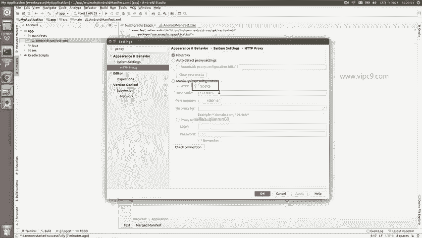
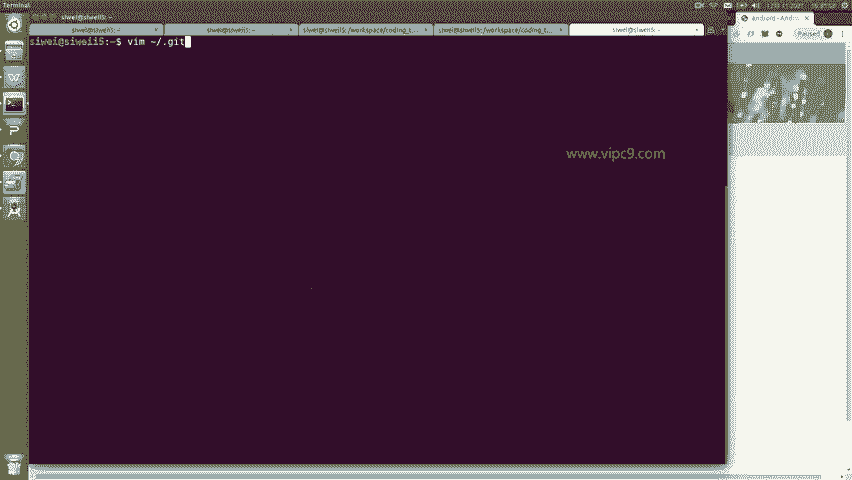
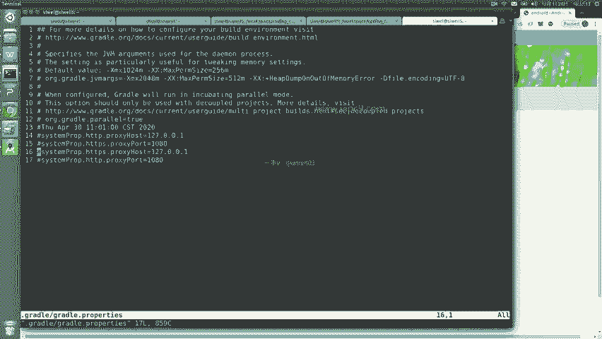

# Android逆向-基础篇：P5：配置android-sdk与代理的使用

在本节课中，我们将学习如何配置Android SDK以及如何为Android Studio设置代理服务器，以确保开发环境的顺利搭建和网络资源的正常访问。

## 概述

上一节我们介绍了Android Studio的基本安装。本节中，我们来看看如何管理Android SDK以及配置网络代理，这对于后续的开发和逆向工程至关重要。

## 配置Android SDK

在Android Studio的菜单栏中，有一个名为“Tools”的工具菜单。其中最重要的项目之一是“SDK Manager”。点击它，可以查看当前所有可用的Android SDK版本。

目前最新的版本是**API 32**。你可以根据需求选择下载。例如，你可以选择下载最新的API 32，或者选择一些历史版本，如Android 5（API 21）或Android 7（API 24）。对于Android 4.4及更早的版本，通常没有安装的必要，因为它们对应的设备年代过于久远。

以下是下载SDK的步骤：

1.  在SDK Manager中，勾选你需要的SDK版本，例如“Android API 32”。
2.  注意上方的“Android SDK Location”路径。建议将其修改到非系统盘（如D盘或E盘）的目录下。这样，即使Android Studio被卸载或重装，已下载的SDK也不会丢失。
3.  点击“Edit”可以修改SDK的存储位置。
4.  在“SDK Tools”标签页中，包含了NDK、Build Tools等组件。通常，保持Android Studio默认选择的选项即可。像“Google Play”等服务一般用不上。
5.  确认选择后，点击“OK”开始下载。

下载过程会显示进度。如果网络正常，SDK将很快安装完成。

## 配置代理服务器

对于国内用户，有时可能因为网络问题无法直接下载SDK。此时，配置代理服务器是必要的解决方案。Android Studio支持配置代理以访问Google服务。

配置代理主要有两种方式：

### 方式一：在IDE设置中配置（适用于HTTP/HTTPS代理）

在Android Studio的设置中，搜索“proxy”或“代理”，即可进入代理设置页面。

*   如果你的代理服务器是HTTP或HTTPS类型，可以直接在此界面进行配置。
*   填写代理服务器的主机名、端口号等信息即可。

### 方式二：在Gradle配置文件中配置（适用于SOCKS5等代理）

如果你的代理是SOCKS5等其他类型，则需要在Gradle的配置文件中进行设置。



1.  找到用户目录下的 `.gradle` 文件夹。
2.  在该文件夹中，创建或编辑一个名为 `gradle.properties` 的文件。
3.  在该文件中，添加你的代理配置。配置格式类似于设置系统环境变量。

例如，一个基本的SOCKS5代理配置可能如下所示：



```properties
systemProp.socksProxyHost=127.0.0.1
systemProp.socksProxyPort=1080
```



通过以上两种方式之一配置好代理后，Android Studio和Gradle就可以通过代理服务器访问外部资源，从而顺利下载SDK和依赖库。

## 总结


本节课中，我们一起学习了Android开发环境搭建的两个关键步骤：配置Android SDK和管理代理设置。我们了解了如何在SDK Manager中下载所需的平台工具，并掌握了针对不同网络环境设置HTTP/HTTPS代理或通过Gradle配置文件设置SOCKS5代理的方法。这些配置是确保后续安卓应用开发与逆向工程顺利进行的基础。下一节，我们将开始准备用于测试的开发设备。