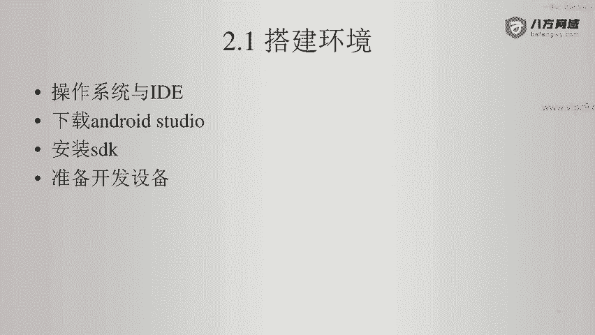
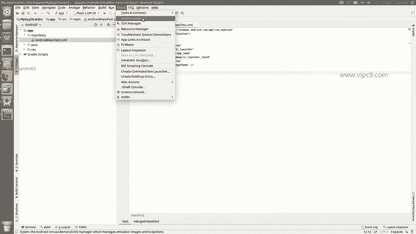
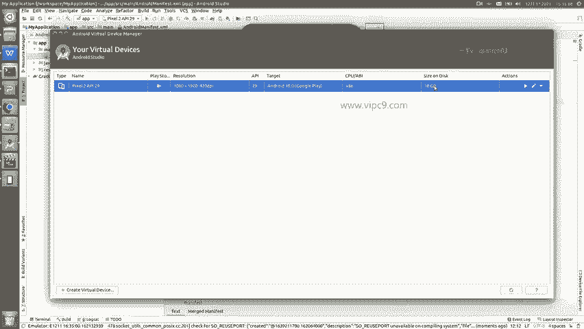
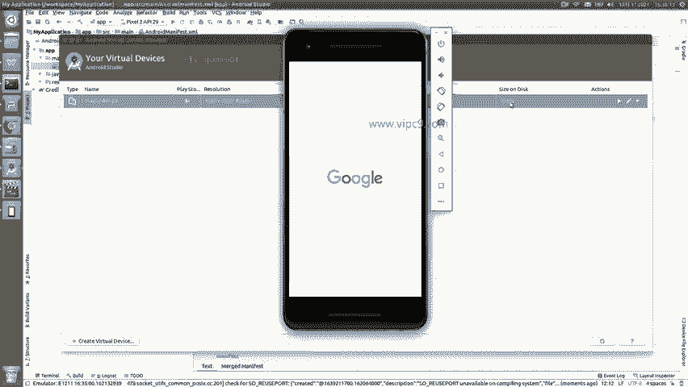
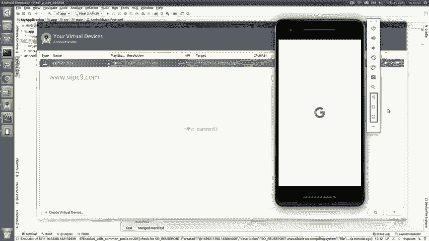
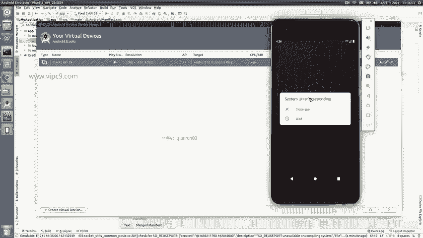
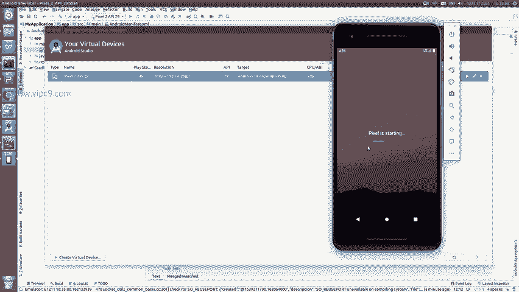
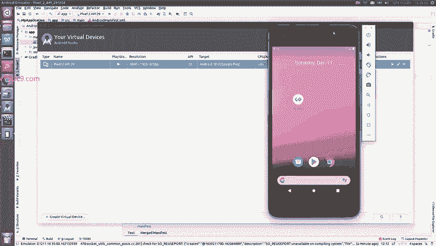
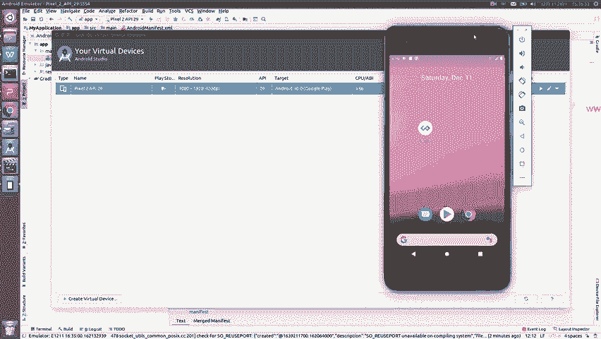
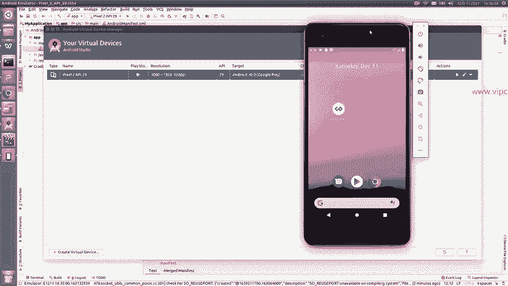

# Android逆向-基础篇：P6：配置开发设备虚拟机

在本节课中，我们将要学习如何为Android逆向工程配置开发设备，重点介绍虚拟机的创建与使用。

开发设备主要分为两种：虚拟机和实体机。虚拟机是在电脑上模拟的Android设备，而实体机则是真实的物理手机。本节我们将重点讲解虚拟机的配置。

## 虚拟机配置

上一节我们介绍了开发设备的两种类型。本节中我们来看看如何使用Android Studio自带的工具创建和管理虚拟机。

Android Studio已经集成了虚拟机管理工具，入口称为AVD Manager。

点击AVD Manager，可以查看当前已创建的虚拟设备。

以下是当前虚拟设备的一个示例：
*   该设备镜像来自Google Play Store。
*   设备分辨率为1080p。
*   对应的Android系统版本为API 29。
*   该虚拟机占用的硬盘空间为10GB。

双击列表中的虚拟机即可启动它。在启动过程中，我们可以观察模拟器控制面板。

以下是控制面板上主要按钮的功能说明：
*   右上角的电源按钮用于关机或开机。
*   音量加减按钮用于调整设备音量。
*   相机按钮用于截图。
*   放大镜按钮用于放大显示。
*   下方的三个按钮模拟了Android设备的导航键：后退键、主页键和最近任务键。

虚拟机启动完成后，即可正常使用。

## 虚拟机与实体机的选择

启动后可以看到，虚拟机在运行时通常会占用较多的系统资源（CPU和内存）。

因此，如果您的电脑性能不够强劲，运行虚拟机可能会感到卡顿。在这种情况下，我的建议是使用实体机进行开发。实体机在运行速度、流畅度和稳定性方面通常都优于虚拟机。

我们可以先将虚拟机挂起或关闭。

本节课中我们一起学习了如何通过Android Studio的AVD Manager配置Android虚拟机，并了解了虚拟机控制面板的基本操作。同时，我们也对比了虚拟机与实体机的优缺点，为后续根据自身条件选择合适的开发设备打下了基础。