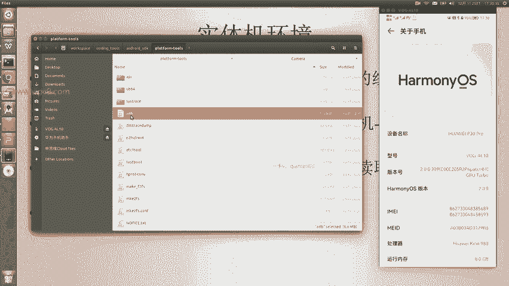
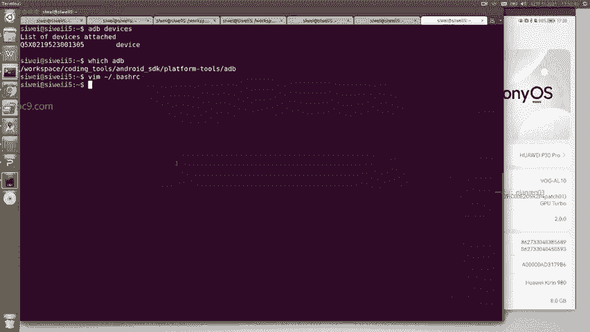
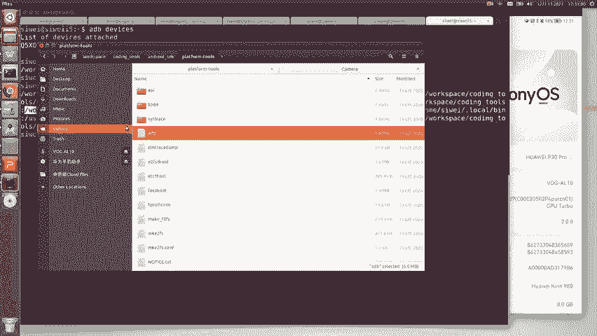

# Android逆向-基础篇：P7：配置开发设备-实体机 📱

在本节课中，我们将学习如何配置一台实体安卓手机作为开发设备。使用实体机进行开发测试，具有运行速度快、不占用电脑内存等优点。我们将从准备数据线开始，逐步完成手机设置与电脑连接的整个流程。

## 准备数据线

首先，需要准备一根数据线用于连接手机和电脑。

以下是注意事项：
*   必须使用标准的数据线，而非廉价的充电线。两者规格不同。
*   例如，华为品牌的部分数据线内部为紫色。

使用不合格的数据线可能导致连接失败，造成不必要的困扰。

## 开启手机开发者模式

其次，需要在手机上开启开发者模式。

操作步骤如下：
1.  进入手机的“设置”应用。
2.  找到并进入“关于手机”选项。
3.  在关于手机界面中，找到“版本号”一项。
4.  连续点击“版本号”5到10次，直到屏幕提示已进入开发者模式。

## 连接电脑并授权

完成上述设置后，即可连接手机与电脑。

连接与授权步骤如下：
1.  使用数据线将手机与电脑连接。
2.  等待几秒钟，手机会弹出USB连接用途的提示窗口。
3.  在提示窗口中，选择允许电脑访问手机文件或类似选项。



## 验证ADB连接



成功连接并授权后，我们需要通过ADB工具来验证设备是否被电脑正确识别。ADB是Android Debug Bridge的缩写，是安卓开发与调试的核心命令行工具。

**ADB命令位于安卓SDK目录的 `platform-tools` 文件夹内。**

例如，在SDK目录中，你可以找到 `build-tools` 和 `platform-tools` 等文件夹，`adb` 可执行文件就存放在 `platform-tools` 中。

为了让系统在任何路径下都能识别 `adb` 命令，需要将 `platform-tools` 目录的路径添加到系统的环境变量 `PATH` 中。Windows和Linux系统的设置方法类似。

配置完成后，打开命令行终端，输入以下命令来检测连接的设备：
```bash
adb devices
```
如果连接成功，命令行将列出已识别的设备信息，例如你的华为手机型号。



## 实体机开发的优势

上一节我们验证了ADB连接，本节我们来看看使用实体机作为开发环境的主要好处。

使用实体机进行开发的优势如下：
*   **运行与响应速度快**，远超模拟器。
*   **不占用主机内存**，电脑运行更流畅。

因此，在条件允许的情况下，推荐使用实体机进行安卓应用开发与测试。

---

本节课中我们一起学习了配置实体安卓手机作为开发设备的完整流程。我们了解了选择合格数据线的重要性，掌握了开启手机开发者模式、连接授权以及使用ADB命令验证连接的方法，最后总结了实体机开发速度快、资源占用低的优势。正确配置实体机将为后续的安卓逆向工程实践打下坚实的基础。