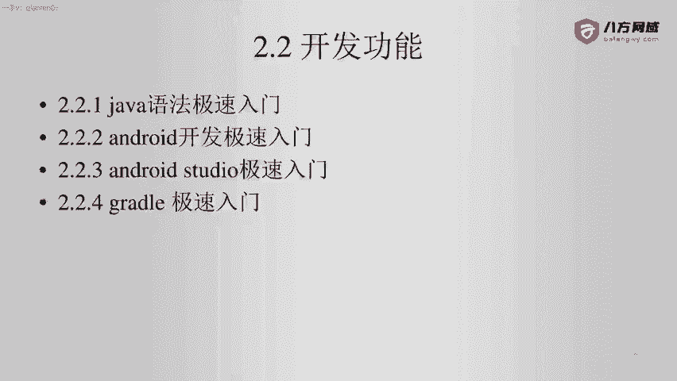
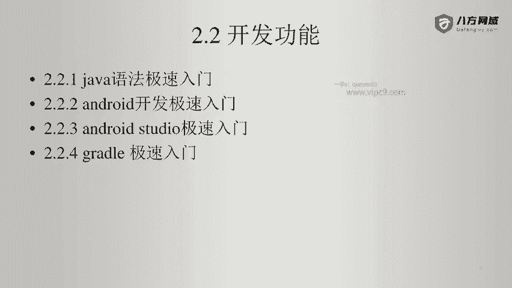
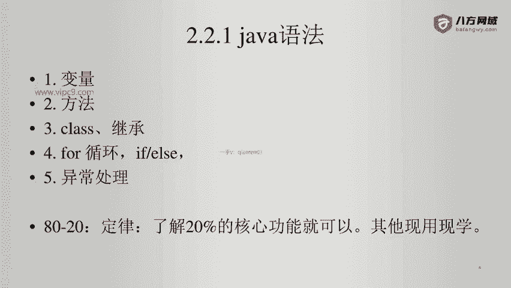

# Android逆向-基础篇：P8：3-1-Java语法概述 🚀

在本节课中，我们将要学习Java语法的核心概念。掌握这些基础知识是进行安卓正向开发和逆向分析的必要前提。我们将以极简的方式，聚焦于最核心、最常用的部分，帮助你快速理解Java代码的结构与含义。



上一节我们介绍了学习安卓逆向所需的正向知识框架，本节中我们来看看其中最基础也是最重要的一环——Java语法。

## 变量 📦

变量是程序中存储数据的基本单元。在Java中，使用变量前需要声明其类型。

以下是变量的核心概念：

*   **声明与赋值**：`数据类型 变量名 = 值;`
    *   例如：`int number = 10;` 或 `String text = "Hello";`
*   **基本数据类型**：包括`int`（整数）、`double`（浮点数）、`boolean`（布尔值）、`char`（字符）等。
*   **引用数据类型**：例如`String`（字符串）和各种`类`创建的对象。

## 方法 ⚙️

方法（或称为函数）是一段用于执行特定任务的代码块。方法可以接收输入参数，并可以返回一个结果。

以下是方法的核心结构：



```java
// 方法定义模板
访问修饰符 返回类型 方法名(参数类型 参数名, ...) {
    // 方法体：要执行的代码
    return 返回值; // 如果返回类型不是void
}

// 示例：一个相加的方法
public int add(int a, int b) {
    int sum = a + b;
    return sum;
}
```

## 类与对象 🏗️

类是创建对象的蓝图，它定义了对象的属性（变量）和行为（方法）。对象是类的具体实例。

以下是类的核心概念：

*   **类的定义**：使用`class`关键字。
*   **对象创建**：使用`new`关键字。
*   **构造函数**：一种特殊的方法，在创建对象时被调用，用于初始化对象。

```java
// 定义一个简单的Person类
public class Person {
    // 属性（变量）
    String name;
    int age;

    // 构造函数
    public Person(String name, int age) {
        this.name = name;
        this.age = age;
    }

    // 方法
    public void introduce() {
        System.out.println("我叫" + name + "，今年" + age + "岁。");
    }
}

// 创建并使用对象
Person person1 = new Person("小明", 20);
person1.introduce(); // 输出：我叫小明，今年20岁。
```

## 流程控制 🔄

流程控制语句用于控制程序执行的顺序，主要包括条件判断和循环。

以下是主要的流程控制语句：

*   **条件判断 (if-else)**：根据条件执行不同的代码块。
    ```java
    if (score >= 60) {
        System.out.println("及格");
    } else {
        System.out.println("不及格");
    }
    ```
*   **循环 (for, while)**：重复执行一段代码。
    ```java
    // for循环示例：打印数字0到4
    for (int i = 0; i < 5; i++) {
        System.out.println(i);
    }
    ```

## 异常处理 ⚠️

异常处理机制用于捕获和处理程序运行时可能出现的错误，保证程序的健壮性。



以下是异常处理的基本结构：

```java
try {
    // 尝试执行可能出错的代码
    int result = 10 / 0;
} catch (ArithmeticException e) {
    // 捕获并处理特定的异常（这里是除零错误）
    System.out.println("发生算术错误: " + e.getMessage());
} finally {
    // 无论是否发生异常，都会执行的代码（常用于清理资源）
    System.out.println("执行结束。");
}
```

本节课中我们一起学习了Java语法的五大核心组成部分：变量、方法、类与对象、流程控制以及异常处理。理解这些概念足以让你读懂大部分基础的Java代码，为后续的安卓开发与逆向分析打下坚实的基础。记住，对于更边缘或复杂的特性，我们可以遵循“用时再学”的原则。下一节，我们将开始安卓开发的极速入门。