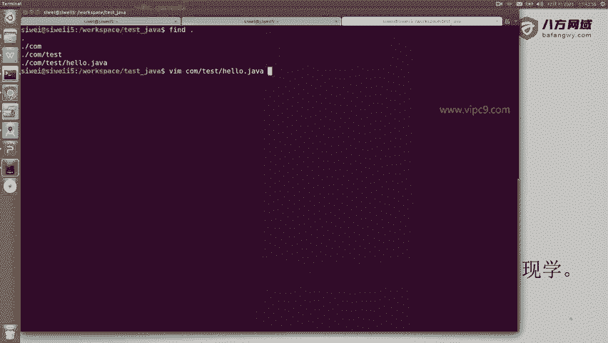
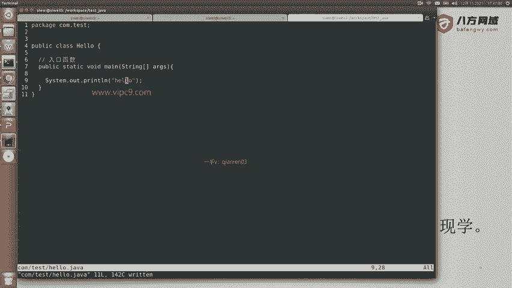
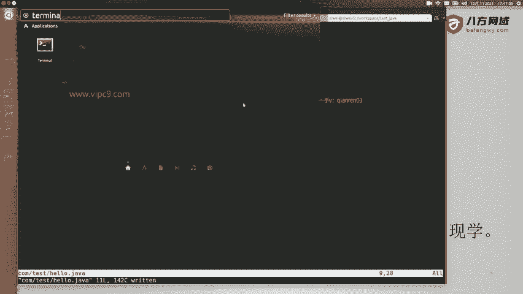
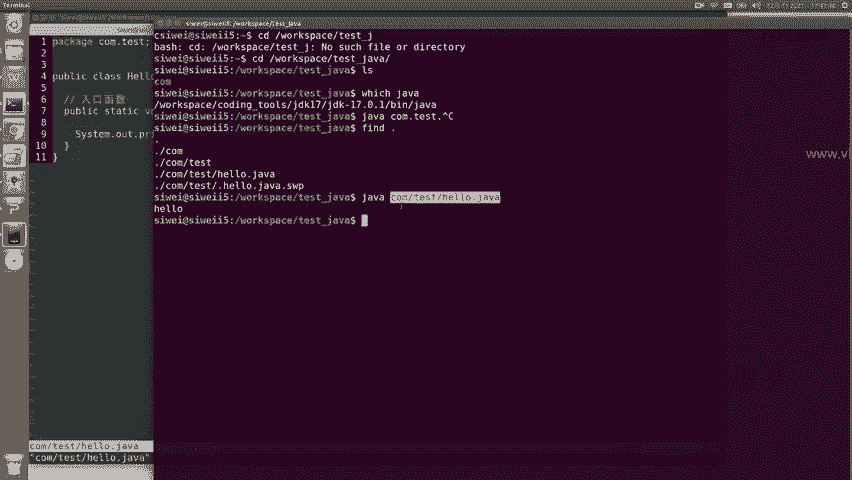
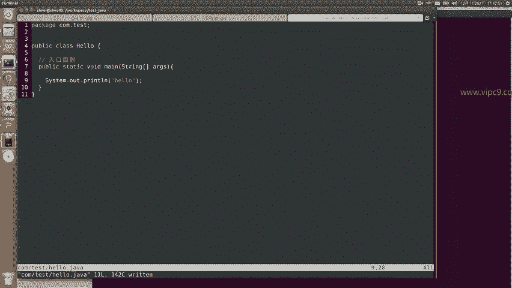
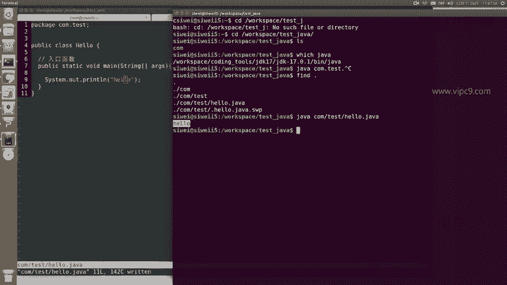
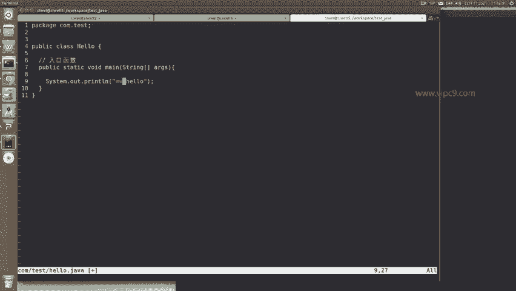
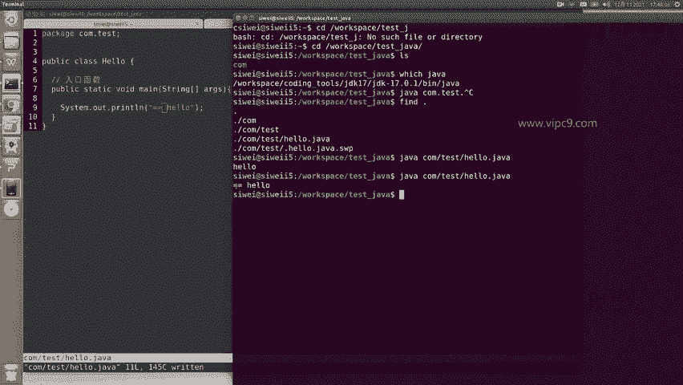
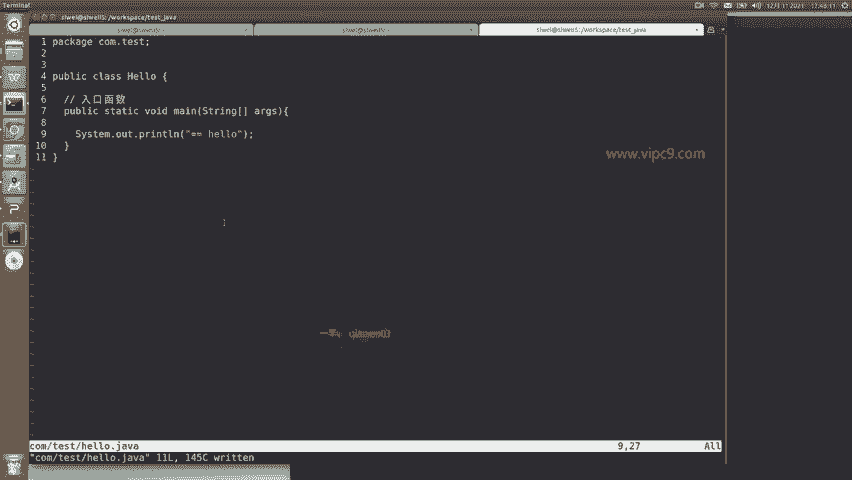

# Android逆向-基础篇：P9：3-2-Java语法Hello示例 👋

在本节课中，我们将通过一个简单的“Hello World”示例，学习Java程序的基本结构和运行方式。我们将从创建文件开始，逐步解析代码的每一部分，并最终运行程序。

---

## 概述



本节将通过一个具体的例子，演示如何编写并运行一个最简单的Java程序。我们将学习`package`、`class`、`main`方法等核心概念，并理解它们之间的关系。

---

## 创建项目与文件

首先，我们需要创建一个项目目录和Java源文件。

以下是创建步骤：

1.  打开命令行工具。
2.  创建一个名为 `test_java` 的文件夹。
3.  进入该文件夹。
4.  创建嵌套目录结构 `com/test`。
5.  在 `com/test` 目录下创建文件 `Hello.java`。

最终的文件路径应为：`test_java/com/test/Hello.java`。

---

## 解析Java代码

现在，让我们查看并分析 `Hello.java` 文件的内容。

```java
package com.test;

public class Hello {
    public static void main(String[] args) {
        System.out.println("Hello");
    }
}
```

上一节我们创建了文件，本节中我们来看看这段代码的具体含义。

### 包声明 (Package)

代码第一行是包声明：
```java
package com.test;
```
*   **`package`** 是Java关键字，中文翻译为“包”。
*   **`com.test`** 是包的名称。通常，包名使用公司或项目的域名倒序，例如 `com.baidu`、`com.qq`。这里我们使用 `com.test` 表示这是一个测试项目。
*   从编程逻辑角度看，包的主要作用是对类（`class`）进行分组和管理。**包名必须与文件所在的目录路径完全一致**。例如，包名为 `com.test`，那么源文件就必须放在 `com/test/` 目录下。

### 类定义 (Class)

接下来是类定义：
```java
public class Hello {
```
*   **`public`** 是访问修饰符，表示这个类是公开的，可以被其他类访问。
*   **`class`** 是定义类的关键字。
*   **`Hello`** 是我们为这个类起的名称。在Java中，一个 `.java` 源文件可以包含多个类，但**文件名必须与其中被 `public` 修饰的类名完全相同**。

### 主方法 (Main Method)

在类内部，我们定义了主方法：
```java
public static void main(String[] args) {
```
*   这是Java程序的**入口函数**。程序运行时，会从这里开始执行。
*   **`public`**：表示该方法是公开的。
*   **`static`**：表示该方法是静态的，无需创建类的实例即可调用。
*   **`void`**：表示该方法不返回任何值。
*   **`main`**：这是方法的固定名称。
*   **`String[] args`**：这是方法的参数，它是一个字符串数组，用于接收命令行传入的参数。

### 输出语句

在主方法内部，我们有一行执行输出的代码：
```java
System.out.println("Hello");
```
*   **`System`** 是一个内置的Java类。
*   **`out`** 是 `System` 类中的一个静态成员（是一个 `PrintStream` 对象）。
*   **`println`** 是 `out` 对象的一个方法，用于输出一行文本，并在末尾自动换行。
*   **`"Hello"`** 是传递给 `println` 方法的字符串参数，即要打印的内容。



---



## 编译与运行程序

理解了代码结构后，我们来运行这个程序。

以下是运行步骤：

1.  确保已安装Java运行环境（JRE）或开发工具包（JDK）。可以在命令行输入 `java -version` 检查。
2.  在命令行中，进入 `test_java` 目录。
3.  使用 `java` 命令直接运行源文件。现代Java版本支持直接运行单个源文件，前提是文件中包含 `main` 方法。
    ```bash
    java com/test/Hello.java
    ```
4.  执行后，命令行将输出：`Hello`。

### 修改与验证



我们可以轻松修改输出内容来验证程序。例如，将代码中的 `"Hello"` 改为 `"Hello World!!"`：



```java
System.out.println("Hello World!!");
```



保存文件后，再次执行 `java com/test/Hello.java` 命令，输出将变为：
```
Hello World!!
```

这个过程展示了Java程序从编写、修改到运行的完整流程。



---



## 总结

本节课中我们一起学习了Java程序的基础：
1.  我们创建了一个标准的Java项目目录结构。
2.  我们编写了一个包含 `package` 声明、`public class` 定义以及 `main` 入口方法的完整Java源文件。
3.  我们详细解析了 `package`、`class`、`public static void main(String[] args)` 和 `System.out.println()` 这些核心概念的作用。
4.  最后，我们使用 `java` 命令直接运行了 `.java` 源文件，并验证了修改代码后的效果。



这个“Hello World”示例是理解任何Java程序的起点，其中涉及的结构和概念在后续更复杂的Android逆向分析中会反复出现。