# BIT NSC暑期培训2023：lec04：Web安全基础入门 🚀


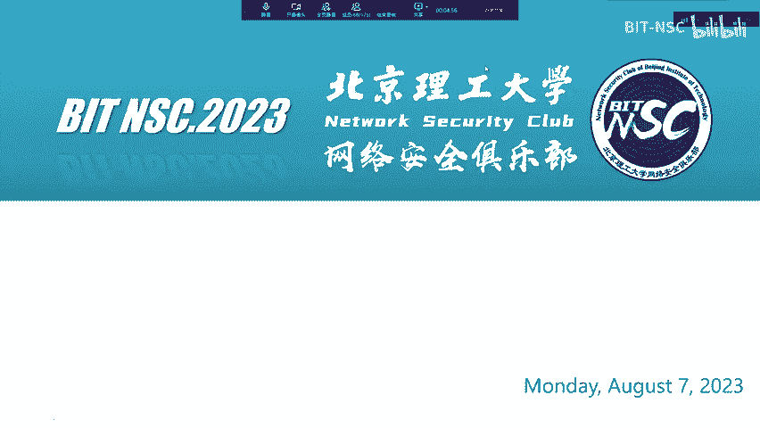

在本节课中，我们将要学习CTF中Web安全方向的基础知识，包括HTTP/HTTPS协议、URL结构、以及几种常见的Web漏洞类型（如命令执行、SQL注入、XSS等）的基本概念和简单示例。课程旨在为初学者提供一个清晰、直观的入门指引。

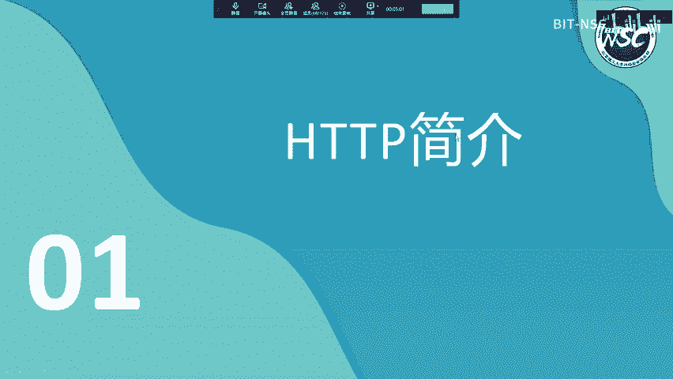

## 概述：什么是CTF中的Web安全？

Web安全是CTF竞赛中的一个重要门类。其题型通常表现为给出一个Web网站，要求参赛者利用题目中的信息找到隐藏的`flag`字符串。整个过程类似于渗透测试的某个环节。

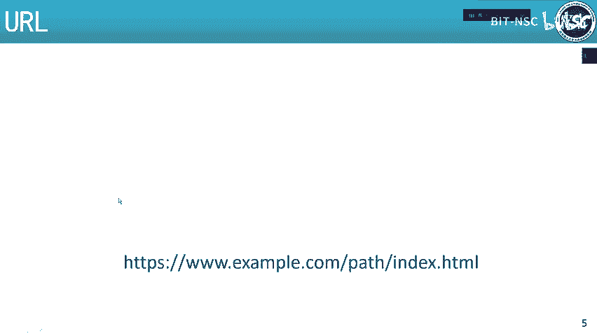


Web安全涉及的前置知识广泛，包括PHP、Python、JavaScript、SQL数据库查询语言、Apache/Nginx等服务器配置等。本次课程将聚焦于最基础的部分。

---

## HTTP/HTTPS协议基础 🌐

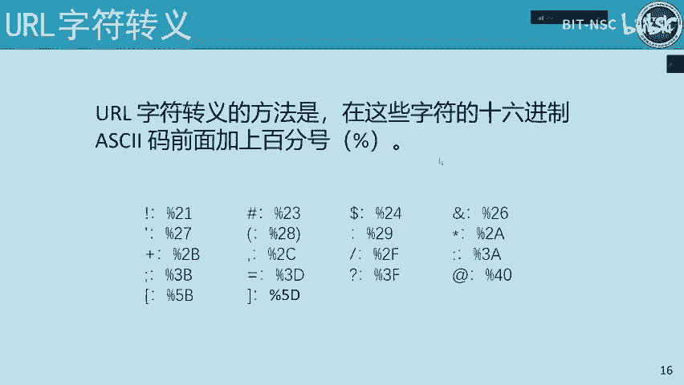

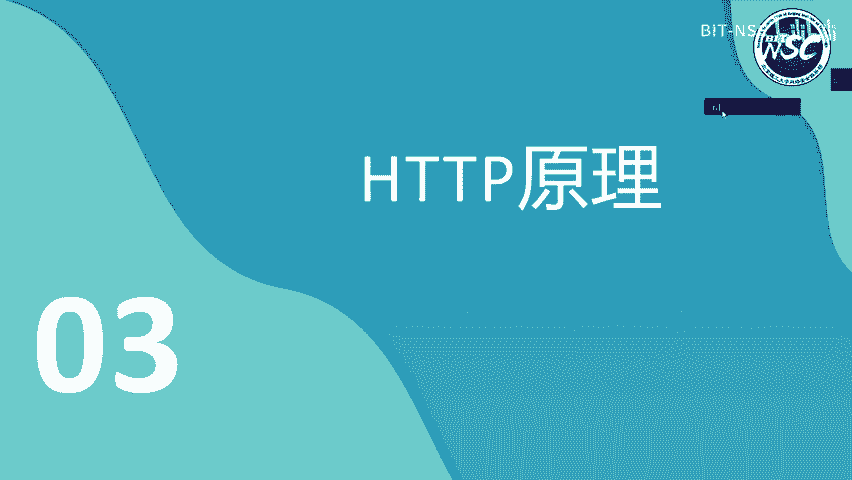

上一节我们介绍了CTF-Web的整体概念，本节中我们来看看Web通信的基石——HTTP/HTTPS协议。

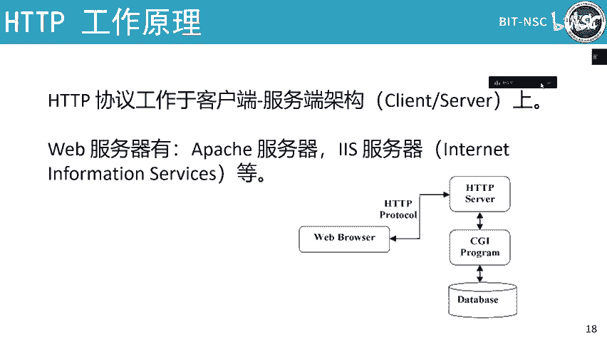

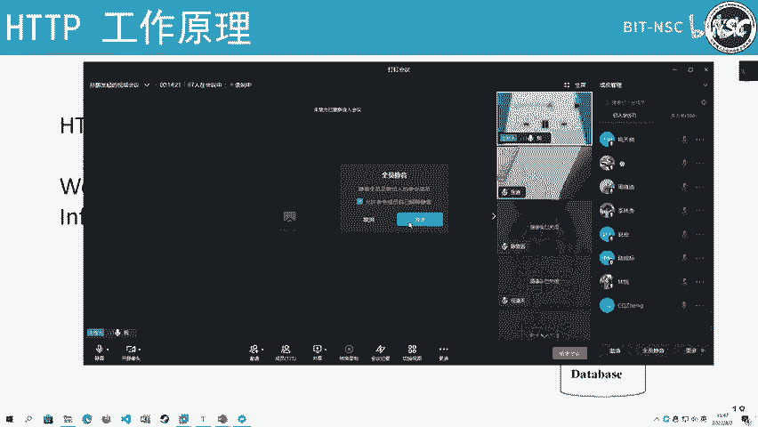

### 什么是HTTP协议？

**HTTP**（超文本传输协议）是互联网上应用最为广泛的一种网络协议，用于客户端和服务器之间的通信。其URL通常以 `http://` 开头。

**HTTPS** 是HTTP的安全版本，在HTTP基础上增加了SSL/TLS加密层和证书认证机制，URL以 `https://` 开头。它默认使用**443端口**，而HTTP默认使用**80端口**。

访问网站时，如果浏览器提示“连接不安全”，通常是因为该网站使用了HTTP协议或HTTPS证书存在问题。

### 统一资源定位符（URL）

URL用于定位互联网上的资源。一个完整的URL示例如下：
```
http://www.example.com:80/path/to/myfile.html?key1=value1&key2=value2#anchor
```
其组成部分如下：
*   **协议**：`http://`
*   **主机地址**：`www.example.com`
*   **端口**：`:80`（HTTP默认端口，常省略）
*   **路径**：`/path/to/myfile.html`
*   **查询参数**：`?key1=value1&key2=value2`（以`?`开头，`&`连接多个参数）
*   **锚点**：`#anchor`（用于定位页面内的特定位置）

URL中只能使用特定字符（字母、数字、`-`、`.`、`_`）。其他字符（如中文、空格）需要进行**URL编码**（或称百分号编码），例如空格被编码为`%20`。

### HTTP报文原理

HTTP基于经典的**客户端-服务器（C/S）** 架构。一次完整的请求流程如下：
1.  客户端（如浏览器）发送一个**HTTP请求报文**。
2.  服务器接收并处理请求，然后返回一个**HTTP响应报文**。

一个简单的HTTP请求报文结构如下：
```http
GET /index.html HTTP/1.1
Host: www.example.com
User-Agent: Mozilla/5.0
...
```
其中`GET`是**请求方法**，常见的有：
*   **GET**：请求资源，参数附在URL后。
*   **POST**：提交数据，参数放在请求体中。

服务器响应的第一行包含**状态码**，用于表示请求结果：
*   **200 OK**：请求成功。
*   **301/302**：重定向。
*   **404 Not Found**：请求的资源不存在。
*   **500 Internal Server Error**：服务器内部错误。

---

## CTF-Web常见漏洞类型 ⚠️

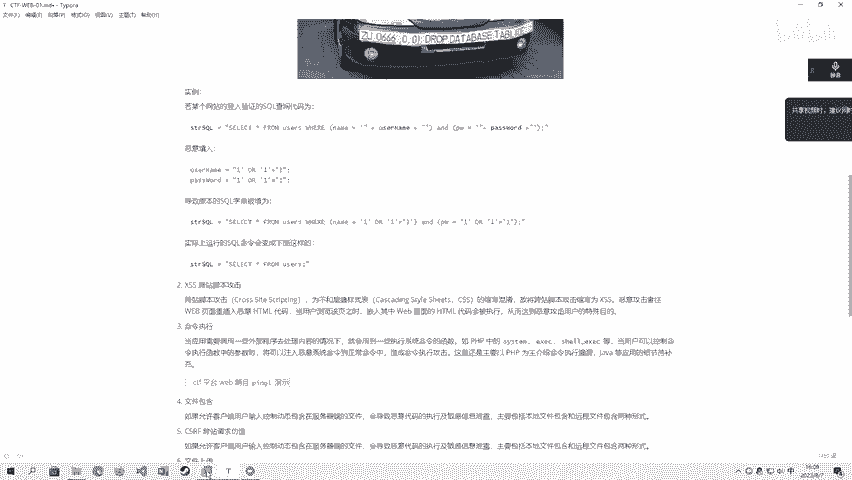

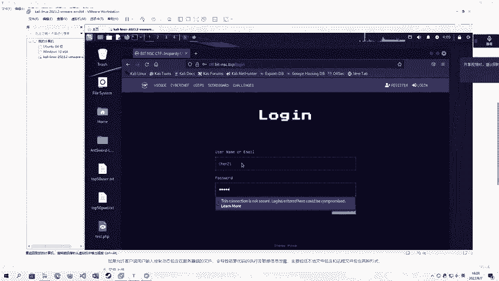

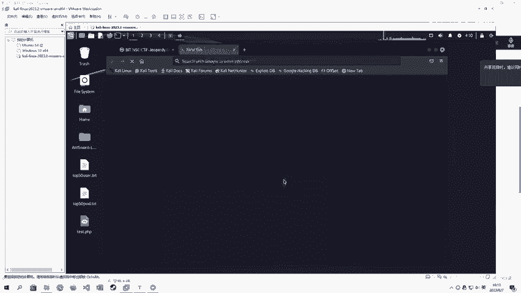

了解了Web通信的基础后，我们来看看CTF中常见的几种Web漏洞类型。

### 1. SQL注入

**SQL注入**是Web中最经典的漏洞类型之一。它发生在应用程序将用户输入**直接拼接**到SQL查询语句中时，攻击者可以构造特殊输入来改变原查询逻辑，从而窃取、篡改或删除数据库数据。

**核心问题**：对用户输入过于信任，未做过滤。

**示例**：
假设登录验证的SQL语句如下：
```sql
SELECT * FROM users WHERE name='$name' AND password='$password'
```
如果用户输入用户名为 `admin' --`，密码任意，则语句变为：
```sql
SELECT * FROM users WHERE name='admin' --' AND password='xxx'
```
`--`在SQL中表示注释，这使得密码验证条件失效，只要用户名`admin`存在即可登录成功。

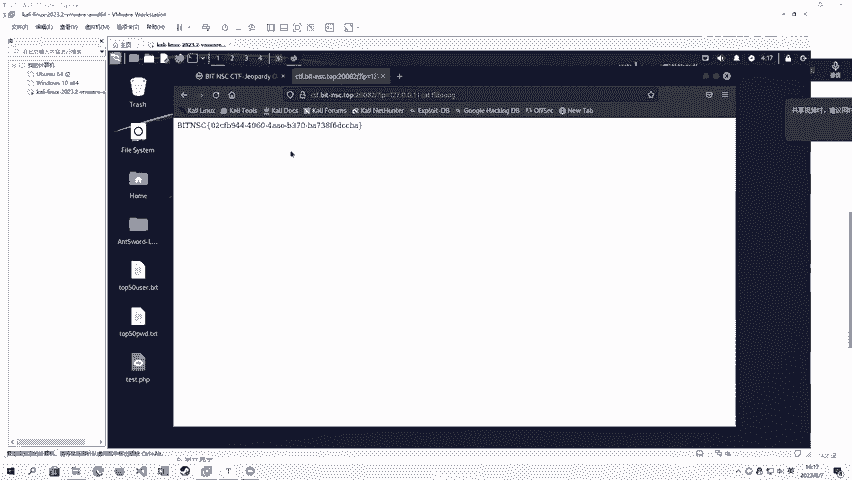

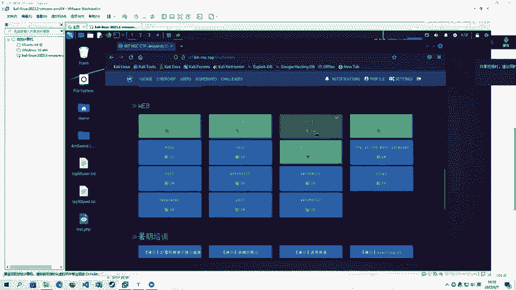

### 2. 跨站脚本攻击（XSS）

**XSS** 全称跨站脚本攻击（Cross-Site Scripting）。攻击者通过在Web页面中插入恶意脚本，当其他用户浏览该页面时，脚本会在其浏览器中执行。

**危害**：盗取用户Cookie、会话令牌，进行钓鱼攻击，篡改页面内容等。

**示例**：
在一个评论框输入：
```html
<script>alert('XSS测试')</script>
```
如果网站未对输入进行过滤，那么其他用户加载此评论页面时就会弹出一个显示“XSS测试”的警告框。

### 3. 命令执行

**命令执行**漏洞是指应用程序调用了系统命令（如`ping`、`ls`等），但未对用户输入进行严格过滤，导致攻击者可以注入并执行任意系统命令。

**示例**：
一个网站提供`ping`功能，代码如下：
```php
$ip = $_GET['ip'];
system("ping -c 4 " . $ip);
```
正常输入：`?ip=127.0.0.1`
恶意输入：`?ip=127.0.0.1; ls`
此时执行的命令变为 `ping -c 4 127.0.0.1; ls`，分号`;`使得`ls`命令也被执行，从而泄露服务器目录信息。

### 4. 文件上传漏洞

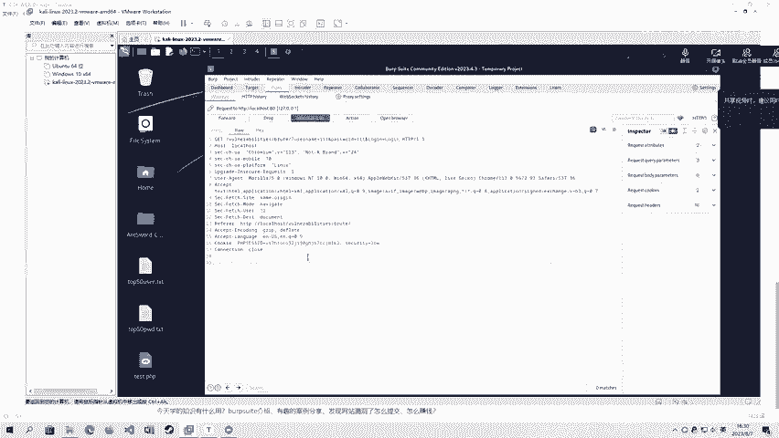

**文件上传漏洞** 指网站对用户上传的文件类型、内容检查不严，导致攻击者可以上传恶意文件（如Webshell），从而获取服务器控制权。

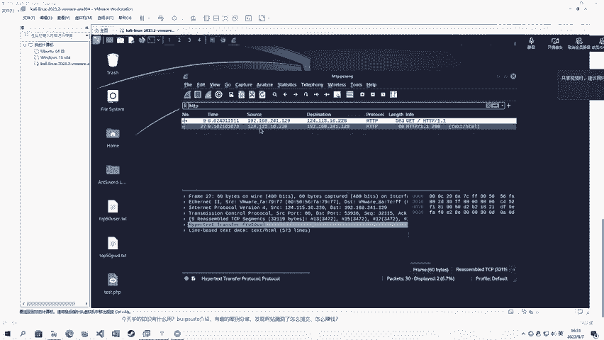

**危害**：攻击者上传一个一句话木马文件，即可通过工具连接，在目标服务器上执行任意命令。

### 5. 其他漏洞类型
*   **文件包含**：程序动态包含文件时，未对包含的文件名进行限制，可能导致恶意代码执行或敏感文件泄露。
*   **CSRF**：跨站请求伪造，诱使用户在已登录的状态下，执行非本意的操作（如转账、改密）。
*   **SSRF**：服务器端请求伪造，利用服务器作为代理，攻击内网或其他系统。

---

## 实战演练：DVWA靶场体验 🎯

理论学习后，我们通过DVWA（Damn Vulnerable Web Application）靶场进行简单实践。DVWA是一个专为安全人员练习用的、包含多种漏洞的Web应用。

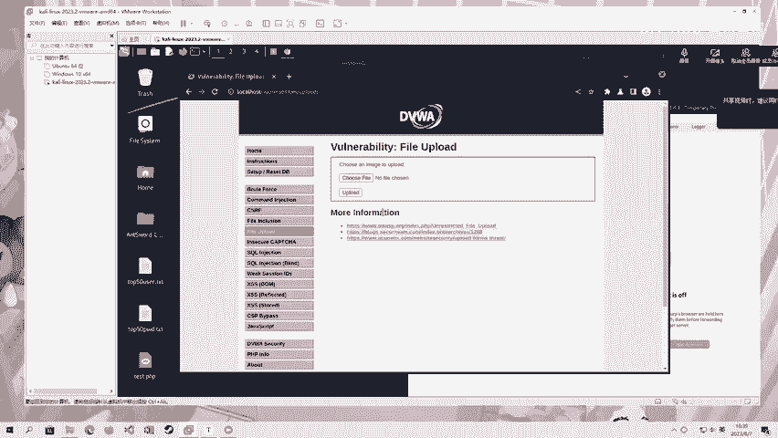

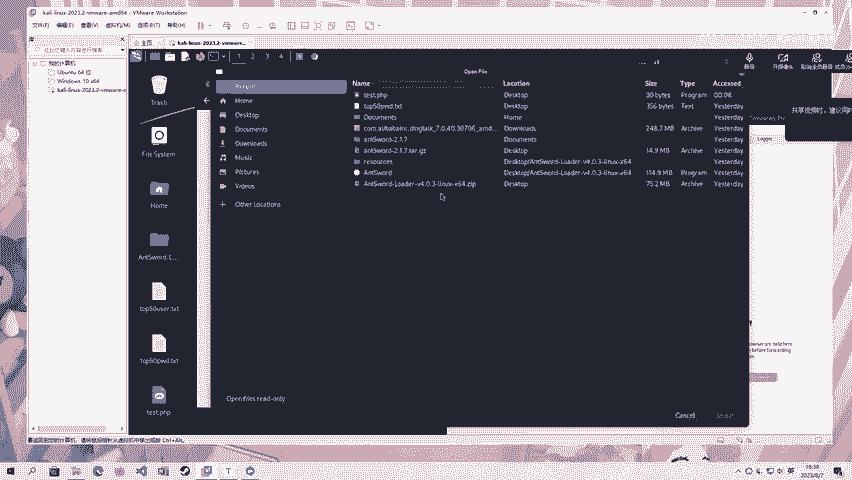

以下是几个简单的漏洞利用演示：

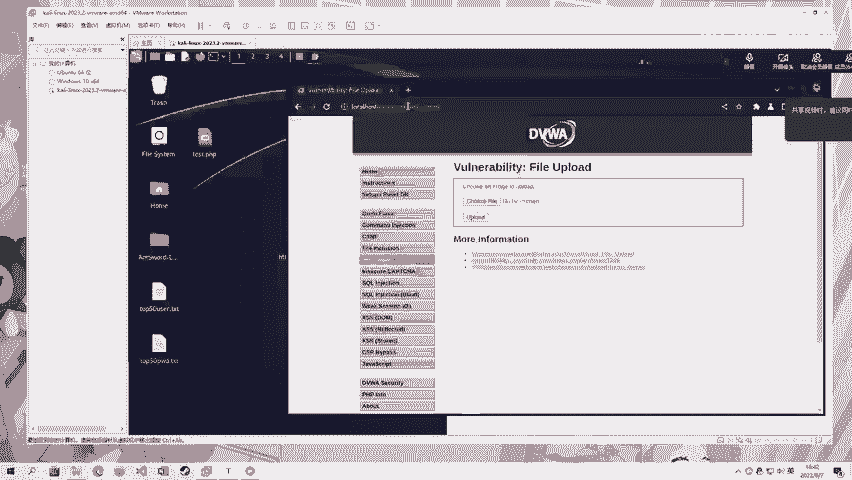

### 1. 暴力破解
在DVWA的Brute Force模块，安全级别设为`Low`。使用Burp Suite工具拦截登录请求，并将其发送到Intruder模块，对用户名和密码字段进行字典爆破，通过响应长度差异判断登录成功与否。

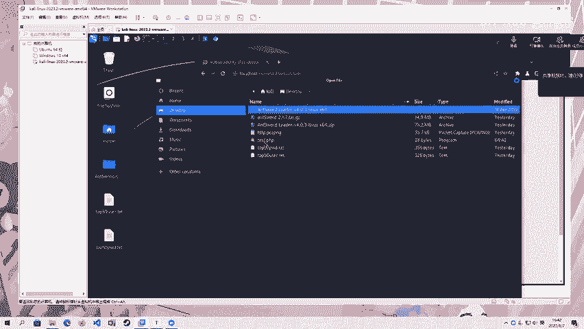

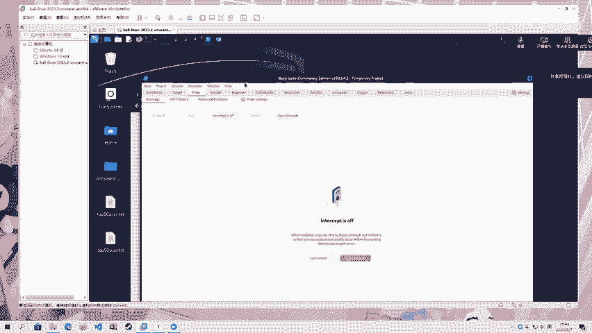

### 2. 命令注入
在Command Injection模块，输入`127.0.0.1 && ls`。`&&`表示前一条命令执行成功则执行后一条。这样既能执行`ping`，又能列出当前目录文件，验证命令执行漏洞。

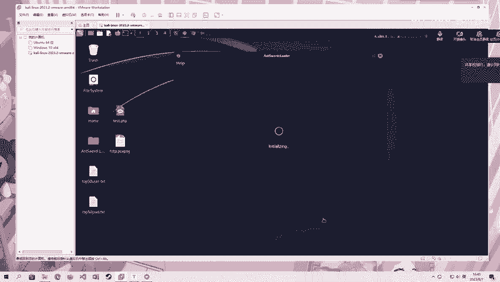

### 3. 文件上传漏洞
1.  在桌面创建一个一句话木马文件`shell.php`：
    ```bash
    echo '<?php @eval($_POST["key"]);?>' > shell.php
    ```
2.  在DVWA的File Upload模块（`Low`级别）上传该文件。
3.  使用“中国蚁剑”等连接工具，填写文件上传地址和连接密码`key`，即可成功连接并获得服务器文件管理权限。

### 4. 反射型XSS
在XSS (Reflected)模块，在输入框提交：
```html
<script>alert('test')</script>
```
页面会直接弹出警告框，证明存在XSS漏洞。

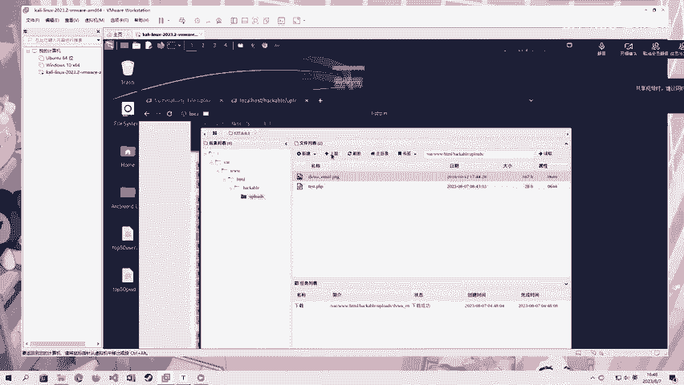

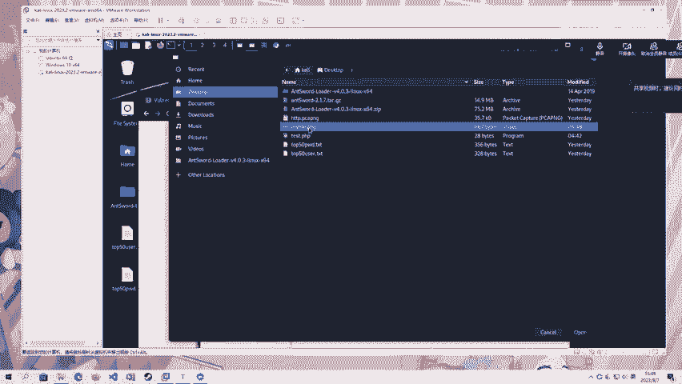

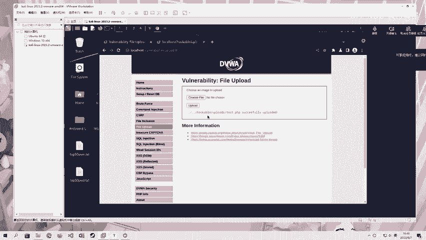

---

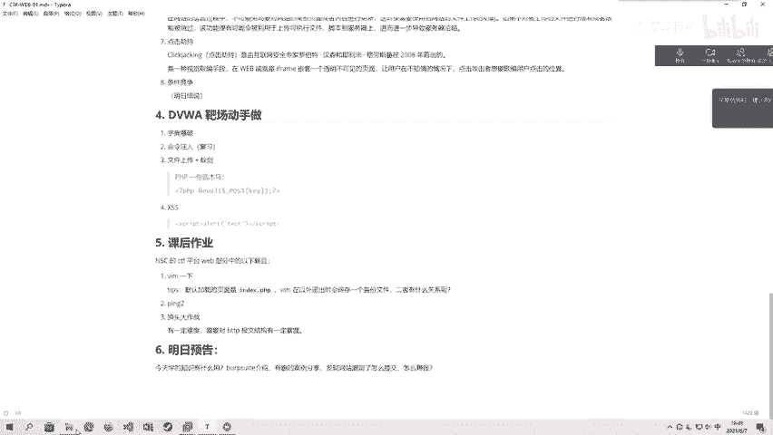


## 总结与作业 📚

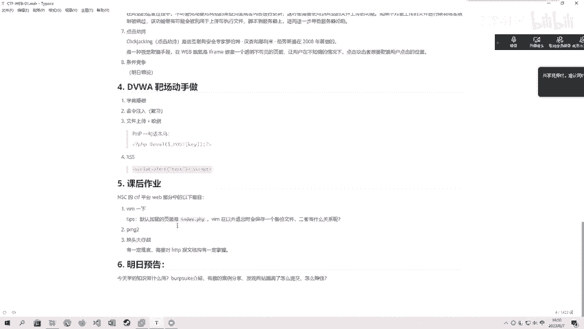

本节课中我们一起学习了Web安全的基础知识。我们首先了解了HTTP/HTTPS协议和URL的构成，这是理解Web通信的基础。接着，我们探讨了CTF中几种常见的Web漏洞，包括SQL注入、XSS、命令执行和文件上传漏洞的原理与简单示例。最后，我们通过DVWA靶场进行了初步的实战体验。

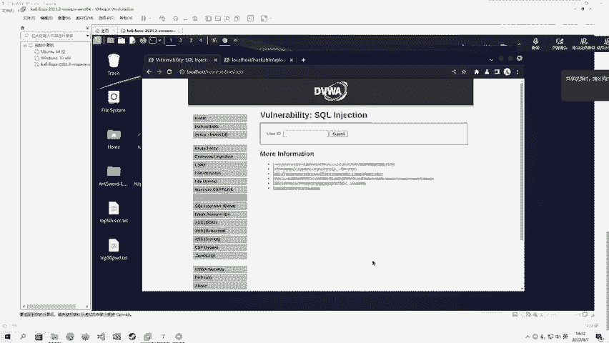

**课后作业**：
1.  **命令执行进阶**：完成NSC平台上的`web01-ping2`题目，尝试绕过简单的过滤。
2.  **HTTP协议实践**：完成`web01-签到`题目，理解HTTP请求与响应。
3.  **脑洞挑战**：尝试解决`web01-套娃`题目，它需要你灵活运用关于HTTP标头的知识。

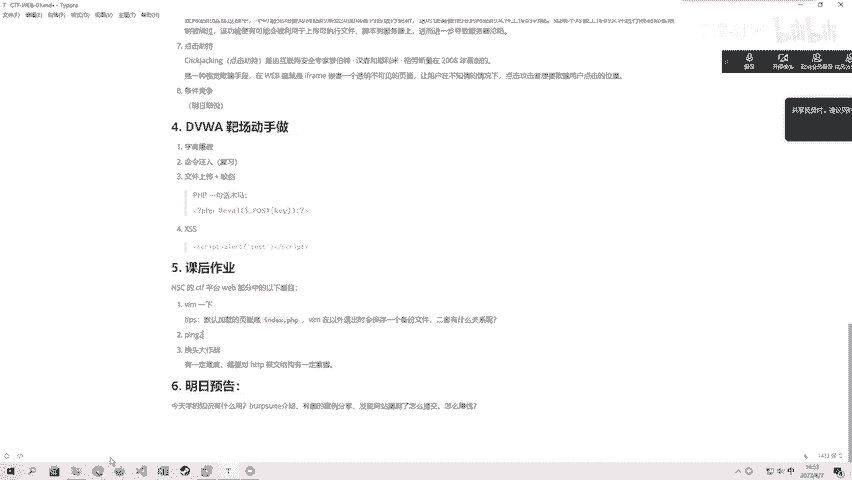

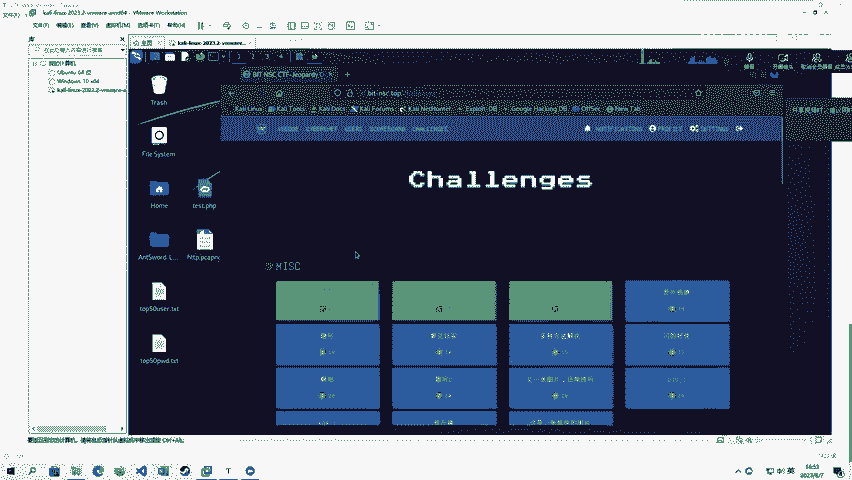

**下节预告**：明天我们将更深入地探讨Web安全工具（如Burp Suite）的使用，分享一些真实有趣的漏洞案例，并讨论如何合法地提交漏洞报告及相关的安全生态。

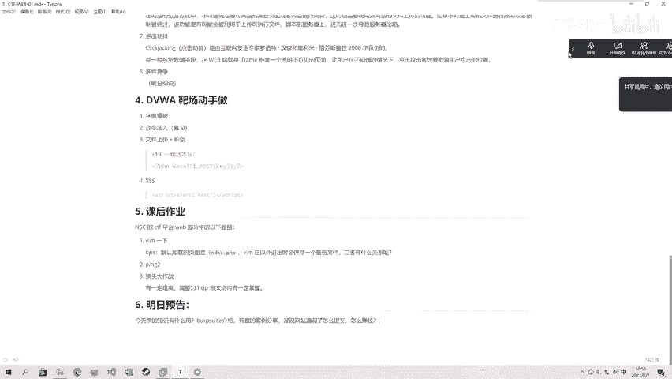

---
*请同学们在课后积极动手实践，巩固所学知识。遇到问题欢迎在课程群内讨论。*