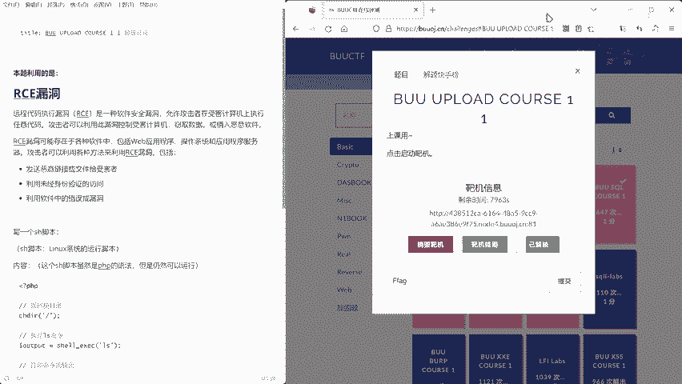
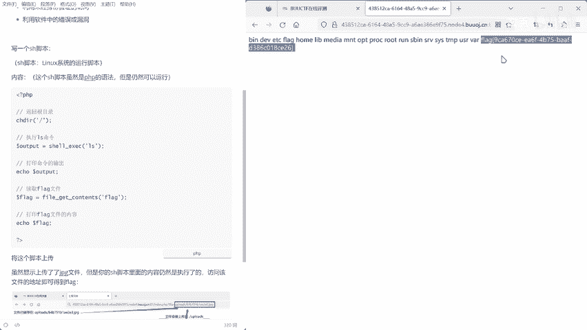
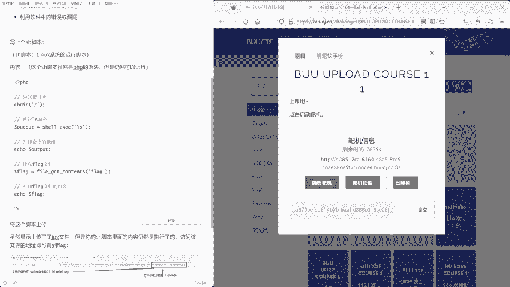

# 文件上传漏洞入门：1.1：基础概念与绕过方法

在本节课中，我们将要学习文件上传漏洞的基础概念，并了解一种常见的客户端验证绕过方法。文件上传功能是Web应用中常见的交互方式，但如果实现不当，就可能成为攻击者入侵系统的入口。

## 什么是文件上传漏洞？

上一节我们介绍了课程目标，本节中我们来看看文件上传漏洞的定义。

文件上传漏洞是指Web应用程序在处理用户上传文件时，未对文件进行充分的安全检查（如类型、内容、后缀名等），导致攻击者能够上传恶意文件（如Webshell）到服务器，从而获取系统控制权或执行任意代码。

## 客户端验证及其局限性

在深入探讨绕过方法前，我们需要理解一种常见的安全措施——客户端验证。

客户端验证通常指通过JavaScript在用户的浏览器端对上传的文件进行检查。例如，检查文件的后缀名是否为允许的图片格式（如.jpg, .png）。这种方法的优点是响应迅速，用户体验好。

然而，客户端验证存在一个根本性的安全缺陷：**它完全依赖于用户浏览器的执行环境，攻击者可以轻易地绕过或篡改验证逻辑**。服务器无法确认客户端提交的数据是否通过了真实的验证流程。

## 如何绕过客户端验证？

上一节我们介绍了客户端验证的局限性，本节中我们来看看一种具体的绕过方法。

由于客户端验证依赖于浏览器执行的JavaScript代码，攻击者可以通过多种方式使其失效。最直接的方法之一是禁用浏览器的JavaScript执行功能。

以下是具体操作步骤：

1.  打开浏览器的开发者工具（通常按F12键）。
2.  进入“设置”或“Preferences”菜单。
3.  找到禁用JavaScript的选项并勾选。
4.  刷新网页，此时页面上的所有JavaScript代码将不再运行。

完成此操作后，网页中原有的客户端文件类型验证将完全失效。此时，攻击者可以尝试上传任何类型的文件，包括恶意的PHP、ASP等脚本文件。

## 核心安全原则

绕过客户端验证的方法揭示了Web安全中的一个核心原则：

**所有来自客户端的输入都是不可信的，必须在服务器端进行严格验证。**

这个原则可以用一个简单的公式来表达：

**有效安全 = 服务器端验证(客户端输入)**

仅仅依赖客户端验证等同于没有安全防护。服务器端必须对上传文件的**文件类型（MIME Type）、文件内容、文件后缀名**等进行多重、严格的检查。

本节课中我们一起学习了文件上传漏洞的基础概念。我们了解到，客户端验证（如JavaScript检查）极易被绕过，不能作为唯一的安全依赖。真正的安全必须建立在服务器端对用户上传文件进行严格、多重验证的基础上。在后续课程中，我们将探讨更多服务器端的验证机制及其绕过方法。