# BUUCTF SQL注入课程：1：SQL注入基础与联合查询注入入门

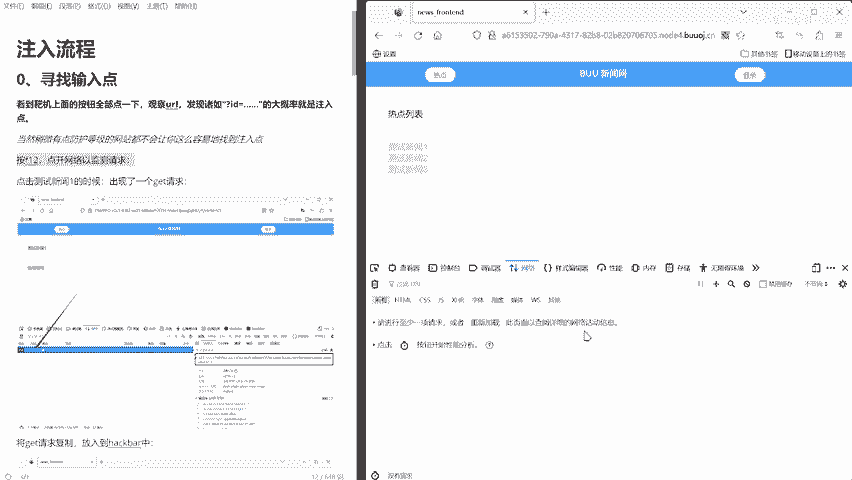

在本节课中，我们将要学习SQL注入攻击的基础知识，并重点掌握联合查询注入的原理、步骤和实战方法。课程内容将从SQL注入的基本概念讲起，逐步深入到如何利用联合查询获取数据库信息。

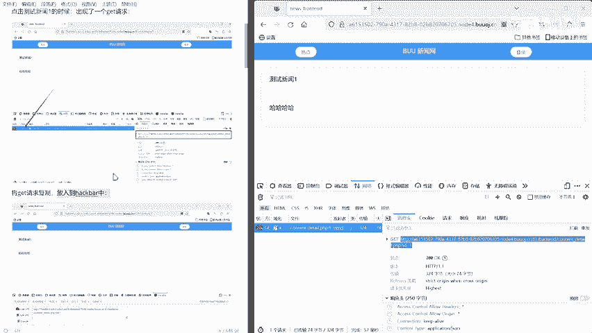

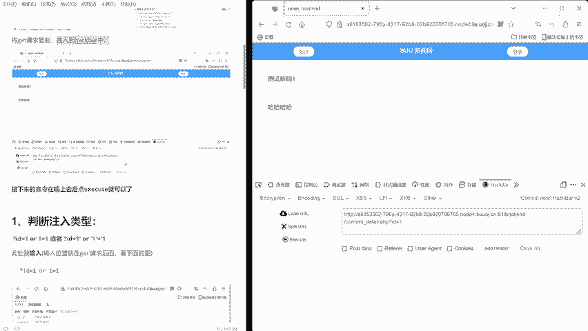

## 概述

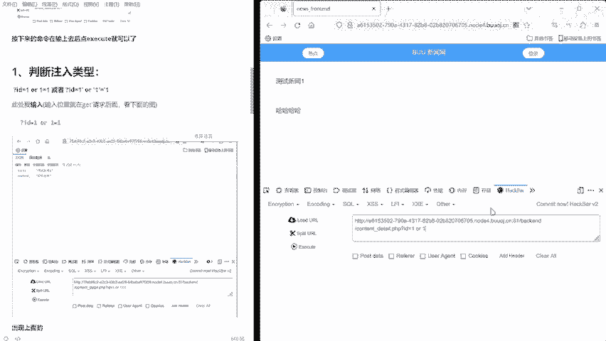

SQL注入是一种常见的Web安全漏洞，攻击者通过在用户输入中插入恶意的SQL代码，欺骗后端数据库执行非预期的命令。本节课将聚焦于联合查询注入，这是一种利用SQL `UNION` 操作符从数据库检索额外信息的技术。

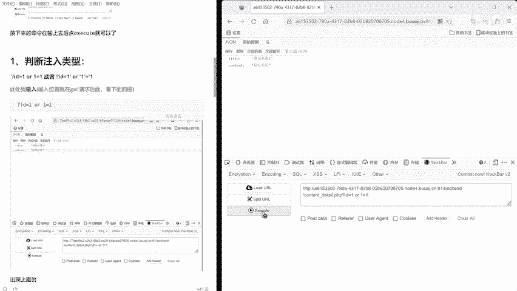

## 什么是SQL注入

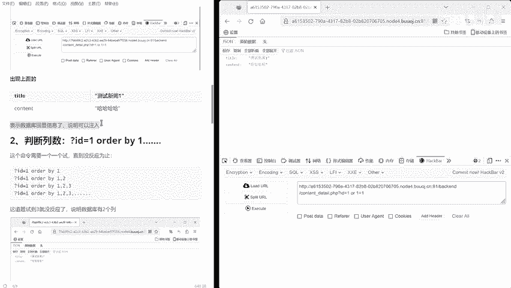

SQL注入发生在应用程序将用户输入直接拼接到SQL查询语句中，且未进行充分过滤或转义时。这使得攻击者能够修改原始查询的逻辑。

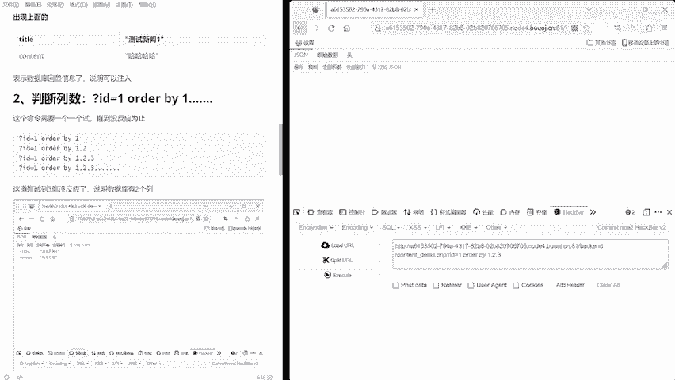

其核心原理是：**利用单引号 `‘` 等字符闭合原查询语句，并插入额外的SQL代码**。

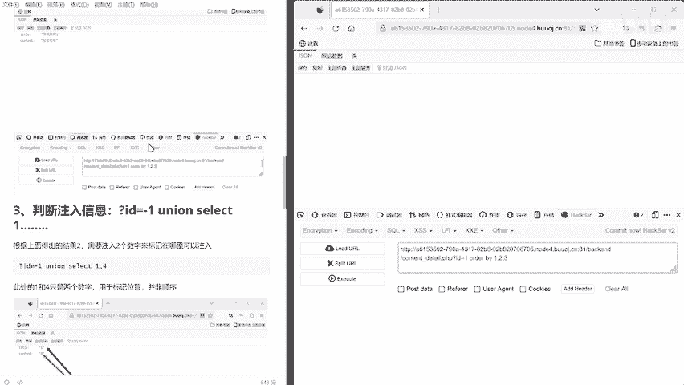

例如，一个登录查询的原始语句可能是：
```sql
SELECT * FROM users WHERE username = ‘输入的用户名’ AND password = ‘输入的密码’
```
如果用户名输入为 `admin‘ -- `，那么查询语句就变成了：
```sql
SELECT * FROM users WHERE username = ‘admin’ -- ’ AND password = ‘...’
```
`--` 在SQL中表示注释，这使得密码检查条件被注释掉，攻击者可能仅凭用户名就登录成功。

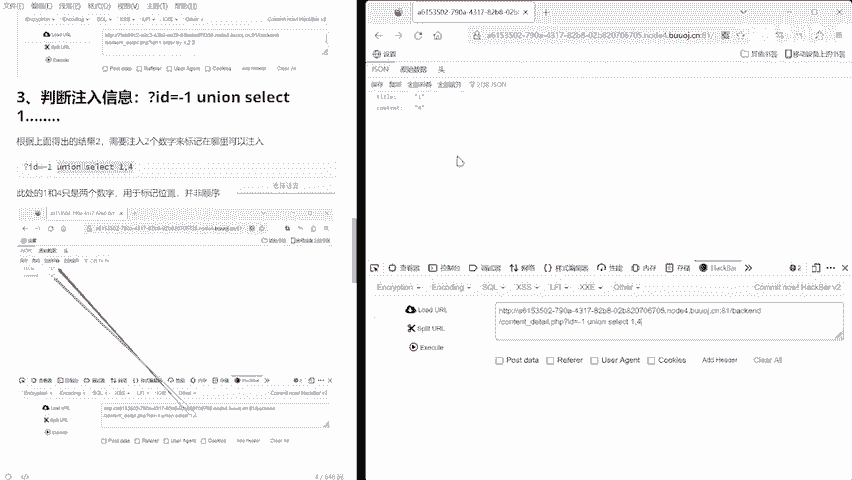

## 联合查询注入详解

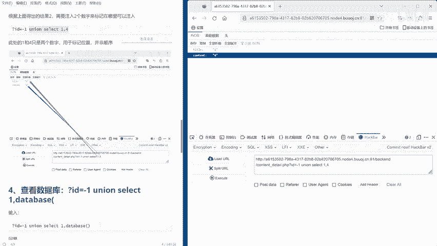

上一节我们介绍了SQL注入的基本概念，本节中我们来看看联合查询注入的具体方法。联合查询注入的核心是利用 `UNION` 操作符，将我们构造的查询结果拼接到原始查询结果之后，从而从数据库中获取额外信息。

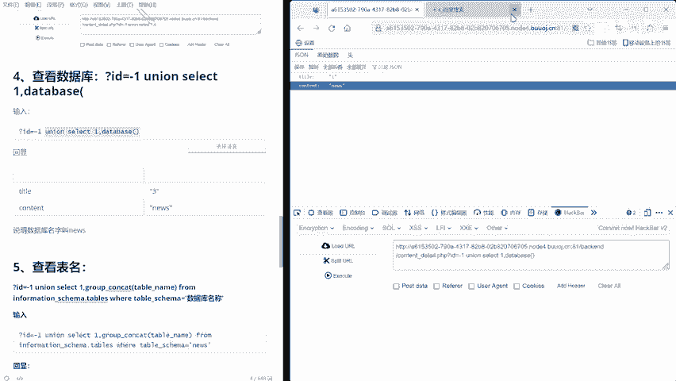

`UNION` 操作符用于合并两个或多个 `SELECT` 语句的结果集，但有一个关键要求：每个 `SELECT` 语句必须拥有相同数量的列，且列的数据类型也需要兼容。

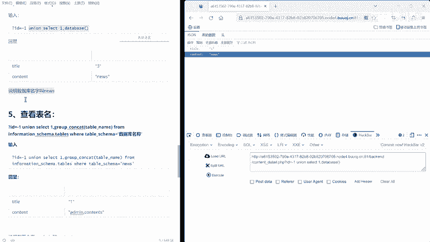

### 联合查询注入步骤

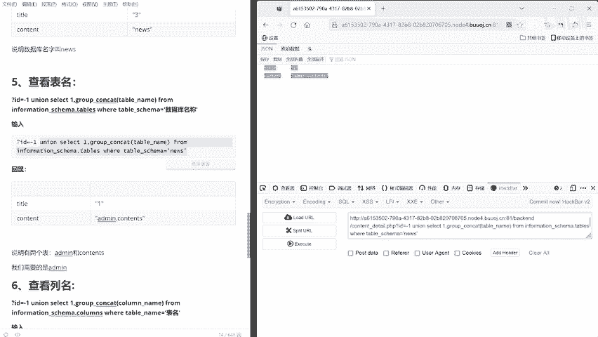

以下是进行联合查询注入的一般步骤流程：

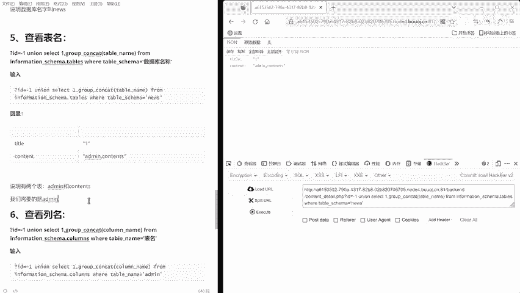

1.  **判断注入点**：确认参数是否存在SQL注入漏洞。常用方法是在参数后添加 `‘`、`“` 等字符，观察页面返回是否出现数据库报错信息。
2.  **判断字段数**：确定当前查询的 `SELECT` 语句包含多少列。通常使用 `ORDER BY` 子句递增列索引来测试，直到页面返回错误。
    *   例如：`?id=1‘ order by 1 --+`， `?id=1‘ order by 2 --+` ... 当 `order by 5` 报错时，说明字段数为4。
3.  **判断回显位**：确定查询结果中哪些列的内容会显示在网页上。使用 `UNION SELECT` 构造一个包含连续数字或字符串的查询，观察页面显示内容。
    *   例如：`?id=-1‘ union select 1， 2， 3， 4 --+`。页面中显示的数字位置就是回显位。
4.  **获取数据库信息**：利用回显位，替换查询语句中的数字，来获取数据库名、表名、列名等敏感信息。
    *   例如：`?id=-1‘ union select 1， database()， 3， 4 --+` 可以获取当前数据库名称。
5.  **提取目标数据**：在获知表名和列名后，从目标表中查询具体的数据内容（如用户名、密码）。
    *   例如：`?id=-1‘ union select 1， username， password， 4 from admin --+`。

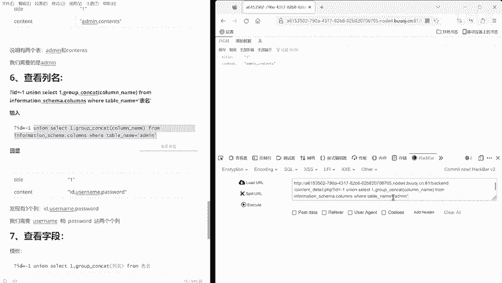

### 关键函数与语句

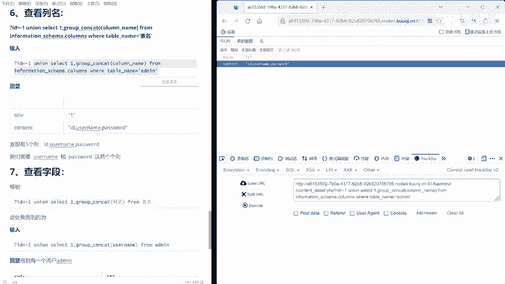

在联合查询注入过程中，会频繁使用到一些特定的数据库函数和查询语句来获取信息结构。

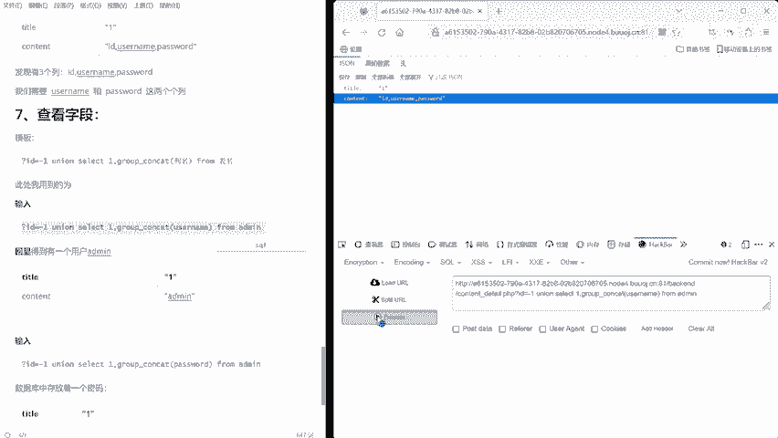

以下是MySQL数据库中常用的信息查询语句：

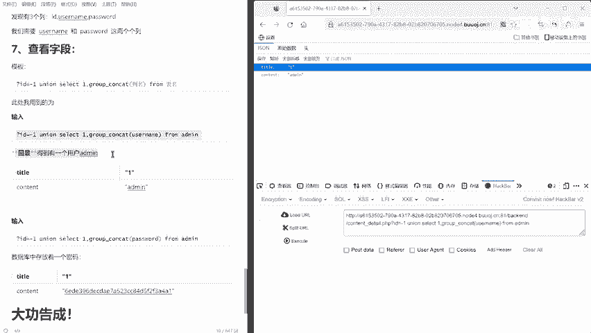

*   `database()`：返回当前数据库名称。
*   `version()`：返回数据库版本信息。
*   `user()`：返回当前数据库用户。
*   `@@datadir`：返回数据库存储路径。
*   `group_concat(...)`：将同一分组中的多个值连接成一个字符串，常用于一次性列出所有表名或列名。
*   `information_schema` 数据库：这是MySQL的系统数据库，存储了所有其他数据库的元数据（如表、列信息）。
    *   查询所有数据库名：`SELECT group_concat(schema_name) FROM information_schema.schemata`
    *   查询指定数据库（如 `security`）的所有表名：`SELECT group_concat(table_name) FROM information_schema.tables WHERE table_schema=‘security’`
    *   查询指定表（如 `users`）的所有列名：`SELECT group_concat(column_name) FROM information_schema.columns WHERE table_name=‘users’`

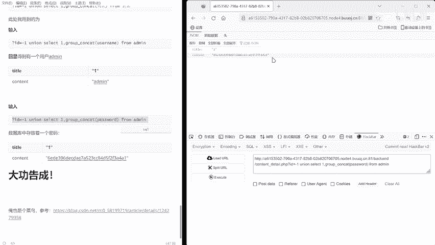

## 总结

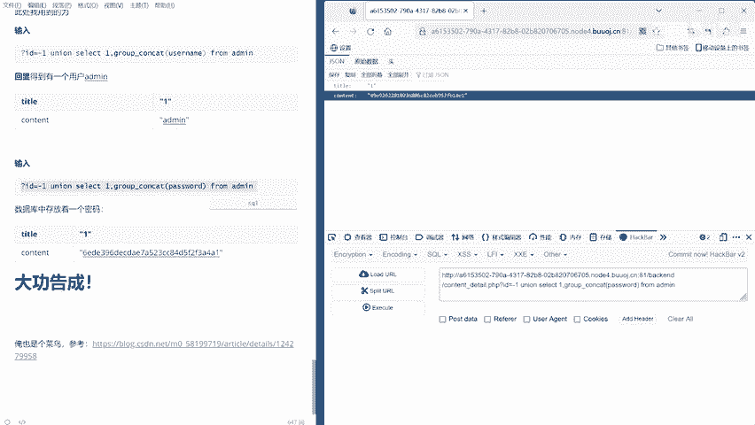

本节课中我们一起学习了SQL注入的基础原理和联合查询注入的完整流程。我们了解到，SQL注入的本质是**控制输入以改变查询逻辑**，而联合查询注入是通过 `UNION` 操作符**扩展查询结果**来窃取数据。关键步骤包括判断字段数、寻找回显位，并利用 `information_schema` 数据库逐步获取数据库名、表名、列名，最终提取出敏感数据。掌握这些基础知识是进行SQL注入安全测试和防御的前提。