# BUUCTF-Crypto-Alice与Bob：P1：RSA大数分解与MD5哈希

在本教程中，我们将学习如何解决一道典型的CTF密码学挑战。这道题的核心是分解一个由RSA加密算法生成的大整数，得到其两个质因数，并按特定格式处理后计算其MD5哈希值作为最终答案。

---

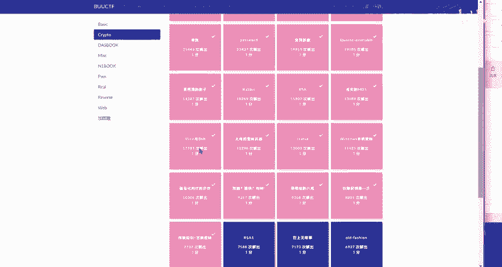

## 概述

题目“Alice与Bob”是一个经典的RSA类型密码学挑战。它提供了一个非常大的整数，这个整数是两个大质数的乘积。我们的任务是将这个大整数分解成两个质因数，按照“小的在前，大的在后”的规则拼接成一个新的数字字符串，然后计算这个字符串的MD5哈希值。最终的MD5值就是我们需要提交的flag。

---

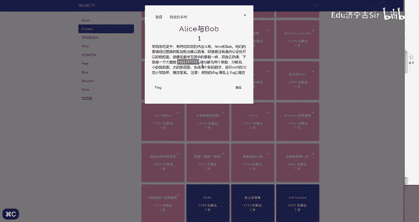

## 第一步：理解题目要求

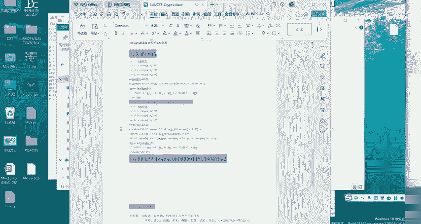

上一节我们介绍了题目的基本背景，本节中我们来看看具体的解题步骤。首先，我们需要仔细阅读题目描述。

题目给出的核心信息如下：
1.  有一个大整数 `N`，它是两个质数 `p` 和 `q` 的乘积，即 `N = p * q`。
2.  解题目标是找到 `p` 和 `q`。
3.  将找到的两个质数按**数值从小到大**的顺序拼接成一个新的字符串。例如，如果 `p=123`， `q=456`，则拼接为 `"123456"`。
4.  对这个拼接后的字符串计算其 **MD5** 哈希值。
5.  得到的32位MD5哈希值（通常为小写十六进制形式）即为最终答案。

---


## 第二步：获取并分解大整数

以下是解题的具体操作流程。

首先，我们需要从题目中复制出那个需要分解的大整数。通常，这个数字会直接显示在题目描述或附件中。

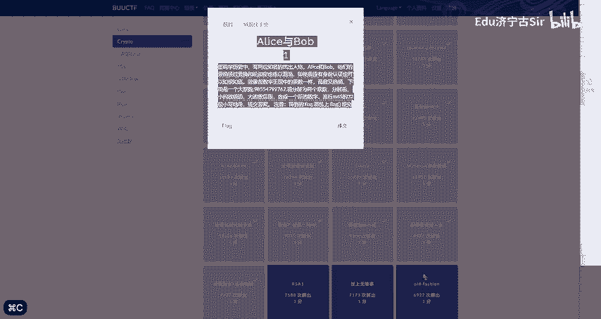

```
98554799767
```

**注意**：此处为示例数字，实际题目中的数字会大得多，通常有数百位，无法通过人工计算分解。

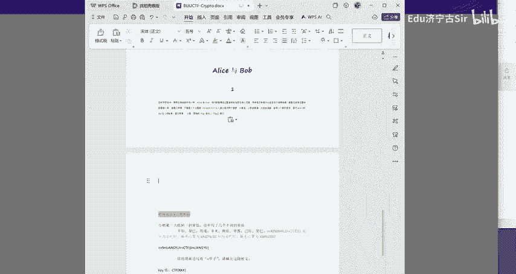

对于如此大的整数，我们需要借助专门的工具或网站进行质因数分解。一个常用的在线工具是 **factordb.com**。

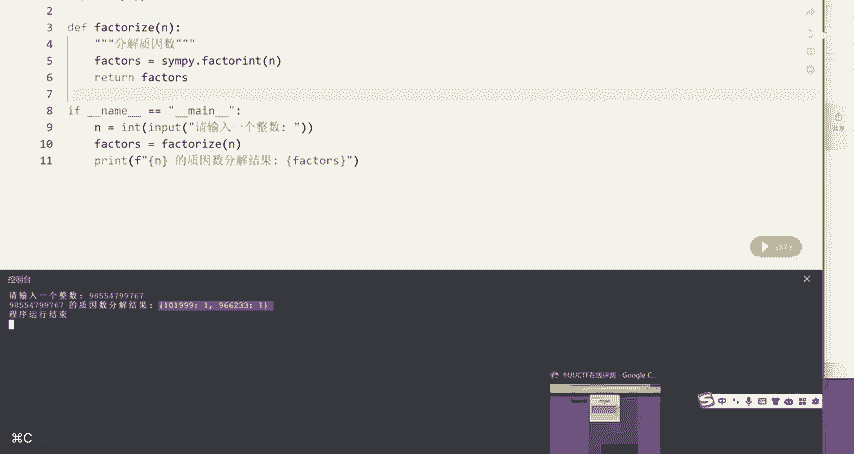

操作步骤如下：
1.  访问 [http://factordb.com](http://factordb.com)。
2.  在网站的查询框中，粘贴你从题目中复制的大整数。
3.  点击查询或按回车键。
4.  网站会尝试分解这个数，并显示结果。如果分解成功，你会看到类似 `101999 * 966233` 这样的结果。这两个数就是我们要找的质因数 `p` 和 `q`。

---

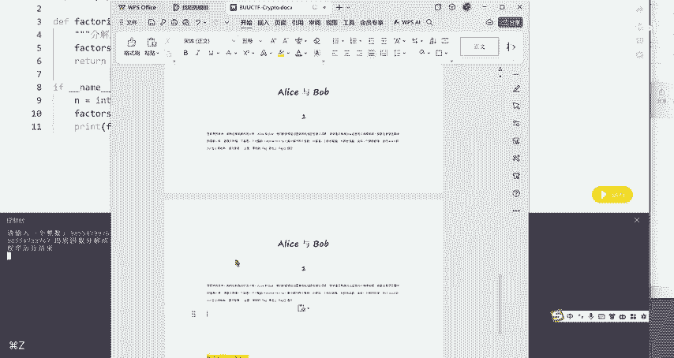

## 第三步：格式化并计算MD5

在成功分解出两个质因数后，下一步就是按照题目要求进行格式化处理。

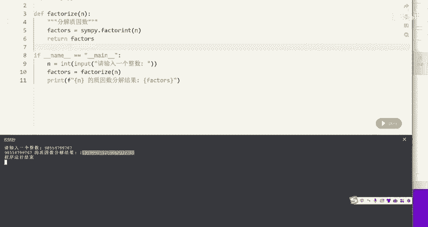

1.  **比较大小**：确定两个质因数哪个更小。假设分解结果是 `p = 966233`， `q = 101999`。通过比较可知，`101999 < 966233`。
2.  **拼接字符串**：将较小的数放在前面，较大的数放在后面，直接拼接成一个新的字符串。根据上面的例子，拼接结果为：`"101999966233"`。
    *   公式表示为：`result_str = str(min(p, q)) + str(max(p, q))`
3.  **计算MD5**：对拼接后的字符串计算MD5哈希值。你可以使用编程语言（如Python）或在线MD5计算工具来完成。

以下是使用Python计算的示例代码：

```python
import hashlib

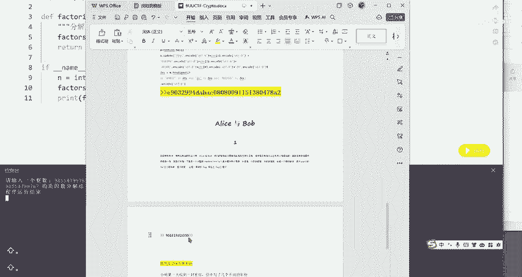

# 假设分解得到的两个质数
p = 966233
q = 101999

# 按小到大顺序拼接
result_str = str(min(p, q)) + str(max(p, q))
print("拼接后的字符串:", result_str)

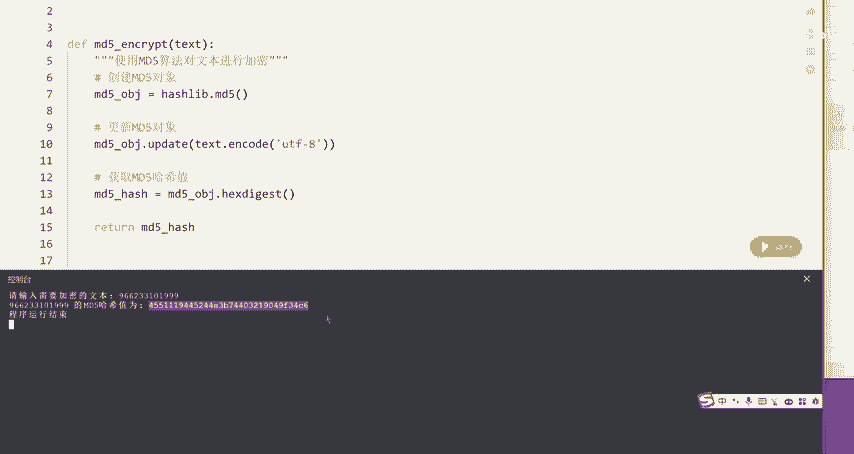

# 计算MD5哈希值
md5_hash = hashlib.md5(result_str.encode()).hexdigest()
print("MD5哈希值（flag）:", md5_hash)
```

运行这段代码，你将得到一个32位的十六进制字符串，例如 `d450209e1d5df5a42d4b1c3b3a4f4c4b`。这个字符串就是本题的最终答案。

---

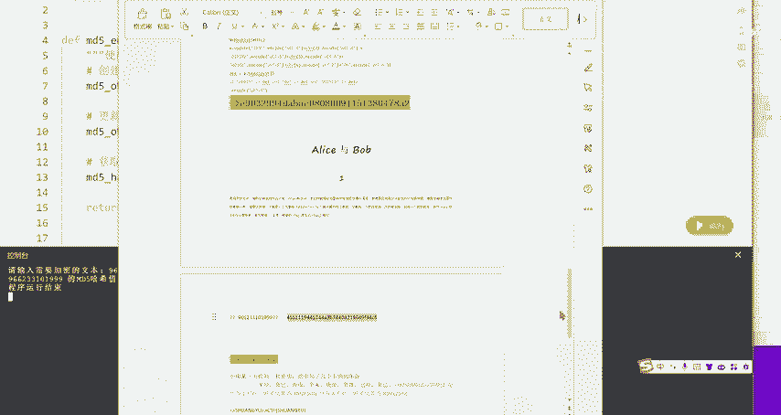

## 总结

本节课中我们一起学习了如何解决“Alice与Bob”这类RSA大数分解题。我们回顾一下关键步骤：首先从题目中提取大整数 `N`；然后利用factordb等工具将其分解为两个质因数 `p` 和 `q`；接着按照“小的在前，大的在后”的规则将它们拼接成字符串；最后计算该字符串的MD5哈希值作为flag提交。掌握这个流程，你就能应对许多类似的CTF密码学挑战了。