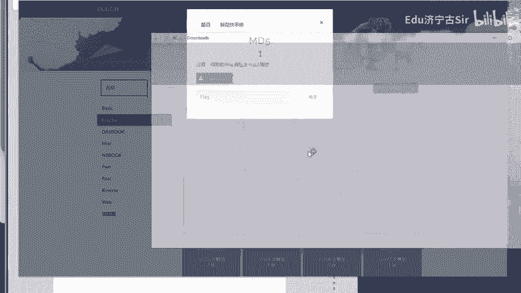
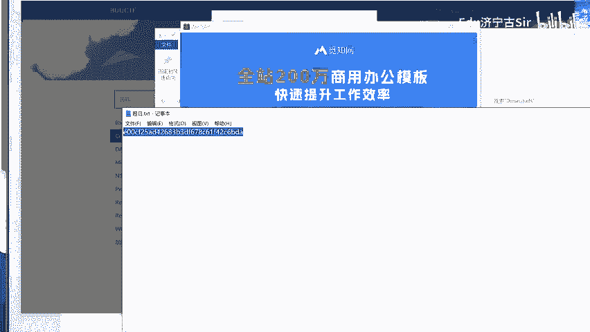
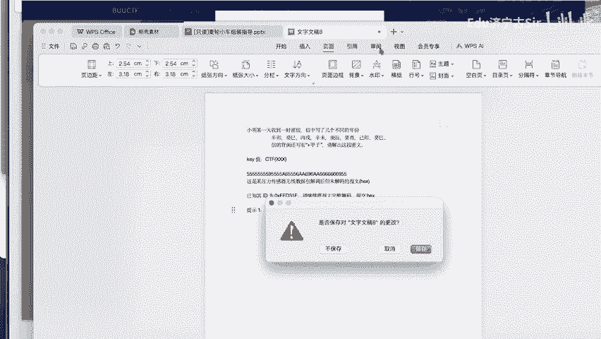
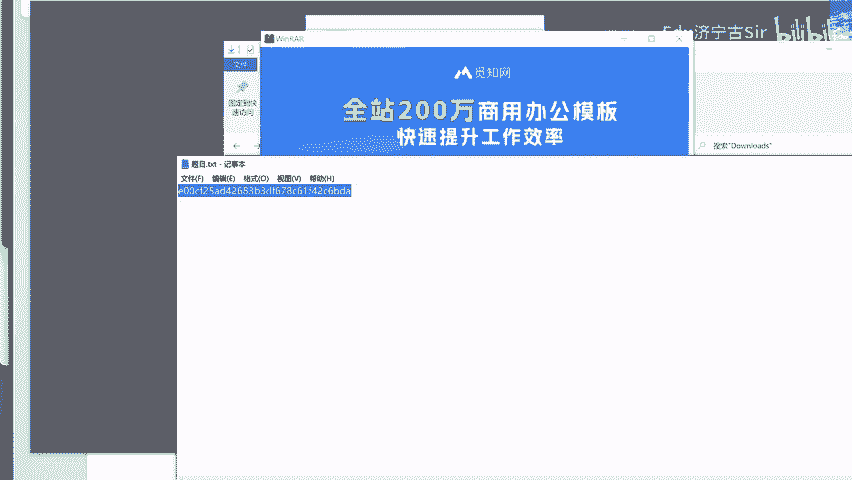
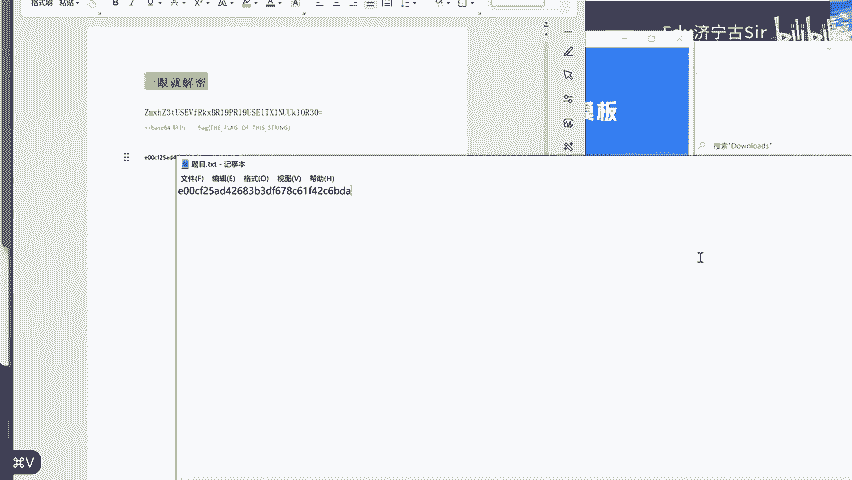
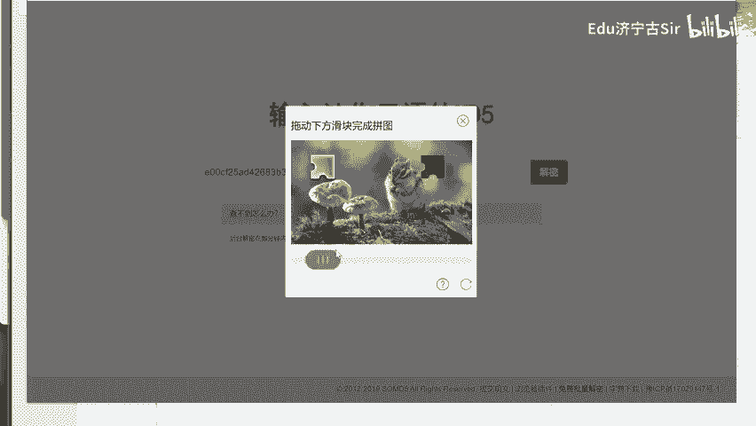
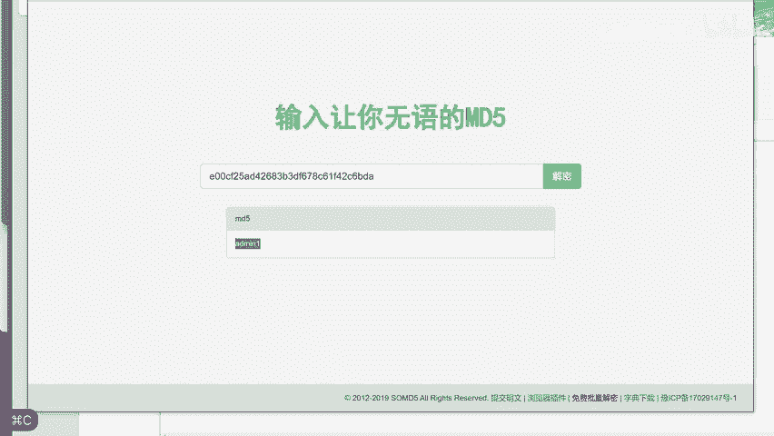
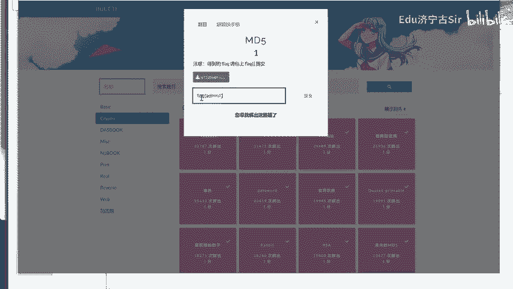

# BUUCTF-Crypto-MD5：P1：MD5解密挑战教程 🔑

在本节课中，我们将要学习如何解决一个典型的CTF（Capture The Flag）密码学挑战，具体是关于MD5哈希值的解密。我们将通过一个来自BUUCTF平台的实际例子，一步步演示如何识别MD5哈希、使用在线工具进行解密，并最终获取到隐藏的明文信息。


## 认识MD5哈希值



上一节我们介绍了本课程的目标，本节中我们来看看什么是MD5。MD5是一种广泛使用的密码散列函数，它可以将任意长度的数据“映射”为一个固定长度（128位，通常表示为32个十六进制字符）的“指纹”或“摘要”。在CTF挑战中，我们常常会遇到一串看似无意义的字符，它可能就是一段文本经过MD5加密后的结果。

MD5的典型输出格式如下：
```
e10adc3949ba59abbe56e057f20f883e
```
这是一个32位的十六进制字符串，它对应着明文 `123456` 的MD5哈希值。



## 识别题目中的MD5



在BUUCTF的这道题目中，我们首先看到了一段描述和一张图片。图片中展示了一串字符，这正是我们需要处理的MD5哈希值。我们的目标就是将这串哈希值“解密”回原始的明文。

## 使用在线工具进行解密



由于MD5是一种单向哈希函数，理论上无法直接逆向计算。但在实际中，许多常见的字符串（如简单密码、单词）的MD5值已经被预先计算并存储在庞大的“彩虹表”数据库中。因此，我们可以通过查询这些数据库来尝试“破解”或“解密”MD5值。



以下是解决此类挑战的通用步骤：

1.  **复制哈希值**：首先，从题目描述或提供的图片中，准确地复制出完整的MD5哈希字符串。
2.  **选择解密网站**：在浏览器中打开一个可靠的MD5在线解密网站，例如 `cmd5.com` 或 `somd5.com`。
3.  **提交查询**：将复制的MD5哈希值粘贴到网站的解密输入框中。
4.  **获取结果**：点击查询按钮。如果该哈希值对应的明文较为常见，数据库中存在记录，网站通常会直接返回解密后的明文。



## 实战演练：解决BUUCTF挑战

现在，让我们将上述步骤应用到具体的题目中。



1.  我们从题目提供的材料中，找到并复制出需要解密的MD5哈希值。
2.  接着，我们访问一个MD5在线解密网站。
3.  将哈希值粘贴到网站的输入框内并开始查询。
4.  查询结果显示，这个MD5值对应的明文是一个数字 `5`。

至此，我们就成功破解了这道题目。最终的答案（Flag）很可能就是这个明文 `5`，或者需要以某种格式（如 `flag{5}`）提交。



## 总结

本节课中我们一起学习了如何应对一个基础的CTF密码学挑战——MD5解密。我们了解了MD5哈希的基本概念，掌握了利用在线查询工具破解常见MD5值的实践方法。关键的操作流程可以总结为：**识别MD5 -> 复制哈希 -> 在线查询 -> 获取明文**。这是CTF入门阶段必须掌握的一项基本技能。