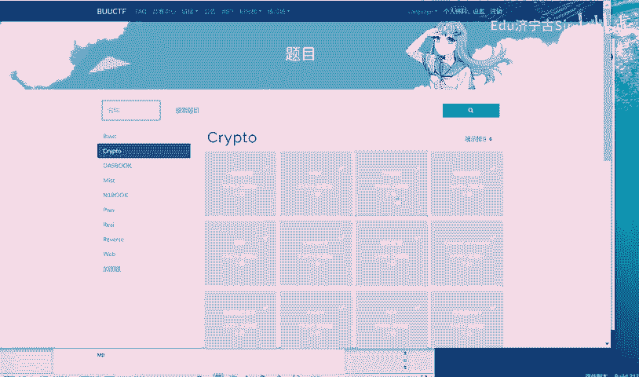
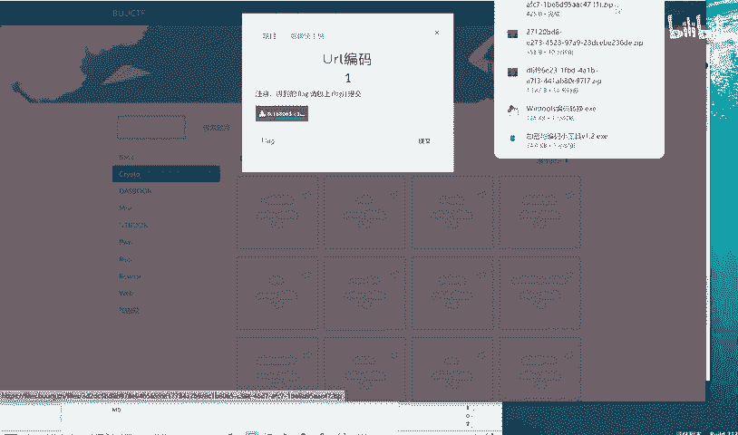
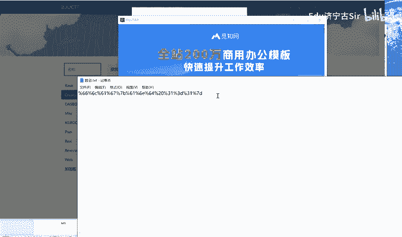
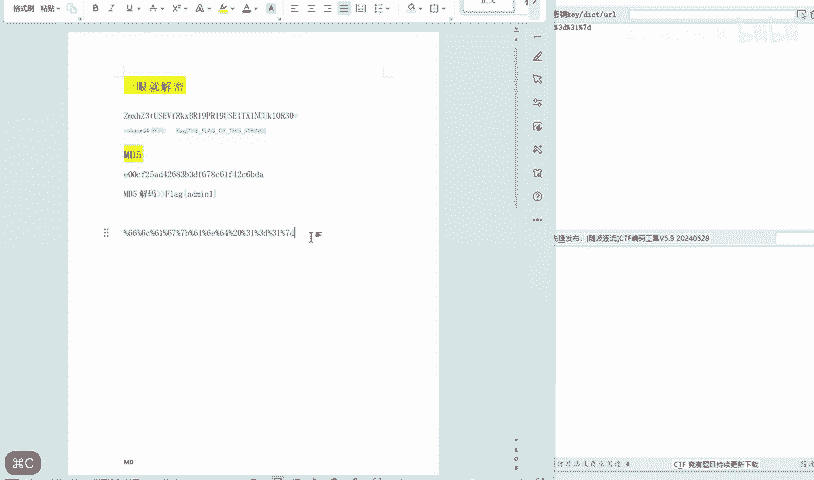
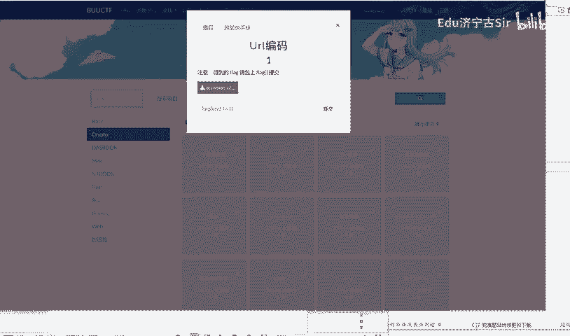

# BUUCTF-Crypto-Url编码：P1：URL编码基础与解题实践 🔐

在本节课中，我们将要学习URL编码的基础知识，并通过一个来自BUUCTF平台的Crypto类题目实例，演示如何识别并解码URL编码，从而获取隐藏的Flag。

## 概述

URL编码，也称为百分号编码，是一种在互联网上传输数据时使用的编码机制。它确保URL中只包含安全字符，将不安全的或特殊字符转换为以百分号（%）开头，后跟两个十六进制数字的形式。理解URL编码是解决许多CTF（Capture The Flag）密码学挑战的基础。

上一节我们介绍了课程目标，本节中我们来看看URL编码的具体规则和表现形式。

## URL编码规则

URL编码的核心规则是将非安全字符转换为其ASCII码的十六进制表示，并在前面加上百分号（%）。例如，空格字符的ASCII码是32，十六进制为20，因此被编码为 `%20`。

以下是URL编码的几个关键点：
*   **安全字符**：字母（A-Z, a-z）、数字（0-9）以及一些特殊字符（如 `-`, `_`, `.`, `~`）通常不需要编码。
*   **编码格式**：`%XX`，其中 `XX` 代表字符ASCII码的两位十六进制数。
*   **常见编码示例**：空格（`%20`）、引号（`%22`）、斜杠（`%2F`）。

## 解题实战：BUUCTF URL编码挑战

现在，我们来看一个具体的CTF题目。题目通常会给出一段看似乱码的文本，其中可能包含URL编码。

直接寻找字符串中的URL编码模式，即“%”后跟两个十六进制数字（0-9, A-F）的组合。

以下是解题的一般步骤：
1.  **观察题目**：题目给出的文本或图片中可能包含类似 `%61%62%63` 的字符串。
2.  **识别编码**：确认这些模式符合URL编码格式。
3.  **进行解码**：可以使用在线解码工具、编程语言（如Python）或浏览器地址栏进行解码。
4.  **获取Flag**：解码后的字符串很可能就是题目的答案（Flag）。

在本次示例挑战中，我们按步骤操作，成功解码后即可得到Flag，结束这道题目。

## 总结

本节课中我们一起学习了URL编码的基本原理和格式。我们了解到，URL编码是一种通过 `%XX` 形式表示特殊字符的机制。通过一个BUUCTF的实例，我们实践了如何从题目中识别URL编码模式，并通过解码工具获取最终的Flag。掌握这项技能是解开许多网络相关密码学挑战的关键第一步。