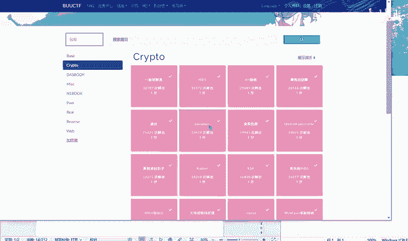
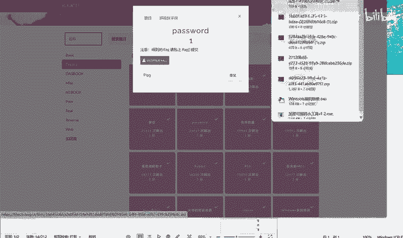
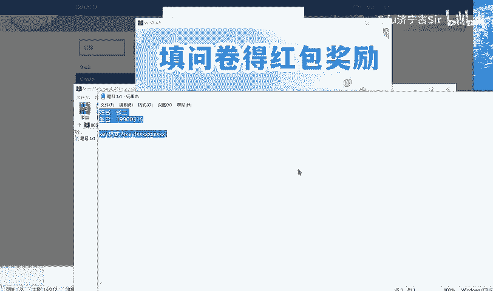
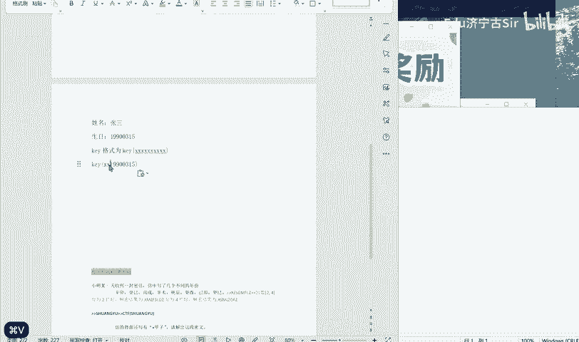
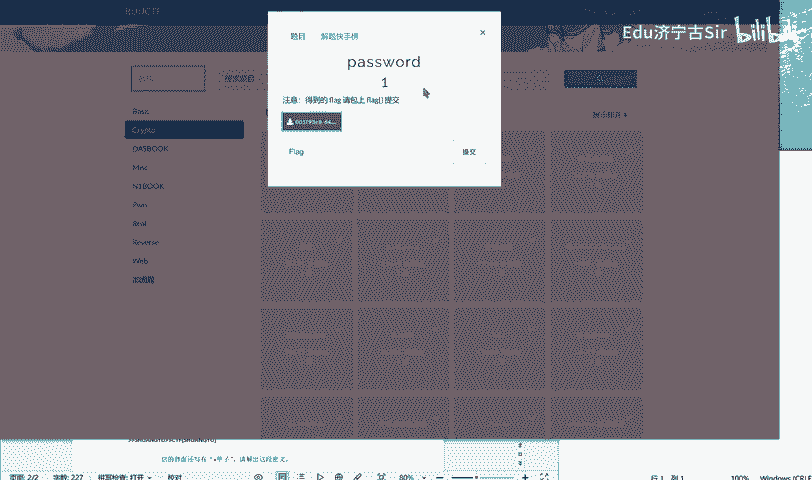
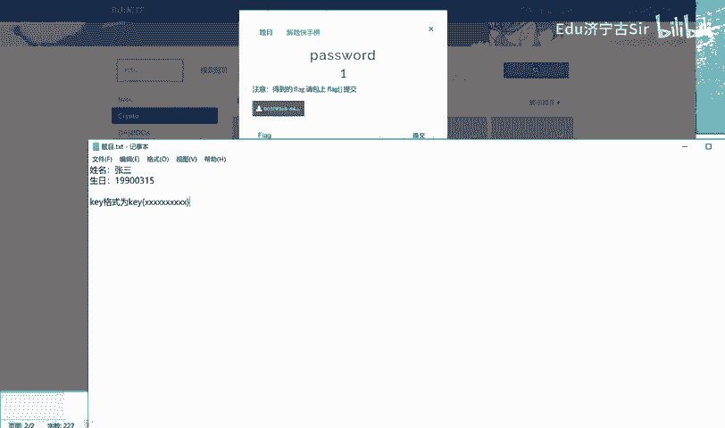
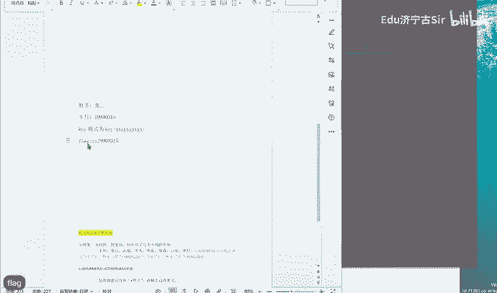
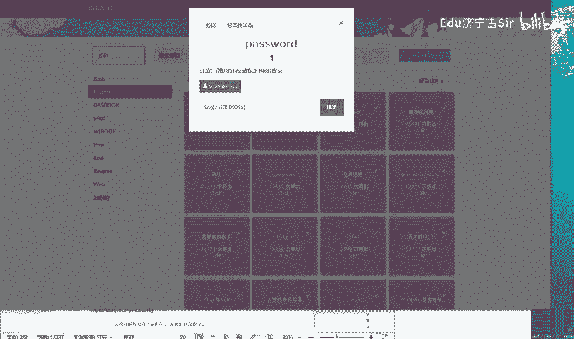

# BUUCTF-Crypto-password：P1：解题思路与步骤解析 🧩

在本节课中，我们将要学习如何解决BUUCTF平台上一道名为“password”的密码学题目。这道题主要考察信息提取和格式转换的能力，我们将一步步分析题目给出的信息，并最终构造出正确的Flag。

---



## 题目信息分析

首先，我们观察题目给出的信息。题目描述中提到了“张三”和一组数字。




图片中显示了一个类似密码或编码的字符串：`zs19970315`。这很可能是一个关键线索。

上一节我们分析了题目给出的核心信息，本节中我们来看看如何解读这些信息。



---

## 密码格式推断

题目中提到“密码的格式”，并指出有“10个数”，而当前信息中“已经有8个了”。结合图片中的 `zs19970315`，我们可以进行如下推断：

1.  **`zs`**：这很可能对应人名“张三”的拼音首字母。
2.  **`19970315`**：这看起来是一个日期格式，即1997年3月15日，可以解释为“生日”。
3.  题目暗示完整的密码应为10位数字，而 `19970315` 是8位数字。因此，我们需要将 `zs` 转换为对应的数字。

以下是关键信息的对应关系：
*   **人名** -> **字母转换**：`张三 (Zhang San)` -> `zs`
*   **生日** -> **数字日期**：`1997年3月15日` -> `19970315`

---



## 构造Flag

在CTF题目中，Flag通常具有特定的格式。根据题目描述和常见格式，我们需要将得到的密码字符串放入标准的Flag格式中。

常见的Flag格式为：`flag{...}` 或 `FLAG{...}`。



因此，我们将分析得到的密码 `zs19970315` 放入此格式中，尝试构造最终的Flag。

构造Flag的代码如下（概念性描述）：
```plaintext
flag_content = “zs19970315”
final_flag = “flag{” + flag_content + “}”
# 得到：flag{zs19970315}
```

---



## 答案验证

按照上述步骤，我们得出的Flag是 **`flag{zs19970315}`**。

提交此答案进行验证，结果正确。





---


## 总结

本节课中我们一起学习了如何解决BUUCTF的“password”密码学题目。解题的核心步骤包括：
1.  **提取信息**：从题目描述和图片中识别出关键字符串 `zs19970315`。
2.  **解析含义**：将字符串拆解为“姓名拼音首字母（zs）”和“生日数字（19970315）”两部分。
3.  **格式转换**：理解题目对密码位数的暗示，并确认当前信息已满足条件。
4.  **构造Flag**：将得到的密码按照CTF通用的 `flag{...}` 格式进行封装。

这道题主要考察了观察力、信息关联能力和对常见Flag格式的熟悉程度。希望这个解析过程能帮助你理解此类题目的基本解法。