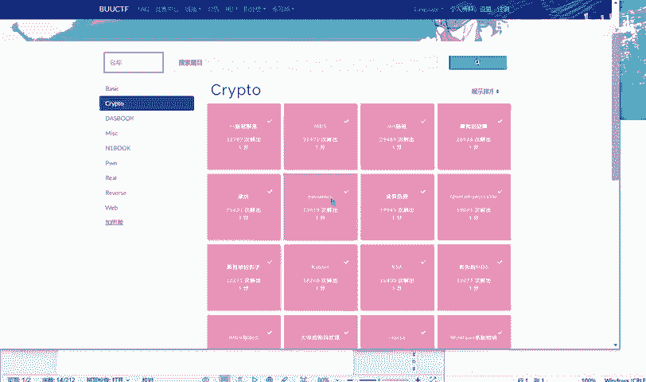
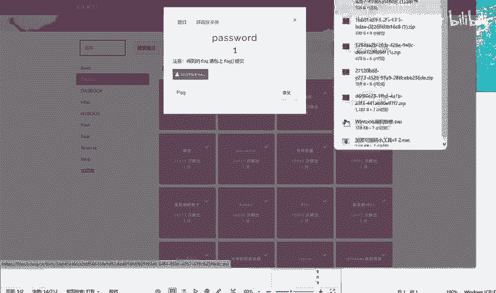
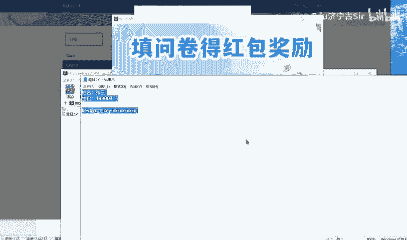
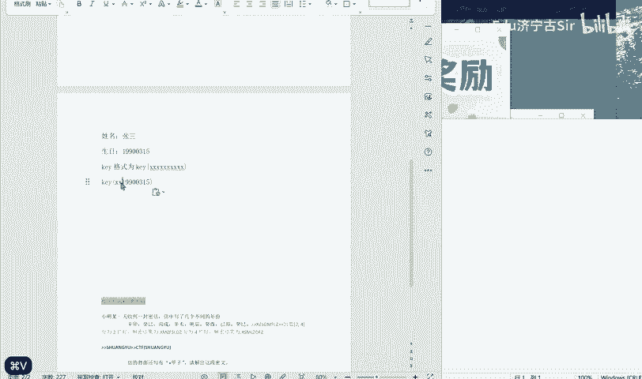
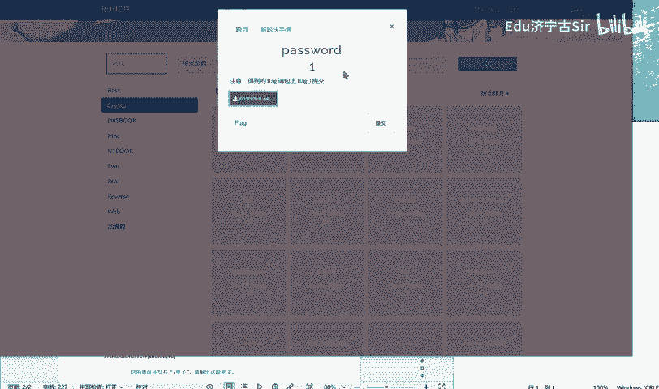
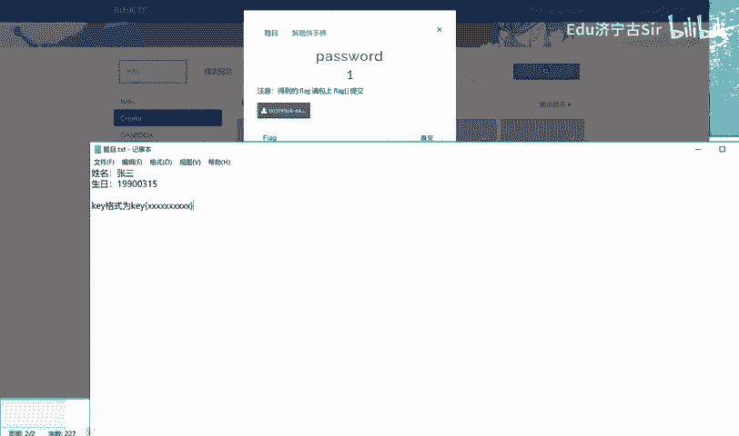
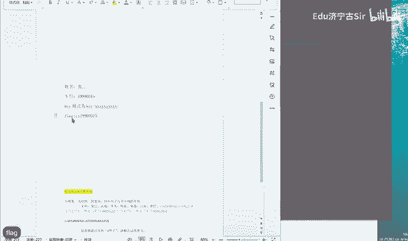
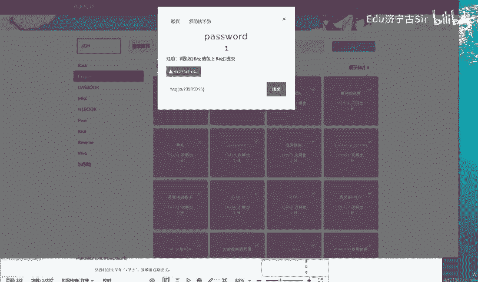

# BUUCTF-Crypto-password - P1 - Edu济宁古Sir - BV1yi421m7RM

B U U C F corrupt。Password。

张三啊，这道题。

这就是脑洞大开的题。密码的格式，你看啊。他这是。几个数。12。是。7891010个数。10个数，他这里就已经有8个了。他这里就已经有8个了。那这8个就给他对应好这个生日。然后这前两位能对应个张三。

ZS。再看它的格式flag。

flag的格式。所以说。

把这里改成flag。😔。

OK提交一下试一试。OK正确。

