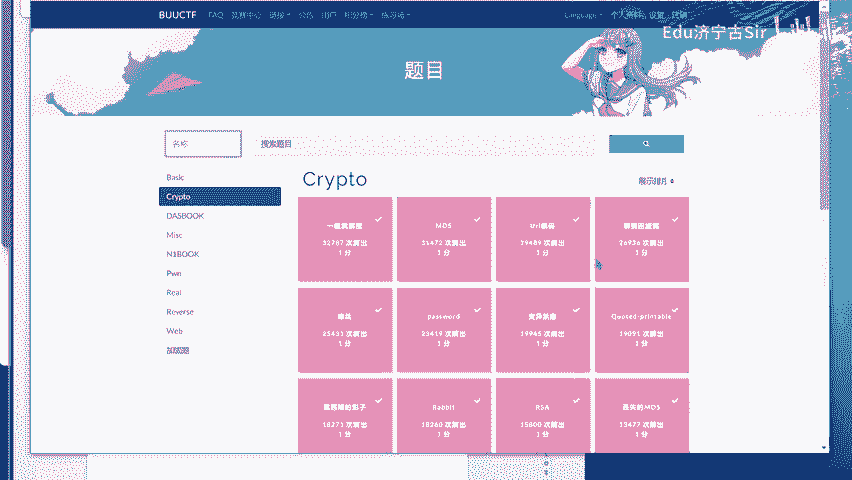
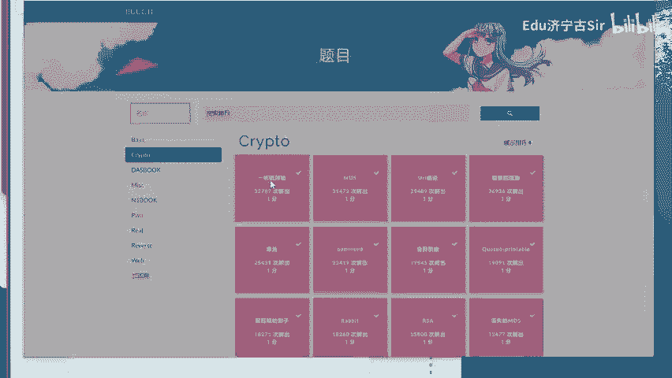
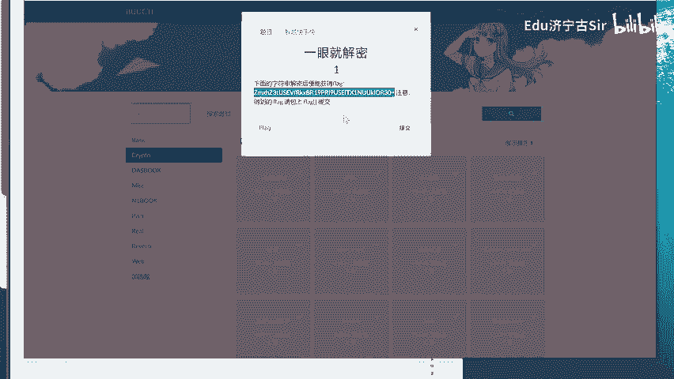
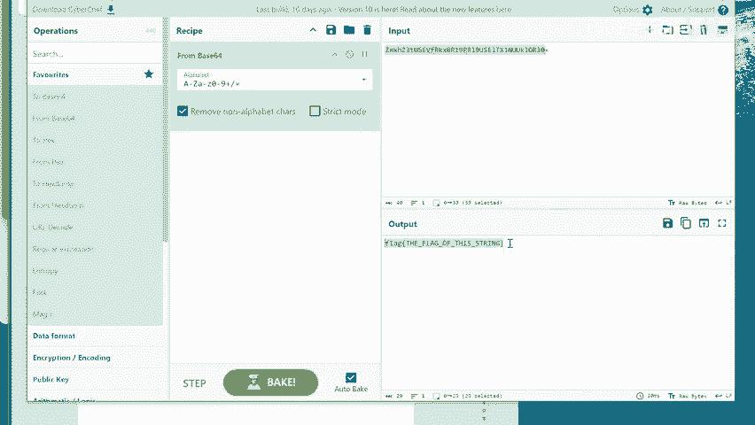
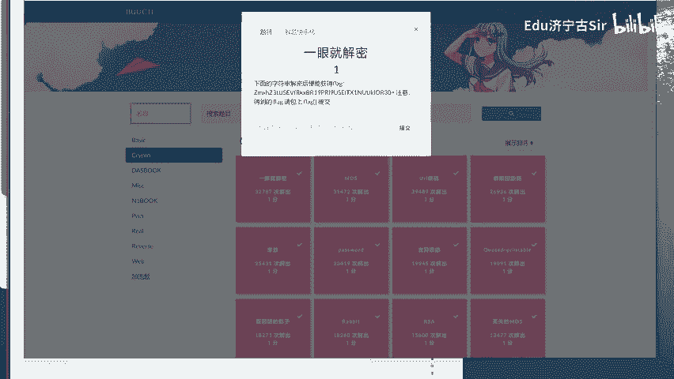

# BUUCTF-Crypto：P1：一眼就解密 🔍

在本节课中，我们将要学习如何识别并解密一种非常基础的编码方式——Base64编码。我们将通过一个名为“一眼就解密”的CTF挑战实例，来理解其原理和操作步骤。



## 概述

Base64是一种用64个可打印字符来表示二进制数据的编码方法。它常用于在那些只能处理文本的环境中传输或存储二进制数据。在CTF（Capture The Flag）比赛的密码学（Crypto）题目中，Base64编码经常出现，因为它简单且易于识别。

## 识别Base64编码

上一节我们介绍了Base64编码的基本概念，本节中我们来看看如何识别它。



Base64编码的字符串通常由字母（A-Z, a-z）、数字（0-9）以及两个符号“+”和“/”组成。字符串末尾有时会出现一个或两个“=”作为填充字符。当你看到一个字符串符合这种特征时，它很可能就是Base64编码。

## 解密Base64编码

识别出编码后，下一步就是将其解密回原始文本。这个过程称为“解码”。



以下是解码Base64的通用步骤：

1.  **获取编码字符串**：首先，你需要获得待解码的Base64字符串。
2.  **使用解码工具**：你可以使用在线的Base64解码网站，编程语言（如Python）的内置库，或者命令行工具来进行解码。
3.  **获取解码结果**：工具会输出解码后的原始数据，通常是文本。

## 挑战实例分析

现在，让我们应用所学知识来解决一个实际挑战。题目名称为“一眼就解密”，这提示我们编码方式非常简单直接。



题目给出的信息是：`B OU C TF crap`。这看起来像是一段被干扰的文本。结合题目名称和CTF的常见模式，我们可以推测“B OU C TF”可能是“BUUCTF”的Base64编码结果被错误地展示或分割了。实际上，`BUUCTF`的Base64编码正是`QlVVQ1RG`。

因此，原始待解密的密文很可能就是`QlVVQ1RG`。当我们对其进行Base64解码时：

```python
import base64
encoded_str = "QlVVQ1RG"
decoded_bytes = base64.b64decode(encoded_str)
print(decoded_bytes.decode('utf-8'))  # 输出: BUUCTF
```



解码后我们得到了`BUUCTF`。在CTF比赛中，flag的格式通常为`flag{...}`或`BUUCTF{...}`。根据这个上下文，最终的flag很可能就是`BUUCTF{...}`格式，而这里`BUUCTF`本身可能就是flag的一部分，或者是一个提示。在原始视频场景中，这被描述为“一眼就看出来”，意指通过Base64特征迅速识别并解密。

## 总结

本节课中我们一起学习了Base64编码的基础知识。我们了解了它的外观特征，掌握了使用工具进行解码的步骤，并通过一个CTF挑战实例巩固了这项技能。记住，在CTF中遇到由字母、数字、“+”、“/”和“=”组成的字符串时，首先尝试Base64解码，这往往是解题的关键第一步。