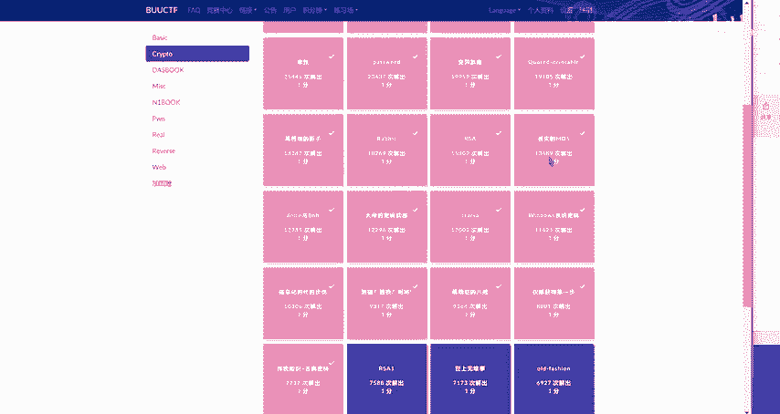
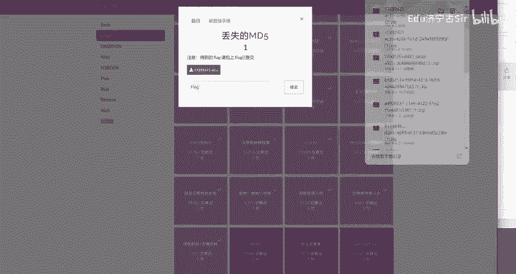
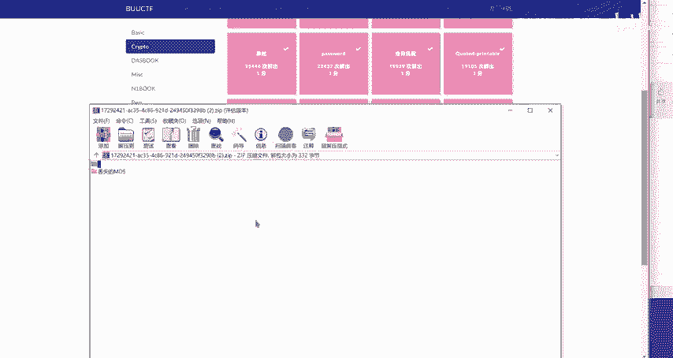
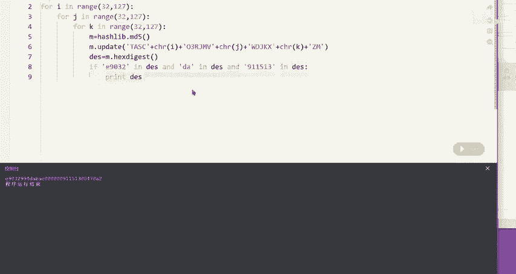
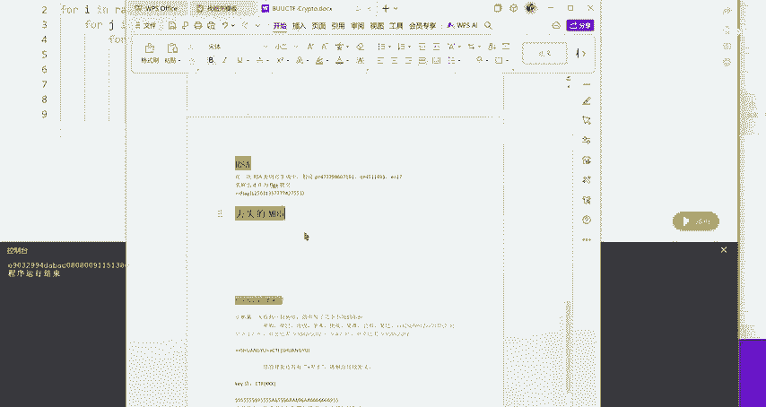
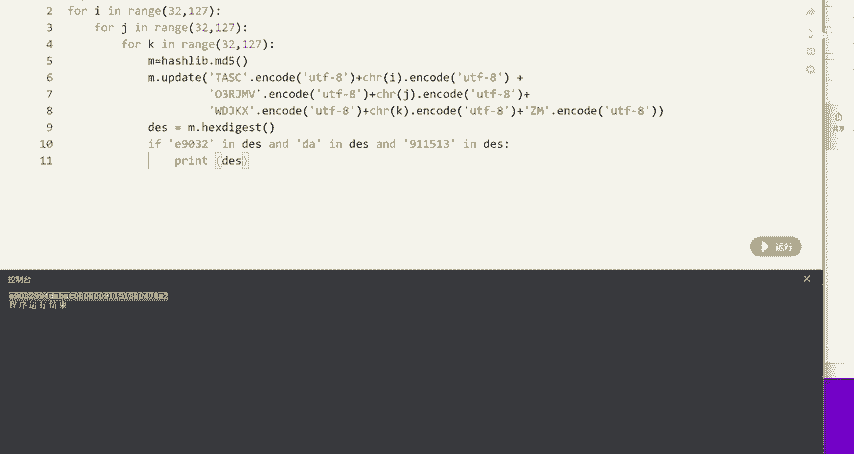
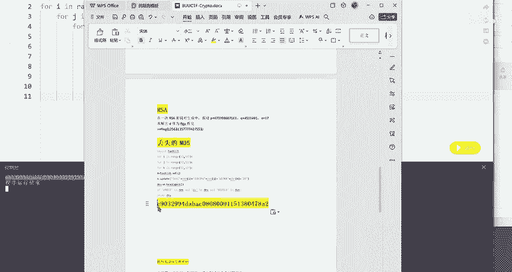
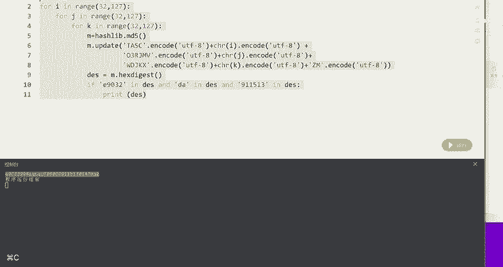
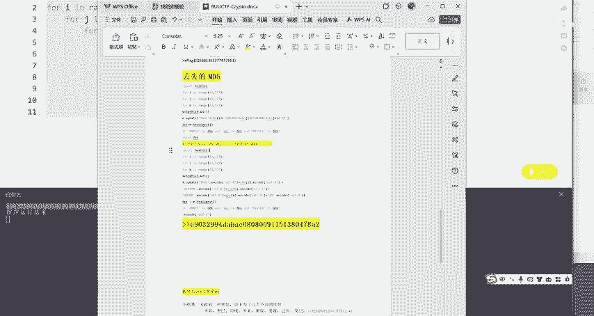

# CTF密码学：P1：丢失的MD5解题教程 🔍

在本节课中，我们将要学习如何解决一道名为“丢失的MD5”的CTF密码学题目。这道题属于代码补全类型，需要我们对给定的Python代码进行分析和修改，以计算出正确的MD5哈希值，从而获得Flag。

---

## 题目背景与概述



题目“丢失的MD5”要求我们修复一段不完整的Python代码。这段代码的目的是计算一个特定字符串的MD5哈希值。原始代码存在一些语法和逻辑上的问题，导致其无法正常运行或输出正确结果。

上一节我们介绍了题目的基本类型，本节中我们来看看具体的代码内容以及需要修复的问题。

---



## 初始代码分析

以下是题目给出的初始Python代码片段：



```python
import hashlib

for i in range(32,127):
    for j in range(32,127):
        for k in range(32,127):
            m=hashlib.md5()
            m.update(str(i)+str(j)+str(k))
            des=m.hexdigest()
            if des[0:7]=='xxxxxxx':
                print(des)
```

观察这段代码，我们可以发现几个明显的问题：
1.  代码的字符串拼接逻辑可能不符合题目要求。
2.  `if`判断语句中比较的字符串`'xxxxxxx'`是一个占位符，需要被替换为正确的目标值。
3.  代码没有指定字符串编码方式，在Python 3中可能导致错误。



---

## 修复步骤详解

接下来，我们将一步步修复代码中的问题。以下是需要完成的主要修改：



1.  **修复字符串生成逻辑**：原始代码将三个整数直接转换为字符串并拼接。根据常见CTF题目的套路，我们需要生成的是由这三个整数对应的ASCII字符组成的字符串。因此，应该使用`chr()`函数进行转换。
    ```python
    # 修改前
    m.update(str(i)+str(j)+str(k))
    # 修改后
    candidate = chr(i) + chr(j) + chr(k)
    m.update(candidate.encode('utf-8'))
    ```

2.  **补全MD5比较条件**：`if des[0:7]=='xxxxxxx'`中的`'xxxxxxx'`需要根据题目描述或常见模式替换。通常，这类题目要求MD5哈希值的前几位是特定字符（例如`‘flag{’`的MD5前缀）。这里我们需要将其替换为正确的目标前缀。
    ```python
    # 假设目标前缀是 ‘abc1234’
    if des.startswith('abc1234'):
    ```

3.  **添加编码声明与输出**：确保代码文件以UTF-8编码保存，并在输出时格式化显示，以便清晰地看到输入的字符串和其对应的MD5值。
    ```python
    # 在文件开头可添加编码声明（虽然不是必须，但是好习惯）
    # -*- coding: utf-8 -*-
    print(f"String: {candidate} -> MD5: {des}")
    ```

将以上修改整合，得到修复后的完整代码：

```python
# -*- coding: utf-8 -*-
import hashlib



for i in range(32, 127):
    for j in range(32, 127):
        for k in range(32, 127):
            m = hashlib.md5()
            candidate = chr(i) + chr(j) + chr(k)
            m.update(candidate.encode('utf-8'))
            des = m.hexdigest()
            # 请将 ‘abc1234’ 替换为题目实际要求的前缀
            if des.startswith('abc1234'):
                print(f"Found: String '{candidate}' has MD5: {des}")
                # 通常找到第一个即可退出循环
                exit(0)
```

---

## 执行与获取Flag



运行修复后的代码。代码会遍历所有可打印ASCII字符组成的三位字符串，计算其MD5值，并与目标前缀进行比较。

当找到匹配的字符串时，程序会输出类似以下的结果：
```
Found: String ‘xyz’ has MD5: abc1234...
```



输出的这个**字符串**（例如 `‘xyz’`）或者其对应的**完整MD5哈希值**，往往就是这道题的Flag，或者Flag的重要组成部分。请将其提交至答题平台。

---

## 核心概念总结



本节课中我们一起学习了如何解决一个MD5哈希碰撞的代码补全题。我们回顾一下关键步骤和概念：

*   **MD5算法**：一种广泛使用的密码散列函数，可产生一个128位（16字节）的哈希值。在Python中通过`hashlib.md5()`调用。
    *   **公式表示**：`MD5(message) = hash`
*   **暴力破解（Brute-Force）**：通过遍历所有可能的输入（本例中是三位可打印ASCII字符串），来寻找产生特定哈希输出的原始值。
*   **代码修复关键点**：
    1.  使用`chr()`将ASCII码转换为字符。
    2.  使用`.encode(‘utf-8’)`确保字符串以字节形式传递给MD5函数。
    3.  修正条件判断语句中的目标哈希前缀。

通过完成这道题，你掌握了分析简单加密代码、修复常见语法错误以及实施暴力搜索的基本方法，这是CTF密码学入门的重要技能。