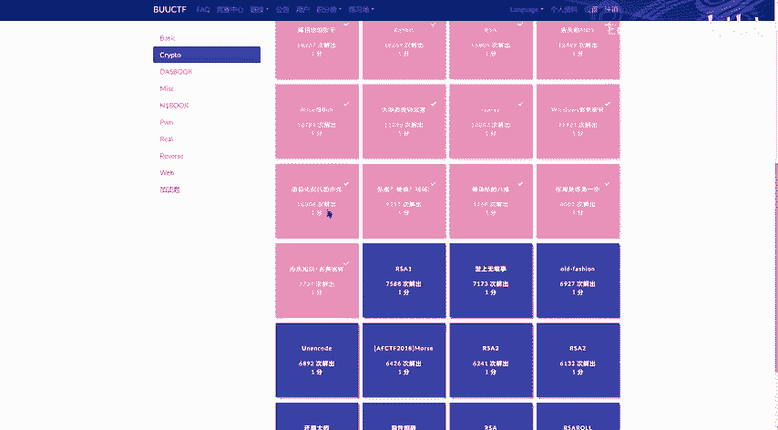
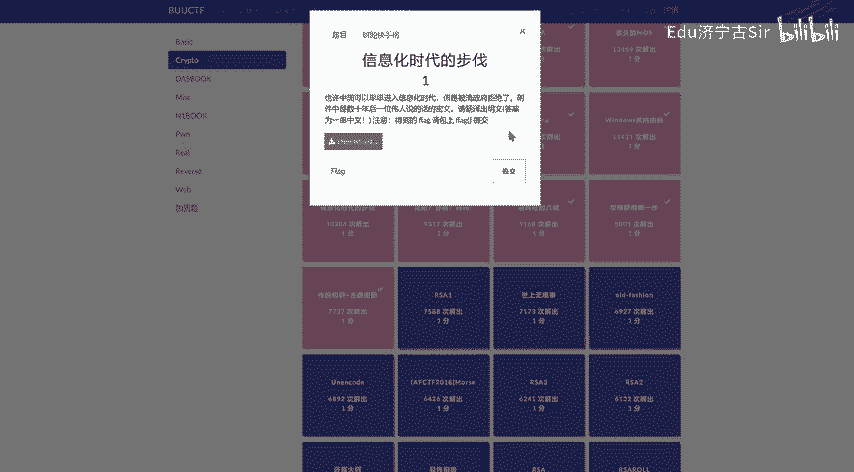
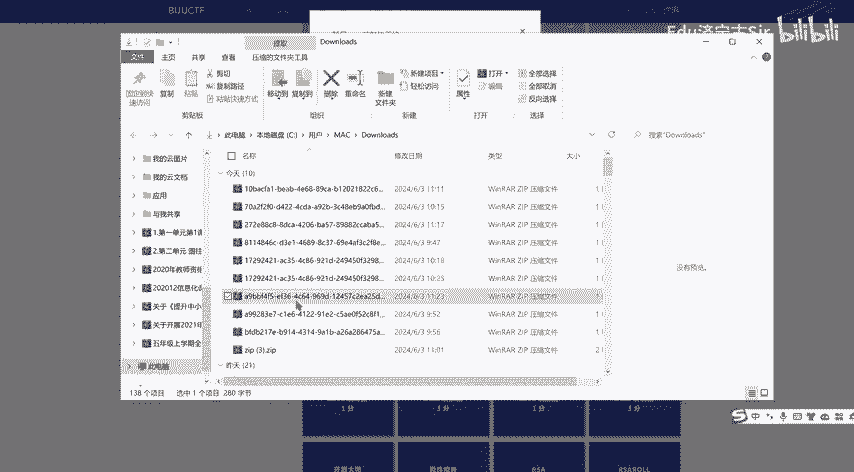
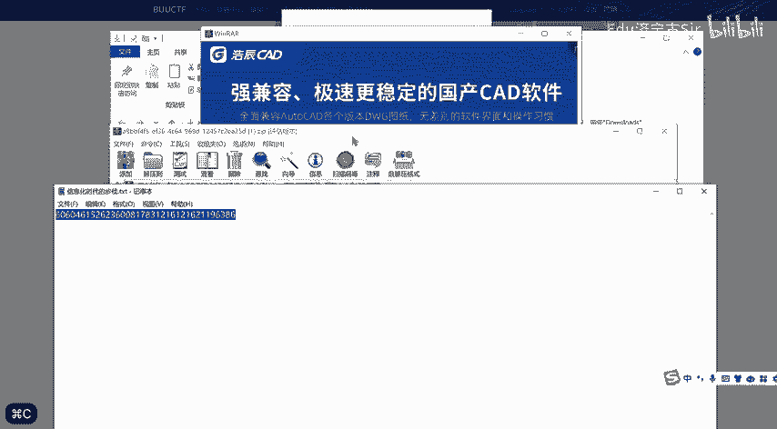
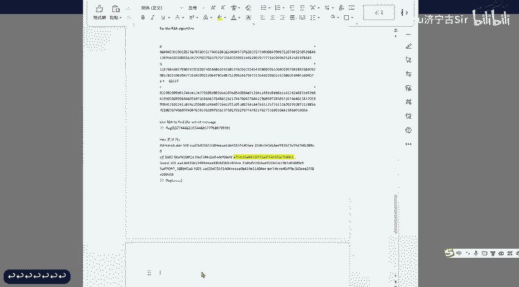
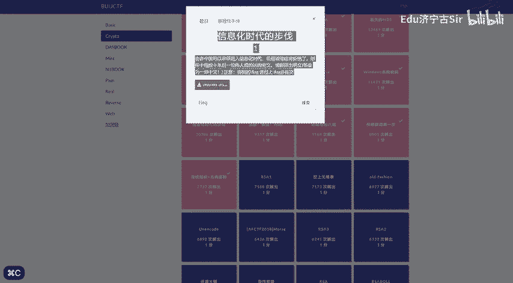
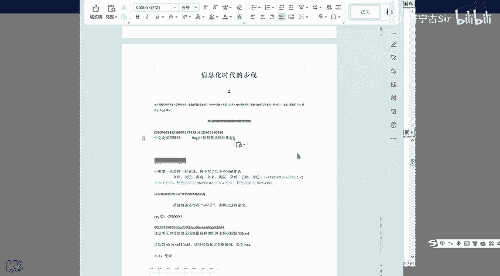

# BUUCTF-Crypto：P1：信息化时代的步伐 🚀

在本节课中，我们将要学习BUUCTF平台上一道名为“信息化时代的步伐”的密码学题目。这道题融合了历史背景与经典编码知识，我们将一步步解析其解题思路。

## 题目概述

题目描述为：“也许中国可以早早进入信息化时代，但是被清政府拒绝了。” 同时配有一张图片，图片中包含一串数字：“606046152623600817831216121621196386”。

上一节我们介绍了题目背景，本节中我们来看看如何理解这段描述和数字。

## 核心思路分析

题目暗示了“信息化时代”与“被清政府拒绝”的历史背景。这很可能指向中国早期信息化进程中的一个著名事件或口号。

结合“计算机要从娃娃抓起”这一广为人知的倡导，以及“中文电报码”这一线索，我们可以推断解题方向。

以下是解题的关键步骤：

1.  **识别编码类型**：题目给出的长串数字，其格式符合中文电报码（又称中文电码、标准电码）的特征。中文电报码是一种将汉字转换为四位数字代码的编码系统。
2.  **进行解码操作**：需要将数字串按四位一组进行分割，然后查询中文电码表，将每组数字转换为对应的汉字。
3.  **获取最终flag**：解码出的中文句子很可能就是本题的flag。

## 解题步骤详解

以下是具体的解码过程：

首先，将数字串 `606046152623600817831216121621196386` 按四位一组进行分割：
*   6060
*   4615
*   2623
*   6008
*   1783
*   1216
*   1216
*   2119
*   6386

接着，使用中文电码查询工具或对照表，将上述每组数字转换为汉字。转换后的结果为：“计算机要从娃娃抓起”。

因此，本题的flag即为该字符串。

在CTF比赛中，flag通常需要以特定格式提交。根据BUUCTF平台常见的格式要求，最终的flag应为：
`flag{计算机要从娃娃抓起}`

## 总结

本节课中我们一起学习了“信息化时代的步伐”这道题目的解法。我们通过分析题目描述中的历史线索，识别出“中文电报码”这一核心编码方式，并通过查询电码表将数字成功解码为中文，最终得到了flag。这道题很好地体现了在密码学挑战中，结合上下文线索和经典编码知识的重要性。