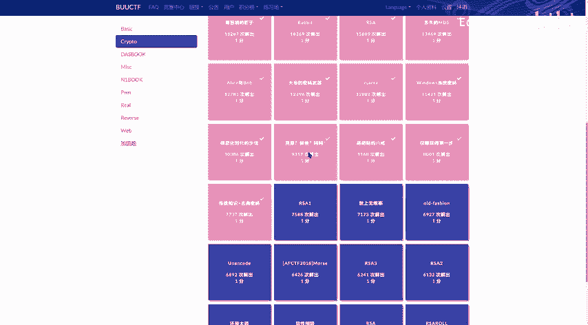
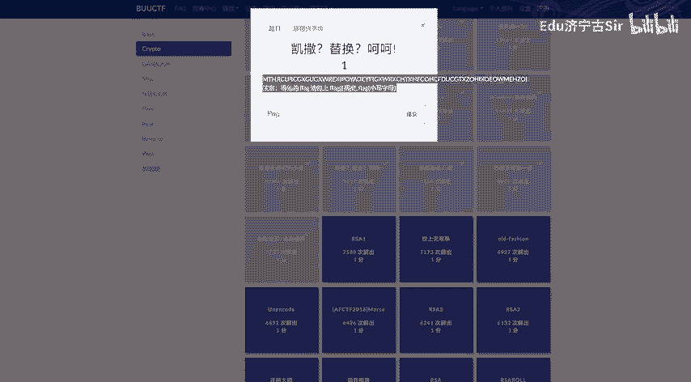
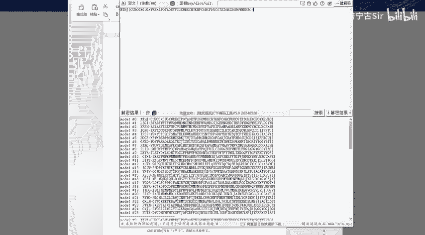
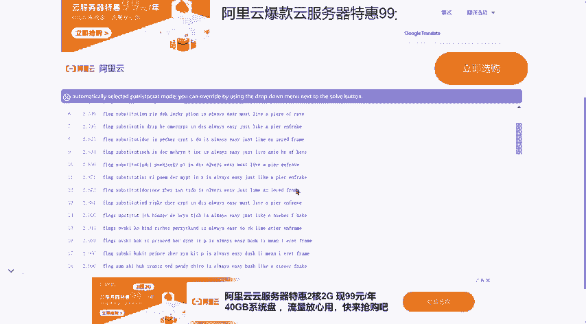
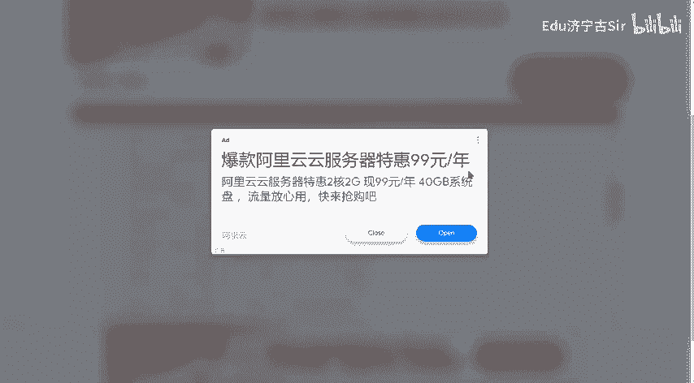
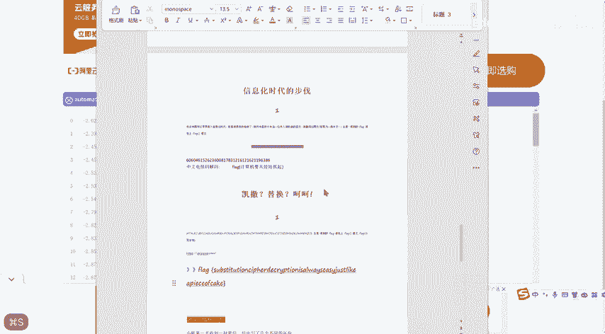

# CTF密码学入门：P1：凯撒密码与替换密码实战解析 🔐

在本节课中，我们将通过一道来自BUUCTF的实战题目，学习凯撒密码和替换密码的基本原理与破解方法。我们将从分析题目开始，逐步演示如何识别密码类型并找到正确的解密密钥，最终获取隐藏的Flag。

---

## 题目背景与初步分析

首先，我们面对的题目是“凯撒？替换？呵呵!”。题目给出的密文是：`MTHJ{CUBCGXGUGXWREXIPOYAOEYFIGXWRXCHTKHFCOHCFDUCGTXZOHIXOEOWMEHZO}`。

观察这段密文，其格式形如 `MTHJ{...}`，这与CTF比赛中常见的Flag格式 `flag{...}` 或 `FLAG{...}` 非常相似。因此，我们的目标是将 `MTHJ` 还原为 `flag`。

## 尝试凯撒密码破解

凯撒密码是一种简单的替换密码，通过将字母在字母表上向前或向后进行固定偏移来实现加密和解密。其加密公式可以表示为：

**C = (P + K) mod 26**

其中，`C` 代表密文字母，`P` 代表明文字母，`K` 代表偏移量。

我们的第一个思路是尝试凯撒密码。既然我们猜测 `MTHJ` 对应 `flag`，我们可以计算一下每个字母的偏移量：
- `M` -> `f`: 在字母表中，M是第12位（A=0），f是第5位。这需要向前移动（或向后移动一个很大的数字），不是一个整齐的固定偏移。
- `T` -> `l`: T是第19位，l是第11位，同样不是固定偏移。

手动或使用工具对所有可能的偏移量（1-25）进行测试后，我们发现没有任何一个偏移量能将整个密文解密成有意义的英文句子。这表明，简单的凯撒密码可能不适用。

## 转向替换密码分析

当凯撒密码测试失败后，我们应考虑更通用的**单表替换密码**。在这种密码中，每个明文字母被唯一的一个密文字母所替换，但替换规则不是简单的位移，而是任意一一映射。

题目提示“替换”，暗示我们需要找到一个替换密钥（Key）。这个密钥定义了从密文字母到明文字母的映射关系。

我们的突破口仍然是 `MTHJ` -> `flag` 这个假设。由此，我们可以建立部分映射关系：
- `M` 替换为 `f`
- `T` 替换为 `l`
- `H` 替换为 `a`
- `J` 替换为 `g`

## 使用在线工具辅助破解

对于单表替换密码，我们可以利用已知的明文片段（`MTHJ` -> `flag`）在在线解密网站上进行辅助破解。将密文和已知的映射输入工具，工具会利用英文单词的统计特征（如字母频率、常见单词）来推测其他字母的映射，并尝试生成可读的明文。

以下是破解过程中的关键步骤：

1.  我们将密文和部分密钥（`M=f, T=l, H=a, J=g`）提交到在线替换密码破解网站。
2.  网站会生成多种可能的解密结果供我们筛选。
3.  我们需要在这些结果中寻找一段通顺、有意义的英文句子。

## 识别有效明文与获取Flag

在工具生成的众多结果中，我们需要仔细辨别。一个有效的明文通常看起来像一句完整的英文。

经过排查，我们找到了一句通顺的话：**“It's always easy just like a piece of cake.”**

这正是我们寻找的有效明文！此时，整个替换规则已被工具成功推导出来。我们只需将密文 `MTHJ{CUBCGXGUGXWREXIPOYAOEYFIGXWRXCHTKHFCOHCFDUCGTXZOHIXOEOWMEHZO}` 通过这个完整的替换规则进行解密，即可得到最终的Flag。

解密后，我们得到：`flag{substitutioncipherdecryptionisalwayseasy}`。注意，提交Flag时需要去掉单词间的空格，格式为 `flag{...}`。

---

本节课中我们一起学习了如何应对CTF中的经典密码题。我们首先通过格式判断攻击目标，然后尝试简单的凯撒密码。当凯撒密码无效时，我们转向单表替换密码，并利用已知的明文片段作为“密钥”突破口，借助在线工具进行频率分析和破解，最终从杂乱的结果中识别出有意义的句子，成功获得Flag。这个过程体现了密码分析中“假设-验证-利用工具”的基本思路。