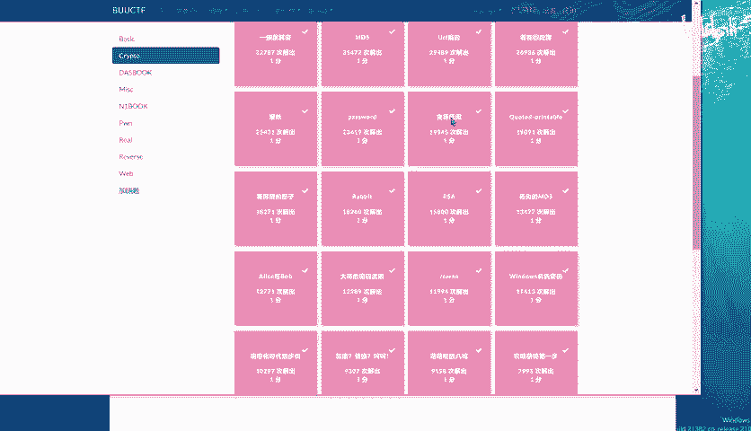
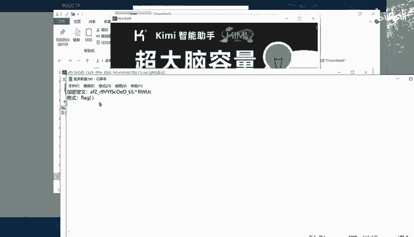
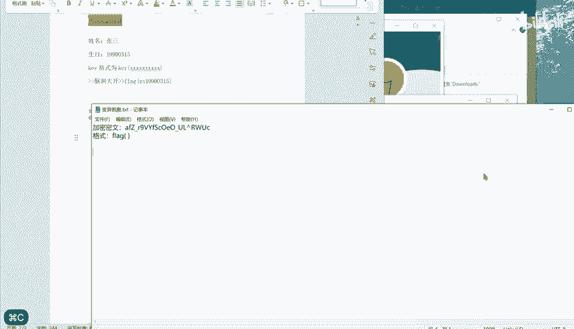
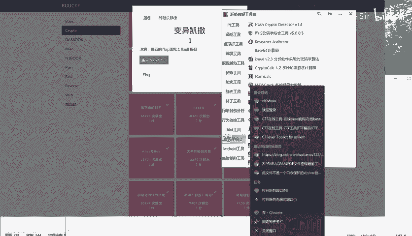
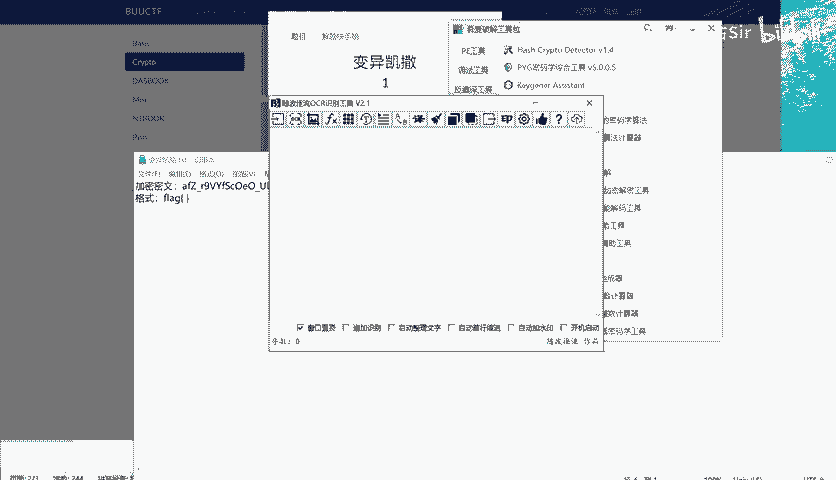
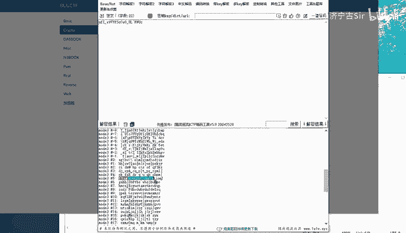
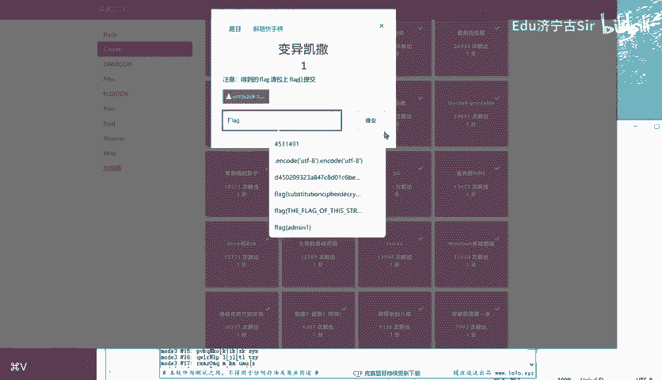

# BUUCTF-Crypto-变异凯撒：P1：变异凯撒解题教程 🧩

在本节课中，我们将要学习如何解决BUUCTF平台上一道名为“变异凯撒”的密码学题目。我们将分析题目给出的密文，理解“变异凯撒”的含义，并使用合适的工具进行解密，最终获取明文Flag。

---



## 题目背景与密文

题目来自BUUCTF平台的Crypto（密码学）类别，名为“变异凯撒”。



题目给出的密文如下：
```
afZ_r9VYfScOeO_UL^RWUc
```

## 理解“变异凯撒”

上一节我们介绍了题目背景和密文，本节中我们来看看“变异凯撒”的核心概念。



标准的凯撒密码是一种替换加密技术，其中明文中的所有字母都在字母表上向后（或向前）按照一个固定数目进行偏移后被替换成密文。例如，当偏移量为3时，所有的字母A将被替换为D，B变成E，以此类推。

“变异凯撒”意味着偏移量可能不是固定的，而是遵循某种变化的规律。我们需要找出这个变化的规律。

## 分析解题思路



以下是解题的关键步骤分析：

1.  **观察密文与Flag格式**：通常CTF题目的Flag格式为`flag{...}`或`FLAG{...}`。我们需要将密文解密成这种格式。
2.  **对比首字符**：将密文首字符`a`与预期明文首字符`f`（假设Flag格式为`flag`）进行对比。
    *   `a`的ASCII码是97。
    *   `f`的ASCII码是102。
    *   偏移量 = 102 - 97 = 5。
3.  **验证规律**：继续对比第二个字符。
    *   密文`f`的ASCII码是102。
    *   预期明文`l`的ASCII码是108。
    *   偏移量 = 108 - 102 = 6。
4.  **发现规律**：偏移量从5开始，对每个后续字符依次递增1。这是一个递增的偏移量序列。



我们可以用公式来描述这个“变异”的凯撒解密过程：
```
明文[i]的ASCII码 = 密文[i]的ASCII码 + (5 + i)
```
其中 `i` 从0开始计数。

## 使用工具进行解密

理解了规律后，我们可以编写脚本或使用在线工具进行解密。这里演示使用一个支持自定义凯撒密码（即ROT N）的工具。



操作步骤如下：

1.  访问一个在线的密码学工具网站（如CyberChef）。
2.  将密文 `afZ_r9VYfScOeO_UL^RWUc` 放入输入框。
3.  选择“ROT13”或“凯撒密码”功能。
4.  由于工具通常只支持固定偏移量，我们需要手动计算或使用“ROT47”等尝试。但根据我们发现的规律，更直接的方法是编写一个简单的Python脚本。



以下是实现解密规律的Python代码：
```python
cipher = "afZ_r9VYfScOeO_UL^RWUc"
plain = ""
for i in range(len(cipher)):
    # 对每个字符的ASCII码加上起始偏移量5，再加上其在字符串中的位置i
    shifted_char = chr(ord(cipher[i]) + 5 + i)
    plain += shifted_char
print(plain)
```
运行这段代码，即可得到解密后的明文。

## 获取最终Flag

运行解密脚本或手动计算后，我们得到明文结果。


成功解密后，获得的明文即为本题的Flag。

---

本节课中我们一起学习了如何解决“变异凯撒”密码题。我们首先分析了题目，理解了“变异”指的是偏移量递增的凯撒密码。然后通过对比密文与预期Flag格式的首部，发现了偏移量从5开始逐位递增1的规律。最后，我们通过编写简单的Python脚本应用这个规律，成功解密得到了Flag。掌握这种分析思路对于解决类似的变异古典密码题目非常有帮助。