# BUUCTF-Crypto-大帝的密码武器：P1：凯撒密码实战解析 🔐

在本节课中，我们将要学习如何解决一道基于凯撒密码的CTF（Capture The Flag）题目。我们将从分析题目开始，逐步理解凯撒密码的原理，并最终通过脚本工具找到正确的偏移量，从而解密出最终的Flag。

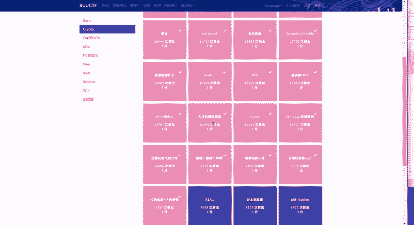

---

## 题目背景与初步分析

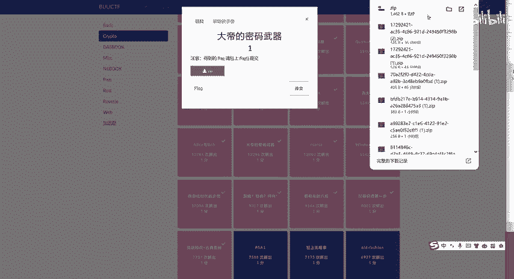

题目“大帝的密码武器”的提示“一看就是凯撒”，明确指出了加密方式为凯撒密码。凯撒密码是一种简单的替换加密技术，通过将字母在字母表中偏移固定的位置来进行加密和解密。

我们获得的密文是：`ComeChina`。题目说明，这段密文被解开后，可以获得一个有意义的英文单词。这意味着我们需要找到正确的偏移量，对密文进行解密。

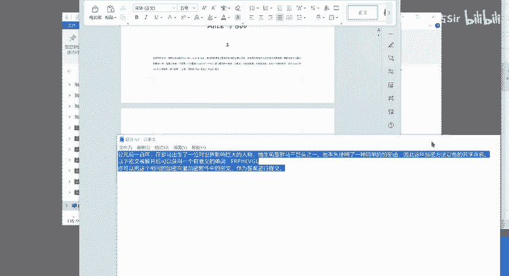

---

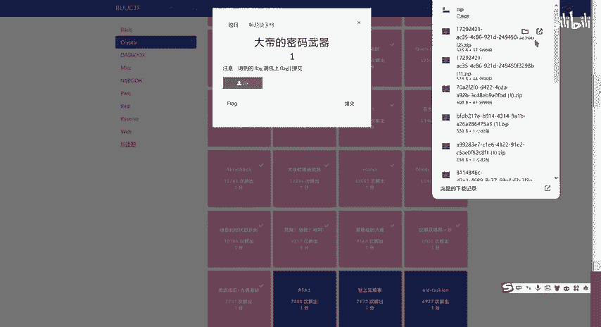

## 凯撒密码核心原理

上一节我们介绍了题目的基本情况，本节中我们来看看凯撒密码的核心概念。凯撒密码的加密和解密过程可以用一个简单的公式来描述。

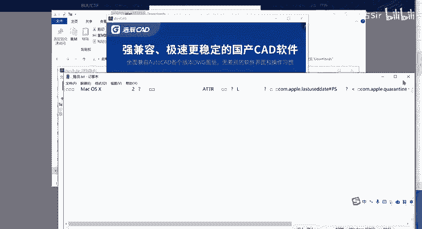

对于一个明文字母 `P`，其对应的密文字母 `C` 可以通过以下公式计算：
`C = (P + K) mod 26`
其中，`K` 是偏移量（密钥），`mod 26` 表示对26取模，以处理字母表循环（A-Z）。

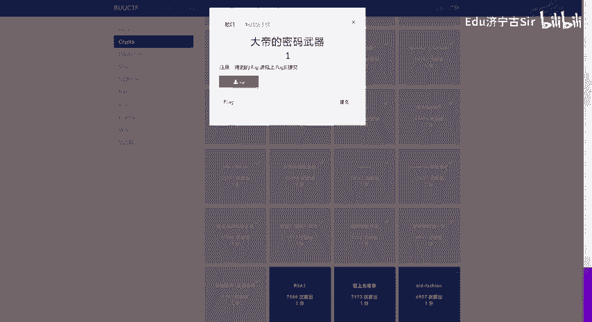

反之，解密过程为：
`P = (C - K) mod 26`

在编程中，我们可以通过遍历所有可能的偏移量（1到25）来暴力破解，因为凯撒密码的密钥空间很小。

以下是使用Python进行凯撒密码暴力破解的核心代码逻辑：

```python
def caesar_bruteforce(ciphertext):
    for shift in range(1, 26):
        plaintext = ''
        for char in ciphertext:
            if char.isalpha():
                # 处理大写字母
                base = ord('A') if char.isupper() else ord('a')
                plaintext += chr((ord(char) - base - shift) % 26 + base)
            else:
                plaintext += char
        print(f'Shift {shift}: {plaintext}')
```

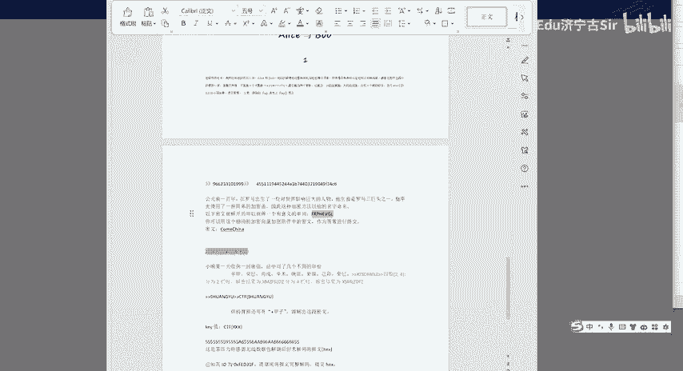

---

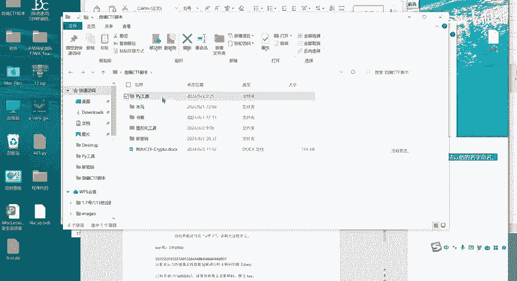

## 解题步骤详解

理解了原理后，我们开始具体解题。以下是解题的关键步骤：

1.  **识别加密方式**：根据题目提示“凯撒”，确定使用凯撒密码解法。
2.  **获取密文**：题目提供的密文为 `ComeChina`。
3.  **尝试暴力破解**：将密文 `ComeChina` 输入到凯撒密码破解脚本中，遍历所有可能的偏移量。
4.  **寻找有意义的单词**：在输出结果中，我们发现当偏移量为13时，解密得到的单词是 `Security`。这是一个有意义的英文单词，符合题目描述。
5.  **确定偏移量**：因此，可以确定本题使用的凯撒偏移量是13。
6.  **应用偏移量解密Flag**：题目要求我们使用相同的偏移量（13）去解密另一段文本（即Flag的密文部分），从而得到最终的Flag。

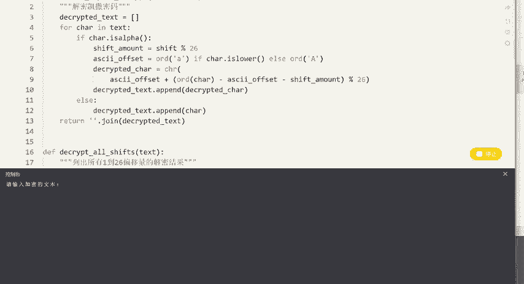

---

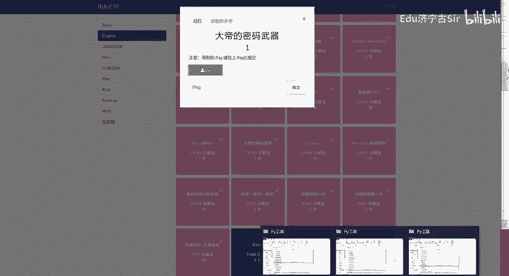

## 获取最终Flag

在解题步骤中，我们确定了偏移量为13。现在，我们需要将这个偏移量应用到Flag的密文上。

假设我们通过平台或上下文获得了Flag的密文（例如，在视频中后续出现的密文），我们只需使用偏移量13进行解密即可。

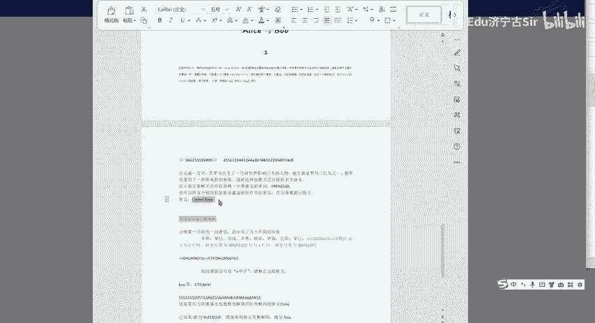

例如，如果密文是 `SnprPuvan`，使用偏移13解密：
- S -> F
- n -> a
- p -> c
- r -> e
- P -> C
- u -> h
- v -> i
- a -> n
- n -> a
最终得到明文：`FaceChina`（此处为示例，实际Flag需根据题目提供的最终密文计算）。

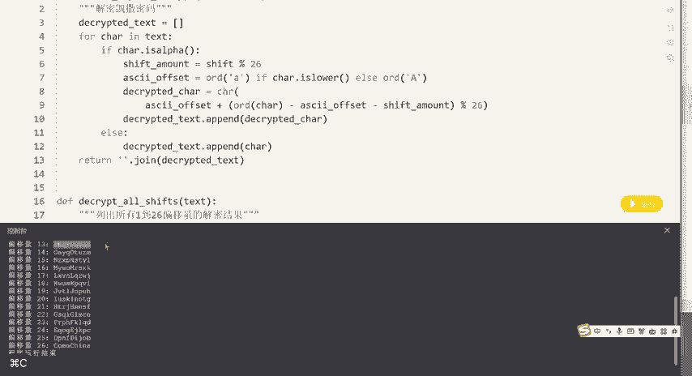

将得到的明文用Flag格式包裹，即得到最终答案，例如：`flag{FaceChina}`。

---

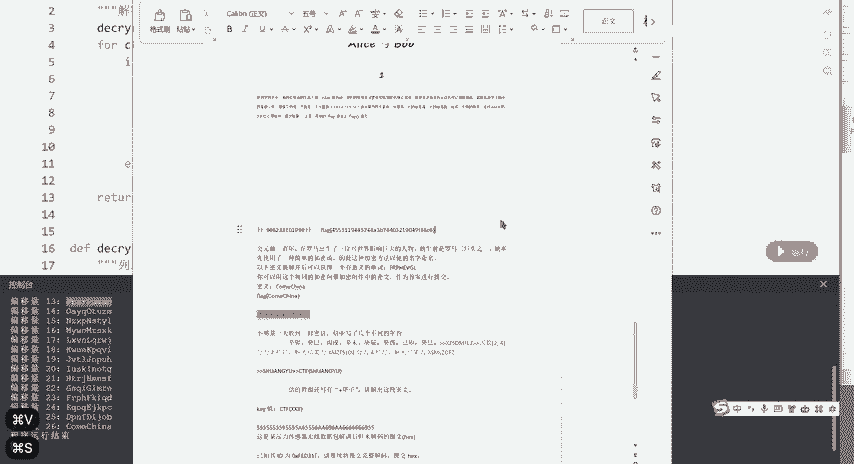

## 总结

本节课中我们一起学习了如何解决一道典型的凯撒密码CTF题目。我们回顾了凯撒密码的加密公式 `C = (P + K) mod 26`，并通过暴力破解的方式找到了关键偏移量13。解题的核心思路是：**先利用已知密文破解出密钥，再将相同的密钥应用于目标密文以获取Flag**。掌握这个方法，你就能轻松应对类似的古典密码题目了。