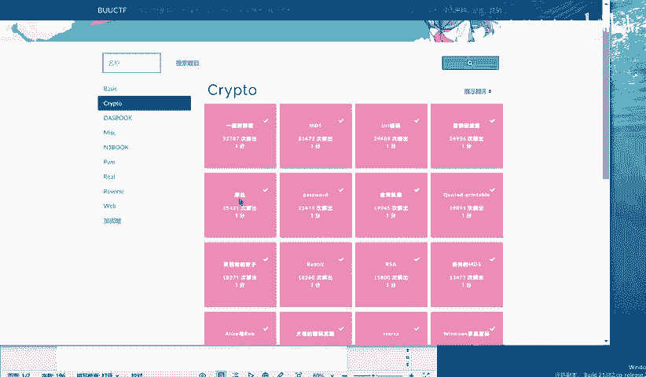
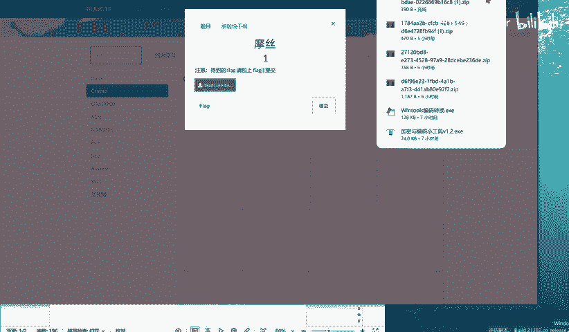
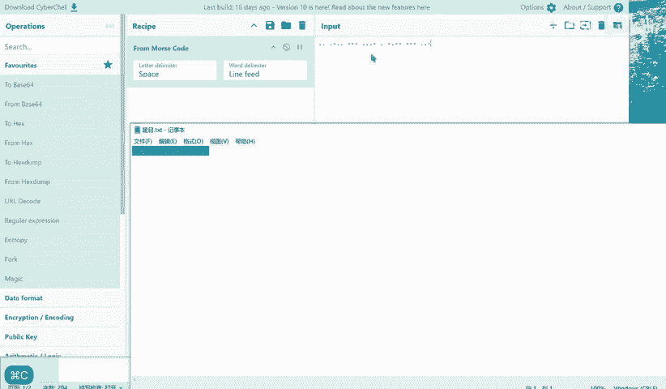
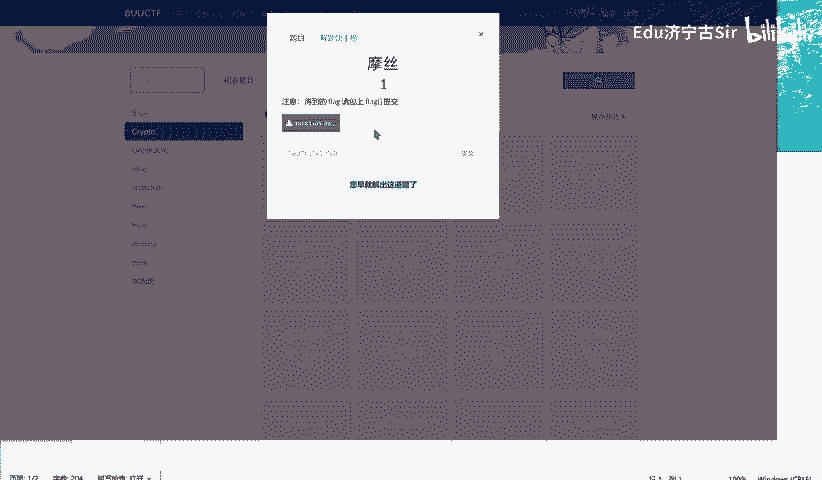

# BUUCTF-Crypto-摩丝：P1：摩斯密码基础与解题实践

在本节课中，我们将学习摩斯密码的基本概念，并通过一个来自BUUCTF平台的实战题目，演示如何识别和解码摩斯密码，最终获取隐藏的Flag信息。

## 摩斯密码简介

摩斯密码是一种通过点和划的不同排列组合来表示字母、数字和标点符号的编码系统。在网络安全和CTF竞赛中，它常被用作一种基础的编码或隐写手段。



## 题目分析与解题步骤

上一节我们介绍了摩斯密码的基本概念，本节中我们来看看如何应用这些知识解决实际问题。

题目给出的信息是一串由点和划组成的序列，这是典型的摩斯密码表现形式。我们的目标是将这串代码解码成可读的文本。



以下是解题的核心步骤：

1.  **识别编码类型**：首先确认题目给出的信息是摩斯密码。其特征是仅由点（`.` 或短信号）和划（`-` 或长信号）以及分隔符（如空格 `/`）组成。
2.  **进行解码**：将摩斯码序列根据标准对照表转换为英文字母和数字。
3.  **格式化输出**：将解码后的字母组合成单词或句子，这通常就是Flag或提示信息。

对于本题，我们观察到给定的序列（例如 `..` 对应 I，`.-..` 对应 L 等），解码后得到英文句子 “I love you”。

## 核心工具与代码

在CTF比赛中，我们通常不会手动查表解码。使用在线的摩斯密码解码工具或编写简单的脚本可以大大提高效率。

以下是一个Python解码的简单示例逻辑（非本题完整代码）：



```python
# 一个简化的摩斯密码字典示例
MORSE_CODE_DICT = {
    '.-': 'A', '-...': 'B', '-.-.': 'C', '-..': 'D',
    '.': 'E', '..-.': 'F', '--.': 'G', '....': 'H',
    '..': 'I', '.---': 'J', '-.-': 'K', '.-..': 'L',
    '--': 'M', '-.': 'N', '---': 'O', '.--.': 'P',
    '--.-': 'Q', '.-.': 'R', '...': 'S', '-': 'T',
    '..-': 'U', '...-': 'V', '.--': 'W', '-..-': 'X',
    '-.--': 'Y', '--..': 'Z', '-----': '0', '.----': '1',
    '..---': '2', '...--': '3', '....-': '4', '.....': '5',
    '-....': '6', '--...': '7', '---..': '8', '----.': '9'
}

def decode_morse(morse_code):
    words = morse_code.strip().split(' / ')  # 假设单词间用‘/ ’分隔
    decoded_message = []
    for word in words:
        letters = word.split(' ')            # 字母间用空格分隔
        decoded_word = ''.join(MORSE_CODE_DICT.get(letter, '') for letter in letters)
        decoded_message.append(decoded_word)
    return ' '.join(decoded_message)

# 使用示例
# morse_text = ".. / .-.. --- ...- . / -.-- --- ..-"
# print(decode_morse(morse_text))  # 输出: I LOVE YOU
```



## 获取Flag

通过解码，我们得到了信息 “I love you”。在CTF题目中，这串文本本身或其某种变形（如全部大写、加上特定格式）通常就是需要提交的Flag。因此，本题的Flag很可能为 `flag{I love you}` 或类似格式，具体需根据题目要求调整。

## 总结

本节课中我们一起学习了摩斯密码的基础知识，并完成了一道BUUCTF的实战题目。我们了解到，解决此类问题的关键在于准确识别编码类型，并利用工具或代码进行快速解码。摩斯密码是Crypto类题目中非常常见的考点，掌握其原理和解法对CTF初学者至关重要。